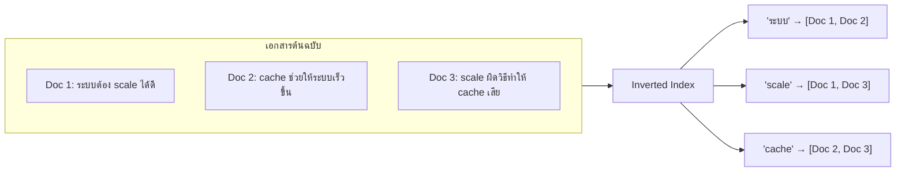
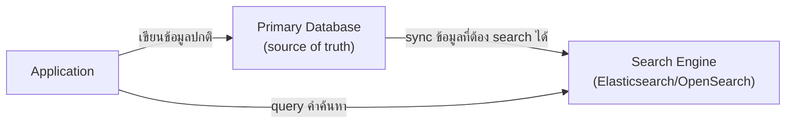

Index ในโมดูล Database (B-Tree) ช่วยหา "แถวที่ email ตรงกันเป๊ะ" ได้เร็ว เหมือนสารบัญท้ายเล่มที่บอกว่า "หัวข้อนี้อยู่หน้าไหน" — แต่ถ้าอยากค้นหาแบบ **full-text search** ("หาบทความที่มีคำว่า 'ระบบ' และ 'scale' อยู่ในเนื้อหา") สารบัญแบบเดิมช่วยไม่ได้ ต้องใช้โครงสร้างที่ต่างออกไป: <mark class="hl-term">Inverted Index</mark>

## แนวคิด: กลับหัวจากเอกสาร → คำ



ลองนึกภาพสารบัญท้ายเล่มปกติ ที่บอกว่า "หน้า 850 พูดเรื่องอะไร" — แต่ inverted index ทำตรงกันข้าม มันคือ**ดัชนีคำศัพท์ท้ายเล่ม** ที่บอกว่า "คำว่า 'ระบบนิเวศ' ปรากฏอยู่หน้าไหนบ้าง (850, 902, 1050)" ชื่อ "inverted" มาจากการสลับทิศทางนี้เอง: ปกติเอกสารชี้ไปหาคำที่มันมี (doc → words) แต่ inverted index เก็บ<mark class="hl-insight">คำเป็นตัวหลัก แล้วชี้กลับไปว่าเอกสารไหนมีคำนั้นบ้าง (word → docs)</mark> — ทำให้ query "หาเอกสารที่มีคำว่า X" เร็วมาก แค่ดู list ที่ผูกกับคำ X โดยตรง ไม่ต้องไล่อ่านทุกเอกสาร

## ทำไมไม่ใช้ Database ธรรมดาค้นหา

`WHERE content LIKE '%scale%'` ใน SQL ทำงานได้ แต่<mark class="hl-warning">ช้ามากกับข้อมูลจำนวนมาก</mark> (ต้องไล่อ่านทุกแถวทุกครั้ง เพราะ B-Tree index ช่วยแค่ค่าที่ตรงกันเป๊ะ ไม่ช่วยเรื่อง "มีคำนี้อยู่ตรงไหนก็ได้ในข้อความยาวๆ") นอกจากนี้ full-text search ที่ดียังต้องมี:

- **Ranking/Relevance** — เอกสารไหนควรขึ้นก่อน (ตรงกับคำค้นมากกว่า, คำอยู่ใน title vs อยู่ลึกๆ ในเนื้อหา)
- **Tokenization** — ตัดคำให้ถูกต้อง (ยากเป็นพิเศษกับภาษาไทยที่ไม่มีช่องว่างระหว่างคำ)
- **Typo tolerance / Synonym** — พิมพ์ผิดนิดหน่อยยังหาเจอ, คำพ้องความหมายก็หาเจอ

```demo
component: ComparisonDiagram
props: {"left":{"title":"SQL LIKE '%คำ%'","points":["ไล่อ่านทุกแถวทุกครั้งที่ query","ช้ามากเมื่อข้อมูลเยอะ","ไม่มี ranking/relevance ในตัว","ไม่รองรับ typo/synonym"]},"right":{"title":"Inverted Index","points":["lookup คำ → list เอกสารได้ทันที","เร็วไม่ขึ้นกับขนาดข้อมูลมากนัก","มี ranking/relevance ในตัว (เช่น TF-IDF - Term Frequency-Inverse Document Frequency)","รองรับ typo tolerance/synonym ได้ (เครื่องมือเฉพาะทาง)"]},"note":"นี่คือเหตุผลที่ full-text search มักแยกไปใช้ search engine เฉพาะทาง ไม่ใช้ database หลักโดยตรง"}
```

```demo
component: JourneyDiagram
props: {"nodes":[{"icon":"person","label":"Client"},{"icon":"notebook","label":"Primary DB"},{"icon":"building","label":"Search Engine"}],"travelerIcon":"envelope","steps":[{"activeNode":1,"caption":"Application เขียนข้อมูลปกติเข้า Primary Database (source of truth)"},{"activeNode":2,"caption":"ข้อมูลถูก sync ไปยัง Search Engine เฉพาะทาง (เช่น Elasticsearch) ที่ทำ Inverted Index ไว้"},{"activeNode":0,"caption":"ตอน query คำค้นหา Application ยิงไปที่ Search Engine โดยตรง ไม่ใช่ Database หลัก — เร็วกว่ามาก"}]}
```

## เครื่องมือที่ใช้จริง



ระบบใหญ่มัก**ไม่ใช้ database หลักทำ search โดยตรง** แต่ sync ข้อมูลบางส่วนไปยัง search engine เฉพาะทาง (เช่น Elasticsearch) ที่ optimize สำหรับ full-text search โดยเฉพาะ — เป็นอีกตัวอย่างของการแยกความรับผิดชอบ: database หลักดูแล consistency, search engine ดูแลความเร็ว/ความฉลาดในการค้นหา

## ขั้นสูง: sync ไม่ทันใจ และ index เดียวไม่พอ

**Indexing Lag** — การ sync จาก Primary DB ไป Search Engine ไม่ได้เกิดทันที (ใช้เวลาหลักวินาทีถึงนาที เรียกว่า **near-real-time** ไม่ใช่ real-time จริง) <mark class="hl-warning">ผลคือ user เพิ่ง post ข้อมูลใหม่ไปหมาดๆ แล้วลอง search หาทันที อาจหาไม่เจอ เพราะ index ยัง sync ไม่ทัน</mark> เหมือนสารบัญท้ายเล่มยังไม่ได้อัปเดตตามหน้าที่เพิ่งเขียนใหม่ ระบบที่ต้องการ "search เจอทันทีที่ post" (เช่น chat) มักแก้ด้วย **CDC (Change Data Capture)** ที่ลด lag ให้เร็วขึ้นมาก หรือให้ UI แสดงผลจาก Primary DB ควบคู่ไปก่อนชั่วคราวจนกว่า index จะ sync ทัน

**Index Sharding** — พอข้อมูลมหาศาลระดับพันล้านเอกสาร inverted index ตัวเดียวจะโตจนช้าและไม่พอเก็บในเครื่องเดียว <mark class="hl-term">Index Sharding</mark> แก้ปัญหาเดียวกับที่ database เจอ (โมดูล Database) — แบ่ง index ออกเป็นหลาย shard กระจายหลายเครื่อง query เข้ามาแต่ละครั้งต้องยิงไปทุก shard พร้อมกันแล้วรวมผลลัพธ์ (scatter-gather) ก่อนส่งกลับ ซึ่งซับซ้อนกว่า query index เดียวตรงๆ มาก แต่จำเป็นเมื่อข้อมูลใหญ่เกินเครื่องเดียวรับได้

> คำถามสัมภาษณ์: "ทำไม search feature บางทีหาโพสต์ที่เพิ่งโพสต์ไม่เจอ" — เพราะ full-text search แยก sync จาก primary database เสมอ (ไม่ใช่ query database ตรงๆ) และการ sync นั้นมี lag ตามธรรมชาติ — ยิ่งต้องการ lag สั้นแค่ไหน ยิ่งต้องลงทุนกับ CDC/streaming sync ที่ซับซ้อนขึ้นตามไปด้วย ไม่มีทางได้ real-time เป๊ะแบบไม่มี trade-off
