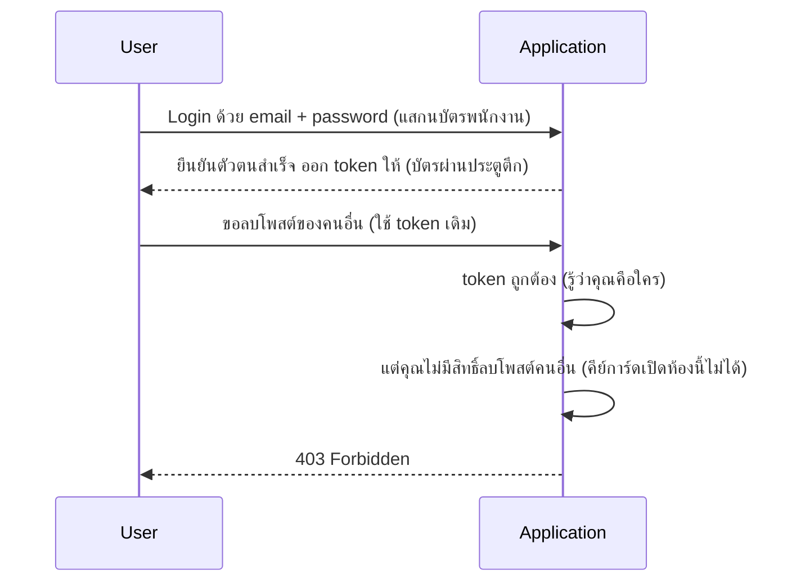

ลองนึกภาพพนักงานออฟฟิศที่ต้องผ่านสองด่านทุกเช้า — ด่านแรกคือ**บัตรพนักงาน**ที่แสกนหน้าประตูตึก ยืนยันว่า "คุณคือพนักงานคนนี้จริง" ด่านที่สองคือ**คีย์การ์ดเปิดประตูห้อง** ที่กำหนดว่าคุณเข้าห้องไหนได้บ้าง (ห้อง HR เข้าได้เฉพาะทีม HR, ห้องเซิร์ฟเวอร์เข้าได้เฉพาะทีมไอที) — สองด่านนี้ตอบคำถามคนละอย่างกัน แม้จะดูคล้ายกันมาก

**Authentication (AuthN)** กับ **Authorization (AuthZ)** คือคำสองคำที่คนสับสนกันบ่อยที่สุดในเรื่อง security — เหมือนบัตรพนักงานกับคีย์การ์ดเปิดห้อง

```demo
component: ComparisonDiagram
props: {"left":{"title":"Authentication (AuthN) — บัตรพนักงาน","points":["ตอบคำถาม: คุณเป็นใคร?","พิสูจน์ตัวตน เช่น login ด้วย password, OTP, biometric","เกิดขึ้นครั้งเดียวตอนเข้าระบบ (ได้ token/session มา)"]},"right":{"title":"Authorization (AuthZ) — คีย์การ์ดเปิดห้อง","points":["ตอบคำถาม: คุณเข้าห้องนี้ได้ไหม?","ตรวจสิทธิ์ทุกครั้งที่พยายามเข้าถึง resource","เกิดขึ้นซ้ำๆ ทุกครั้งที่ต้องการสิทธิ์"]},"note":"ลำดับเสมอ: ต้องแสกนบัตรพนักงาน (AuthN) ผ่านก่อน ถึงจะมาแตะคีย์การ์ดเปิดห้อง (AuthZ) ได้"}
```

```demo
component: JourneyDiagram
props: {"nodes":[{"icon":"person","label":"User"},{"icon":"gate","label":"AuthN"},{"icon":"gate","label":"AuthZ"}],"travelerIcon":"envelope","steps":[{"activeNode":1,"caption":"User login ด้วย email+password — ผ่านด่าน AuthN (พิสูจน์ว่าคุณเป็นใคร) ได้ token มา"},{"activeNode":2,"caption":"User ขอลบโพสต์ — มาถึงด่าน AuthZ (เช็คว่ามีสิทธิ์ทำสิ่งนี้ไหม)"},{"activeNode":2,"caption":"Token ถูกต้อง (ผ่าน AuthN) แต่ไม่มีสิทธิ์ลบโพสต์คนอื่น (ไม่ผ่าน AuthZ) — ได้ 403 Forbidden กลับไป"}]}
```

## ตัวอย่างในชีวิตจริง



สังเกตว่า request ที่สองผ่าน **AuthN** (บัตรพนักงานถูกต้อง ระบบรู้ว่าคุณคือใครจริงๆ) แต่ล้มเหลวที่ **AuthZ** (คีย์การ์ดไม่เปิดห้องนี้ให้ — คุณไม่มีสิทธิ์ทำสิ่งนี้) — สอง layer นี้แยกกันชัดเจนและต้องเช็คทั้งคู่เสมอ

## รูปแบบ Authorization ที่พบบ่อย

- **RBAC (Role-Based Access Control)** — กำหนดสิทธิ์ตาม "บทบาท" (admin, editor, viewer) เหมือนคีย์การ์ดสีต่างกันเปิดประตูคนละชุด ง่ายต่อการจัดการเมื่อมี user เยอะ
- **ABAC (Attribute-Based Access Control)** — กำหนดสิทธิ์ตาม attribute หลายอย่างร่วมกัน (เช่น "เข้าห้องนี้ได้เฉพาะพนักงานแผนกเดียวกัน และเฉพาะเวลาทำงาน") ยืดหยุ่นกว่าแต่ซับซ้อนกว่า

> คำถามสัมภาษณ์: "ทำไม 401 กับ 403 ต่างกัน" — **401 Unauthorized** จริงๆ หมายถึงยังไม่ผ่านด่านบัตรพนักงาน (ไม่รู้ว่าคุณเป็นใคร หรือบัตรหมดอายุ) ส่วน **403 Forbidden** หมายถึงผ่านด่านบัตรพนักงานแล้ว (รู้ว่าคุณเป็นใคร) แต่คีย์การ์ดไม่เปิดห้องนี้ให้ (ไม่มีสิทธิ์ทำสิ่งนี้)
