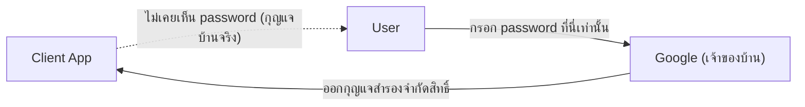

ลองนึกภาพให้เพื่อนเข้าไปรดน้ำต้นไม้ที่บ้านตอนคุณไปเที่ยวต่างจังหวัด — คุณไม่อยากให้กุญแจบ้านจริง (เดี๋ยวเพื่อนเข้าไปห้องอื่นได้หมด) วิธีที่ทำกันจริงคือ**ทำกุญแจสำรองที่จำกัดสิทธิ์** เช่น กุญแจที่เปิดได้แค่ประตูหน้าบ้านกับสวน ไม่เปิดห้องนอน แถมยังเรียกคืนได้ทีหลังโดยไม่ต้องเปลี่ยนกุญแจบ้านจริงเลย

AuthN (บทที่แล้ว) พูดถึงการพิสูจน์ตัวตน — แต่ถ้าอยากให้ "Login with Google" ทำงานได้ (ไม่ต้องสร้าง password ใหม่ในทุกแอป) ต้องมีมาตรฐานกลางที่ทุกฝ่ายเข้าใจตรงกัน นั่นคือ **OAuth 2.0** ซึ่งทำงานเหมือนระบบกุญแจสำรองจำกัดสิทธิ์นี้เป๊ะ

เดินตาม flow ทีละขั้นด้านล่าง (ตัวอย่าง "Login with Google")

```demo
component: StepThroughDiagram
props: {"steps":[{"label":"1. User กด Login with Google","detail":"แอป (Client) พาผู้ใช้ไปหน้า Google แทนที่จะขอ password ของ Google เก็บไว้เอง — เหมือนบอกเพื่อนว่า \"ไปคุยกับเจ้าของบ้านเอง ไม่ต้องขอกุญแจจากฉัน\""},{"label":"2. User ยืนยันตัวตนกับ Google โดยตรง","detail":"ผู้ใช้กรอก password ที่หน้าของ Google เท่านั้น แอปไม่เห็น password นี้เลย — เหมือนเพื่อนคุยกับเจ้าของบ้านตัวจริง ไม่ผ่านคนกลาง"},{"label":"3. Google ถามสิทธิ์ที่แอปขอ","detail":"เช่น \"แอปนี้ขอเข้าถึง อีเมลและชื่อของคุณ อนุญาตไหม?\" — เหมือนเจ้าของบ้านถามว่า \"จะทำกุญแจสำรองแบบเปิดได้แค่ประตูหน้ากับสวนนะ โอเคไหม\""},{"label":"4. Google ส่ง Authorization Code กลับมา","detail":"ส่งกลับไปที่แอปผ่าน redirect URL พร้อม code ชั่วคราว (ยังไม่ใช่กุญแจจริง แค่ใบเบิกกุญแจ)"},{"label":"5. แอปแลก Code เป็น Access Token","detail":"แอป (ฝั่ง server) ส่ง code นี้ไปแลกที่ Google โดยตรง (พร้อม client secret) ได้กุญแจสำรองจริง (access token) กลับมา"},{"label":"6. แอปใช้ Token เรียก API ของ Google","detail":"ใช้กุญแจสำรอง (access token) ขอข้อมูล profile/email ผู้ใช้จาก Google API แล้วสร้างบัญชีในระบบตัวเอง"}]}
```

## ทำไมต้องซับซ้อนขนาดนี้

จุดสำคัญที่สุดคือ **password ของผู้ใช้ไม่เคยผ่านมือแอปเลย** — เหมือนเพื่อนไม่เคยเห็นกุญแจบ้านจริง ผู้ใช้กรอก password ที่หน้าของ Google เท่านั้น (ขั้นตอนที่ 2) แอปได้แค่ "กุญแจสำรองจำกัดสิทธิ์" (แค่อีเมล/ชื่อ ไม่ใช่สิทธิ์เข้าบัญชี Google เต็มรูปแบบ) และ**เรียกคืนได้ทีหลัง**โดยไม่ต้องเปลี่ยน password จริง (เหมือนยกเลิกกุญแจสำรองได้โดยไม่ต้องเปลี่ยนล็อคบ้านทั้งหลัง)



## Token กับ Session ต่างกันยังไง

Token (โดยเฉพาะ JWT — JSON Web Token) มักเก็บข้อมูลผู้ใช้ไว้ใน**ตัวกุญแจเอง** (encode + sign แล้ว เหมือนกุญแจที่มีรอยบากบอกในตัวว่าเปิดประตูไหนได้บ้าง) server ตรวจสอบแค่รอยบากนั้นก็รู้ทันทีว่ากุญแจถูกต้องไหม โดย**ไม่ต้องโทรถามเจ้าของบ้านหรือเช็คสมุดทะเบียนกุญแจทุกครั้ง** — เชื่อมโยงตรงกับโมดูล Scalability เรื่อง stateless design: JWT ช่วยให้ server ไม่ต้องเก็บ session state เลย เพราะทุกอย่างที่ต้องรู้อยู่ในกุญแจ (token) ที่ client แนบมาเองในทุก request
