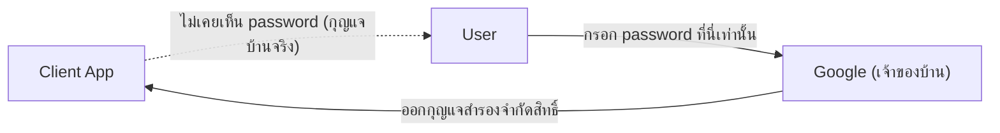

ลองนึกภาพให้เพื่อนเข้าไปรดน้ำต้นไม้ที่บ้านตอนคุณไปเที่ยวต่างจังหวัด — คุณไม่อยากให้กุญแจบ้านจริง (เดี๋ยวเพื่อนเข้าไปห้องอื่นได้หมด) วิธีที่ทำกันจริงคือ**ทำกุญแจสำรองที่จำกัดสิทธิ์** เช่น กุญแจที่เปิดได้แค่ประตูหน้าบ้านกับสวน ไม่เปิดห้องนอน แถมยังเรียกคืนได้ทีหลังโดยไม่ต้องเปลี่ยนกุญแจบ้านจริงเลย

AuthN (บทที่แล้ว) พูดถึงการพิสูจน์ตัวตน — แต่ถ้าอยากให้ "Login with Google" ทำงานได้ (ไม่ต้องสร้าง password ใหม่ในทุกแอป) ต้องมีมาตรฐานกลางที่ทุกฝ่ายเข้าใจตรงกัน นั่นคือ <mark class="hl-term">OAuth 2.0 (Open Authorization)</mark> ซึ่งทำงานเหมือนระบบกุญแจสำรองจำกัดสิทธิ์นี้เป๊ะ

เดินตาม flow ทีละขั้นด้านล่าง (ตัวอย่าง "Login with Google")

```demo
component: StepThroughDiagram
props: {"steps":[{"label":"1. User กด Login with Google","detail":"แอป (Client) พาผู้ใช้ไปหน้า Google แทนที่จะขอ password ของ Google เก็บไว้เอง — เหมือนบอกเพื่อนว่า \"ไปคุยกับเจ้าของบ้านเอง ไม่ต้องขอกุญแจจากฉัน\""},{"label":"2. User ยืนยันตัวตนกับ Google โดยตรง","detail":"ผู้ใช้กรอก password ที่หน้าของ Google เท่านั้น แอปไม่เห็น password นี้เลย — เหมือนเพื่อนคุยกับเจ้าของบ้านตัวจริง ไม่ผ่านคนกลาง"},{"label":"3. Google ถามสิทธิ์ที่แอปขอ","detail":"เช่น \"แอปนี้ขอเข้าถึง อีเมลและชื่อของคุณ อนุญาตไหม?\" — เหมือนเจ้าของบ้านถามว่า \"จะทำกุญแจสำรองแบบเปิดได้แค่ประตูหน้ากับสวนนะ โอเคไหม\""},{"label":"4. Google ส่ง Authorization Code กลับมา","detail":"ส่งกลับไปที่แอปผ่าน redirect URL พร้อม code ชั่วคราว (ยังไม่ใช่กุญแจจริง แค่ใบเบิกกุญแจ)"},{"label":"5. แอปแลก Code เป็น Access Token","detail":"แอป (ฝั่ง server) ส่ง code นี้ไปแลกที่ Google โดยตรง (พร้อม client secret) ได้กุญแจสำรองจริง (access token) กลับมา"},{"label":"6. แอปใช้ Token เรียก API ของ Google","detail":"ใช้กุญแจสำรอง (access token) ขอข้อมูล profile/email ผู้ใช้จาก Google API แล้วสร้างบัญชีในระบบตัวเอง"}]}
```

```demo
component: JourneyDiagram
props: {"nodes":[{"icon":"person","label":"User"},{"icon":"building","label":"App (Client)"},{"icon":"building","label":"Google"}],"travelerIcon":"envelope","steps":[{"activeNode":0,"caption":"User กด \"Login with Google\" ที่ App"},{"activeNode":2,"caption":"App พาไปหน้า Google โดยตรง — User กรอก password ที่ Google เท่านั้น ไม่ผ่าน App เลย"},{"activeNode":1,"caption":"Google ส่ง Authorization Code กลับมาที่ App"},{"activeNode":2,"caption":"App เอา Code ไปแลกเป็น Access Token กับ Google โดยตรง (พร้อม client secret)"},{"activeNode":1,"caption":"App ใช้ Access Token เรียกข้อมูล profile จาก Google — สร้างบัญชีในระบบตัวเอง"}]}
```

## ทำไมต้องซับซ้อนขนาดนี้

จุดสำคัญที่สุดคือ <mark class="hl-insight">password ของผู้ใช้ไม่เคยผ่านมือแอปเลย</mark> — เหมือนเพื่อนไม่เคยเห็นกุญแจบ้านจริง ผู้ใช้กรอก password ที่หน้าของ Google เท่านั้น (ขั้นตอนที่ 2) แอปได้แค่ "กุญแจสำรองจำกัดสิทธิ์" (แค่อีเมล/ชื่อ ไม่ใช่สิทธิ์เข้าบัญชี Google เต็มรูปแบบ) และ**เรียกคืนได้ทีหลัง**โดยไม่ต้องเปลี่ยน password จริง (เหมือนยกเลิกกุญแจสำรองได้โดยไม่ต้องเปลี่ยนล็อคบ้านทั้งหลัง)



## Token กับ Session ต่างกันยังไง

Token (โดยเฉพาะ <mark class="hl-term">JWT — JSON Web Token</mark>) มักเก็บข้อมูลผู้ใช้ไว้ใน**ตัวกุญแจเอง** (encode + sign แล้ว เหมือนกุญแจที่มีรอยบากบอกในตัวว่าเปิดประตูไหนได้บ้าง) server ตรวจสอบแค่รอยบากนั้นก็รู้ทันทีว่ากุญแจถูกต้องไหม โดย**ไม่ต้องโทรถามเจ้าของบ้านหรือเช็คสมุดทะเบียนกุญแจทุกครั้ง** — เชื่อมโยงตรงกับโมดูล Scalability เรื่อง stateless design: JWT ช่วยให้ server ไม่ต้องเก็บ session state เลย เพราะทุกอย่างที่ต้องรู้อยู่ในกุญแจ (token) ที่ client แนบมาเองในทุก request

## ขั้นสูง: จุดที่ JWT/OAuth พังได้จริง

ความ stateless ของ JWT ที่เป็นข้อดี (ไม่ต้องเช็คสมุดทะเบียนทุกครั้ง) กลับกลายเป็นข้อเสียสำคัญเมื่อกุญแจถูกขโมยไป — เหมือนกุญแจสำรองที่ไม่มีใครโทรมาถามยืนยันเลย ใครถือไปก็ใช้ได้จนกว่าจะหมดอายุเอง

- **alg:none downgrade attack** — <mark class="hl-warning">JWT เก็บชื่อ algorithm ที่ใช้เซ็นไว้ในตัวกุญแจเอง ถ้า server ไม่ระวังจะเชื่อ field นี้ตรงๆ</mark> คนร้ายส่งกุญแจปลอมที่บอกว่า `"alg": "none"` (ไม่มีลายเซ็นเลย) — server ที่เขียนโค้ดตรวจ signature ตาม field ในกุญแจเองจะ "เชื่อคำกุญแจ" แล้วปล่อยผ่านทั้งที่ไม่มีลายเซ็นจริง ป้องกันโดย hardcode algorithm ที่ยอมรับไว้ฝั่ง server เอง ไม่อ่านจาก field ในกุญแจที่คนร้ายควบคุมได้
- **Refresh Token Rotation** — access token (กุญแจสำรองอายุสั้น เช่น 15 นาที) ยกเลิกกลางทางไม่ได้เพราะ stateless ทางแก้คือให้อายุสั้นมาก แล้วใช้ **refresh token** (อายุยาวกว่า, server เก็บสถานะไว้เช็คได้) ขอกุญแจสำรองใหม่เรื่อยๆ — ทุกครั้งที่ใช้ refresh token ควรออกใบใหม่แล้ว**ยกเลิกใบเก่าทันที (rotation)** ถ้ามีคนพยายามใช้ใบเก่าที่ถูกยกเลิกไปแล้ว = สัญญาณชัดว่าใบนั้นถูกขโมยไปด้วย (reuse detection)
- **Replay attack** — ถ้าคนร้ายขโมย token ไปได้ (เช่นจาก XSS) เอาไปใช้ซ้ำได้เรื่อยๆ จนกว่า token จะหมดอายุเอง เพราะ token ไม่ได้ผูกกับใครคนใดคนหนึ่งเป็นพิเศษ — ลด risk ได้ด้วยการตั้ง TTL ให้สั้นที่สุดที่ยังใช้งานได้จริง และพิจารณาผูก token เข้ากับ client fingerprint (เช่น IP/device) เพื่อตรวจจับความผิดปกติถ้า token เดิมโผล่มาจากที่อื่นกะทันหัน

> คำถามสัมภาษณ์: "ถ้า access token หลุดไปกลางทาง แก้ยังไงโดยไม่ต้อง revoke ทันที (เพราะ stateless revoke ไม่ได้)" — คำตอบคือออกแบบให้ **TTL สั้นมากพอที่ความเสียหายจำกัดอยู่ในกรอบเวลานั้น** แล้วให้ refresh token (ที่ revoke ได้จริงเพราะ server เก็บสถานะ) เป็นตัวควบคุมอายุการใช้งานจริงของ session ทั้งหมด
