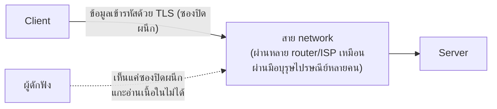

ลองนึกภาพการส่งจดหมายสำคัญกับการเก็บเอกสารสำคัญไว้ที่บ้าน — สองสถานการณ์ต้องการการป้องกันคนละแบบ: จดหมายที่**กำลังเดินทาง**ต้องใส่ซองปิดผนึกกันคนแอบเปิดอ่านระหว่างทาง ส่วนเอกสารที่**นอนอยู่เฉยๆ ที่บ้าน**ต้องเก็บในตู้เซฟกันขโมยที่บุกเข้าบ้านมาเจอเอกสารตรงๆ

แม้ระบบจะ authenticate/authorize ถูกต้องแล้ว (สองบทที่แล้ว) ถ้าข้อมูลถูก**ดักอ่านได้ระหว่างทาง**หรือ**อ่านได้ตรงๆ จากที่เก็บ** ระบบก็ยังไม่ปลอดภัย — **Encryption** ป้องกันสองจุดนี้แยกกัน เหมือนซองปิดผนึกกับตู้เซฟ

```demo
component: ComparisonDiagram
props: {"left":{"title":"Encryption in Transit (ซองปิดผนึก)","points":["เข้ารหัสข้อมูลระหว่างเดินทาง (client ↔ server)","ทำผ่าน TLS/HTTPS (จากโมดูล Fundamentals)","ป้องกัน: คนดักฟังระหว่างทาง (man-in-the-middle)"]},"right":{"title":"Encryption at Rest (ตู้เซฟที่บ้าน)","points":["เข้ารหัสข้อมูลตอนเก็บอยู่นิ่งๆ ใน disk/database","ทำที่ระดับ disk, database, หรือ object storage","ป้องกัน: คนขโมย harddisk/backup ไปอ่านตรงๆ"]},"note":"ต้องมีทั้งคู่ — ใส่ซองปิดผนึกตอนส่ง แต่เก็บเอกสารแบบเปิดโล่งไว้บนโต๊ะที่บ้าน ยังเสี่ยงถ้าโจรบุกเข้าบ้านได้"}
```

```demo
component: JourneyDiagram
props: {"nodes":[{"icon":"person","label":"Client"},{"icon":"gate","label":"TLS (ระหว่างทาง)"},{"icon":"notebook","label":"Database (at rest)"}],"travelerIcon":"envelope","steps":[{"activeNode":1,"caption":"ข้อมูลเดินทางจาก Client ผ่านสาย network — เข้ารหัสด้วย TLS (ซองปิดผนึก) กันดักฟัง"},{"activeNode":2,"caption":"ข้อมูลถึงปลายทาง เก็บลง Database — เข้ารหัสอีกชั้น (at rest) กันขโมย harddisk/backup อ่านตรงๆ"},{"activeNode":0,"caption":"ต้องมีทั้งสองชั้น — ปิดผนึกตอนส่ง (in transit) ไม่พอ ถ้าตู้เซฟปลายทาง (at rest) ไม่ล็อกด้วย"}]}
```

## ซองปิดผนึก — ทำไม TLS สำคัญ



ข้อมูลที่วิ่งผ่าน network สาธารณะ (โดยเฉพาะ Wi-Fi สาธารณะ) ผ่านหลายจุดที่อาจถูกดักฟังได้ เหมือนจดหมายที่ผ่านมือคนหลายคนกว่าจะถึงปลายทาง <mark class="hl-insight">TLS ปิดผนึกข้อมูลตั้งแต่ต้นทางถึงปลายทาง แม้มีคนดักจับซองได้ก็แกะอ่านเนื้อหาไม่ออก</mark> (นี่คือเหตุผลที่ทุกเว็บสมัยใหม่ต้องเป็น HTTPS ไม่ใช่ HTTP เฉยๆ)

## ตู้เซฟที่บ้าน — ป้องกันตอนข้อมูลอยู่นิ่ง

ถ้า harddisk ของ database ถูกขโมยไปตรงๆ (หรือ backup file หลุดไปอยู่ที่ผิด) หากข้อมูลเก็บแบบเปิดโล่ง (plaintext) คนร้ายอ่านได้ทันที เหมือนเอกสารวางอยู่บนโต๊ะให้ขโมยหยิบอ่านได้เลย การเข้ารหัสข้อมูลตอนเก็บ (เช่น เข้ารหัสทั้ง disk หรือเข้ารหัสเฉพาะ column ที่ sensitive อย่าง บัตรเครดิต, รหัสผ่าน) ทำให้ต่อให้ไฟล์หลุดไป ก็ยังต้องมีกุญแจตู้เซฟ (key) ถึงจะอ่านได้

## Hashing ≠ Encryption (ข้อควรระวังสำคัญ)

Password <mark class="hl-warning">ไม่ควรเข้ารหัสแบบ encryption</mark> (ที่ถอดกลับได้ถ้ามี key เหมือนตู้เซฟที่เปิดได้ถ้ามีกุญแจ) แต่ควรใช้ <mark class="hl-term">hashing</mark> (เช่น bcrypt, argon2) ซึ่งเหมือน**ทำลายเอกสารต้นฉบับทิ้งแล้วเก็บแค่รอยประทับที่ถอดกลับเป็นเอกสารเดิมไม่ได้เลยแม้แต่เจ้าของตู้เซฟเอง** ตอน login ระบบแค่ hash password ที่ผู้ใช้กรอกมาใหม่ แล้วเทียบกับ hash ที่เก็บไว้ว่าตรงกันไหม — ถ้า database หลุดไป คนร้ายได้แค่รอยประทับที่ reverse กลับเป็น password จริงแทบไม่ได้เลย (ต่างจาก encryption ที่ถ้าได้ key ไปด้วยจะถอดกลับเป็นข้อมูลจริงได้ทันที)

## ขั้นสูง: กุญแจตู้เซฟเองก็ต้องมีคนดูแล

ทุกตัวอย่างข้างบนพูดถึง "เข้ารหัสด้วย key" แต่ไม่ได้ตอบว่า **key เก็บไว้ที่ไหน ใครดูแล และเปลี่ยนได้ไหม** — เหมือนมีตู้เซฟดีแค่ไหน ถ้ากุญแจแขวนอยู่ข้างตู้เซฟตลอดชีวิตไม่เคยเปลี่ยน ก็ไม่ต่างจากไม่มีตู้เซฟเลย

- <mark class="hl-term">KMS (Key Management Service)</mark> — ระบบกลางที่เก็บและดูแล encryption key แยกออกจาก application/database เอง (เช่น AWS KMS, HashiCorp Vault) แอปไม่เห็น key จริงตรงๆ แต่ขอ KMS ช่วยเข้ารหัส/ถอดรหัสให้ทุกครั้ง เหมือนฝากกุญแจตู้เซฟไว้กับบริษัทรักษาความปลอดภัยแยกต่างหาก ไม่ใช่แขวนไว้ในบ้านตัวเอง
- <mark class="hl-warning">Key rotation</mark> — ถ้า key เดิมหลุดไปสักครั้ง (ไม่ว่าจะรู้ตัวหรือไม่รู้ตัว) ข้อมูลที่เข้ารหัสด้วย key นั้นทั้งหมดยังเสี่ยงตลอดไปถ้าไม่เคยเปลี่ยน key เลย ระบบจริงจึงต้อง**เปลี่ยน key เป็นระยะ** (เช่นทุก 90 วัน) แล้ว re-encrypt ข้อมูลเดิมด้วย key ใหม่ — เหมือนเปลี่ยนกุญแจตู้เซฟเป็นระยะแม้ไม่มีสัญญาณว่าหลุดไป เพราะรอจนรู้ว่าหลุดแล้วอาจสายไปแล้ว
- **Key hierarchy** — ระบบใหญ่มักไม่เข้ารหัสข้อมูลจริงด้วย master key ตรงๆ แต่ใช้ master key เข้ารหัส "data key" ชั้นล่างอีกที (envelope encryption) เพื่อให้ rotate master key ได้โดยไม่ต้อง re-encrypt ข้อมูลจริงทั้งหมดทันที — เหมือนมีกุญแจแม่บ้านเปิดกล่องเก็บกุญแจย่อยแต่ละห้อง แทนที่จะต้องเปลี่ยนล็อคทุกห้องพร้อมกันทุกครั้งที่เปลี่ยนกุญแจแม่บ้าน

> คำถามสัมภาษณ์: "ถ้า encryption key รั่วออกไป ระบบเสียหายแค่ไหน" — คำตอบที่ดีต้องพูดถึงทั้ง **blast radius** (ถ้าใช้ key เดียวเข้ารหัสทุกอย่าง ความเสียหายครอบคลุมทั้งระบบ ต่างจากมี key แยกตาม service/tenant) และ **ความเร็วในการ rotate** (ระบบที่ออกแบบ key hierarchy ไว้ล่วงหน้าจะ rotate ได้เร็วกว่าระบบที่ไม่เคยเตรียมไว้มาก)
