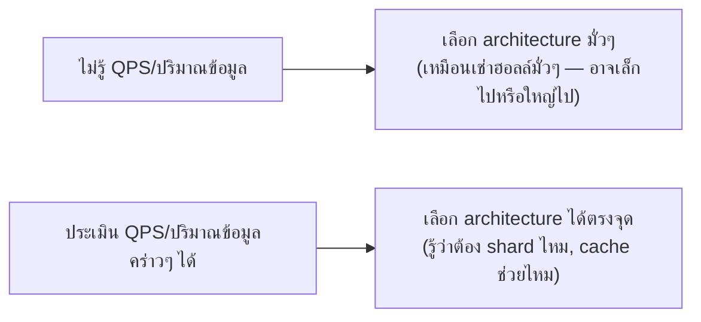
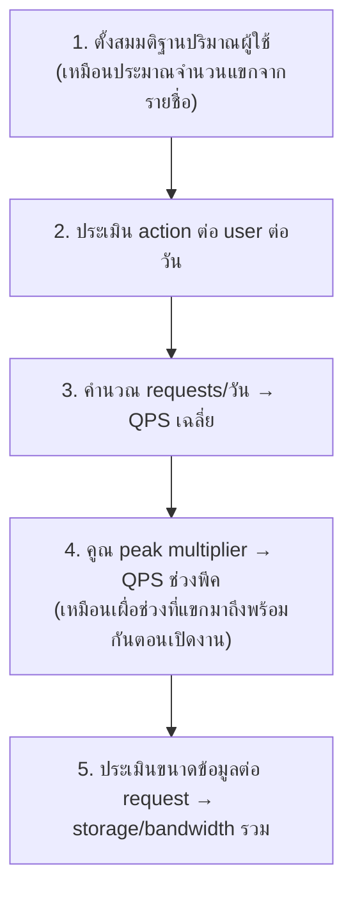

ลองนึกภาพวางแผนจัดงานแต่งงาน — ถ้าเช่าโรงแรมก่อนโดยไม่รู้ว่าจะมีแขกกี่คน อาจเช่าฮอลล์เล็กเกินไปจนแขกยืนล้นออกมานอกงาน หรือเช่าฮอลล์ใหญ่เกินจนเสียเงินฟรีๆ วิธีที่คนวางแผนงานทำจริงคือ**ประมาณจำนวนแขกก่อน** (จากรายชื่อคนที่จะเชิญ) แล้วค่อยเลือกขนาดฮอลล์ให้พอดี ไม่ใช่เดามั่วๆ

ตลอด curriculum นี้พูดถึง "scale", "high traffic", "โหลดสูง" บ่อยมาก — แต่ **"สูง" แปลว่าเท่าไหร่กันแน่?** ถ้าตอบไม่ได้เป็นตัวเลข การออกแบบระบบก็เป็นแค่การเดา เหมือนเช่าฮอลล์โดยไม่รู้จำนวนแขก **Capacity Estimation** คือทักษะการประเมินตัวเลขคร่าวๆ ให้เร็วและใกล้เคียงพอที่จะตัดสินใจได้

## ทำไมต้องทำ "back-of-envelope" (คำนวณคร่าวๆ)



ไม่ต้องแม่นยำ 100% เหมือนไม่ต้องรู้จำนวนแขกเป๊ะเป๊ะทุกคน — เป้าหมายคือรู้**ระดับขนาด (order of magnitude)**: ระบบนี้ต้องรองรับหลักสิบ, หลักพัน, หลักล้าน, หรือหลักร้อยล้าน request ต่อวัน? คำตอบต่างกันแค่ order of magnitude เดียวก็เปลี่ยนสถาปัตยกรรมที่เหมาะสมไปคนละแบบแล้ว เหมือนงานแต่ง 50 คนกับ 500 คนต้องใช้สถานที่คนละแบบเลย

## ตัวเลขที่ต้องรู้จักไว้ตั้งต้น

- **1 วัน = 86,400 วินาที** (ปัดเป็น ~100,000 เพื่อคำนวณเร็วในหัว)
- **1 ล้าน (1M), 1 พันล้าน (1B)** — แปลงหน่วยให้คล่อง
- **1 KB, 1 MB, 1 GB, 1 TB** — 1 KB ≈ 10<sup>3</sup> bytes, 1 GB ≈ 10<sup>9</sup> bytes (ปัดง่ายๆ พอสำหรับประเมิน)

## กระบวนการคิดมาตรฐาน



```demo
component: StepThroughDiagram
props: {"steps":[{"label":"1. ตั้งสมมติฐานปริมาณผู้ใช้","detail":"เหมือนประมาณจำนวนแขกจากรายชื่อที่เชิญ — เช่น 'แอปนี้มี 10 ล้าน user, active ต่อวัน 10%'"},{"label":"2. ประเมิน action ต่อ user ต่อวัน","detail":"แต่ละ user ทำ action กี่ครั้งต่อวัน (เช่น โพสต์ 2 ครั้ง, อ่าน feed 20 ครั้ง)"},{"label":"3. คำนวณ requests/วัน → QPS เฉลี่ย","detail":"รวม request ทั้งหมดต่อวัน หารด้วย 86,400 วินาที (ปัดเป็น 100,000) ได้ QPS (Queries Per Second) เฉลี่ย"},{"label":"4. คูณ peak multiplier → QPS ช่วงพีค","detail":"เหมือนเผื่อช่วงที่แขกมาถึงพร้อมกันตอนเปิดงาน — traffic จริงไม่กระจายเท่ากันตลอดวัน มักคูณ 2-3 เท่าจาก QPS เฉลี่ย"},{"label":"5. ประเมินขนาดข้อมูล → storage/bandwidth","detail":"คูณขนาดข้อมูลต่อ request กับจำนวน request ทั้งหมด ได้ตัวเลข storage/bandwidth รวมที่ต้องรองรับ"}]}
```

```demo
component: JourneyDiagram
props: {"nodes":[{"icon":"person","label":"ผู้ใช้"},{"icon":"notebook","label":"ประเมิน (Estimate)"},{"icon":"building","label":"Architecture"}],"travelerIcon":"envelope","steps":[{"activeNode":0,"caption":"เริ่มจากตั้งสมมติฐานจำนวนผู้ใช้และ action ต่อวัน — เหมือนประมาณจำนวนแขกจากรายชื่อเชิญ"},{"activeNode":1,"caption":"คำนวณออกมาเป็นตัวเลข QPS (Queries Per Second) และขนาดข้อมูลคร่าวๆ"},{"activeNode":2,"caption":"ตัวเลขนี้บอกว่าต้องเลือก architecture แบบไหน — ต้อง shard ไหม cache ช่วยไหม ไม่ใช่การเดามั่วๆ อีกต่อไป"}]}
```

บทถัดไปจะให้ **ตัวเลข latency มาตรฐาน**ที่ควรจำ (เช่น อ่านจาก memory เร็วกว่าอ่านจาก disk กี่เท่า) และบทสุดท้ายจะให้**เครื่องคิดเลขจริง**มาลองคำนวณเอง
