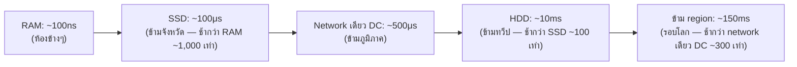

เวลาประเมินว่า "operation นี้เร็วพอไหม" ต้องมีตัวเลขอ้างอิงในหัว ลองนึกภาพระยะทางในชีวิตจริง — เดินไปห้องข้างๆ ใช้เวลาไม่กี่วินาที ขับรถในเมืองใช้เป็นชั่วโมง บินข้ามประเทศใช้เป็นวัน ยิ่งระยะทางไกล ยิ่งใช้เวลานาน ตารางนี้เป็นชุดตัวเลข "ระยะทาง" แบบเดียวกันที่วิศวกรระบบมักท่องจำไว้คร่าวๆ

## Latency ระดับต่างๆ (โดยประมาณ)

| Operation | เวลาโดยประมาณ | เทียบเป็นระยะทาง (คูณ 1 พันล้านเท่า) |
|---|---|---|
| อ่านจาก **L1 cache** (CPU) | ~1 nanosecond | 1 วินาที (เดินคนละมุมห้อง) |
| อ่านจาก **RAM** | ~100 nanoseconds | ~1.5 นาที (เดินไปห้องข้างๆ) |
| **Compress** ข้อมูล 1KB | ~10 microseconds | ~3 ชั่วโมง (ขับรถข้ามเมือง) |
| อ่านจาก **SSD** | ~100 microseconds | ~1 วัน (เดินทางข้ามจังหวัด) |
| Round-trip ใน **data center เดียวกัน** | ~500 microseconds | ~6 วัน (เดินทางข้ามภูมิภาค) |
| อ่านจาก **HDD (จานหมุน)** | ~10 milliseconds | ~4 เดือน (บินไปอีกทวีป) |
| Round-trip **ข้าม region** (เช่น ไทย↔สหรัฐฯ) | ~150 milliseconds | ~5 ปี (เดินทางรอบโลกหลายรอบ) |



ลองคลิกเลือก 2 แถวเทียบกันดูว่าต่างกันกี่เท่า:

```demo
component: LatencyBarChartDemo
caption: คลิกเลือก 2 operation เพื่อเทียบว่าอันไหนช้ากว่ากี่เท่า (แถบยาวตามสเกล log — ต่างกันเป็นพันเป็นล้านเท่าจริงๆ)
```

## ทำไมต้องจำตัวเลขเหล่านี้

ตัวเลขพวกนี้ตอบคำถามที่เจอบ่อยในการออกแบบ:

- **"ทำไมต้อง cache"** — เพราะ RAM (ห้องข้างๆ) เร็วกว่า disk/database (ข้ามจังหวัด) เป็นพันเท่า ทุก cache hit ประหยัดเวลาได้มหาศาล (โมดูล Caching)
- **"ทำไม CDN ช่วยเรื่อง latency ได้มาก"** — เพราะ round-trip ข้าม region (รอบโลก) ช้ากว่า round-trip ใน data center เดียวกัน (ข้ามภูมิภาค) เป็นร้อยเท่า (โมดูล Storage at Scale)
- **"ทำไมต้องเลือก SSD ไม่ใช่ HDD สำหรับ database"** — เพราะต่างกันเป็น 100 เท่า (ข้ามจังหวัด vs ข้ามทวีป) ผลกระทบต่อ query latency ชัดเจนมาก

## กฎง่ายๆ ที่จำได้จากตารางนี้

<mark class="hl-insight">ยิ่งข้อมูลต้องเดินทางไกล (physically) ยิ่งช้า</mark> — memory ในเครื่องเดียวกันเร็วที่สุด (เดินในห้อง), ตามด้วย disk ในเครื่องเดียวกัน (เดินในบ้าน), ตามด้วย network ใน data center เดียวกัน (เดินในเมือง), และช้าที่สุดคือ network ข้ามทวีป (บินรอบโลก) ทุกครั้งที่ออกแบบระบบ ควรถามตัวเองว่า "ทำยังไงให้ข้อมูลเดินทางน้อยที่สุดเท่าที่จำเป็น"
