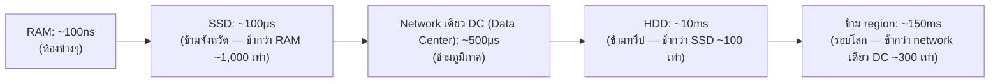

เวลาประเมินว่า "operation นี้เร็วพอไหม" ต้องมีตัวเลขอ้างอิงในหัว ลองนึกภาพระยะทางในชีวิตจริง — เดินไปห้องข้างๆ ใช้เวลาไม่กี่วินาที ขับรถในเมืองใช้เป็นชั่วโมง บินข้ามประเทศใช้เป็นวัน ยิ่งระยะทางไกล ยิ่งใช้เวลานาน ตารางนี้เป็นชุดตัวเลข "ระยะทาง" แบบเดียวกันที่วิศวกรระบบมักท่องจำไว้คร่าวๆ

## Latency ระดับต่างๆ (โดยประมาณ)

| Operation | เวลาโดยประมาณ | เทียบเป็นระยะทาง (คูณ 1 พันล้านเท่า) |
|---|---|---|
| อ่านจาก **L1 cache** (CPU) | ~1 nanosecond | 1 วินาที (เดินคนละมุมห้อง) |
| อ่านจาก <mark class="hl-term">RAM</mark> | ~100 nanoseconds | ~1.5 นาที (เดินไปห้องข้างๆ) |
| **Compress** ข้อมูล 1KB | ~10 microseconds | ~3 ชั่วโมง (ขับรถข้ามเมือง) |
| อ่านจาก <mark class="hl-term">SSD</mark> | ~100 microseconds | ~1 วัน (เดินทางข้ามจังหวัด) |
| Round-trip ใน **data center เดียวกัน** | ~500 microseconds | ~6 วัน (เดินทางข้ามภูมิภาค) |
| อ่านจาก **HDD (Hard Disk Drive, จานหมุน)** | ~10 milliseconds | ~4 เดือน (บินไปอีกทวีป) |
| Round-trip **ข้าม region** (เช่น ไทย↔สหรัฐฯ) | ~150 milliseconds | ~5 ปี (เดินทางรอบโลกหลายรอบ) |


```mermaid
flowchart LR
    A["RAM: ~100ns\n(ห้องข้างๆ)"] --> B["SSD: ~100μs\n(ข้ามจังหวัด — ช้ากว่า RAM ~1,000 เท่า)"]
    B --> C["Network เดียว DC (Data Center): ~500μs\n(ข้ามภูมิภาค)"]
    C --> D["HDD: ~10ms\n(ข้ามทวีป — ช้ากว่า SSD ~100 เท่า)"]
    D --> E["ข้าม region: ~150ms\n(รอบโลก — ช้ากว่า network เดียว DC ~300 เท่า)"]
```

ลองคลิกเลือก 2 แถวเทียบกันดูว่าต่างกันกี่เท่า:

```demo
component: LatencyBarChartDemo
caption: คลิกเลือก 2 operation เพื่อเทียบว่าอันไหนช้ากว่ากี่เท่า (แถบยาวตามสเกล log — ต่างกันเป็นพันเป็นล้านเท่าจริงๆ)
```

## ทำไมต้องจำตัวเลขเหล่านี้

ตัวเลขพวกนี้ตอบคำถามที่เจอบ่อยในการออกแบบ:

- **"ทำไมต้อง cache"** — เพราะ RAM (ห้องข้างๆ) เร็วกว่า disk/database (ข้ามจังหวัด) เป็นพันเท่า ทุก cache hit ประหยัดเวลาได้มหาศาล (โมดูล Caching)
- **"ทำไม CDN ช่วยเรื่อง latency ได้มาก"** — เพราะ round-trip ข้าม region (รอบโลก) ช้ากว่า round-trip ใน data center เดียวกัน (ข้ามภูมิภาค) เป็นร้อยเท่า (โมดูล Storage at Scale)
- **"ทำไมต้องเลือก SSD ไม่ใช่ HDD สำหรับ database"** — เพราะต่างกันเป็น 100 เท่า (ข้ามจังหวัด vs ข้ามทวีป) ผลกระทบต่อ query latency ชัดเจนมาก

## กฎง่ายๆ ที่จำได้จากตารางนี้

<mark class="hl-insight">ยิ่งข้อมูลต้องเดินทางไกล (physically) ยิ่งช้า</mark> — memory ในเครื่องเดียวกันเร็วที่สุด (เดินในห้อง), ตามด้วย disk ในเครื่องเดียวกัน (เดินในบ้าน), ตามด้วย network ใน data center เดียวกัน (เดินในเมือง), และช้าที่สุดคือ network ข้ามทวีป (บินรอบโลก) ทุกครั้งที่ออกแบบระบบ ควรถามตัวเองว่า "ทำยังไงให้ข้อมูลเดินทางน้อยที่สุดเท่าที่จำเป็น"

## ขั้นสูง: ตัวเลข "เฉลี่ย" โกหกได้ — ทำไมต้องดู p99 ไม่ใช่แค่ค่าเฉลี่ย

ตารางข้างบนให้ตัวเลขเดี่ยวๆ ต่อ operation แต่ในระบบจริง **latency ไม่ใช่ค่าคงที่ค่าเดียว** — request 1,000 ครั้งไปที่เดียวกัน จะได้เวลาตอบสนองกระจายตัวเป็นช่วง ไม่ใช่ตัวเลขเดียวซ้ำทุกครั้ง <mark class="hl-warning">ค่าเฉลี่ย (average) ซ่อนความจริงที่สำคัญที่สุดไว้ — ถ้า 99% ของ request เร็ว 50ms แต่ 1% ช้าถึง 2 วินาที ค่าเฉลี่ยอาจดูโอเคอยู่ (~70ms) ทั้งที่จริงๆ มี user จำนวนหนึ่งเจอประสบการณ์ที่แย่มาก</mark>

วิธีที่ถูกต้องคือดู <mark class="hl-term">Percentile</mark> — **p50** (ค่ากลาง, ครึ่งหนึ่งเร็วกว่านี้ครึ่งหนึ่งช้ากว่านี้), **p95** (95% ของ request เร็วกว่าค่านี้), และ **p99** (99% เร็วกว่าค่านี้ เหลือแค่ 1% ที่แย่กว่า) — <mark class="hl-insight">p99 คือตัวเลขที่บอก "user ที่โชคร้ายที่สุดในกลุ่ม" เจออะไร — ยิ่งระบบมี traffic สูง 1% ที่ดูเหมือนน้อย ก็แปลงเป็นจำนวนคนจริงที่เจอปัญหาได้มหาศาล (ระบบที่มี 1 ล้าน request/วัน แปลว่ามีคนเจอ p99 latency ถึงหมื่นครั้ง/วัน ไม่ใช่จำนวนน้อยเลย)</mark>

สาเหตุที่ p99 มักแย่กว่า p50 มากไม่ใช่เรื่องบังเอิญ — มักมาจาก **GC pause** (garbage collection หยุดโปรแกรมชั่วครู่), **cache miss** ที่ไปกระทบเฉพาะบาง request, หรือ **network retry** ที่เกิดเป็นบางครั้ง เหตุการณ์เหล่านี้ไม่ได้เกิดกับทุก request แต่พอเกิดกับ request ไหนก็ทำให้ request นั้นช้าผิดปกติทันที

> คำถามสัมภาษณ์: "ทำไม SLA (Service Level Agreement) มักระบุเป็น p99 latency ไม่ใช่ average latency" — เพราะ average latency ซ่อน tail latency ที่แย่ที่สุดไว้ ทำให้ดูเหมือนระบบทำงานดีทั้งที่มี user บางกลุ่มเจอประสบการณ์แย่มากอยู่จริง ยิ่งระบบมี scale สูง 1% ที่ดูน้อยก็แปลงเป็นผู้ใช้จริงจำนวนมากที่ไม่พอใจ p99 (หรือ p95) สะท้อนประสบการณ์ของกลุ่มที่แย่ที่สุดได้ตรงกว่า เป็นตัวชี้วัดที่มีความหมายในทางธุรกิจมากกว่า
