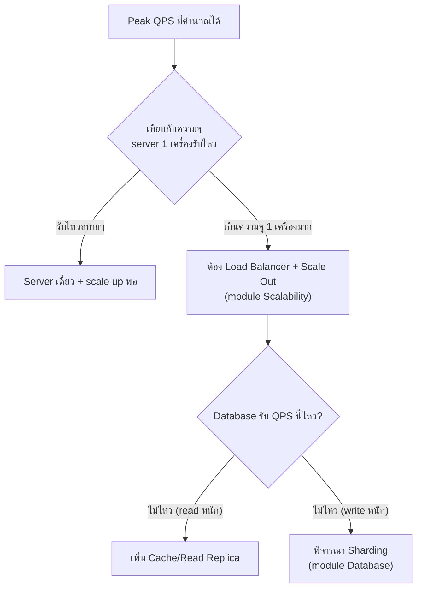

กลับมาที่งานแต่งงาน (บทแรกของโมดูลนี้) — ถ้ารู้จำนวนแขกคร่าวๆ แล้ว ก็คำนวณต่อได้เลยว่าต้องเช่าโต๊ะกี่ตัว อาหารกี่จาน ที่จอดรถกี่คัน — รวมทุกอย่างจากสองบทที่แล้วมาลองคำนวณจริงแบบเดียวกันกับระบบซอฟต์แวร์ ลองปรับตัวเลขในเครื่องคิดเลขข้างล่าง หรือกด preset ดูว่าระบบขนาดต่างกัน ตัวเลขที่ได้ต่างกันแค่ไหน

```demo
component: CapacityCalculator
```

## อ่านผลลัพธ์ยังไง

- <mark class="hl-warning">Average QPS — ภาระเฉลี่ยตลอดวัน มักไม่ใช่ตัวเลขที่ต้องออกแบบระบบให้รองรับ เพราะ traffic จริงไม่กระจายสม่ำเสมอ</mark> (คนใช้งานตอนกลางวัน/เย็นเยอะกว่ากลางดึกมาก)
- <mark class="hl-term">Peak QPS</mark> — เหมือนช่วงเวลาที่แขกมาถึงงานพร้อมกันมากที่สุด (ตอนเปิดงาน) — ตัวเลขที่**ต้องออกแบบให้รองรับจริง** เพราะระบบต้องรอดตอนพีคที่สุด ไม่ใช่แค่ค่าเฉลี่ย — นี่คือเหตุผลที่ทุก capacity planning ต้องคูณ peak multiplier เข้าไปเสมอ
- **Data transfer/วัน** — บอกว่าต้องเผื่อ bandwidth และพื้นที่เก็บข้อมูลแค่ไหน มีผลต่อการเลือกว่าต้องใช้ CDN ไหม (โมดูล Storage at Scale)

## ตัวอย่างการนำไปใช้ตัดสินใจ



ตัวเลขจาก capacity estimation ไม่ใช่แค่ตัวเลขลอยๆ — มันคือ<mark class="hl-insight">จุดเริ่มต้นของทุกการตัดสินใจด้าน architecture</mark> ในหลักสูตรนี้ ตั้งแต่ต้องมี load balancer ไหม, ต้อง cache ไหม, ต้อง shard database ไหม ล้วนตอบได้ชัดเจนขึ้นเมื่อมีตัวเลขจริงมาอ้างอิง ไม่ใช่การเดา เหมือนรู้จำนวนแขกก่อนแล้วค่อยเลือกขนาดฮอลล์ ไม่ใช่เช่าฮอลล์แล้วค่อยมานับแขกทีหลัง

> คำถามสัมภาษณ์: เกือบทุกโจทย์ system design เริ่มด้วยประโยคแบบ "ออกแบบระบบที่รองรับ 10 ล้าน user" — ทักษะจากบทนี้คือขั้นตอนแรกที่ควรทำก่อนวาด diagram ใดๆ เลย: **แปลงตัวเลข user ให้เป็น QPS และขนาดข้อมูลก่อนเสมอ**
