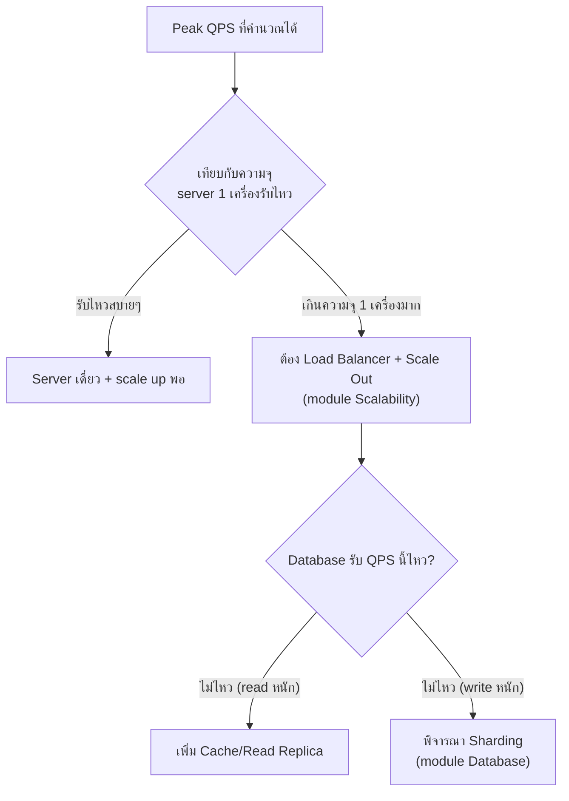

กลับมาที่งานแต่งงาน (บทแรกของโมดูลนี้) — ถ้ารู้จำนวนแขกคร่าวๆ แล้ว ก็คำนวณต่อได้เลยว่าต้องเช่าโต๊ะกี่ตัว อาหารกี่จาน ที่จอดรถกี่คัน — รวมทุกอย่างจากสองบทที่แล้วมาลองคำนวณจริงแบบเดียวกันกับระบบซอฟต์แวร์ ลองปรับตัวเลขในเครื่องคิดเลขข้างล่าง หรือกด preset ดูว่าระบบขนาดต่างกัน ตัวเลขที่ได้ต่างกันแค่ไหน

```demo
component: CapacityCalculator
```

## อ่านผลลัพธ์ยังไง

- <mark class="hl-warning">Average QPS — ภาระเฉลี่ยตลอดวัน มักไม่ใช่ตัวเลขที่ต้องออกแบบระบบให้รองรับ เพราะ traffic จริงไม่กระจายสม่ำเสมอ</mark> (คนใช้งานตอนกลางวัน/เย็นเยอะกว่ากลางดึกมาก)
- <mark class="hl-term">Peak QPS</mark> — เหมือนช่วงเวลาที่แขกมาถึงงานพร้อมกันมากที่สุด (ตอนเปิดงาน) — ตัวเลขที่**ต้องออกแบบให้รองรับจริง** เพราะระบบต้องรอดตอนพีคที่สุด ไม่ใช่แค่ค่าเฉลี่ย — นี่คือเหตุผลที่ทุก capacity planning ต้องคูณ peak multiplier เข้าไปเสมอ
- **Data transfer/วัน** — บอกว่าต้องเผื่อ bandwidth และพื้นที่เก็บข้อมูลแค่ไหน มีผลต่อการเลือกว่าต้องใช้ CDN ไหม (โมดูล Storage at Scale)

## ตัวอย่างการนำไปใช้ตัดสินใจ


```mermaid
flowchart TD
    A["Peak QPS ที่คำนวณได้"] --> B{"เทียบกับความจุ\nserver 1 เครื่องรับไหว"}
    B -->|"รับไหวสบายๆ"| C["Server เดี่ยว + scale up พอ"]
    B -->|"เกินความจุ 1 เครื่องมาก"| D["ต้อง Load Balancer + Scale Out\n(module Scalability)"]
    D --> E{"Database รับ QPS นี้ไหว?"}
    E -->|"ไม่ไหว (read หนัก)"| F["เพิ่ม Cache/Read Replica"]
    E -->|"ไม่ไหว (write หนัก)"| G["พิจารณา Sharding\n(module Database)"]
```

ตัวเลขจาก capacity estimation ไม่ใช่แค่ตัวเลขลอยๆ — มันคือ<mark class="hl-insight">จุดเริ่มต้นของทุกการตัดสินใจด้าน architecture</mark> ในหลักสูตรนี้ ตั้งแต่ต้องมี load balancer ไหม, ต้อง cache ไหม, ต้อง shard database ไหม ล้วนตอบได้ชัดเจนขึ้นเมื่อมีตัวเลขจริงมาอ้างอิง ไม่ใช่การเดา เหมือนรู้จำนวนแขกก่อนแล้วค่อยเลือกขนาดฮอลล์ ไม่ใช่เช่าฮอลล์แล้วค่อยมานับแขกทีหลัง

> คำถามสัมภาษณ์: เกือบทุกโจทย์ system design เริ่มด้วยประโยคแบบ "ออกแบบระบบที่รองรับ 10 ล้าน user" — ทักษะจากบทนี้คือขั้นตอนแรกที่ควรทำก่อนวาด diagram ใดๆ เลย: **แปลงตัวเลข user ให้เป็น QPS และขนาดข้อมูลก่อนเสมอ**

## ขั้นสูง: สูตรที่แปลง QPS ให้เป็น "ต้องมีกี่เครื่อง" ได้จริง (Little's Law)

Peak QPS บอกว่าระบบต้องรับ request กี่ครั้ง/วินาที แต่ยังไม่บอกตรงๆ ว่า**ต้องมี server/thread กี่ตัวพร้อมกันถึงจะรับไหว** — ตัวเชื่อมสองอย่างนี้คือกฎทางคณิตศาสตร์ที่เรียกว่า <mark class="hl-term">Little's Law</mark>: **L = λ × W**

- **L** = จำนวน request ที่กำลังถูกประมวลผลพร้อมกัน ณ เวลาใดเวลาหนึ่ง (concurrency ที่ต้องรองรับ)
- **λ (lambda)** = อัตรา request เข้ามาต่อวินาที (คือ QPS ที่คำนวณมาจากเครื่องคิดเลขข้างบน)
- **W** = เวลาเฉลี่ยที่ใช้ประมวลผล 1 request (latency เฉลี่ยต่อ request)

<mark class="hl-insight">ตัวอย่าง: ถ้า Peak QPS = 1,000 request/วินาที และแต่ละ request ใช้เวลาเฉลี่ย 200ms (0.2 วินาที) ในการประมวลผล — L = 1,000 × 0.2 = 200 แปลว่าต้องมีความสามารถรองรับ 200 request พร้อมกัน ณ เวลาเดียวกันได้จริง ไม่ใช่แค่ "รับได้ 1,000 request ต่อวินาทีเฉลี่ย" เฉยๆ</mark> ถ้า 1 server รับได้ 50 concurrent request พร้อมกัน (ตาม thread pool/connection ที่ตั้งไว้) ก็คำนวณต่อได้ทันทีว่าต้องมีอย่างน้อย 200 ÷ 50 = 4 เครื่องขึ้นไป (ไม่รวม margin เผื่อ failover)

<mark class="hl-warning">สูตรนี้แสดงให้เห็นด้วยว่าทำไม latency เฉลี่ยที่สูงขึ้นแค่นิดเดียว ต้องการเครื่องเพิ่มขึ้นตามสัดส่วน — ถ้า W เพิ่มจาก 200ms เป็น 400ms (ช้าลง 2 เท่า) โดย QPS เท่าเดิม L ก็เพิ่มเป็น 2 เท่าทันที (400 concurrent request) ต้องการจำนวนเครื่องเพิ่มเป็น 2 เท่าตามไปด้วย</mark> — นี่คือเหตุผลที่ optimization latency (แม้แค่ไม่กี่ ms) มีผลจริงต่อจำนวนเครื่องที่ต้องใช้ ไม่ใช่แค่เรื่อง "เร็วขึ้นนิดหน่อย"

> คำถามสัมภาษณ์: "จาก Peak QPS ที่คำนวณได้ จะรู้ได้ยังไงว่าต้องใช้กี่ server" — ใช้ Little's Law (L = λW): เอา Peak QPS (λ) คูณกับ latency เฉลี่ยต่อ request (W) ได้จำนวน concurrent request ที่ต้องรองรับพร้อมกันจริง (L) แล้วหารด้วยความสามารถรองรับ concurrent request ของ 1 server ได้จำนวนเครื่องขั้นต่ำที่ต้องมี — สูตรนี้ยังแสดงด้วยว่าทำไม latency ที่แย่ลงถึงต้องการจำนวนเครื่องเพิ่มขึ้นตามสัดส่วนเสมอ
