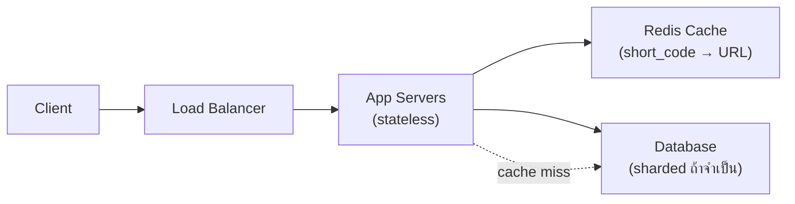

โจทย์สัมภาษณ์คลาสสิก: "ออกแบบ URL Shortener แบบ bit.ly" — ลองนึกภาพบริการที่รับ URL ยาวๆ (อาจยาวเป็นร้อยตัวอักษร) แล้วคืนกลับมาเป็นลิงก์สั้นๆ จำง่าย คลิกแล้วพาไปที่หน้าเดิม — โจทย์ฟังดูเรียบง่ายมาก แต่ครอบคลุมแทบทุก concept ที่เรียนมาตลอดหลักสูตรนี้

## Requirement คร่าวๆ

- รับ URL ยาว คืน short code (เช่น `short.ly/aZ3x9`)
- คลิก short code แล้ว redirect ไป URL ต้นฉบับ
- <mark class="hl-insight">รองรับ 100 ล้าน URL ใหม่/เดือน, อ่าน (redirect) มากกว่าเขียนหลายเท่า (read-heavy)</mark> — เหมือนป้ายบอกทางที่คนขับผ่านดูวันละหลายพันครั้ง แต่ไม่ค่อยมีใครมาติดป้ายใหม่บ่อย

```demo
component: StepThroughDiagram
props: {"steps":[{"label":"1. ประเมิน Capacity ก่อน (module Capacity Estimation)","detail":"100M URL/เดือน ≈ 40 write/วินาที (เฉลี่ย) — เขียนน้อย แต่ redirect (อ่าน) อาจสูงกว่านี้ 10-100 เท่า เพราะ 1 URL ถูกคลิกซ้ำได้หลายครั้ง เหมือนป้ายเดียวมีคนผ่านดูซ้ำๆ ทุกวัน"},{"label":"2. ออกแบบวิธีสร้าง Short Code","detail":"เข้ารหัส ID ตัวเลข (auto-increment หรือ distributed ID generator) เป็น base62 (a-z, A-Z, 0-9) ได้ code สั้นไม่ซ้ำกันแน่นอน แทนที่จะสุ่มแล้วเช็คชนไปเรื่อยๆ"},{"label":"3. เลือก Database (module Database)","detail":"ข้อมูลเรียบง่าย (short_code → long_url) ไม่ต้องเชื่อมโยงข้ามตารางซับซ้อน ใช้ key-value store หรือ NoSQL ก็พอ ไม่จำเป็นต้องเป็น SQL"},{"label":"4. ใส่ Cache เพราะ Read-Heavy (module Caching)","detail":"URL ยอดนิยมถูกคลิกซ้ำมหาศาล — จดไว้ในกระดาษข้างเตา (cache mapping short_code → long_url ไว้ใน Redis) ลด load ที่ database ลงอย่างมาก"},{"label":"5. Scale ด้วย Load Balancer (module Scalability)","detail":"หลาย server รับ redirect request พร้อมกัน — เพราะไม่มีอะไรต้องจำเกี่ยวกับ user คนไหนเป็นพิเศษ (stateless ตามธรรมชาติ) ทำ horizontal scaling ได้ง่าย"},{"label":"6. พิจารณา Sharding ถ้าข้อมูลใหญ่มาก (module Database)","detail":"ถ้า URL สะสมหลักพันล้าน แบ่งไปเก็บคนละตึกตาม short_code (hash-based) รองรับได้ไม่จำกัดตามจำนวนตึกที่เพิ่ม"}]}
```

```demo
component: JourneyDiagram
props: {"nodes":[{"icon":"person","label":"Client"},{"icon":"notebook","label":"Cache"},{"icon":"building","label":"Database"}],"travelerIcon":"envelope","steps":[{"activeNode":0,"caption":"Client คลิก short link (เช่น short.ly/aZ3x9)"},{"activeNode":1,"caption":"App เช็ค Cache ก่อน — URL ยอดนิยมส่วนใหญ่ hit ที่นี่ ไม่ต้องไปแตะ Database เลย"},{"activeNode":2,"caption":"ถ้า Miss ถึงไปเปิด Database หา long URL จริง แล้วจดใส่ Cache ไว้ด้วย"},{"activeNode":0,"caption":"Redirect กลับไปยัง URL ต้นฉบับ — เพราะเป็น read-heavy ระบบเน้นให้ทาง Cache เร็วที่สุด"}]}
```

## Architecture รวม



## จุดที่มักถูกถามต่อในสัมภาษณ์

- **Custom alias** (ผู้ใช้ตั้ง short code เอง) — ต้องเช็คว่า code นั้นถูกใช้ไปแล้วหรือยัง (เหมือนเช็คว่าชื่อโดเมนนี้มีคนจองแล้วหรือยัง)
- **Analytics** (นับจำนวนคลิก) — <mark class="hl-warning">เขียนถี่มาก ควรทำแบบ async ไม่บล็อกการ redirect ให้ user ต้องรอ</mark> (module Async & Messaging)
- **URL หมดอายุ** — ใช้ TTL คล้ายกับที่เรียนใน module Caching (ป้ายที่มีวันหมดอายุกำกับ)
