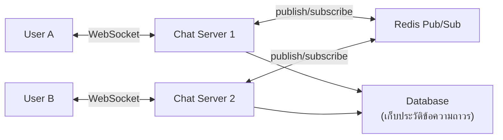

โจทย์ "ออกแบบระบบแชทแบบ WhatsApp" — ลองนึกภาพความต่างจาก URL shortener: แชทต้องการ **real-time** ข้อความต้องส่งถึงอีกฝั่งเกือบทันที เหมือนคุยโทรศัพท์ ไม่ใช่ส่งจดหมายที่รอวันสองวันได้

## ปัญหาใหม่ที่ต้องแก้: HTTP ปกติไม่พอ

HTTP request-response แบบที่เรียนมาตลอด (module Fundamentals) เป็นแบบ client ถามก่อนเสมอ (เหมือนต้องกดโทรออกทุกครั้งถึงจะได้ยินเสียงอีกฝั่ง) — แต่แชทต้องการให้ **server ส่งข้อความหาไปหา client ได้เองทันทีที่มีข้อความใหม่** โดย client ไม่ต้องถามซ้ำๆ (polling — เหมือนโทรถามทุก 2 วินาทีว่า "มีข้อความใหม่หรือยัง") วิธีแก้คือ <mark class="hl-term">WebSocket</mark> — เปิดสายค้างไว้ (persistent connection) ที่ทั้งสองฝั่งพูดใส่กันได้ตลอดเวลาโดยไม่ต้องวางสายแล้วโทรใหม่

```demo
component: StepThroughDiagram
props: {"steps":[{"label":"1. เปิด WebSocket Connection","detail":"แทนที่จะเปิด-ปิดสายทุกครั้งแบบ HTTP ปกติ client เปิดสายค้างไว้กับ server ตัวหนึ่ง เหมือนโทรศัพท์ที่ไม่วางหูตลอดการสนทนา"},{"label":"2. Message Routing ข้าม Server (module Scalability)","detail":"ถ้า user A ต่อสายกับ Server 1 และ user B ต่อสายกับ Server 2 ข้อความของ A ต้องหาทางไปหา Server 2 ให้เจอ — ต้องมีสมุดโทรศัพท์กลางบอกว่า user ไหนต่อสายกับ server ไหน (คล้าย Service Discovery จาก module Microservices)"},{"label":"3. Pub/Sub กระจายข้อความ (module Async & Messaging)","detail":"ใช้ Redis Pub/Sub หรือ message broker กลาง — Server 1 ประกาศข้อความ (publish), Server 2 ที่เปิดลำโพงรับฟังอยู่ (subscribe) ได้ยินแล้วส่งต่อผ่านสายของตัวเองไปหา user B"},{"label":"4. เก็บประวัติข้อความ (module Database)","detail":"ข้อความต้องอยู่ถาวรแม้ user offline (เหมือนข้อความ SMS ที่รออ่านได้ทีหลัง) — เขียนลง database ควบคู่ไปกับการส่ง real-time (เขียนสองที่ ต้องคิดเรื่อง consistency)"},{"label":"5. Offline Delivery","detail":"ถ้า user B offline ตอนส่ง ข้อความต้องรอใน queue จนกว่า B online แล้วค่อยส่ง (คล้ายหลักการ Message Queue — วางบัตรคิวรอไว้จนกว่าจะมีคนมารับ)"}]}
```

```demo
component: JourneyDiagram
props: {"nodes":[{"icon":"person","label":"User A"},{"icon":"building","label":"Chat Server 1"},{"icon":"building","label":"Redis Pub/Sub"},{"icon":"building","label":"Chat Server 2"}],"travelerIcon":"envelope","steps":[{"activeNode":1,"caption":"User A ส่งข้อความผ่าน WebSocket ที่เปิดค้างไว้กับ Chat Server 1"},{"activeNode":2,"caption":"Server 1 ประกาศข้อความผ่าน Redis Pub/Sub — ไม่รู้ว่า User B ต่อสายอยู่กับ server ไหน"},{"activeNode":3,"caption":"Chat Server 2 (ที่ User B ต่อสายอยู่) subscribe อยู่ ได้ยินข้อความ"},{"activeNode":0,"caption":"Server 2 ส่งข้อความผ่าน WebSocket ของตัวเองไปถึง User B เกือบทันที"}]}
```

## Architecture รวม



## Trade-off ที่ควรพูดถึงในสัมภาษณ์

- **Consistency ของลำดับข้อความ** (module Consistency & CAP) — ข้อความต้องเรียงลำดับถูกต้องแม้มาจากหลาย server เหมือนบทสนทนาที่ต้องอ่านตามลำดับ ไม่ใช่สลับหน้าหลัง
- <mark class="hl-warning">Connection ค้างไว้กินทรัพยากร server เยอะกว่า HTTP ปกติมาก</mark> — ต้องคำนวณว่า 1 server รับสายค้างไว้พร้อมกันได้กี่คู่สาย (capacity estimation)
- **Read receipt / "กำลังพิมพ์..."** — เป็น event เล็กๆ ที่ยิงถี่มาก ควรแยกช่องทางจากข้อความจริงเพื่อไม่ให้กระทบ throughput หลัก

## คำถามเจาะลึกที่มักถูกถามต่อ

**ถาม: ทำไม HTTP polling ไม่พอ ต้องใช้ WebSocket ต่างกันแค่ไหนจริงๆ?**
Polling ทุก 2 วินาที = แต่ละ client ยิง request แม้ไม่มีข้อความใหม่ ถ้ามี user หลักล้านคน <mark class="hl-warning">เท่ากับหลักแสน request/วินาทีที่เปล่าประโยชน์ตลอดเวลา และข้อความจริงอาจมาช้าสุดถึง 2 วินาที (worst case)</mark> WebSocket ส่งถึงทันทีที่มีข้อความ (latency หลัก 10-100ms ตาม network) ไม่ต้องยิง request เปล่าซ้ำๆ เลย

**ถาม: ทำไมต้องมี Redis Pub/Sub ทั้งที่แค่ WebSocket ก็ส่งข้อความได้แล้ว?**
WebSocket ส่งได้แค่ระหว่าง client กับ server ที่มันต่ออยู่ ถ้า user A ต่อ Server 1 และ user B ต่อ Server 2 (คนละเครื่องเพราะมี Load Balancer) Server 1 ไม่มีทางส่งตรงไป Server 2 ได้เลย <mark class="hl-insight">Pub/Sub เป็นช่องกลางให้ Server 1 ประกาศแล้ว Server 2 ได้ยินโดยไม่ต้องรู้จักกันโดยตรง</mark> — ไม่มี Pub/Sub ข้อความจาก A จะไปไม่ถึง B เลยถ้าคนละเครื่อง

**ถาม: Connection ค้างไว้กินทรัพยากรกว่า HTTP ปกติกี่เท่า?**
HTTP เปิด-ปิด connection ตามรอบ request/response ไม่ค้างนาน แต่ WebSocket ต้องค้างไว้ตลอดที่ user online กิน memory ต่อ connection (socket state, buffer) แม้ไม่มีข้อความส่งเลย <mark class="hl-warning">เครื่องหนึ่งรับ concurrent WebSocket ได้จำกัดกว่าจำนวน HTTP request/วินาทีที่รับได้มาก (มักหลักหมื่น-แสน connection ต่อเครื่อง ไม่ใช่ไม่จำกัด)</mark> ต้องคำนวณ capacity แยกจาก HTTP ปกติ

**ถาม: ทำไมต้องเขียนข้อความ 2 ที่ (ส่ง real-time + เก็บ Database) ไม่เขียนที่เดียวพอ?**
ถ้าเขียน Database ก่อนแล้วค่อยส่ง real-time ผู้รับต้องรอ Database เขียนเสร็จก่อน (เพิ่ม latency ข้อความ) ถ้าส่ง real-time อย่างเดียวไม่เก็บ Database ข้อความหายถ้า user offline หรือเปิดแอปใหม่ ต้องทำสองอย่างพร้อมกัน (ส่งทันที + เขียนแบบ async ควบคู่) แลกกับความซับซ้อนเรื่อง consistency ระหว่างสองที่

**ถาม: ถ้า user B offline ตอนส่งข้อความ ระบบ hang รอเหรอ?**
ไม่ — ข้อความเข้า queue รอไว้ (คล้าย Message Queue) ไม่ block ฝั่งคนส่ง A ได้รับ "ส่งสำเร็จ" ทันทีไม่ต้องรอ B online พอ B online ค่อย deliver ข้อความที่ค้างคิวให้ ถ้า block รอจริงๆ ระบบแชทใช้งานไม่ได้เลยเวลาอีกฝั่ง offline

**ถาม: ทำไม "กำลังพิมพ์..." ต้องแยกช่องทางจากข้อความจริง?**
Typing indicator ยิงถี่มาก (ทุกครั้งที่กดปุ่ม อาจหลายครั้ง/วินาที) ต่างจากข้อความจริงที่ส่งเป็นครั้งๆ <mark class="hl-insight">ถ้าปนกันในคิวเดียว event เล็กๆ ที่ไม่สำคัญนี้จะแย่ง throughput กับข้อความจริงที่ต้องส่งให้ทันและไม่หาย</mark> แยกช่องทาง (ยอมให้ typing indicator หายได้ ไม่ retry) ป้องกันไม่ให้กระทบข้อความสำคัญ
