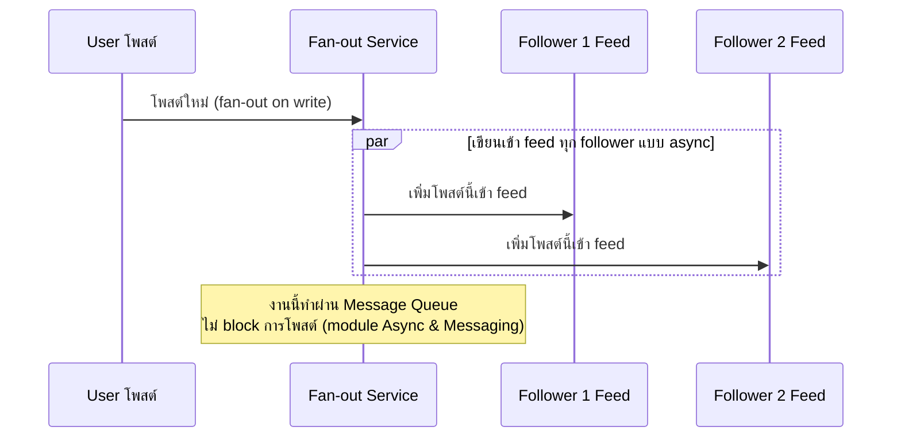
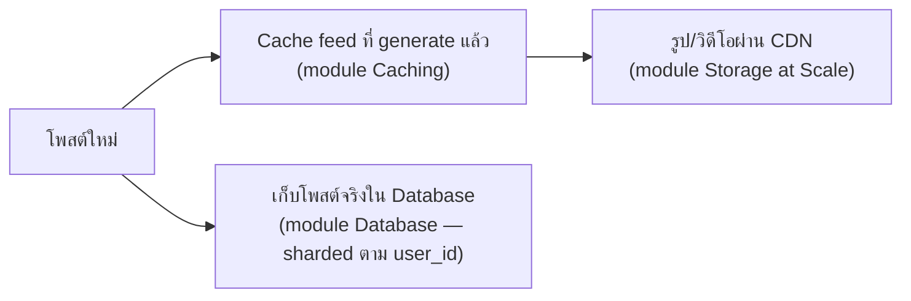

โจทย์ "ออกแบบ News Feed แบบ Facebook/Twitter" — โจทย์นี้พิเศษตรงที่มีคำถามหลักคือ **feed ของแต่ละคน "ประกอบร่าง" ตอนไหน** ลองนึกภาพเหมือนบรรณาธิการหนังสือพิมพ์ที่ต้องตัดสินใจว่าจะพิมพ์หนังสือพิมพ์ฉบับเฉพาะให้แต่ละคนล่วงหน้า หรือรอให้คนมาขอค่อยรวบรวมข่าวให้สดๆ — สองแนวทางนี้ trade-off ตรงข้ามกันชัดเจน

## Fan-out on Write vs Fan-out on Read

```demo
component: ComparisonDiagram
props: {"left":{"title":"Fan-out on Write (พิมพ์ฉบับเฉพาะล่วงหน้า)","points":["โพสต์ใหม่ → เขียนเข้า feed ของ follower ทุกคนทันที","อ่าน feed เร็วมาก (feed พร้อมอยู่แล้ว แค่หยิบมาอ่าน)","เขียนหนักมากถ้าคนดังมี follower หลักล้าน (celebrity problem)"]},"right":{"title":"Fan-out on Read (รวบรวมสดตอนขอ)","points":["โพสต์ใหม่ → เก็บที่เดียว ไม่กระจายทันที","อ่าน feed ต้องไปรวบรวมโพสต์จากทุกคนที่ follow ตอนนั้นเลย","เขียนเบา แต่อ่านหนักและช้ากว่า (ต้องรวบรวมสดทุกครั้ง)"]},"note":"ระบบใหญ่จริงมักผสมทั้งคู่: user ทั่วไปใช้ fan-out on write (เร็ว), คนดัง follower เยอะมากใช้ fan-out on read เฉพาะราย"}
```



```demo
component: JourneyDiagram
props: {"nodes":[{"icon":"person","label":"User โพสต์"},{"icon":"building","label":"Fan-out Queue"},{"icon":"notebook","label":"Follower Feeds"}],"travelerIcon":"envelope","steps":[{"activeNode":0,"caption":"User โพสต์ใหม่ — ระบบตอบกลับทันทีว่าโพสต์สำเร็จ (ไม่รอ fan-out เสร็จ)"},{"activeNode":1,"caption":"งาน fan-out เข้า Message Queue เบื้องหลัง (async ไม่บล็อก user)"},{"activeNode":2,"caption":"Worker ค่อยๆ เขียนโพสต์นี้เข้า feed ของ follower ทุกคน (fan-out on write)"}]}
```

## ทำไม Fan-out ต้องเป็น Async

ถ้า user ดังมี follower 10 ล้านคน <mark class="hl-warning">การเขียนเข้า feed ทุกคนพร้อมกันแบบ synchronous จะทำให้การโพสต์ค้างนานมาก</mark> (เหมือนต้องพิมพ์หนังสือพิมพ์ฉบับพิเศษ 10 ล้านฉบับให้เสร็จก่อนถึงจะกดโพสต์ได้) วิธีที่ถูกต้องคือให้การโพสต์**ตอบกลับทันที** (เชื่อมกับ module Async & Messaging) แล้วส่งงาน fan-out เข้า queue ให้ worker ค่อยๆ กระจายไปทีละ follower เบื้องหลัง

## ตัวช่วยอื่นๆ ที่ประกอบร่างกัน



- **Cache** feed ที่ generate ไว้แล้ว (เหมือนหนังสือพิมพ์พิมพ์เสร็จแล้ว ไม่ต้องพิมพ์ใหม่ทุกครั้งที่มีคนขอ)
- **CDN** สำหรับรูป/วิดีโอในโพสต์ (เนื้อหาหนักที่สุดของ feed — เหมือนภาพสีในหนังสือพิมพ์ที่ต้องพิมพ์แยกโรงพิมพ์ใกล้บ้านลูกค้า)
- **Sharded database** เก็บโพสต์จริง (ปริมาณมหาศาล ต้องกระจายหลายเครื่องเหมือนแบ่งคลังเก็บข่าวเป็นหลายตึก)

## คำถามเจาะลึกที่มักถูกถามต่อ

**ถาม: ทำไม Fan-out on Write ต้องเป็น async ไม่ทำ sync ตอนโพสต์เลย?**
ถ้า user ดังมี follower 10 ล้านคน และเขียนเข้า feed ทุกคนแบบ synchronous — เขียนต่อเนื่องแม้เร็วเครื่องละพันแถว/วินาที <mark class="hl-warning">ก็ยังกินเวลาหลักสิบวินาทีถึงเป็นนาทีกว่าจะเขียนครบ user ต้องรอกดโพสต์นานผิดปกติ</mark> async ตอบกลับทันที (<1 วินาที) แล้วให้ worker ทยอยเขียนเบื้องหลังแทน

**ถาม: ทำไมคนดัง follower เยอะ ต้องเปลี่ยนไปใช้ Fan-out on Read เฉพาะราย?**
User ทั่วไป follower หลักร้อย-พัน fan-out write ใช้เวลาสั้นไม่มีปัญหา แต่คนดัง follower หลักสิบล้าน การเขียนเข้า feed ทุกคนกินทรัพยากรมหาศาลต่อโพสต์เดียว ยิ่งโพสต์บ่อยยิ่งซ้ำงานหนัก <mark class="hl-insight">เปลี่ยนเป็น fan-out on read (รวมตอน follower เปิดแอป) ลดงานเขียนที่ไม่จำเป็นลงมหาศาล แลกกับอ่านช้าลงเล็กน้อยตอนเปิด feed</mark>

**ถาม: ทำไมต้อง Cache feed ที่ generate แล้ว ทั้งที่ fan-out on write เขียนไว้ล่วงหน้าอยู่แล้ว?**
"เขียนเข้า feed" มักหมายถึงเขียน reference ไว้ แต่ render feed จริง (ดึงเนื้อหาโพสต์ครบ รูป ข้อมูล user) ยังมีงานประมวลผลอยู่ ถ้าไม่ cache ผลที่ render แล้ว ทุกครั้งที่ user เปิดแอป (บ่อยกว่าที่มีคนโพสต์ใหม่มาก) ต้อง render ซ้ำงานเดิมทุกรอบ cache ผลไว้ลดงานซ้ำซ้อนนี้ ตอบเร็วขึ้นระดับ 10 เท่า+

**ถาม: ทำไม CDN สำคัญสำหรับ Feed มากเป็นพิเศษ?**
รูป/วิดีโอในโพสต์คือข้อมูลหนักที่สุดใน feed (ขนาดใหญ่กว่า text หลายร้อย-พันเท่า) <mark class="hl-warning">ถ้าทุก client โหลดจาก origin ตรงๆ แบนด์วิดท์ origin จะพังก่อน CPU ด้วยซ้ำ</mark> CDN กระจายไฟล์เหล่านี้ไปหลายจุดทั่วโลก ลด load origin ลงมหาศาลและลด latency โหลดรูปตามภูมิภาค

**ถาม: Sharded Database ตาม user_id ช่วยอะไร ทำไมไม่ shard ตาม post_id?**
Query ที่พบบ่อยที่สุดคือ "ดึงโพสต์ทั้งหมดของ user คนนี้" (ตอน generate feed ต้องไปดึงโพสต์ของทุกคนที่ follow) shard ตาม user_id ทำให้โพสต์ของคนเดียวกันอยู่ shard เดียวกันเสมอ ดึงในครั้งเดียวไม่ต้อง scatter-gather ไปหลาย shard ซึ่งช้ากว่า

**ถาม: ทำไมไม่ทำ Fan-out on Read ทั้งระบบไปเลย ง่ายกว่าไม่ต้องจัดการ celebrity problem?**
Fan-out on read ต้องรวบรวมโพสต์สดทุกครั้งที่เปิด feed — ถ้า follow 500 คน ทุกครั้งที่เปิดแอปต้อง query 500 คนพร้อมกันแล้ว merge/sort ใหม่ <mark class="hl-insight">ทำทุกครั้งที่เปิดแอป (บ่อยกว่าคนโพสต์มาก) กลายเป็นงานหนักกว่าเดิมสำหรับ user ส่วนใหญ่</mark> fan-out on write เร็วกว่ามากสำหรับกรณีทั่วไป hybrid คุ้มกว่า all-read

> คำถามสัมภาษณ์: "Twitter/Facebook แก้ปัญหา celebrity problem ยังไง" — <mark class="hl-insight">คำตอบมาตรฐานคือ hybrid: user ทั่วไป fan-out ทันที (เร็ว, follower น้อย ไม่แพง) ส่วนคนดังที่ follower เยอะมาก ระบบจะไม่ fan-out ล่วงหน้า แต่รวม post ของคนดังเข้า feed ตอน follower เปิดแอปจริงๆ</mark> (fan-out on read เฉพาะกรณีนี้ — เหมือนไม่พิมพ์คอลัมน์พิเศษล่วงหน้า แต่แทรกข่าวสดตอนส่งหนังสือพิมพ์จริง)
