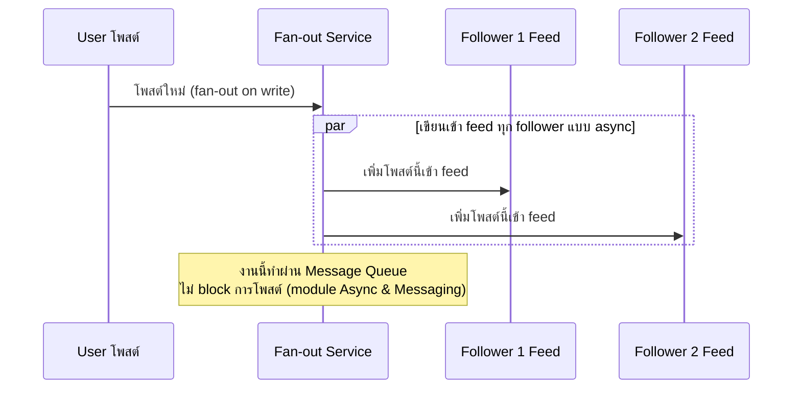
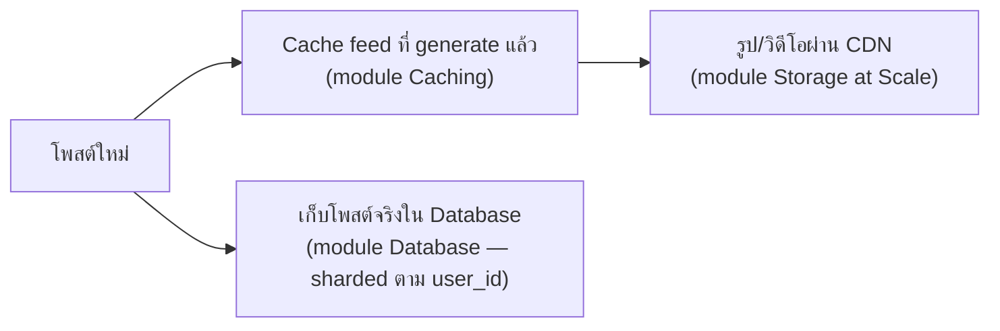

โจทย์ "ออกแบบ News Feed แบบ Facebook/Twitter" — โจทย์นี้พิเศษตรงที่มีคำถามหลักคือ **feed ของแต่ละคน "ประกอบร่าง" ตอนไหน** ลองนึกภาพเหมือนบรรณาธิการหนังสือพิมพ์ที่ต้องตัดสินใจว่าจะพิมพ์หนังสือพิมพ์ฉบับเฉพาะให้แต่ละคนล่วงหน้า หรือรอให้คนมาขอค่อยรวบรวมข่าวให้สดๆ — สองแนวทางนี้ trade-off ตรงข้ามกันชัดเจน

## Fan-out on Write vs Fan-out on Read

```demo
component: ComparisonDiagram
props: {"left":{"title":"Fan-out on Write (พิมพ์ฉบับเฉพาะล่วงหน้า)","points":["โพสต์ใหม่ → เขียนเข้า feed ของ follower ทุกคนทันที","อ่าน feed เร็วมาก (feed พร้อมอยู่แล้ว แค่หยิบมาอ่าน)","เขียนหนักมากถ้าคนดังมี follower หลักล้าน (celebrity problem)"]},"right":{"title":"Fan-out on Read (รวบรวมสดตอนขอ)","points":["โพสต์ใหม่ → เก็บที่เดียว ไม่กระจายทันที","อ่าน feed ต้องไปรวบรวมโพสต์จากทุกคนที่ follow ตอนนั้นเลย","เขียนเบา แต่อ่านหนักและช้ากว่า (ต้องรวบรวมสดทุกครั้ง)"]},"note":"ระบบใหญ่จริงมักผสมทั้งคู่: user ทั่วไปใช้ fan-out on write (เร็ว), คนดัง follower เยอะมากใช้ fan-out on read เฉพาะราย"}
```



```demo
component: JourneyDiagram
props: {"nodes":[{"icon":"person","label":"User โพสต์"},{"icon":"building","label":"Fan-out Queue"},{"icon":"notebook","label":"Follower Feeds"}],"travelerIcon":"envelope","steps":[{"activeNode":0,"caption":"User โพสต์ใหม่ — ระบบตอบกลับทันทีว่าโพสต์สำเร็จ (ไม่รอ fan-out เสร็จ)"},{"activeNode":1,"caption":"งาน fan-out เข้า Message Queue เบื้องหลัง (async ไม่บล็อก user)"},{"activeNode":2,"caption":"Worker ค่อยๆ เขียนโพสต์นี้เข้า feed ของ follower ทุกคน (fan-out on write)"}]}
```

## ทำไม Fan-out ต้องเป็น Async

ถ้า user ดังมี follower 10 ล้านคน <mark class="hl-warning">การเขียนเข้า feed ทุกคนพร้อมกันแบบ synchronous จะทำให้การโพสต์ค้างนานมาก</mark> (เหมือนต้องพิมพ์หนังสือพิมพ์ฉบับพิเศษ 10 ล้านฉบับให้เสร็จก่อนถึงจะกดโพสต์ได้) วิธีที่ถูกต้องคือให้การโพสต์**ตอบกลับทันที** (เชื่อมกับ module Async & Messaging) แล้วส่งงาน fan-out เข้า queue ให้ worker ค่อยๆ กระจายไปทีละ follower เบื้องหลัง

## ตัวช่วยอื่นๆ ที่ประกอบร่างกัน



- **Cache** feed ที่ generate ไว้แล้ว (เหมือนหนังสือพิมพ์พิมพ์เสร็จแล้ว ไม่ต้องพิมพ์ใหม่ทุกครั้งที่มีคนขอ)
- **CDN** สำหรับรูป/วิดีโอในโพสต์ (เนื้อหาหนักที่สุดของ feed — เหมือนภาพสีในหนังสือพิมพ์ที่ต้องพิมพ์แยกโรงพิมพ์ใกล้บ้านลูกค้า)
- **Sharded database** เก็บโพสต์จริง (ปริมาณมหาศาล ต้องกระจายหลายเครื่องเหมือนแบ่งคลังเก็บข่าวเป็นหลายตึก)

> คำถามสัมภาษณ์: "Twitter/Facebook แก้ปัญหา celebrity problem ยังไง" — <mark class="hl-insight">คำตอบมาตรฐานคือ hybrid: user ทั่วไป fan-out ทันที (เร็ว, follower น้อย ไม่แพง) ส่วนคนดังที่ follower เยอะมาก ระบบจะไม่ fan-out ล่วงหน้า แต่รวม post ของคนดังเข้า feed ตอน follower เปิดแอปจริงๆ</mark> (fan-out on read เฉพาะกรณีนี้ — เหมือนไม่พิมพ์คอลัมน์พิเศษล่วงหน้า แต่แทรกข่าวสดตอนส่งหนังสือพิมพ์จริง)
