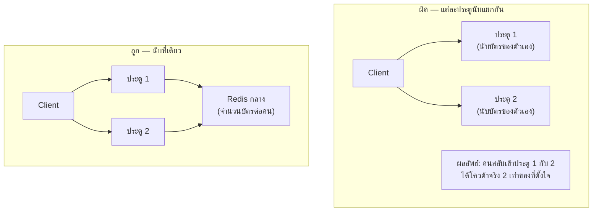

module Reliability สอน**แนวคิด**ของ rate limiting (บัตรแจกวันละ 8 ใบ) ไปแล้ว — โจทย์สัมภาษณ์นี้ถามลึกกว่านั้น: "ออกแบบ **rate limiter เป็น service กลาง** ที่ทุก microservice ในองค์กรเรียกใช้ร่วมกัน" ลองนึกภาพถ้าสวนสนุกมีหลายประตูทางเข้า แต่ละประตูแจกบัตรนับของตัวเอง — ปัญหาใหม่ที่โผล่มาคือ **หลายประตูต้องนับบัตรใบเดียวกันให้ตรงกัน**

## ปัญหาใหม่: Rate Limiter ต้อง Distributed



ถ้าแต่ละ app server เก็บ token bucket แยกกันเอง (in-memory) — <mark class="hl-warning">user ที่ยิง request สลับไปมาระหว่างเครื่อง (ปกติมากเพราะมี Load Balancer อยู่แล้ว) จะได้โควต้ารวมมากกว่าที่ตั้งใจ</mark> ทางแก้คือย้ายจำนวนบัตรไปเก็บที่ **Redis กลาง** (distributed cache จาก module Caching) ให้ทุก server เช็ค/อัปเดตค่าเดียวกัน เหมือนทุกประตูเปิดสมุดนับบัตรเล่มเดียวกัน แทนที่จะมีสมุดนับแยกคนละเล่ม

```demo
component: StepThroughDiagram
props: {"steps":[{"label":"1. Request มาถึง App Server (ผ่าน Load Balancer)","detail":"App server ไหนก็ได้รับ request แล้วต้องเช็คโควต้าของ user นี้ก่อนประมวลผลต่อ"},{"label":"2. เช็ค/อัปเดต Token Count ที่ Redis กลาง","detail":"ใช้ atomic operation (เช่น Redis INCR + EXPIRE) เพื่อป้องกัน race condition ตอนหลาย server เช็คพร้อมกัน เหมือนสมุดนับบัตรที่แก้ทีละคนไม่ให้เขียนทับกัน"},{"label":"3. Redis ตอบกลับว่าเหลือโควต้าไหม","detail":"ถ้าเหลือ อนุญาต request ผ่าน ถ้าไม่เหลือ ตอบ 429 ทันทีโดยไม่ต้องประมวลผล request จริง"},{"label":"4. ทำที่ API Gateway ไม่ใช่ทุก service แยกกัน","detail":"เชื่อมกับ module Microservices — rate limit ควรอยู่ที่ Gateway (พนักงานต้อนรับ) จุดเดียว ไม่ต้องเขียนซ้ำในทุก microservice ข้างหลัง"}]}
```

```demo
component: JourneyDiagram
props: {"nodes":[{"icon":"person","label":"Client"},{"icon":"gate","label":"App Servers"},{"icon":"notebook","label":"Redis กลาง"}],"travelerIcon":"envelope","steps":[{"activeNode":1,"caption":"Request จากหลายประตู (App Server) ต่างเช็คโควต้าของ user เดียวกัน"},{"activeNode":2,"caption":"ทุกประตูเช็ค/อัปเดตที่ Redis กลางเล่มเดียวกัน (ไม่ใช่นับแยกคนละเครื่อง)"},{"activeNode":1,"caption":"Redis ตอบกลับว่าเหลือโควต้าไหม — ถ้าไม่เหลือ ตอบ 429 ทันที"}]}
```

## Trade-off ที่ควรพูดถึง

- **Redis กลายเป็น dependency สำคัญ** — ถ้า Redis ช้า/ล่ม ทุก request ที่ต้องเช็ค rate limit ก็ช้า/ล่มตาม (ต้องคิดเรื่อง Circuit Breaker จาก module Reliability ป้องกันไว้ด้วย: ถ้า Redis ตอบช้าเกินไป อาจเลือก "fail open" ยอมปล่อยผ่านชั่วคราวดีกว่าบล็อกทุก request)
- **Latency เพิ่มขึ้นทุก request** — ต้องยิงไป Redis ก่อนเสมอ (ปกติเร็วมาก ~1ms เพราะ Redis เป็น in-memory แต่ก็ยังเป็น network call เพิ่ม)
- **เลือก granularity ให้เหมาะ** — per-user, per-IP, หรือ per-API-key ขึ้นกับว่าระบบต้องการป้องกันอะไร (เชื่อมกับ module Reliability เรื่อง rate limiting ระดับต่างๆ)

> นี่คือตัวอย่างที่ดีว่าทำไม system design เป็นเรื่องของ**การเอาหลายๆ concept มาประกอบกัน** ไม่ใช่ท่องจำแต่ละเรื่องแยกๆ — <mark class="hl-insight">rate limiter เดี่ยวๆ ง่าย แต่พอต้อง distributed ต้องดึง caching, consistency, และ reliability pattern มาผสมกันทั้งหมด</mark>
