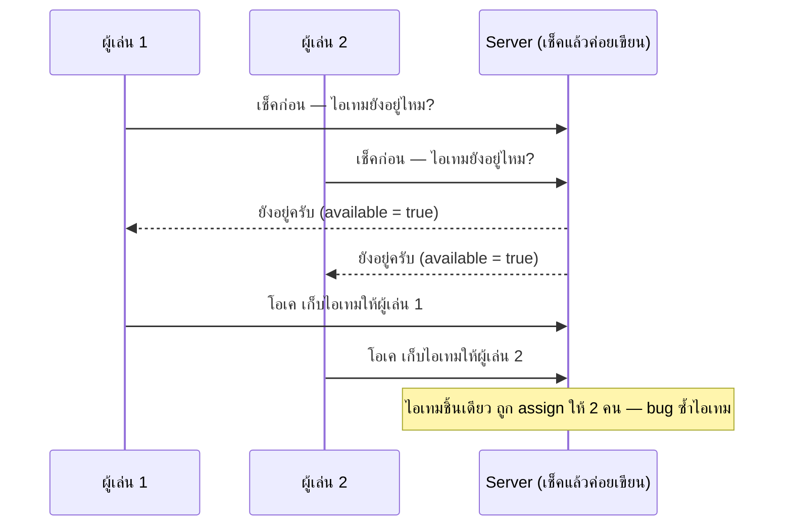
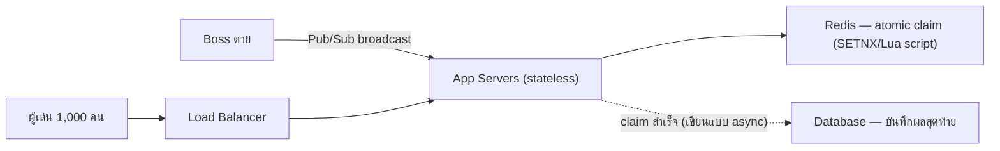

โจทย์แนวเกม: บอสตัวหนึ่งมีผู้เล่น**1,000 คน**รุมตีพร้อมกัน พอบอสตาย ระบบดรอปไอเทม legendary **1 ชิ้น** — กติกาคือ "ใครกดเก็บก่อนได้ก่อน" ฟังดูง่าย แต่ถ้าออกแบบผิด **ไอเทมชิ้นเดียวจะถูกแจกซ้ำให้ 2 คนพร้อมกันได้** และ 1,000 client ที่กดพร้อมกันจังหวะเดียวกันอาจกระแทกระบบจนล่ม

## Requirement

- ไอเทม 1 ชิ้น ต้องตกเป็นของผู้เล่น**แค่คนเดียว**เท่านั้น ห้ามซ้ำเด็ดขาด (แม้ผู้เล่น 1,000 คนกดพร้อมกันในเสี้ยววินาทีเดียวกัน)
- <mark class="hl-insight">ผู้เล่นทุกคนต้องรู้ว่าบอสตายพร้อมๆ กัน (broadcast) แล้วส่ง request "เก็บไอเทม" กระจุกตัวเข้ามาในช่วงเวลาสั้นมาก — นี่คือ traffic spike แบบเดียวกับ flash sale แต่บีบอัดสั้นกว่ามาก</mark>
- ระบบต้องตอบเร็ว ไม่ให้ผู้เล่นที่แพ้รอค้างจนคิดว่าเกมค้าง

## ถ้าออกแบบผิด: race condition ตรงๆ



<mark class="hl-warning">ปัญหาคือ "เช็คก่อนแล้วค่อยเขียน" (check-then-act) เป็นสองขั้นตอนที่แยกจากกัน — ระหว่างที่ผู้เล่น 1 เช็คเสร็จแล้วกำลังจะเขียน ผู้เล่น 2 ก็เช็คผ่านไปแล้วเหมือนกัน (เพราะตอนนั้นยังไม่มีใครเขียนอะไรลงไปเลย) ทั้งสอง request เห็นสถานะ "ยังว่าง" พร้อมกันได้จริง</mark> ยิ่งมีผู้เล่นกดพร้อมกันมากเท่าไหร่ โอกาสชนกันแบบนี้ก็สูงขึ้นเท่านั้น

## วิธีแก้: ให้ "เช็ค" กับ "เขียน" เป็นก้อนเดียวที่แยกกันไม่ได้

```demo
component: StepThroughDiagram
props: {"steps":[{"label":"1. บอสตาย — Server เป็นคนตัดสินเพียงผู้เดียว","detail":"ห้ามให้ client ตัดสินว่าใครเก็บได้ก่อน (client เชื่อไม่ได้ ทั้ง latency และ clock ไม่ตรงกัน) ทุกอย่างต้องตัดสินที่ server/central store เท่านั้น"},{"label":"2. ใช้ Atomic Claim แทนการเช็คแล้วเขียนสองขั้นตอน","detail":"ยิง operation เดียวที่ทำ \"เช็ค + เขียน\" พร้อมกันแบบแยกกันไม่ได้ (เช่น Redis SETNX หรือ Lua script, เทียบเท่า CAS - Compare-And-Swap) — ก่อนหน้านี้เคยเห็น Redis INCR แบบเดียวกันใน Rate Limiter case study"},{"label":"3. คนแรกที่ operation สำเร็จ ได้ไอเทมจริง","detail":"ทุกคนที่เหลือ operation จะ fail ทันที (เพราะสถานะเปลี่ยนไปแล้ว) ได้ response \"ไอเทมถูกเก็บไปแล้ว\" กลับไปเร็วมาก ไม่ต้องรอ lock หรือ queue ต่อแถว"},{"label":"4. ใส่ Idempotency Key กันการกดซ้ำของคนเดิม","detail":"เชื่อมกับ module Reliability — ถ้า client กดซ้ำเพราะเน็ตกระตุก หรือ retry อัตโนมัติ ต้องไม่ทำให้ระบบเข้าใจผิดว่าเป็นคนละ request แล้วพยายาม claim ซ้ำ"},{"label":"5. Broadcast บอสตายผ่าน Pub/Sub ไม่ใช่ให้ทุกคน poll","detail":"เชื่อมกับ module Async & Messaging — server ส่ง event ครั้งเดียวให้ 1,000 client พร้อมกันผ่าน WebSocket/Pub-Sub แทนที่จะให้ client ถามซ้ำๆ ว่า \"บอสตายยัง\" ลดโหลดที่ไม่จำเป็นลงมาก"}]}
```

```demo
component: JourneyDiagram
props: {"nodes":[{"icon":"person","label":"ผู้เล่น 1,000 คน"},{"icon":"gate","label":"App Servers"},{"icon":"notebook","label":"Redis (atomic claim)"}],"travelerIcon":"envelope","steps":[{"activeNode":0,"caption":"บอสตาย — ทุก client ได้รับ broadcast พร้อมกัน แล้วยิง request เก็บไอเทมเข้ามาพร้อมกันเป็นพัน request"},{"activeNode":2,"caption":"ทุก request วิ่งไปที่ Redis เดียวกัน (single source of truth) ไม่มีใครเช็คจากความจำของตัวเองบน server คนละเครื่อง"},{"activeNode":1,"caption":"Redis ยอมให้แค่ request แรกที่มาถึง \"ชนะ\" operation atomic claim สำเร็จ ส่วนที่เหลือ fail ทันที ได้คำตอบเร็วเท่ากันหมด"}]}
```

## Architecture รวม



## Trade-off ที่ควรพูดถึง

- **"กดก่อนได้ก่อน" จริงๆ แล้วหมายถึง "request ไปถึง server ก่อน" ไม่ใช่ "มือไวกว่าจริง"** — <mark class="hl-warning">ผู้เล่นที่ ping สูง (อยู่ไกล server) เสียเปรียบเสมอ แม้กดเร็วกว่าจริงในหน้าจอตัวเอง</mark> ถ้าต้องการความแฟร์แบบไม่ผูกกับ network latency ต้องเปลี่ยนดีไซน์เป็นเปิดหน้าต่างเวลาสั้นๆ ให้ทุกคนกดได้ แล้วสุ่มผู้ชนะทีเดียวหลังปิดรับ (แลกความซับซ้อนเพิ่มกับความแฟร์ที่มากขึ้น)
- **Redis กลายเป็นจุดตัดสินเดียวของทุก claim** — ถ้าหลายบอสตายพร้อมกันทั่วเซิร์ฟเวอร์ ปริมาณ request เพิ่มตาม แต่ operation atomic claim เป็น O(1) เร็วมาก รับ spike ระดับพันขอพร้อมกันได้สบาย ไม่ต้องมี lock ที่ทำให้ request ต่อแถวรอกัน
- **บันทึกผลลง Database แบบ async ได้** เพราะผู้ชนะตัดสินที่ Redis เสร็จเรียบร้อยแล้ว การเขียน Database คือแค่บันทึกประวัติ ไม่ใช่จุดตัดสินผล ไม่ต้องรอ Database ตอบก่อนแจ้งผู้เล่นว่าได้ไอเทม

## คำถามเจาะลึกที่มักถูกถามต่อ

**ถาม: ทำไมต้องใช้ Redis ไม่เก็บสถานะไอเทมใน memory ของ app server ตรงๆ?**
ถ้าเก็บใน memory ของ app server และมีหลายเครื่อง (เพราะมี Load Balancer) แต่ละเครื่องมีสถานะไอเทมแยกกัน <mark class="hl-warning">ผู้เล่นที่ request ไปคนละเครื่องกันจะเห็นสถานะไม่ตรงกัน (เครื่อง A ว่ายังอยู่ เครื่อง B ว่าหมดแล้ว) เกิด bug แจกซ้ำเหมือนเดิม</mark> ต้องมี storage กลางเดียว (Redis) ที่ทุกเครื่องอ่าน/เขียนที่เดียวกัน

**ถาม: Atomic Claim ลด latency การตัดสินผลได้กี่ ms เทียบกับ database lock แบบปกติ?**
<mark class="hl-insight">Redis atomic operation ทำงานใน memory เสร็จระดับ sub-millisecond (<1ms) ต่อ operation ต่างจาก database row-level lock ที่ผ่าน disk I/O มักใช้หลัก 5-20ms ต่อรอบ</mark> ถ้ามี 1,000 request แย่งกันพร้อมกัน database lock อาจสร้างคิวรอ lock ยาวถึงหลักร้อย ms-วินาที ขณะที่ Redis claim จบเร็วเพราะไม่มี lock ให้ต่อแถวเลย

**ถาม: ทำไมไม่ใช้ Database Transaction (SERIALIZABLE) แทน Redis เลย ในเมื่อก็ atomic เหมือนกัน?**
ถูกต้องเหมือนกันในเชิง correctness แต่ SERIALIZABLE มี overhead สูงกว่า (ต้องจัดการ lock/rollback) และ throughput ต่ำกว่ามาก — Database มักรับได้หลักพัน-หมื่น TPS ต่อเครื่อง ส่วน Redis รับได้หลักแสน operation/วินาที สำหรับ spike สั้นๆ ระดับ 1,000 request Redis รับมือได้โดยไม่กระทบ latency รวม

**ถาม: Idempotency Key ป้องกันอะไร ถ้าไม่มีจะเกิดอะไร?**
ถ้า client กด claim ซ้ำ (double-click หรือ retry เพราะเน็ตกระตุกไม่เห็น response) โดยไม่มี idempotency key ระบบอาจตีความว่าเป็นคนละ request แล้วพยายาม claim ซ้ำ <mark class="hl-insight">idempotency key (player_id + boss_instance_id) ทำให้ระบบจำได้ว่า request นี้เคยประมวลผลไปแล้ว ตอบผลเดิมกลับโดยไม่ทำ operation ซ้ำ</mark>

**ถาม: Pub/Sub broadcast ให้ 1,000 client พร้อมกัน ลด request เปล่าได้กี่เท่าเทียบกับ polling?**
ถ้าให้ client poll ถามทุก 1 วินาทีว่า "บอสตายยัง" ผู้เล่น 1,000 คน = 1,000 request/วินาทีเปล่าประโยชน์ตลอดเวลาที่บอสยังไม่ตาย (อาจนาทีถึงชั่วโมง) <mark class="hl-warning">Pub/Sub ยิง event แค่ครั้งเดียวตอนบอสตายจริง ลดจำนวน request เปล่าจากหลักพัน/วินาทีต่อเนื่อง เหลือ 0 จนกว่าจะมี event จริง</mark>

**ถาม: ทำไมไม่ปล่อยให้ client ตัดสินเองว่าใครกดก่อน (ส่ง timestamp จาก client มาเทียบ)?**
Client clock ไม่ synchronize กันแน่นอน (แต่ละเครื่องเวลาต่างกันได้หลัก ms ถึงวินาที) และ client ปลอมแปลง timestamp ได้ง่าย ต้องให้ server ตัดสินจากเวลาที่ request มาถึง server จริงเท่านั้น ไม่พึ่งข้อมูลเวลาที่ client อ้างมา

> คำถามสัมภาษณ์: "ทำไม 'เช็คก่อนว่ายังว่างไหม แล้วค่อยเขียนว่าจองแล้ว' ถึงมีปัญหาเวลามีคนเข้าพร้อมกันเยอะ" — <mark class="hl-insight">เพราะเช็คกับเขียนเป็นสองขั้นตอนแยกกัน ระหว่างนั้นมีช่องให้อีก request เข้ามาเห็นสถานะเดิมได้ ทางแก้คือรวมเช็ค+เขียนเป็น operation เดียวที่ atomic (แยกกันไม่ได้) ที่ระดับ storage เอง เช่น Redis SETNX, DB row-level lock ระดับ SERIALIZABLE, หรือ Lua script — หลักการเดียวกับ Rate Limiter distributed ที่เรียนมาก่อนหน้านี้ในโมดูล Reliability</mark>
