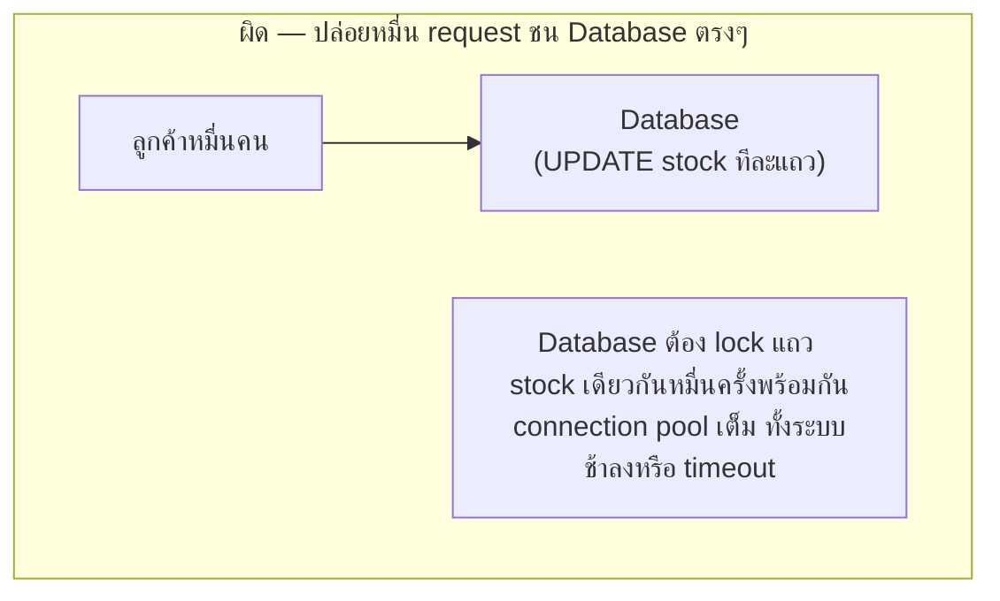
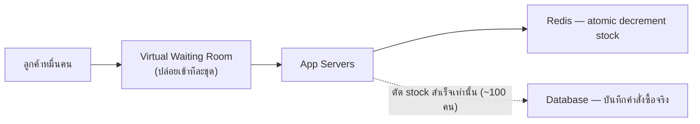

โจทย์คลาสสิก: คอนเสิร์ตขายบัตร **100 ใบ** เปิดขายพร้อมกันตอน **8 โมงตรง** แต่มีคนกดรอซื้อ**หมื่นคน**พร้อมกัน — สองปัญหาต้องแก้พร้อมกัน: (1) ห้ามขาย**เกิน 100 ใบ** (oversell) แม้มีคนกดซื้อพร้อมกันหมื่นคน และ (2) traffic ที่กระจุกตัวแค่วินาทีแรกต้องไม่ทำให้ระบบล่ม

## Requirement

- <mark class="hl-insight">Inventory มีจำกัดเด็ดขาด (100 ใบ) — ต่างจากกรณีทั่วไปที่ scale แค่ "รับ traffic ให้ได้มากขึ้น" เพราะที่นี่ "ขายเกิน" คือ bug ร้ายแรง ไม่ใช่แค่ performance issue</mark>
- Traffic ไม่กระจายสม่ำเสมอ — พุ่งชนกันวินาทีแรกที่เปิดขาย (thundering herd) แล้วก็ซาไปเร็ว ต่างจาก URL Shortener ที่โหลดสม่ำเสมอทั้งวัน
- คนที่พลาดบัตรต้องได้คำตอบไว (ไม่ปล่อยให้หน้าเว็บค้างจนคิดว่าระบบพัง)

## ถ้าปล่อยให้หมื่น request ชนกันตรงๆ ที่ Database



<mark class="hl-warning">Database ออกแบบมาให้รองรับ transaction ที่กระจายตัว ไม่ใช่ให้หมื่น connection มา lock แถวเดียวกันพร้อมกันในวินาทีเดียว — ต่อให้ transaction ทุกตัวถูกต้อง (ไม่มี race condition ขายเกิน) ตัว Database เองก็รับโหลดแบบนี้ไม่ไหวจนช้าหรือล่มไปทั้งระบบ</mark> การป้องกัน oversell กับการป้องกันระบบล่มต้องแก้คนละชั้นกัน

## วิธีแก้: กันคนก่อนถึง Database + กัน oversell ด้วย atomic decrement

```demo
component: StepThroughDiagram
props: {"steps":[{"label":"1. Virtual Waiting Room กันคนก่อนถึง backend จริง","detail":"เชื่อมกับ module Reliability (Rate Limiting) — ปล่อยคนเข้าระบบเป็นชุดๆ ตามอัตราที่ backend รับได้ ไม่ใช่ปล่อยหมื่นคนพรวดเดียว เหมือนคิวหน้าประตูคอนเสิร์ตจริงที่ค่อยๆ ปล่อยเข้าทีละกลุ่ม"},{"label":"2. เช็ค/ตัด stock ด้วย Atomic Decrement ที่ Redis ก่อน","detail":"ใช้ operation เดียวที่เช็ค+ลดจำนวนพร้อมกัน (เหมือน Boss Loot Race และ Rate Limiter ก่อนหน้านี้) — ตัด stock ที่ Redis ก่อน ไม่ใช่ยิง UPDATE ตรงไปที่ Database"},{"label":"3. คนที่ decrement สำเร็จ (stock > 0 ก่อนตัด) เท่านั้นที่ผ่านไปจองจริง","detail":"คนที่เหลือ (stock หมดแล้ว) ได้คำตอบ \"บัตรหมด\" ทันทีจาก Redis โดยไม่ต้องแตะ Database เลย"},{"label":"4. ยืนยันคำสั่งซื้อจริงที่ Database แบบ async ทีละใบที่ผ่านมา","detail":"เพราะจำนวนคนที่ \"ผ่าน\" ด่าน Redis เหลือแค่เท่ากับ stock จริง (100 คน) ไม่ใช่หมื่นคน — Database จัดการภาระระดับนี้ได้สบาย"},{"label":"5. Idempotency กันการกดซื้อซ้ำ/refresh ซ้ำ","detail":"เชื่อมกับ module Reliability — ผู้ใช้ที่กด refresh หรือกดซื้อซ้ำระหว่างรอ ต้องไม่ถูกตัด stock ซ้ำสอง"}]}
```

```demo
component: JourneyDiagram
props: {"nodes":[{"icon":"person","label":"ลูกค้าหมื่นคน"},{"icon":"gate","label":"Waiting Room + Redis"},{"icon":"building","label":"Database"}],"travelerIcon":"envelope","steps":[{"activeNode":1,"caption":"ลูกค้าหมื่นคนกดพร้อมกัน แต่ Waiting Room ปล่อยเข้าทีละชุดตามที่ backend รับได้"},{"activeNode":1,"caption":"แต่ละคนที่เข้ามาเช็ค/ตัด stock ที่ Redis ด้วย atomic decrement — คนที่ stock หมดแล้วได้คำตอบทันที ไม่ต้องรอ"},{"activeNode":2,"caption":"เฉพาะคนที่ตัด stock สำเร็จ (แค่ 100 คน) เท่านั้นที่ไปยืนยันคำสั่งซื้อจริงที่ Database"}]}
```

## Architecture รวม



## Trade-off ที่ควรพูดถึง

- **Waiting Room เพิ่มความซับซ้อนแลกกับความอยู่รอด** — คนที่กดไวสุดในโลกอาจยังต้องรอในคิว virtual ก่อนถึงจะได้ลองซื้อจริง เพราะระบบจงใจถ่วงอัตราเข้าให้พอดีกับที่ backend รับได้ (คล้าย autoscaling ที่ต้องรอ cache warm ก่อนรับ traffic เต็มที่จากโมดูล Scalability)
- **Redis เป็นจุด bottleneck เดียวของ stock** — ถ้า Redis ล่มระหว่างขาย ต้องมีแผนสำรอง (เชื่อมกับ module Reliability เรื่อง Circuit Breaker/failover) เพราะ stock ทั้งระบบพึ่งจุดเดียวนี้
- **ทำไมไม่ปล่อยให้ Database ตัด stock ตรงๆ ด้วย transaction ก็ได้ ถูกต้องเหมือนกัน** — ถูกต้องในเชิง correctness แต่ Database รับโหลดระดับหมื่น concurrent lock พร้อมกันไม่ไหวเท่า Redis in-memory ที่ออกแบบมาสำหรับ throughput สูงระดับนี้โดยเฉพาะ

## คำถามเจาะลึกที่มักถูกถามต่อ

**ถาม: Virtual Waiting Room ลดโหลดที่ backend ได้กี่เท่า เทียบกับปล่อยหมื่นคนเข้าพร้อมกัน?**
ถ้าปล่อยหมื่นคนพร้อมกัน backend ต้องรับ spike ระดับหมื่น request ในเสี้ยววินาที เกิน capacity ที่ออกแบบไว้ (เครื่องรับได้จริงมักหลักร้อย-พัน concurrent request) <mark class="hl-insight">Waiting Room ปล่อยเข้าเป็นชุดตามอัตราที่ backend รับได้จริง (เช่นทยอยปล่อยทีละ 500 คนทุกๆ 2-3 วินาที) ทำให้ backend เห็น load คงที่สม่ำเสมอ ไม่ใช่ spike ทั้งหมื่นพร้อมกัน</mark>

**ถาม: ทำไมต้องตัด stock ที่ Redis ก่อน ไม่ตัดที่ Database Transaction ตรงๆ ถึงจะการันตี ACID?**
Database transaction ให้ ACID จริง แต่ต้อง lock แถว stock เดียวกันทุกครั้ง — ถ้าหมื่น connection มา lock แถวเดียวกันพร้อมกัน connection pool (มักจำกัดหลักร้อย connection ต่อเครื่อง) เต็มเร็วมาก <mark class="hl-warning">request ต่อคิวรอ lock นานขึ้นเรื่อยๆ (latency พุ่งจากหลัก ms เป็นหลักวินาทีได้)</mark> Redis รับ throughput สูงกว่ามาก จึงตัด stock ที่นั่นก่อน ให้ Database รับแค่ ~100 คนที่ผ่านจริง

**ถาม: ทำไม Idempotency ในเคสนี้สำคัญ ถ้า user กด refresh/ซื้อซ้ำระหว่างรอ จะเกิดอะไรถ้าไม่มี?**
ถ้า user กด refresh ระหว่างที่ request แรกกำลังประมวลผลและไม่มี idempotency key ระบบอาจตัด stock ซ้ำสองรอบสำหรับคนคนเดียว ทำให้ stock หมดเร็วกว่าที่ควร (คนอื่นเสียโอกาสซื้อบัตรจริง) idempotency key ผูกกับ request เดิม ทำให้ retry ไม่ตัด stock ซ้ำ

**ถาม: ยืนยันคำสั่งซื้อที่ Database แบบ async ปลอดภัยแค่ไหน ถ้าเขียนไม่สำเร็จหลัง Redis claim ไปแล้ว?**
ต้องมี reconciliation job คอยเช็คว่าทุก claim ที่สำเร็จใน Redis มีบันทึกจริงใน Database ครบ เพราะ Redis เป็นแค่ตัวตัดสินสิทธิ์ ไม่ใช่ที่เก็บข้อมูลถาวร <mark class="hl-warning">ถ้าไม่มี reconciliation คนที่ claim สำเร็จอาจไม่มีบัตรจริงบันทึกไว้เลย (data loss)</mark>

**ถาม: ทำไมไม่ใช้ CDN/Cache หน้าเว็บขายบัตรอย่างเดียว ไม่ต้องมี Waiting Room?**
CDN/Cache ช่วยเรื่องโหลดหน้าเว็บ (static content) ได้ แต่ไม่ช่วยเรื่อง "การตัดสินใจตัด stock" ซึ่งเป็น dynamic operation ที่ต้องยิงไป backend เสมอ ต่อให้หน้าเว็บโหลดเร็วจาก CDN คนหมื่นคนก็ยังกดปุ่ม "ซื้อ" พร้อมกันอยู่ดี ต้องมี Waiting Room จัดการปริมาณ request จริงที่ไปถึง backend

**ถาม: ทำไมคนกดไวสุดในโลกอาจยังไม่ได้บัตร?**
Waiting Room มักปล่อยคนเข้าตามลำดับที่ระบบรับ request ไม่ใช่ตามที่ผู้ใช้กดจริง (network latency ของแต่ละคนต่างกัน) <mark class="hl-insight">คนที่กดไวในหน้าจอตัวเองแต่ network ช้าอาจถึง server ทีหลังคนที่กดช้ากว่าแต่ network เร็วกว่า</mark> — ข้อจำกัดร่วมนี้เจอเหมือนกันใน Boss Loot Race

> คำถามสัมภาษณ์: "ทำไมกัน oversell กับกันระบบล่ม ต้องแก้คนละวิธี" — <mark class="hl-insight">กัน oversell คือปัญหาเรื่อง correctness (atomic operation ต้องถูกต้องเสมอ) ส่วนกันระบบล่มคือปัญหาเรื่อง capacity (ต้องลดจำนวน request ที่ชนกันในเวลาเดียว) สองปัญหานี้แก้ด้วยเทคนิคคนละชนิด — Waiting Room ลดปริมาณคนที่เข้าถึงจุดตัดสินใจ ส่วน atomic decrement การันตีว่าจุดตัดสินใจนั้นถูกต้องเสมอไม่ว่าจะมีกี่คนมาพร้อมกัน</mark>
