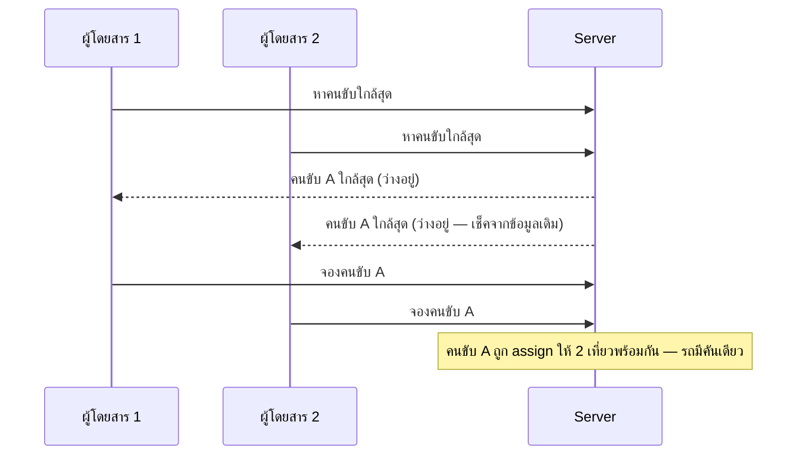
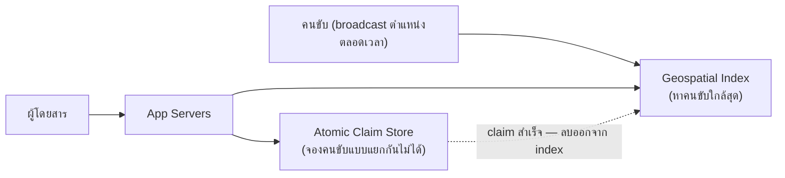

โจทย์แอปเรียกรถ: ผู้โดยสารกดเรียกรถพร้อมกันหลายคนในย่านเดียวกัน แต่ละคนเห็นคนขับใกล้ที่สุดคนเดิม (เพราะอยู่ในระยะที่รับได้เหมือนกัน) — ถ้าออกแบบผิด **คนขับคนเดียวถูก assign ให้ผู้โดยสาร 2 คนพร้อมกัน** ทั้งที่รถมีที่นั่งจำกัดคันเดียว

## Requirement

- คนขับ 1 คน ต้องถูก assign ให้ผู้โดยสาร**ได้ครั้งละ 1 คนเท่านั้น** แม้มีผู้โดยสารหลายคนขอจับคู่กับคนขับคนเดียวกันในเวลาไล่เลี่ยกัน
- <mark class="hl-insight">ต่างจาก Boss Loot Race ที่ "ทรัพยากร" (ไอเทม) อยู่นิ่งๆ ที่นี่ทั้งคนขับและผู้โดยสาร**เคลื่อนที่ตลอดเวลา** ตำแหน่งที่ใช้ตัดสิน "ใกล้ที่สุด" เปลี่ยนได้ทุกวินาที</mark>
- ผู้โดยสารที่จับคู่ไม่ได้ (คนขับถูกจองไปแล้ว) ต้องได้คำตอบไวและถูกจับคู่กับคนขับคนถัดไปทันที ไม่ใช่รอ timeout นาน

## ถ้าให้แต่ละ request ค้นหาคนขับใกล้สุดแล้ว assign ตรงๆ



<mark class="hl-warning">ปัญหาเดิมของ check-then-act (จาก Boss Loot Race) กลับมาอีกครั้ง แต่คราวนี้ซับซ้อนกว่าเพราะการ "หาคนขับใกล้สุด" ต้อง query ตำแหน่ง geospatial ก่อน แล้วค่อย assign — ช่องว่างระหว่าง query กับ assign นี่แหละที่ทำให้สอง request เห็นคนขับคนเดียวกันว่า "ว่าง" พร้อมกันได้</mark>

## วิธีแก้: แยก "หา" กับ "จอง" แล้วให้ "จอง" เป็น atomic เสมอ

```demo
component: StepThroughDiagram
props: {"steps":[{"label":"1. คนขับ broadcast ตำแหน่งตัวเองเข้า Geospatial Index ตลอดเวลา","detail":"เชื่อมกับ module Async & Messaging — คนขับส่งพิกัดผ่าน connection ที่เปิดค้างไว้ (WebSocket) ระบบเก็บตำแหน่งล่าสุดไว้ค้นหาแบบ \"ใกล้ที่สุดในระยะ X กิโลเมตร\" ได้เร็ว"},{"label":"2. ผู้โดยสาร query หาคนขับใกล้สุดจาก Geospatial Index","detail":"ได้รายชื่อคนขับที่ \"น่าจะว่าง\" มา — แต่ขั้นนี้เป็นแค่การหา ยังไม่ใช่การจอง ข้อมูลนี้อาจ stale ไปแล้วเล็กน้อยก็ได้"},{"label":"3. จองคนขับด้วย Atomic Claim เท่านั้น (เหมือน Boss Loot Race)","detail":"ยิง operation atomic \"claim คนขับคนนี้\" ที่ storage กลาง — คนแรกที่ claim สำเร็จได้คนขับจริง คนที่เหลือ claim fail ทันที"},{"label":"4. ถ้า claim fail ให้ลองคนขับคนถัดไปในรายชื่อทันที ไม่ใช่ error ทันที","detail":"เพราะรายชื่อจาก geospatial query มีคนขับหลายคนอยู่แล้ว ระบบลองไล่ตามลำดับความใกล้จนกว่าจะเจอคนขับที่ claim สำเร็จจริง — ผู้โดยสารไม่รู้สึกว่าต้องกดเรียกใหม่เอง"},{"label":"5. คนขับที่ถูก claim แล้วหายจาก Geospatial Index ทันที","detail":"กันไม่ให้ผู้โดยสารคนอื่น query เจอคนขับคนนี้อีกในระหว่างที่กำลังไปรับผู้โดยสารคนแรก"}]}
```

```demo
component: JourneyDiagram
props: {"nodes":[{"icon":"person","label":"ผู้โดยสาร"},{"icon":"gate","label":"Geospatial Index"},{"icon":"notebook","label":"Atomic Claim Store"}],"travelerIcon":"envelope","steps":[{"activeNode":1,"caption":"ผู้โดยสารขอจับคู่ — ระบบ query คนขับใกล้สุดจาก Geospatial Index ได้รายชื่อที่ \"น่าจะว่าง\""},{"activeNode":2,"caption":"ระบบพยายาม claim คนขับคนแรกในรายชื่อแบบ atomic — ถ้า fail (มีคนจองไปก่อนแล้ว) ลองคนถัดไปทันที"},{"activeNode":0,"caption":"เมื่อ claim สำเร็จ ผู้โดยสารได้คนขับจริง และคนขับคนนั้นหายจาก Geospatial Index ทันทีไม่ให้คนอื่นเห็นอีก"}]}
```

## Architecture รวม



## Trade-off ที่ควรพูดถึง

- **แยก "หา" กับ "จอง" ออกจากกัน แลกกับความซับซ้อนที่เพิ่มขึ้น** — ถ้ารวมสองขั้นตอนเป็นอันเดียว (query แล้ว assign ทันทีโดยไม่เช็คซ้ำ) ง่ายกว่ามาก แต่กลับมาเจอ race condition เดิม การแยกสองขั้นตอนคือการยอมรับว่าข้อมูล "หา" อาจ stale ได้เสมอ แล้วให้ขั้น "จอง" เป็นคนตัดสินจริงแทน
- **ต้องมี retry logic ไล่คนขับคนถัดไปเมื่อ claim fail** — เพิ่ม latency เล็กน้อยเทียบกับ assign ตรงๆ แต่แลกกับ correctness ที่ถูกต้องเสมอ และผู้โดยสารไม่ต้องกดเรียกรถใหม่เอง
- **ตำแหน่งคนขับต้อง broadcast บ่อยพอ** — ถ้า update ตำแหน่งช้าเกินไป (interval ยาว) ระบบอาจแนะนำคนขับที่ไม่ได้ใกล้จริงแล้ว เป็น trade-off ระหว่างความแม่นยำกับปริมาณ network traffic ที่ต้องรับ

## คำถามเจาะลึกที่มักถูกถามต่อ

**ถาม: ทำไมต้องมี Geospatial Index แยก ไม่ query ตำแหน่งคนขับจาก Database ปกติตรงๆ?**
Database ปกติ (B-Tree index) หา "ค่าตรงกันเป๊ะ" ได้เร็ว แต่ query "ใครอยู่ในระยะ 2 กิโลเมตรจากจุดนี้" ต้องคำนวณระยะทางจริงซึ่ง B-Tree ช่วยไม่ได้ตรง ต้องไล่เช็คทุกแถว <mark class="hl-warning">ช้ามากเมื่อคนขับมีหลักหมื่น-แสนคนพร้อมกัน</mark> Geospatial Index (เช่น Redis GEO) ออกแบบมาให้ query แบบระยะทางได้เร็วระดับ ms แม้คนขับจำนวนมาก

**ถาม: ทำไมคนขับต้อง broadcast ตำแหน่งทุก 3-5 วินาที ไม่ทุก 1 นาทีก็พอ ประหยัด bandwidth กว่า?**
ถ้า update ทุก 1 นาที คนขับที่ขับด้วยความเร็วเฉลี่ยในเมือง (30-40 กม./ชม.) เคลื่อนที่ได้ไกลถึง 500-700 เมตรก่อนตำแหน่งจะอัปเดตครั้งถัดไป <mark class="hl-warning">ระบบจะแนะนำคนขับที่ "ดูใกล้" แต่จริงๆ ไม่ใกล้แล้ว</mark> update ทุก 3-5 วินาทีคลาดเคลื่อนแค่ไม่กี่สิบเมตร แม่นยำพอสำหรับการจับคู่

**ถาม: การ claim คนขับที่นี่ต่างจาก Boss Loot Race ยังไง ทำไมซับซ้อนกว่า?**
หลักการเดียวกัน (ป้องกัน check-then-act race) แต่ที่นี่ "ทางเลือก" (คนขับที่ query ได้) เปลี่ยนได้ตลอดเวลาจากการเคลื่อนที่ <mark class="hl-insight">ต้องมี fallback logic ไล่คนขับคนถัดไปถ้า claim แรก fail — ต่างจาก Boss Loot Race ที่ถ้า claim fail ก็จบเลย ไม่มีไอเทมให้แจกต่อ</mark>

**ถาม: ทำไมคนขับที่ถูก claim ต้องลบออกจาก Geospatial Index ทันที ไม่รอ trip เสร็จก่อน?**
ถ้าไม่ลบทันที ผู้โดยสารคนอื่นที่ query พร้อมกันจะยังเห็นคนขับคนนี้เป็นตัวเลือก "น่าจะว่าง" อยู่ ทำให้เกิด failed-claim rate สูงขึ้นโดยไม่จำเป็น การลบออกทันทีลดจำนวนครั้งที่ระบบต้อง reject ผู้โดยสารเพราะคนขับที่ "ดูว่าง" จริงๆ ไม่ว่างแล้ว

**ถาม: ทำไมไม่ใช้ pessimistic lock (จองคนขับไว้ตั้งแต่เริ่ม query) แทน atomic claim แบบนี้?**
Pessimistic lock ต้อง lock คนขับไว้ตั้งแต่เริ่มหาจนกว่าจะจองเสร็จ — ถ้าผู้โดยสารหลายคน query คนขับคนเดียวกันพร้อมกัน จะเกิดการรอ lock ต่อแถว (queueing) <mark class="hl-insight">atomic claim (optimistic) เร็วกว่าเพราะไม่มีใครต้องรอ lock เลย แค่แข่งกัน claim ครั้งเดียวจบ คนแรกได้ คนที่เหลือ fail แล้วลองคนถัดไปทันที</mark>

**ถาม: latency รวมของการจับคู่ (query + claim + fallback) ประมาณกี่ ms?**
แต่ละ atomic claim ใช้เวลา sub-millisecond ถึง ~5ms (รวม network round-trip) ถ้าต้องลอง 2-3 คนขับก่อนสำเร็จ (เพราะคนแรกๆ ถูกคนอื่น claim ไปก่อน) รวมแล้วยังอยู่ระดับ 10-20ms ซึ่งเทียบไม่ได้เลยกับเวลาที่คนขับต้องขับมารับจริง (มักหลายนาที) จึงไม่ใช่ bottleneck ของ user experience โดยรวม

> คำถามสัมภาษณ์: "ทำไมไม่ query แล้ว assign คนขับทันทีในขั้นตอนเดียวไปเลย" — <mark class="hl-insight">เพราะระหว่างที่ query กำลังหาคนขับใกล้สุด ตำแหน่ง/สถานะของคนขับเปลี่ยนได้ตลอดเวลา (ต่างจากไอเทมที่อยู่นิ่ง) ข้อมูลที่ query ได้จึงเป็นแค่ "ตัวเลือกที่น่าจะใช้ได้" ไม่ใช่ผลตัดสินจริง ต้องแยกให้ขั้น "จอง" เป็น atomic claim เฉพาะ แล้วมี fallback ไล่คนขับคนถัดไปถ้า claim แรกไม่ผ่าน</mark>
