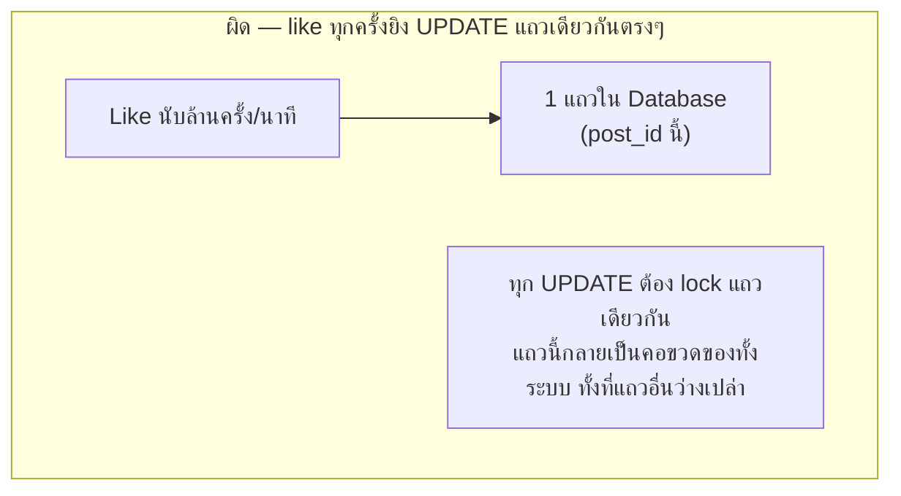
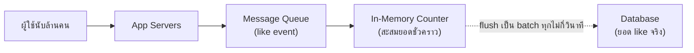

โจทย์โซเชียล: ดาราคนดังโพสต์รูปหนึ่งรูป แล้วยอด like พุ่งจาก 0 เป็น**หลักล้าน**ภายใน**1 นาที** — โพสต์ปกติของคนทั่วไปมี like หลักสิบ ไม่มีปัญหาอะไร แต่โพสต์นี้ **1 แถวใน Database (post_id เดียว) ถูกอ่าน/เขียนพร้อมกันนับล้านครั้งในเวลาสั้นๆ** ทั้งที่ระบบ cache/sharding ปกติออกแบบมาให้กระจายโหลด ไม่ใช่กระจุกที่จุดเดียว

## Requirement

- <mark class="hl-insight">นี่คือ "Hot Key" problem — ปกติ sharding/caching แก้ปัญหาด้วยการกระจาย key ไปหลายเครื่อง แต่ถ้า key เดียว (post_id นี้) ร้อนกว่า key อื่นมหาศาล กระจายไปเครื่องไหนก็ยังกระจุกที่เครื่องนั้นเครื่องเดียวอยู่ดี</mark>
- ยอด like ที่แสดงให้ user เห็นไม่ต้อง exact เป๊ะวินาทีต่อวินาที (ผู้ใช้ไม่สนว่าเป็น 1,000,234 หรือ 1,000,240) แต่ระบบข้างล่างต้องไม่ล่ม
- comment ต้องเขียนได้จริง ไม่ blocked ทั้งที่ post เดียวกันมีคนกดพร้อมกันมหาศาล

## ถ้าทุก like ยิง UPDATE ไปที่แถวเดียวกันตรงๆ



<mark class="hl-warning">ต่อให้ sharding database ออกแบบมาดีแค่ไหน ถ้า key ที่ร้อนอยู่ shard ไหน shard นั้นก็รับภาระหนักกว่า shard อื่นมหาศาลอยู่ดี (โมดูล Database สอนเรื่อง sharding แบบกระจายสม่ำเสมอ แต่ไม่ได้การันตีว่า traffic จะกระจายสม่ำเสมอตามไปด้วย) — ปัญหานี้แก้ด้วยการ sharding เพิ่มไม่ได้ ต้องเปลี่ยนวิธีนับ</mark>

## วิธีแก้: ไม่นับที่ Database ตรงๆ ให้นับแบบ Async แล้วค่อย sync

```demo
component: StepThroughDiagram
props: {"steps":[{"label":"1. Like ไม่เขียน Database ทันที — เขียนเข้า Message Queue ก่อน","detail":"เชื่อมกับ module Async & Messaging — แต่ละ like เป็น event เข้า queue เร็วมาก (แค่ append ไม่ต้อง lock แถวไหน) ตอบ user ว่า \"กดสำเร็จ\" ทันทีโดยยังไม่รอ Database"},{"label":"2. รวมยอด like เป็นชุดที่ In-Memory Counter ก่อน (module Caching)","detail":"สะสมจำนวน like ไว้ในหน่วยความจำ (เช่น Redis counter) เป็นช่วงเวลาสั้นๆ (เช่นทุก 1-2 วินาที) แทนที่จะเขียน Database ทุกครั้งที่มีคนกด"},{"label":"3. Flush ยอดสะสมลง Database เป็นก้อนเดียวเป็นระยะ (batch write)","detail":"เขียนแค่ \"เพิ่มยอด X ครั้ง\" ครั้งเดียวต่อรอบ แทนเขียนทีละครั้งนับล้านครั้ง ลดจำนวน write ที่ Database ต้องรับลงมหาศาล"},{"label":"4. ยอด like ที่ user เห็นคือ eventual consistency","detail":"เชื่อมกับ module Consistency & CAP — user เห็นเลขที่อาจตามหลังของจริงไม่กี่วินาที แลกกับระบบไม่ล่ม เพราะยอด like ไม่จำเป็นต้อง strong consistency"},{"label":"5. Comment แยกคิวจาก Like ไม่ให้กระทบกัน","detail":"comment สำคัญกว่า like ในแง่ที่ต้องไม่หาย (ข้อความจริงของคน) จึงใช้คิวคนละอันจาก like ที่ยอมให้ merge/approximate ได้ ไม่ปนกันจนคิวช้าไปด้วยกัน"}]}
```

```demo
component: JourneyDiagram
props: {"nodes":[{"icon":"person","label":"ผู้ใช้นับล้านคน"},{"icon":"gate","label":"Message Queue"},{"icon":"notebook","label":"In-Memory Counter"}],"travelerIcon":"envelope","steps":[{"activeNode":1,"caption":"ทุกครั้งที่กด like ระบบเขียน event เข้า Message Queue เร็วมาก แล้วตอบ user ว่าสำเร็จทันที ไม่รอ Database"},{"activeNode":2,"caption":"ยอด like สะสมรวมกันที่ In-Memory Counter เป็นช่วงเวลาสั้นๆ ก่อน"},{"activeNode":0,"caption":"Flush ยอดสะสมลง Database เป็นก้อนเดียวเป็นระยะ — user เห็นยอด like ตามหลังจริงไม่กี่วินาที แต่ระบบไม่ล่ม"}]}
```

## Architecture รวม



## Trade-off ที่ควรพูดถึง

- **ยอม eventual consistency เพื่อความอยู่รอด** — เชื่อมกับโมดูล Consistency & CAP โดยตรง: like count ไม่ใช่ข้อมูลที่ต้อง strong consistency user ไม่รู้สึกความต่างระหว่าง 1,000,234 กับ 1,000,240 แต่ถ้าเป็นยอดเงินในบัญชี ห้ามใช้วิธีนี้เด็ดขาด
- **ถ้ายอด counter ตกหายระหว่างทาง (server ล่มก่อน flush) จะคลาดเคลื่อนได้เล็กน้อย** — ต้องยอมรับ trade-off นี้ หรือลงทุนเพิ่มกับ message queue ที่ persist ก่อน ack (durability เพิ่มขึ้น แลกกับ throughput ที่ลดลงบ้าง)
- **Hot Key เป็นปัญหาที่ sharding เดิมแก้ไม่ได้ ต้องแก้ที่ pattern การเขียน** — ต่างจาก Cache Stampede/Penetration ที่แก้ด้วยการจัดการ cache miss ตอนเดียว ปัญหานี้คือปริมาณ write ต่อ key เดียวสูงเกินกว่าที่แถวเดียวจะรับได้ ไม่ว่าจะ cache ดีแค่ไหนก็ตาม

## คำถามเจาะลึกที่มักถูกถามต่อ

**ถาม: Message Queue + In-Memory Counter ลด write ที่ Database ได้กี่เท่าเทียบกับเขียนตรง?**
Like นับล้านครั้ง/นาที ถ้าเขียน Database ตรงทุกครั้ง = ล้าน write/นาที (~16,000+ write/วินาที) ไปที่แถวเดียว เกิน throughput ที่แถวเดียวรับได้มหาศาล <mark class="hl-insight">สะสมที่ In-Memory Counter แล้ว flush เป็น batch ทุก 1-2 วินาที ลดจำนวนครั้งที่ Database ต้องเขียนจริงจากล้านครั้ง/นาที เหลือแค่ 30-60 ครั้ง/นาที — ลดลงหลักหมื่นเท่า</mark>

**ถาม: ทำไมยอม Eventual Consistency ของยอด like ได้ แต่บอกว่ายอดเงินในบัญชีทำแบบนี้ไม่ได้ ต่างกันตรงไหน?**
ยอด like เป็นข้อมูลที่ผิดเพี้ยนเล็กน้อยชั่วคราวไม่มีผลเสียจริง (user เห็น 1,000,234 หรือ 1,000,240 ไม่กระทบการใช้งาน) <mark class="hl-warning">แต่ยอดเงินบัญชีถ้าเห็นเลขผิดแม้ชั่วคราว อาจทำให้ user โอนเงินเกินยอดจริงที่มี</mark> ความต่างคือ "ผลของความผิดพลาดชั่วคราว" ไม่ใช่กลไกทางเทคนิค

**ถาม: ทำไม Comment ต้องแยกคิวจาก Like ไม่ใช้ Message Queue เดียวกัน?**
ถ้าใช้คิวเดียวกัน comment (ที่ต้องไม่หายและประมวลผลแน่นอน) จะต่อแถวรอหลัง like นับล้าน event ที่กำลังท่วมคิว ทำให้ comment ล่าช้าตามไปด้วยทั้งที่สำคัญกว่าและปริมาณน้อยกว่ามาก แยกคิวทำให้ comment ไม่ได้รับผลกระทบจาก traffic spike ของ like เลย

**ถาม: In-Memory Counter สะสมยอด 1-2 วินาทีก่อน flush เสี่ยงอะไร ถ้า server ล่มพอดีตอนนั้น?**
ยอดที่สะสมไว้ (ยังไม่ flush) จะหายไปถ้า server ล่มก่อน flush เสร็จ — ความเสียหายจำกัดเฉพาะยอดในช่วง 1-2 วินาทีล่าสุดเท่านั้น ยอมรับได้เพราะยอด like ไม่ต้องเป๊ะ 100% อยู่แล้ว หรือใช้ message queue แบบ persist-before-ack เพิ่ม durability ได้ถ้าต้องการลดความเสี่ยง

**ถาม: ทำไม sharding แถวอื่นทำงานได้ดี แต่โพสต์ไวรัลกลับพังทั้งที่อยู่ shard เดียวกันกับโพสต์อื่น?**
Sharding กระจาย "โพสต์คนละอัน" ไปคนละเครื่อง — โพสต์ปกติหลักแสนโพสต์กระจายทั่วถึง แต่โพสต์ไวรัลเป็นแค่ 1 แถว (1 key) ที่ต้องอยู่ shard เดียวเสมอ <mark class="hl-insight">ปัญหาไม่เกี่ยวกับ sharding ดีไม่ดี แต่เกี่ยวกับปริมาณ write ต่อ key เดียวที่เกินขีดจำกัดทางกายภาพของ 1 เครื่อง</mark>

**ถาม: ทำไมไม่ flush ถี่กว่านี้ (เช่นทุก 100ms) จะได้ยอดสดกว่า?**
ยิ่ง flush ถี่ ยิ่งจำนวนครั้งที่เขียน Database มากขึ้น (ทุก 100ms = เขียน 600 ครั้ง/นาที เทียบกับทุก 1-2 วินาที = 30-60 ครั้ง/นาที) ลด benefit ของการ batch ลงเรื่อยๆ ต้องเลือกจุดสมดุลระหว่างความสดที่ user เห็นกับจำนวน write ที่ Database ต้องรับ — 1-2 วินาทีเป็นจุดที่รู้สึกเกือบเรียลไทม์แต่ยังลด write ได้มากพอ

> คำถามสัมภาษณ์: "ทำไม sharding ที่ดีอยู่แล้วยังแก้ปัญหาโพสต์ไวรัลไม่ได้" — <mark class="hl-insight">sharding กระจาย key ต่างกันไปคนละเครื่อง แต่ post_id เดียวกันย่อมอยู่ที่ shard เดียวเสมอไม่ว่าจะ sharding ดีแค่ไหน ถ้า key นั้นร้อนกว่า key อื่นมหาศาล (hot key) shard นั้นก็รับภาระหนักกว่าเพื่อนอยู่ดี ทางแก้ที่ถูกคือเปลี่ยนวิธีเขียนจาก "เขียนทุกครั้งที่มี event" เป็น "สะสมแล้วเขียนเป็นก้อน" (batch) ไม่ใช่ไปหวังพึ่ง sharding ให้แก้ปัญหานี้</mark>
