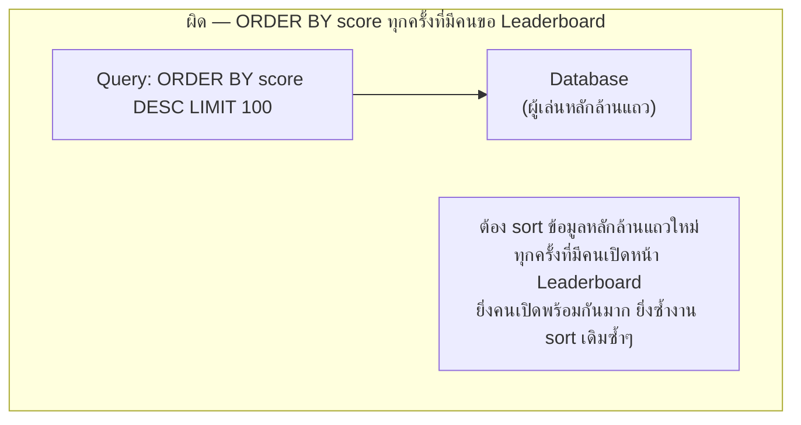

โจทย์เกม: เกมมีผู้เล่น**หลักล้านคน** ทุกคนแข่งคะแนนกัน ต้องมี **Leaderboard แสดงอันดับ Top 100 แบบเรียลไทม์** — คะแนนเปลี่ยนหลายพันครั้งต่อวินาที แต่หน้าจอ Leaderboard ต้อง**เรียงอันดับใหม่ได้เร็ว** ไม่ใช่รอคำนวณเป็นนาทีแบบ report

## Requirement

- <mark class="hl-insight">ต้องตอบได้เร็วสองแบบพร้อมกัน: "อันดับของฉันคือเท่าไหร่" (query แบบสุ่ม เจาะจงคนเดียว) และ "ขอ Top 100 ทั้งหมด" (query แบบเรียงลำดับ) — สองคำถามนี้ต้องการโครงสร้างข้อมูลคนละแบบกัน</mark>
- คะแนนอัปเดตบ่อยมาก (ทุกครั้งที่ผู้เล่นทำแต้ม) เขียนถี่กว่าคนอ่าน Leaderboard มาก (write-heavy ผิดกับ URL Shortener ที่ read-heavy)
- ผู้เล่นหลักล้านคน แต่ Top 100 ที่แสดงจริงมีแค่ 100 คน — ไม่ต้อง sort ผู้เล่นทั้งหมดใหม่ทุกครั้งที่มีคนทำแต้ม

## ทำไม Database ทั่วไปไม่เหมาะกับงานนี้



<mark class="hl-warning">`ORDER BY score DESC LIMIT 100` ทำงานถูกต้อง แต่เปลืองมากถ้าต้องรันซ้ำทุกครั้งที่มีคนขอ (คนเปิด Leaderboard พร้อมกันหลักพันคน) เพราะ Database ต้อง sort ข้อมูลใหม่ทุกรอบ ทั้งที่จริงๆ อันดับเปลี่ยนแค่นิดหน่อยระหว่างสอง query ที่ห่างกันไม่กี่วินาที</mark>

## วิธีแก้: ใช้ Sorted Set เก็บอันดับที่จัดเรียงไว้ตลอดเวลา

```demo
component: StepThroughDiagram
props: {"steps":[{"label":"1. เก็บคะแนนใน Sorted Set แทน Database ตรงๆ (module Caching)","detail":"Sorted Set (เช่น Redis ZSET) คือโครงสร้างข้อมูลที่จัดเรียงตามคะแนนไว้ตลอดเวลาโดยอัตโนมัติ ต่างจากตาราง Database ปกติที่ไม่ได้ sort ค้างไว้"},{"label":"2. ทุกครั้งที่ผู้เล่นทำแต้ม แค่อัปเดตคะแนนใน Sorted Set","detail":"operation เดียว (เช่น ZADD) ทั้งอัปเดตคะแนนและจัดอันดับใหม่ให้ในตัว เร็วกว่าการ sort ทั้งตารางใหม่ทุกครั้งมาก"},{"label":"3. ขอ Top 100 ก็แค่หยิบ 100 อันดับแรกจาก Sorted Set ตรงๆ","detail":"ไม่ต้อง sort ใหม่ทุกครั้ง เพราะข้อมูลถูกจัดเรียงไว้อยู่แล้วตลอดเวลา query นี้เร็วมากไม่ว่าจะมีคนขอพร้อมกันกี่คน"},{"label":"4. ขอ \"อันดับของฉัน\" ก็หาตำแหน่งใน Sorted Set ได้ตรงๆ เช่นกัน","detail":"ไม่ต้องนับใหม่ทั้งหมดทุกครั้ง — Sorted Set ตอบทั้งสองคำถาม (Top N และอันดับเจาะจงคนเดียว) ด้วยโครงสร้างเดียวกัน"},{"label":"5. Sync กลับ Database เป็นระยะ ไม่ใช่ source of truth หลัก","detail":"เชื่อมกับ module Database — Sorted Set คือชั้นเร็วสำหรับอ่าน ส่วน Database เก็บประวัติคะแนนแบบถาวร sync กันเป็นระยะแทนพึ่ง Sorted Set อย่างเดียว (กันข้อมูลหายถ้า cache ล่ม)"}]}
```

```demo
component: JourneyDiagram
props: {"nodes":[{"icon":"person","label":"ผู้เล่นหลักล้านคน"},{"icon":"notebook","label":"Sorted Set (Redis ZSET)"},{"icon":"building","label":"Database"}],"travelerIcon":"envelope","steps":[{"activeNode":1,"caption":"ผู้เล่นทำแต้ม — คะแนนอัปเดตเข้า Sorted Set ทันที ซึ่งจัดเรียงอันดับให้อัตโนมัติในตัว"},{"activeNode":1,"caption":"ขอ Top 100 หรือขออันดับตัวเอง — หยิบจาก Sorted Set ตรงๆ ไม่ต้อง sort ใหม่"},{"activeNode":2,"caption":"Sync ข้อมูลกลับ Database เป็นระยะ เก็บเป็นประวัติถาวร ไม่ให้ Sorted Set เป็นจุดเดียวที่ข้อมูลอยู่"}]}
```

## Architecture รวม


## Trade-off ที่ควรพูดถึง

- **Sharding Leaderboard ระดับภูมิภาคถ้าผู้เล่นเยอะเกินไป** — ถ้าผู้เล่นมากถึงระดับที่ Sorted Set เดียวเก็บไม่พอ (เชื่อมกับ module Database เรื่อง sharding) มักแบ่งเป็น Leaderboard ระดับภูมิภาค/เซิร์ฟเวอร์ก่อน แล้วค่อยรวมเป็น global leaderboard แบบมี lag บ้าง
- **Sorted Set อยู่ใน memory เป็นหลัก** — เร็วมากแต่เสี่ยงข้อมูลหายถ้า cache ล่มก่อน sync กลับ Database ต้องยอมรับ trade-off เรื่อง durability เพื่อความเร็ว หรือลงทุนเพิ่มกับ replication ของ cache นั้นเอง
- **"อันดับของฉัน" อาจไม่ต้อง real-time เป๊ะขนาด Top 100** — ผู้เล่นทั่วไปเช็คอันดับตัวเองไม่บ่อยเท่าคนดู Top 100 บ่อยๆ อาจ cache แยกชั้นสำหรับ query ประเภทนี้เพิ่มได้ถ้าจำเป็น

## คำถามเจาะลึกที่มักถูกถามต่อ

**ถาม: ทำไม Sorted Set เร็วกว่า `ORDER BY ... LIMIT 100` ทุกครั้ง ต่างกันแค่ไหนในเชิง algorithm?**
`ORDER BY` ต้อง sort ข้อมูลทั้งหมดใหม่ทุกครั้งที่ query — ความซับซ้อนระดับ O(n log n) ต่อครั้งที่ผู้เล่นมีหลักล้านคนก็หนักมาก <mark class="hl-insight">Sorted Set จัดเรียงไว้แบบ persistent การเพิ่ม/อัปเดตคะแนนใช้ O(log n) ต่อครั้ง และขอ Top 100 ใช้ O(log n + 100) เท่านั้น — เร็วกว่าในสเกลผู้เล่นล้านคนหลายพันเท่า</mark>

**ถาม: ทำไมการอัปเดตคะแนน (ZADD) กับการขอ Top 100 ทำพร้อมกันได้โดยไม่ชนกัน?**
Sorted Set ออกแบบให้ operation อ่าน/เขียนเป็น O(log n) แยกกันไม่ต้อง lock ทั้งโครงสร้าง ต่างจาก Database ที่ sort ใหม่ (งานหนัก) อาจ lock ตารางจนกระทบการอ่านพร้อมกัน ทำให้รองรับได้ทั้ง write-heavy (คะแนนอัปเดตหลักพันครั้ง/วินาที) และ read พร้อมกันโดยไม่แย่งกัน

**ถาม: ทำไมต้อง sync กลับ Database เป็นระยะ ไม่เก็บที่ Redis อย่างเดียวไปเลย?**
Redis เก็บข้อมูลใน memory เป็นหลัก <mark class="hl-warning">ถ้าเครื่อง Redis ล่ม (hardware failure, restart) ข้อมูลคะแนนทั้งหมดอาจหายถ้าไม่มีการ persist/sync ไปที่อื่น</mark> sync กลับ Database (เก็บบน disk แบบถาวร) เป็นการสำรองข้อมูลกันเหตุนี้ แลกกับความซับซ้อนของการ sync สองระบบให้ตรงกัน

**ถาม: ทำไม Sharding Leaderboard ระดับภูมิภาคถึงจำเป็นตอนผู้เล่นเยอะมาก?**
Sorted Set เดียวอยู่ในเครื่องเดียว มีขีดจำกัดของ memory และ throughput ต่อเครื่อง ผู้เล่นระดับสิบ-ร้อยล้านคนอาจเกินขีดที่เครื่องเดียวรับได้ ต้องแบ่งเป็น Leaderboard ระดับภูมิภาคก่อน (แต่ละอันเก็บผู้เล่นแค่ส่วนหนึ่ง) แล้วค่อยรวมเป็น global แบบมี lag บ้าง เหมือนหลักการ sharding ใน module Database

**ถาม: ทำไมยอมให้ "อันดับของฉัน" มี lag ได้มากกว่า Top 100 ในเมื่อใช้โครงสร้างข้อมูลเดียวกัน?**
ทั้งสอง query ดึงจากโครงสร้างเดียวกัน ความสดเท่ากันในทางเทคนิค แต่ Top 100 คนดูบ่อยกว่าและคาดหวังความสดสูงกว่า ส่วน "อันดับของฉัน" ผู้เล่นทั่วไปเช็คไม่บ่อยเท่า จึงยอม cache แยกชั้นเพิ่มได้ถ้าต้องการลด load เพิ่มเติม (เป็น optimization เสริม ไม่ใช่ข้อจำกัดของ Sorted Set เอง)

**ถาม: ทำไมไม่ cache ผลลัพธ์ Top 100 ที่ sort ไว้แล้วแทนใช้ Sorted Set เลย ง่ายกว่าไหม?**
Cache ผลลัพธ์ที่ sort ไว้ล่วงหน้าเป็นภาพนิ่ง (snapshot) ณ เวลาหนึ่ง พอมีคนทำแต้มใหม่ (เกิดหลักพันครั้ง/วินาที) cache นั้น stale ทันที <mark class="hl-insight">ต้อง invalidate/sort ใหม่บ่อยมาก เกือบเท่ากับ sort ใหม่ทุกครั้งอยู่ดี ไม่ต่างจากปัญหาเดิม</mark> Sorted Set แก้ตรงจุดกว่าเพราะจัดเรียงอัตโนมัติตลอดเวลาทุกครั้งที่มีการเขียน

> คำถามสัมภาษณ์: "ทำไมไม่ใช้ Database ธรรมดา ORDER BY แล้ว cache ผลลัพธ์ไว้ก็พอ" — <mark class="hl-insight">cache ผลลัพธ์ที่ sort ไว้ล่วงหน้าช่วยได้ระดับหนึ่ง แต่พอมีคนทำแต้มใหม่ cache ก็ stale ทันที ต้อง sort ใหม่บ่อยอยู่ดีถ้าต้องการความสดจริง Sorted Set แก้ปัญหานี้ตรงจุดกว่า เพราะมันจัดเรียงอันดับให้อัตโนมัติทุกครั้งที่มีการเขียน โดยไม่ต้องมาสั่ง sort ทั้งชุดใหม่เองเลย</mark>
