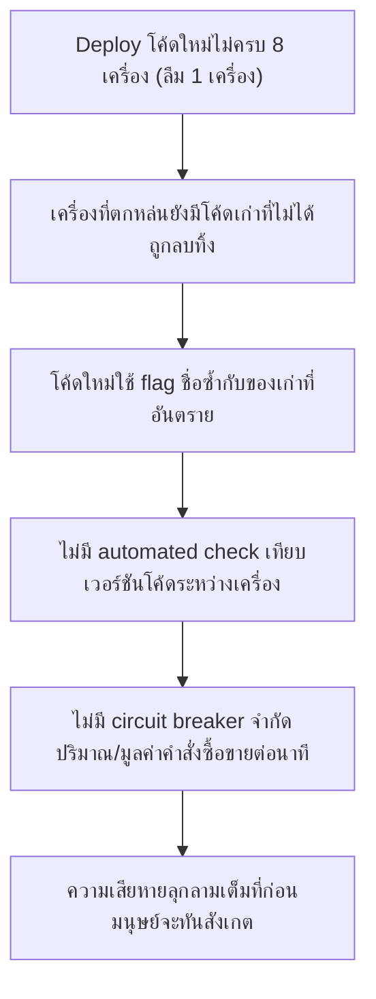
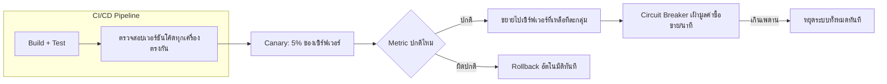

Deployment Strategies (บทก่อนหน้า) สอนไว้ว่า Canary Release คือค่อยๆ ปล่อยเวอร์ชันใหม่ทีละส่วนแทนที่จะปล่อยทีเดียวหมด — เคสนี้คือเรื่องจริงของบริษัทเทรดหุ้น <mark class="hl-term">Knight Capital</mark> ที่เสียเงินประมาณ 440-460 ล้านดอลลาร์ภายใน 45 นาที เพราะ deploy โค้ดใหม่ไม่ครบทุกเครื่อง แล้วไม่มีระบบไหนจับได้ทันก่อนความเสียหายจะลุกลาม

## เกิดอะไรขึ้นจริง (1 สิงหาคม 2012)

Knight Capital เป็นบริษัทที่ทำหน้าที่ "market maker" ต้องส่งคำสั่งซื้อขายหุ้นเป็นแสนรายการต่อวันด้วยความเร็วสูง ทีมวิศวกรเตรียม deploy โค้ดใหม่ชื่อ SMARS (Smart Market Access Routing System) ไปยังเซิร์ฟเวอร์ trading จำนวน 8 เครื่อง

```demo
component: StepThroughDiagram
props: {"steps":[{"label":"1. เตรียม deploy โค้ดใหม่ไปเซิร์ฟเวอร์ 8 เครื่อง","detail":"วิศวกรทำการ deploy ด้วยมือ (manual deployment) ไม่ใช่ automated pipeline"},{"label":"2. Deploy สำเร็จแค่ 7 จาก 8 เครื่อง","detail":"เซิร์ฟเวอร์เครื่องที่ 8 ไม่ได้รับโค้ดใหม่ ยังมีโค้ดเก่าเวอร์ชันก่อนหน้าค้างอยู่ — ไม่มีใครสังเกตเห็นความผิดพลาดนี้ก่อน market เปิด"},{"label":"3. ตลาดหุ้นเปิดทำการเช้าวันที่ 1 สิงหาคม","detail":"เซิร์ฟเวอร์ 7 เครื่องรันโค้ดใหม่ปกติ ส่วนเครื่องที่ 8 ยังรันโค้ดเก่าที่มี feature เก่าชื่อ Power Peg ซ่อนอยู่"},{"label":"4. Flag เก่าที่ถูกนำกลับมาใช้ชื่อซ้ำ ไปปลุก Power Peg ขึ้นมาโดยไม่ตั้งใจ","detail":"โค้ดใหม่ใช้ flag byte ตัวเดิมที่เคยเป็นของ Power Peg (ฟีเจอร์ทดสอบเก่าที่ถูกปลดระวางไปหลายปีแล้วแต่ไม่เคยลบโค้ดทิ้ง) มาเป็นสวิตช์ของฟีเจอร์ใหม่ — บนเครื่องที่ 8 ที่ยังไม่มีโค้ดใหม่ สวิตช์ตัวเดียวกันนี้ไปกระตุ้น Power Peg ของเก่าให้ทำงานแทน"},{"label":"5. Power Peg ยิงคำสั่งซื้อขายจริงเข้าตลาดรัวๆ ไม่หยุด","detail":"Power Peg ถูกออกแบบมาเดิมทีเพื่อทดสอบใน environment จำลอง ไม่ได้ตั้งใจให้รันใน production จริง — พอถูกปลุกขึ้นมาโดยไม่ได้ตั้งใจ มันเริ่มส่งคำสั่งซื้อขายหุ้นจริงนับล้านคำสั่งเข้าตลาดโดยไม่มีการตรวจสอบวงเงินที่สมเหตุสมผล"},{"label":"6. ใช้เวลา 45 นาทีกว่าจะพบและหยุดได้","detail":"ทีมงานเห็นความผิดปกติแต่กว่าจะสืบจนรู้ต้นตอ (เซิร์ฟเวอร์ตัวไหนพัง) และตัดสินใจปิดระบบทั้งหมด เวลาก็ผ่านไปแล้ว 45 นาที ระหว่างนั้นเกิดการซื้อขายผิดพลาดกว่า 4 ล้านรายการ"}]}
```

<mark class="hl-warning">ต้นตอที่แท้จริงไม่ใช่แค่ "ลืม deploy เครื่องเดียว" แต่คือการนำชื่อ flag เก่าที่เคยผูกกับโค้ดอันตรายกลับมาใช้ซ้ำ โดยไม่ได้ลบโค้ดเก่าที่ตายแล้ว (dead code) ออกจากระบบให้หมดก่อน — นี่คือสาเหตุที่ทำให้ความผิดพลาดเล็กๆ (deploy ไม่ครบ) กลายเป็นหายนะระดับ 440 ล้านดอลลาร์</mark>

## ทำไมเรื่องเล็กๆ ถึงลุกลามเป็นหายนะ



จุดที่ควรป้องกันได้มีอยู่หลายชั้น ไม่ใช่แค่จุดเดียว — และนี่คือสิ่งที่ทำให้เคสนี้เป็นบทเรียนคลาสสิกด้าน system design:

- <mark class="hl-term">Dead Code ที่ไม่ถูกลบ</mark> — Power Peg ถูกปลดระวางไปหลายปีแล้วแต่โค้ดยังอยู่ในระบบ พร้อมถูกปลุกขึ้นมาได้ทุกเมื่อถ้ามีอะไรไปกระตุ้นมันโดยบังเอิญ
- <mark class="hl-term">Deployment ไม่มี Verification อัตโนมัติ</mark> — ไม่มีขั้นตอนตรวจสอบอัตโนมัติว่าทุกเครื่องรันโค้ดเวอร์ชันเดียวกันจริงก่อนเปิดรับ traffic จริง ต้องพึ่งความจำของมนุษย์ล้วนๆ
- <mark class="hl-term">ไม่มี Canary/Staged Rollout</mark> — ปล่อยโค้ดใหม่เข้า production เต็มรูปแบบทันที ไม่ได้ทดสอบกับ traffic ส่วนน้อยก่อนเพื่อจับความผิดปกติ
- <mark class="hl-term">ไม่มี Circuit Breaker ระดับธุรกิจ</mark> — ต่อให้ทุกอย่างข้างบนพลาดหมด การมี**เพดานอัตโนมัติ**ที่หยุดระบบทันทีถ้ามูลค่าซื้อขายต่อนาทีเกินขอบเขตปกติมาก ก็ยังกันความเสียหายไม่ให้ลามได้ในระดับหนึ่ง

## ถ้าออกแบบระบบนี้ให้ถูกต้องตั้งแต่แรก

```demo
component: JourneyDiagram
props: {"nodes":[{"icon":"gear","label":"CI/CD Pipeline"},{"icon":"building","label":"Canary Servers (5% traffic)"},{"icon":"building","label":"Servers ที่เหลือทั้งหมด"},{"icon":"shield","label":"Circuit Breaker เฝ้าดูมูลค่าซื้อขาย"}],"travelerIcon":"package","steps":[{"activeNode":0,"caption":"Pipeline deploy พร้อมตรวจสอบอัตโนมัติว่าทุกเครื่องได้โค้ดเวอร์ชันเดียวกันจริง ก่อนเปิดรับ traffic"},{"activeNode":1,"caption":"ปล่อยโค้ดใหม่ให้เซิร์ฟเวอร์ส่วนน้อยก่อน (canary) แล้วเฝ้าดู metric ผิดปกติ เช่น อัตราการซื้อขายพุ่งเกินปกติ"},{"activeNode":2,"caption":"ถ้า canary ผ่านจริง ค่อยขยายไปเซิร์ฟเวอร์ที่เหลือทีละกลุ่ม ไม่ปล่อยทีเดียวหมด"},{"activeNode":3,"caption":"ไม่ว่าขั้นตอนก่อนหน้าจะพลาดตรงไหน circuit breaker ระดับธุรกิจจะหยุดระบบทันทีถ้ามูลค่าซื้อขายต่อนาทีเกินเพดานที่ตั้งไว้ ก่อนความเสียหายจะลามไปถึง 45 นาที"}]}
```

<mark class="hl-insight">บทเรียนสำคัญคือ ระบบที่ปลอดภัยต้องมี "การป้องกันหลายชั้น" (defense in depth) — ต่อให้ชั้นแรก (verification ตอน deploy) พลาด ก็ยังมีชั้นถัดไป (canary) และชั้นสุดท้าย (circuit breaker) คอยจำกัดความเสียหายไม่ให้ลุกลามเกินควบคุม ไม่ใช่หวังพึ่งการป้องกันแค่จุดเดียวจุดใดจุดหนึ่ง</mark>

## Architecture รวม



## Trade-off ที่ควรพูดถึง

- **Canary ช้ากว่าปล่อยทีเดียวหมด** — แลกความเร็วในการ deploy กับความปลอดภัย ยิ่งระบบมูลค่าความเสียหายต่อวินาทีสูง (เช่นระบบการเงิน) ยิ่งคุ้มที่จะช้าลง
- **ลบ Dead Code มีต้นทุนแรงงาน** — ต้องมีวินัยลบโค้ดที่ไม่ใช้แล้วออกจริงๆ ไม่ใช่แค่ปิดการเรียกใช้แล้วปล่อยทิ้งไว้ในระบบ เพราะโค้ดที่ "ปิดอยู่" ยังเป็นความเสี่ยงเสมอถ้ามีทางเปิดมันขึ้นมาโดยไม่ตั้งใจ
- **Circuit Breaker เข้มเกินไปอาจบล็อกธุรกรรมที่ถูกต้อง** — ต้องตั้งเพดานให้สมดุลระหว่างจับความผิดปกติจริงกับไม่กันธุรกรรมปกติที่แค่ช่วงนั้น traffic สูงกว่าปกติ (เช่นวันข่าวใหญ่ที่คนซื้อขายหุ้นเยอะจริงๆ)

## คำถามเจาะลึกที่มักถูกถามต่อ

**ถาม: ทำไมแค่ "deploy ไม่ครบเครื่อง" ถึงกลายเป็นความเสียหายระดับหลายร้อยล้านดอลลาร์ ทั้งที่ฟังดูเป็นเรื่องเล็ก**

เพราะปัญหาไม่ได้อยู่ที่ deploy ไม่ครบเพียงอย่างเดียว แต่อยู่ที่ระบบไม่มีชั้นป้องกันถัดไปเลยสักชั้น — ถ้ามี automated verification ตรวจพบความต่างของเวอร์ชันโค้ดได้ตั้งแต่ก่อนเปิด market ก็จบตั้งแต่ต้น ถ้าไม่มีอันนั้นแต่มี circuit breaker จำกัดมูลค่าซื้อขายต่อนาที ความเสียหายก็จะหยุดในหลักวินาทีถึงนาทีแรกๆ ไม่ใช่ 45 นาที การไม่มีชั้นป้องกันใดๆ เลยคือสิ่งที่ทำให้เรื่องเล็กบานปลาย

**ถาม: ทำไมการใช้ชื่อ flag ซ้ำกับของเก่าถึงอันตรายขนาดนี้ ทำไมไม่แค่สร้าง flag ใหม่**

เพราะทีมที่เขียนโค้ดใหม่ไม่รู้ (หรือลืม) ว่า flag byte ตัวนั้นเคยผูกกับฟีเจอร์เก่าที่อันตราย — ถ้าไม่มีการลบโค้ดเก่าออกจากระบบจริงๆ การใช้ชื่อซ้ำก็เหมือนวางกับดักทิ้งไว้โดยไม่รู้ตัว ยิ่งทีมงานเปลี่ยนคนไปเรื่อยๆ ยิ่งไม่มีใครจำได้ว่า flag ตัวไหนเคยผูกกับอะไรมาก่อน นี่คือเหตุผลที่หลักการ "ลบโค้ดที่ไม่ใช้แล้วออกจริง ไม่ใช่แค่ปิดไว้" สำคัญมากในระบบที่มีอายุยาวนาน

**ถาม: Canary Release ช่วยตรงจุดไหนในเคสนี้โดยเฉพาะ**

ถ้าปล่อยโค้ดใหม่ให้เซิร์ฟเวอร์แค่ 1-2 เครื่องก่อน (canary) แล้วเฝ้าดู metric เช่น จำนวนคำสั่งซื้อขายต่อวินาทีหรือมูลค่ารวมต่อนาที ทีมงานจะเห็นความผิดปกติจากเครื่องที่ 8 (ที่ยังรันโค้ดเก่า) ได้เร็วกว่ามาก เพราะ traffic ที่ผิดปกติจะกระจุกอยู่แค่ส่วนน้อยที่สังเกตง่าย ไม่ปนกับ traffic ปกติของทั้งระบบ 8 เครื่องพร้อมกัน

**ถาม: Circuit Breaker ระดับธุรกิจต่างจาก Circuit Breaker ที่เรียนในบท Resilience Patterns ยังไง**

หลักการเดียวกันคือ "หยุดทำงานอัตโนมัติเมื่อเกินเพดานที่ตั้งไว้" แต่ Circuit Breaker ที่เรียนในบท Resilience มักวัดจาก metric ทางเทคนิค (error rate, latency ของ service) ส่วนที่ควรมีเพิ่มในระบบการเงินคือ Circuit Breaker ที่วัดจาก**ตัวเลขทางธุรกิจโดยตรง** (มูลค่าซื้อขายต่อนาที, จำนวนคำสั่งผิดปกติ) เพราะบางความผิดพลาดทางเทคนิคอาจดูเหมือนระบบทำงาน "ปกติ" ทุกอย่าง (ไม่มี error, latency ต่ำ) ทั้งที่กำลังทำสิ่งที่ผิดพลาดร้ายแรงในเชิงธุรกิจอยู่

**ถาม: ทำไมทีมงานถึงใช้เวลาถึง 45 นาทีกว่าจะหยุดระบบได้ ทั้งที่เห็นความผิดปกติตั้งแต่ต้น**

เพราะระบบไม่มี dashboard ที่ชี้ตรงไปที่ต้นตอได้ทันที ทีมงานเห็นแค่ผลลัพธ์ปลายทาง (คำสั่งซื้อขายผิดปกติจำนวนมาก) แต่ต้องไล่สืบเองว่ามาจากเซิร์ฟเวอร์เครื่องไหน เกิดจากอะไร — นี่คือเหตุผลที่ observability (logging, tracing แยกตามเครื่อง/เวอร์ชันโค้ด) สำคัญมาก เพราะยิ่งรู้ต้นตอเร็วเท่าไหร่ ยิ่งตัดสินใจ rollback หรือปิดระบบได้เร็วเท่านั้น การไล่สืบด้วยมือกลางสถานการณ์วิกฤตกินเวลามากกว่าที่คิด

**ถาม: บทเรียนนี้เอาไปใช้กับระบบที่ไม่ใช่การเงินได้ไหม เช่นระบบ e-commerce ทั่วไป**

ได้เต็มที่ — หลักการ "deploy ต้อง verify ครบทุกเครื่อง, ปล่อยทีละน้อยก่อนด้วย canary, มีเพดานอัตโนมัติจำกัดความเสียหายสูงสุด" ใช้ได้กับทุกระบบที่การพลาดหนึ่งครั้งสร้างความเสียหายเป็นวงกว้างเร็ว เช่น ระบบ e-commerce อาจตั้ง circuit breaker จำกัด "จำนวนคำสั่งซื้อผิดปกติต่อนาทีจากบัญชีเดียว" หรือระบบแจ้งเตือนอาจจำกัด "จำนวนข้อความที่ส่งออกต่อวินาที" เพื่อกัน bug ที่ยิงข้อความซ้ำไม่หยุดไม่ให้ลามไปหา user นับล้านคนในเวลาสั้นๆ

> คำถามสัมภาษณ์: "ถ้าคุณต้อง deploy ระบบที่พลาดแล้วเสียหายสูงมาก (เช่นระบบการเงิน) คุณจะป้องกันแบบ Knight Capital ไม่ให้เกิดซ้ำยังไง" — ตอบด้วยหลัก defense in depth หลายชั้น: (1) automated verification ตรวจเวอร์ชันโค้ดทุกเครื่องตรงกันก่อนเปิดรับ traffic จริง (2) canary release ปล่อยทีละน้อยพร้อมเฝ้า metric ทางธุรกิจไม่ใช่แค่ทางเทคนิค (3) circuit breaker ระดับธุรกิจจำกัดความเสียหายสูงสุดต่อหน่วยเวลา และ (4) มีวินัยลบ dead code ออกจริง ไม่ปล่อยโค้ดอันตรายเก่าให้ค้างในระบบเฉยๆ เพราะไม่มีชั้นป้องกันชั้นเดียวที่ไว้ใจได้ 100% ต้องมีหลายชั้นซ้อนกัน
