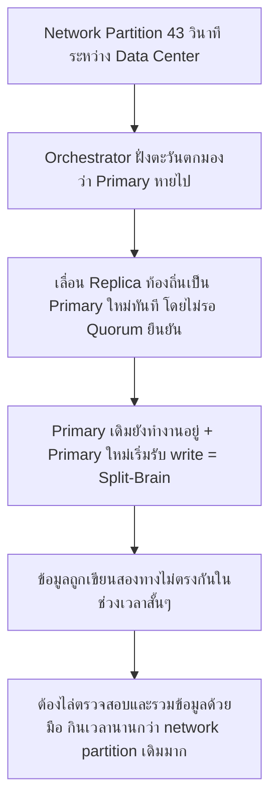
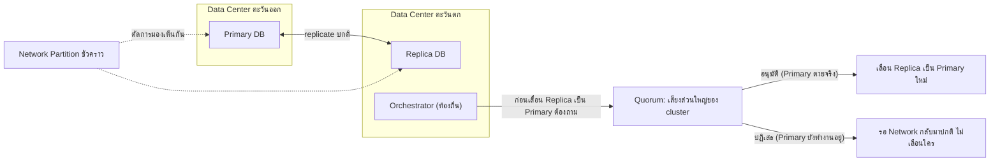

Consensus & Leader Election (บทก่อนหน้า) สอนไว้ว่า algorithm อย่าง Raft ต้องมี quorum เสียงส่วนใหญ่ก่อนจะเลือก leader ใหม่ได้ — เคสนี้คือเรื่องจริงของ <mark class="hl-term">GitHub</mark> ที่ network ขาดแค่ 43 วินาที แต่ทำให้บริการทั้งแพลตฟอร์มป่วนหนักนานเกือบ 24 ชั่วโมง เพราะระบบ automated failover ตัดสินใจผิดในช่วงเวลาสั้นๆ นั้น

## เกิดอะไรขึ้นจริง (ตุลาคม 2018)

GitHub เก็บข้อมูลหลักไว้ใน MySQL cluster ที่กระจายอยู่หลาย data center เพื่อความเร็วและความทนทาน โดยใช้เครื่องมือชื่อ Orchestrator คอยเฝ้าดูสุขภาพของ cluster และสั่ง failover อัตโนมัติถ้า primary database มีปัญหา

```demo
component: StepThroughDiagram
props: {"steps":[{"label":"1. ปกติ: Primary database อยู่ที่ data center ตะวันออก (US East)","detail":"Replica database หลายชุดกระจายอยู่ data center อื่น รวมถึงฝั่งตะวันตก (US West) คอย sync ข้อมูลตามหลัง primary อยู่เสมอ"},{"label":"2. เกิด network partition 43 วินาที ระหว่าง data center","detail":"อุปกรณ์ network ที่เชื่อมสอง data center เสียชั่วขณะ ทำให้สอง data center มองไม่เห็นกันในช่วงเวลาสั้นๆ นี้"},{"label":"3. Orchestrator ที่ฝั่งตะวันตกมองว่า primary หายไป จึงเลื่อน replica ท้องถิ่นขึ้นเป็น primary ใหม่ทันที","detail":"เป็นการตัดสินใจอัตโนมัติตามการออกแบบ แต่ทำโดยไม่รู้ว่า primary เดิมฝั่งตะวันออกยังทำงานได้ปกติอยู่ แค่ network ขาดชั่วคราว"},{"label":"4. Network กลับมาเชื่อมต่อได้ใน 43 วินาทีถัดมา — ตอนนี้มี Primary สองตัวพร้อมกัน","detail":"Primary เดิมฝั่งตะวันออกยังรับ write อยู่ ส่วน Primary ใหม่ฝั่งตะวันตกก็เริ่มรับ write เช่นกัน — ข้อมูลเริ่มเขียนสองทางไม่ตรงกัน"},{"label":"5. ระบบตรวจพบความขัดแย้งและสั่งเข้าสู่ read-only mode เพื่อกันข้อมูลเสียหายเพิ่ม","detail":"GitHub บังคับให้ระบบเข้าสู่โหมด read-only ชั่วคราว (ผู้ใช้ดูข้อมูลได้แต่แก้ไข/สร้างใหม่ไม่ได้เต็มรูปแบบ) เพื่อหยุดความขัดแย้งของข้อมูลไม่ให้ลามต่อ"},{"label":"6. ใช้เวลาเกือบ 24 ชั่วโมงกว่าจะไล่ตรวจสอบและรวมข้อมูลทั้งสองฝั่งกลับเป็นชุดเดียวได้ปลอดภัย","detail":"ทีมวิศวกรต้องไล่เปรียบเทียบข้อมูลที่เขียนจากทั้งสอง primary ทีละรายการเพื่อไม่ให้ข้อมูลผู้ใช้หายหรือขัดแย้งกัน กว่าจะกลับมาให้บริการปกติเต็มรูปแบบได้"}]}
```

<mark class="hl-warning">ต้นตอไม่ใช่แค่ "network ขาด" (ซึ่งเกิดขึ้นได้เสมอในระบบกระจาย) แต่คือระบบ failover อัตโนมัติตัดสินใจโดยไม่รอยืนยันว่า primary เดิม "ตายจริง" หรือแค่ "ติดต่อไม่ได้ชั่วคราว" สองสถานการณ์นี้แยกไม่ออกจากมุมมองของฝั่งที่ถูกตัดขาด — นี่คือแก่นของปัญหา Split-Brain</mark>

## ทำไม 43 วินาทีถึงกลายเป็นปัญหาเกือบ 24 ชั่วโมง



<mark class="hl-insight">นี่คือตัวอย่างจริงของหลักการที่เรียนในบท Consensus: การจะเลื่อนใครขึ้นเป็น leader ใหม่ต้องได้เสียงยืนยันจาก<mark class="hl-term">Quorum</mark> (เสียงส่วนใหญ่ของ cluster) ก่อนเสมอ ไม่ใช่ให้ node เดียวตัดสินใจเองจากมุมมองที่ตัวเองมองเห็นเพียงฝ่ายเดียว เพราะสิ่งที่ node นั้นมองว่า "primary หายไป" อาจแค่หมายถึง "ฉันมองไม่เห็นมันเฉยๆ" ก็ได้</mark> ปัญหาคือการรอ quorum ข้าม data center ก็แลกมาด้วย latency ที่สูงขึ้น เป็น trade-off เดียวกับที่เรียนในบท Multi-Region Active-Active

## ถ้าออกแบบระบบ Failover นี้ให้ปลอดภัยกว่าเดิม

```demo
component: JourneyDiagram
props: {"nodes":[{"icon":"building","label":"Data Center ตะวันออก (Primary)"},{"icon":"gate","label":"Network ระหว่าง Data Center"},{"icon":"building","label":"Data Center ตะวันตก (Replica)"},{"icon":"shield","label":"Quorum เสียงส่วนใหญ่"}],"travelerIcon":"envelope","steps":[{"activeNode":1,"caption":"Network ขาดชั่วคราวระหว่าง Data Center — ฝั่งตะวันตกมองไม่เห็น Primary"},{"activeNode":3,"caption":"แทนที่จะเลื่อน Replica เป็น Primary ทันที ระบบควรถามเสียงยืนยันจาก node ส่วนใหญ่ใน cluster ก่อนว่า Primary ตัวเดิม 'ตายจริง' หรือแค่ 'ติดต่อไม่ได้จากมุมเดียว'"},{"activeNode":0,"caption":"ถ้า Primary เดิมยังตอบสนองกับ node ส่วนใหญ่ได้ปกติ Quorum จะไม่อนุมัติให้เลื่อน Replica ขึ้นมาแทน — กัน Split-Brain ได้ตั้งแต่ต้น"},{"activeNode":2,"caption":"ถ้า Quorum ยืนยันจริงว่า Primary หายไปจริง (เสียงส่วนใหญ่เห็นตรงกัน) ถึงจะอนุมัติเลื่อน Replica เป็น Primary ใหม่อย่างปลอดภัย"}]}
```

## Architecture รวม



## Trade-off ที่ควรพูดถึง

- **รอ Quorum ปลอดภัยกว่าแต่ failover ช้าลง** — ถ้า primary ตายจริง การรอเสียงยืนยันจาก data center อื่นทำให้ downtime นานขึ้นกว่าการเลื่อน replica ทันทีแบบเดิม ต้องชั่งน้ำหนักระหว่าง "ปลอดภัยจาก split-brain" กับ "กู้คืนเร็ว"
- **Network Partition สั้นแค่ไหนก็อันตรายได้ถ้าไม่มี Quorum** — ไม่ใช่แค่ partition ยาวๆ ถึงจะเป็นปัญหา แม้แต่ 43 วินาทีก็พอที่จะทำให้ automated system ตัดสินใจผิดถ้าไม่มีกลไกยืนยันที่ถูกต้อง
- **Manual Reconciliation กินเวลามากกว่าที่คิด** — เมื่อเกิด split-brain ขึ้นแล้ว การไล่ตรวจสอบและรวมข้อมูลด้วยมือ (เพื่อไม่ให้ข้อมูลผู้ใช้หาย) ใช้เวลานานกว่าตัว incident เดิมมาก นี่คือเหตุผลที่การป้องกันไม่ให้เกิด split-brain ตั้งแต่แรกคุ้มค่ากว่าการแก้ทีหลังเสมอ

## คำถามเจาะลึกที่มักถูกถามต่อ

**ถาม: ทำไม network ขาดแค่ 43 วินาที ถึงทำให้ระบบป่วนนานเกือบ 24 ชั่วโมง**

เพราะปัญหาไม่ได้อยู่ที่ตัว network partition เอง (ซึ่งจบไปแล้วใน 43 วินาที) แต่อยู่ที่ผลลัพธ์ของมัน — ระบบตัดสินใจเลื่อน replica เป็น primary ใหม่ระหว่างนั้น ทำให้เกิด primary สองตัวเขียนข้อมูลไม่ตรงกันช่วงสั้นๆ พอ network กลับมา ข้อมูลสองชุดนั้นขัดแย้งกันแล้ว การไล่ตรวจสอบและรวมข้อมูลคืนให้ถูกต้องโดยไม่ทำข้อมูลผู้ใช้หายต้องทำอย่างระมัดระวังทีละรายการ ซึ่งกินเวลานานกว่าตัวเหตุการณ์ต้นตอมาก

**ถาม: Quorum ในเคสนี้ต่างจาก Quorum ที่เรียนในบท Multi-Region Active-Active ยังไง**

หลักการเดียวกันคือต้องได้เสียงยืนยันจากเสียงส่วนใหญ่ก่อนตัดสินใจสำคัญ แต่ในบท Multi-Region ใช้ quorum ตอน**เขียนข้อมูล** (write ต้องได้เสียงยืนยันก่อนถือว่าสำเร็จ) ส่วนในเคสนี้ใช้ quorum ตอน**ตัดสินใจเลื่อน leader ใหม่** (จะเปลี่ยน primary ต้องได้เสียงยืนยันก่อนว่า primary เดิมตายจริง) เป็นคนละจุดใช้งานแต่รากฐานทางทฤษฎีเดียวกันคือ Consensus

**ถาม: ทำไมไม่ให้ Orchestrator รอนานกว่านี้ก่อนตัดสินใจเลื่อน replica เป็น primary**

เป็น trade-off โดยตรง — ถ้ารอนานเกินไปก่อนเลื่อน replica ตอนที่ primary ตายจริง ผู้ใช้จะเจอ downtime นานขึ้น ถ้ารอสั้นเกินไป (แบบที่เกิดขึ้นจริง) ก็เสี่ยงตัดสินใจผิดตอน network แค่สั่นชั่วขณะ ทางแก้ที่ถูกต้องไม่ใช่แค่ "รอนานขึ้น" แต่คือเปลี่ยนเงื่อนไขจาก "รอเวลา" เป็น "รอเสียงยืนยันจาก quorum" ซึ่งแม่นยำกว่าการเดาจากระยะเวลาเฉยๆ

**ถาม: ทำไม GitHub เลือกเข้าสู่ read-only mode แทนที่จะปิดระบบไปเลย**

เพราะ read-only mode ยังให้ผู้ใช้เข้าถึงข้อมูลเดิมได้ตามปกติ (ดู repository, อ่านโค้ด) แค่ปิดกั้นการเขียนข้อมูลใหม่ชั่วคราวเพื่อกันไม่ให้ความขัดแย้งของข้อมูลลุกลามเพิ่ม เป็นการลด blast radius ให้เหลือน้อยที่สุดเท่าที่จำเป็น แทนที่จะปิดบริการทั้งหมดซึ่งกระทบผู้ใช้รุนแรงกว่าโดยไม่จำเป็น หลักการเดียวกับ Blast Radius ที่เรียนในบท Chaos Engineering

**ถาม: ถ้าใช้ CRDT หรือ Last-Write-Wins แบบที่เรียนในบท Multi-Region จะช่วยเคสนี้ได้ไหม**

ช่วยได้บางส่วนแต่ไม่ใช่ทางแก้ที่สมบูรณ์ — LWW/CRDT เหมาะกับระบบที่ออกแบบมาให้เป็น active-active ตั้งแต่ต้น (รู้ตัวว่าจะมีการเขียนสองทางและมีกลไกรวมผลไว้แล้ว) แต่ระบบของ GitHub ในเคสนี้ออกแบบเป็น single-primary (มี primary จริงแค่ตัวเดียวตลอดเวลาปกติ) การเกิด primary สองตัวคือสภาวะผิดปกติที่ไม่ได้ออกแบบไว้รองรับ การป้องกันที่ถูกจุดกว่าคือกัน split-brain ไม่ให้เกิดตั้งแต่ต้นด้วย quorum ไม่ใช่ไปแก้ผลลัพธ์ทีหลังด้วย conflict resolution

**ถาม: บทเรียนนี้เอาไปใช้กับระบบขนาดเล็กที่ไม่มีหลาย data center ได้ไหม**

หลักการยังใช้ได้แม้เป็น cluster เดียวใน data center เดียวกัน — ถ้ามี automated failover ที่ตัดสินใจเลื่อน node ใหม่ขึ้นเป็น leader ต้องถามตัวเองเสมอว่า "การตัดสินใจนี้ยึดจากมุมมองของ node เดียวหรือจากเสียงส่วนใหญ่ของ cluster" ถ้ายึดจากมุมมองเดียว (เช่น node เดียวมองว่า leader หายไปแล้วเลื่อนตัวเองขึ้นทันที) ก็เสี่ยง split-brain ได้เหมือนกัน แม้จะไม่มี network partition ข้าม data center ก็ตาม เช่น กรณี garbage collection pause ยาวผิดปกติที่ทำให้ node หนึ่งดูเหมือนตายทั้งที่จริงยังทำงานอยู่

> คำถามสัมภาษณ์: "Automated failover ที่ปลอดภัยควรตัดสินใจเลื่อน leader ใหม่ยังไง เพื่อไม่ให้เกิด split-brain แบบ GitHub" — ต้องอาศัย quorum เสียงส่วนใหญ่ของ cluster ยืนยันก่อนเสมอว่า leader เดิม "ตายจริง" ไม่ใช่ให้ node เดียวตัดสินใจเองจากมุมมองที่ตัวเองมองเห็นเพียงฝ่ายเดียว เพราะ network partition สั้นแค่ไหนก็ทำให้ node หนึ่งมองไม่เห็นอีกฝั่งได้ทั้งที่อีกฝั่งยังทำงานปกติ การรอ quorum แลกมาด้วย latency ที่สูงขึ้นตอน failover แต่ป้องกันความเสียหายที่ใหญ่กว่ามากคือข้อมูลขัดแย้งกันจากการมี primary สองตัวพร้อมกัน
