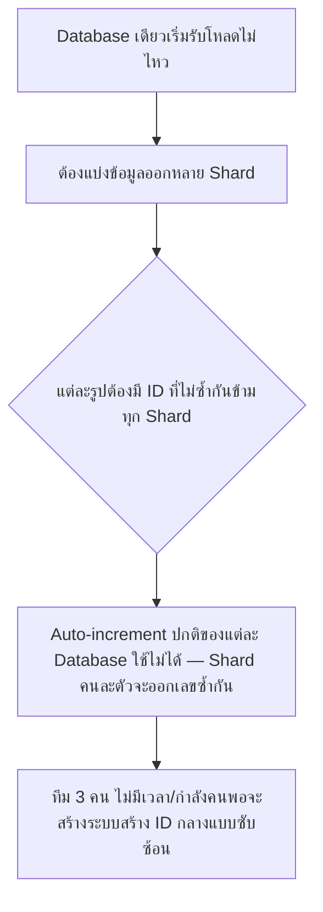
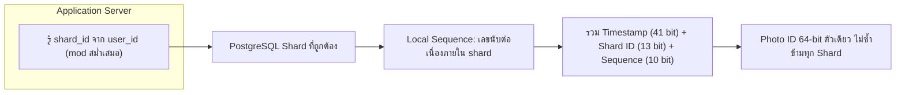

Sharding (บทก่อนหน้า) สอนไว้ว่าการแบ่งข้อมูลออกหลาย database ต้องมีวิธีสร้าง ID ที่ไม่ชนกันข้าม shard — เคสนี้คือเรื่องจริงของ <mark class="hl-term">Instagram</mark> ตอนที่มีวิศวกรแค่ 3 คน แต่ต้องออกแบบระบบให้รองรับผู้ใช้หลักสิบล้านคนภายในเวลาไม่ถึงปี โดยไม่มีงบหรือกำลังคนพอจะสร้างระบบซับซ้อนแบบบริษัทใหญ่

## สถานการณ์จริง: ทีมเล็กมาก แต่โตเร็วเกินคาด (2011-2012)

Instagram เริ่มต้นด้วยวิศวกรแค่ 3 คน ใช้ PostgreSQL เป็น database หลัก ตอนแรกเก็บทุกอย่างไว้ใน database เดียว แต่พอผู้ใช้เพิ่มจากหลักแสนเป็นหลักสิบล้านคนอย่างรวดเร็ว database เดียวเริ่มรับโหลดไม่ไหว ทีมต้องตัดสินใจทำ <mark class="hl-term">Sharding</mark> (แบ่งข้อมูลออกหลาย database) แต่ติดปัญหาใหญ่ทันที



<mark class="hl-warning">ปัญหานี้เจอเหมือนกันในบท Sharding ทั่วไป — auto-increment ID ของแต่ละ database เป็นอิสระจากกัน พอแบ่งข้อมูลเป็นหลาย shard แต่ละ shard จะเริ่มนับ ID จาก 1 ใหม่ ทำให้รูปจาก shard คนละตัวมี ID ซ้ำกันได้ ต้องมีวิธีสร้าง ID ที่รับประกันว่าไม่ซ้ำกันข้ามทุก shard โดยไม่ต้องมีจุดกลางจุดเดียวที่ทุก request ต้องวิ่งไปขอ ID ก่อน (เพราะจุดกลางแบบนั้นจะกลายเป็นคอขวดทันที)</mark>

## ทางแก้ที่ทีมเล็กออกแบบ: ยัดข้อมูลสามอย่างลงใน ID เดียว

```demo
component: StepThroughDiagram
props: {"steps":[{"label":"1. ออกแบบ ID ให้เป็นเลข 64-bit ตัวเดียว แบ่งเป็น 3 ส่วนในตัวมันเอง","detail":"แทนที่จะพึ่งจุดกลางแจก ID แต่ละเครื่องสร้าง ID ของตัวเองได้เลยจากข้อมูลที่มีอยู่แล้ว ไม่ต้องถามใคร"},{"label":"2. ส่วนที่ 1 (41 bits): timestamp ตอนสร้างข้อมูล (มิลลิวินาที นับจากจุดเริ่มต้นที่กำหนดเอง)","detail":"ทำให้ ID เรียงตามเวลาได้โดยธรรมชาติ (ID ใหม่กว่าจะมีค่ามากกว่าเสมอ) เป็นประโยชน์มากตอนต้องดึงข้อมูลเรียงตามเวลาโพสต์"},{"label":"3. ส่วนที่ 2 (13 bits): หมายเลข Shard ที่ข้อมูลนี้ถูกเก็บอยู่","detail":"บอกได้ทันทีจาก ID เพียงอย่างเดียวว่าข้อมูลนี้อยู่ shard ไหน ไม่ต้องเปิด mapping table แยกต่างหากเพื่อค้นหา"},{"label":"4. ส่วนที่ 3 (10 bits): เลขนับต่อเนื่องภายใน shard นั้นในมิลลิวินาทีเดียวกัน","detail":"ใช้ auto-increment sequence ของ database ปกติ (PostgreSQL) แต่จำกัดขอบเขตแค่ภายใน shard เดียวกันเท่านั้น ไม่ต้องคุยข้าม shard"},{"label":"5. รวมสามส่วนนี้เป็นเลขเดียวด้วยการ bit-shift","detail":"ผลลัพธ์คือ ID 64-bit ตัวเดียวที่รับประกันไม่ซ้ำกันข้าม shard โดยไม่ต้องมีจุดกลางจุดเดียวที่ทุกคำขอต้องวิ่งไปขอ ID ก่อนสร้างข้อมูลจริง"}]}
```

<mark class="hl-insight">แนวคิดนี้ตรงกับหลักการเดียวกับ Snowflake ID ของ Twitter — ยัดข้อมูล timestamp + shard identifier + sequence number ลงในเลขจำนวนเดียว ทำให้แต่ละเครื่องสร้าง ID ของตัวเองได้อย่างอิสระโดยไม่ต้องมี single point of coordination แถมยังได้ประโยชน์แถมคือ ID เรียงตามเวลาได้ในตัวโดยไม่ต้องคำนวณเพิ่ม</mark> ทีมแค่ 3 คนเลือกวิธีนี้เพราะ**ใช้ของที่มีอยู่แล้ว** (PostgreSQL sequence ในตัว) แทนที่จะสร้างระบบสร้าง ID กลางแยกต่างหาก (เช่น service เฉพาะ) ซึ่งต้องดูแลเพิ่มโดยไม่จำเป็น

## Architecture รวม



## Trade-off ที่ควรพูดถึง

- **ประหยัดแรงงานทีมเล็ก แต่ผูกกับขอบเขต bit ที่กำหนดไว้ตายตัว** — 13 bits รองรับได้สูงสุด 8,192 shard, 10 bits รองรับได้ 1,024 ID ต่อ shard ต่อมิลลิวินาที ถ้าระบบโตเกินขอบเขตนี้ในอนาคตต้องออกแบบ ID scheme ใหม่ทั้งหมด (ต่างจากระบบที่จ่ายแพงกว่าตั้งแต่ต้นด้วย central ID service ที่ปรับขนาดได้ยืดหยุ่นกว่า)
- **ID เรียงตามเวลาได้ แต่เดาลำดับได้ง่ายกว่า UUID สุ่ม** — ถ้าระบบต้องการความเป็นส่วนตัวสูง (ไม่อยากให้คนนอกเดาได้ว่ามีข้อมูลกี่แถวจาก ID ที่เห็น) วิธีนี้เปิดเผยข้อมูลมากกว่า UUID v4 ที่สุ่มล้วน
- **ต้องรู้ shard_id ล่วงหน้าก่อนสร้าง ID** — วิธีนี้ใช้ได้เพราะระบบรู้อยู่แล้วว่าจะเขียนข้อมูลลง shard ไหน (คำนวณจาก user_id) ถ้าเป็นระบบที่ยังไม่รู้ปลายทาง shard ตอนสร้าง ID วิธีนี้จะใช้ไม่ได้ตรงๆ

## คำถามเจาะลึกที่มักถูกถามต่อ

**ถาม: ทำไมทีม 3 คนไม่ใช้ UUID แบบสุ่มไปเลย ทำไมต้องออกแบบ ID เอง**

UUID สุ่มก็ไม่ชนกันข้าม shard ได้จริง แต่แลกมาด้วยการเสีย property ที่มีประโยชน์มาก — ID ที่เรียงตามเวลาได้ในตัว ระบบ social media ต้องดึงโพสต์เรียงตามเวลาโพสต์บ่อยมาก (news feed, timeline) ถ้า ID ไม่เรียงตามเวลา ต้องพึ่ง column แยกต่างหาก (created_at) แล้ว sort เพิ่มทุกครั้ง ID ที่ออกแบบเองยัด timestamp เข้าไปทำให้ได้ประโยชน์นี้ฟรีโดยไม่ต้อง query เพิ่ม

**ถาม: ทำไมไม่สร้าง central ID generator service แยกต่างหากแบบบริษัทใหญ่ทำกัน**

เพราะทีมแค่ 3 คน ทรัพยากรจำกัดมาก — การสร้างและดูแล service แยกต่างหากมีต้นทุนสูงกว่า (ต้องดูแล availability ของ service นั้นเอง ถ้ามันล่ม ระบบทั้งหมดสร้างข้อมูลใหม่ไม่ได้) การยัด logic ไว้ในแอปพลิเคชันโดยใช้ของที่มีอยู่แล้ว (PostgreSQL sequence) ทำให้ไม่ต้องเพิ่มจุดล้มเหลวใหม่เข้าไปในระบบ นี่คือหลักการ "เลือกทางแก้ที่เรียบง่ายที่สุดที่ตอบโจทย์ได้จริง" ไม่ใช่ทางแก้ที่ซับซ้อนที่สุดเสมอไป

**ถาม: ทำไมแบ่ง bit เป็น 41-13-10 ไม่ใช่สัดส่วนอื่น**

เป็นการคำนวณจาก capacity estimation ตามที่เรียนในบท Capacity Estimation — 41 bits ของ timestamp รองรับได้ประมาณ 69 ปีนับจาก epoch ที่กำหนด ยาวพอสำหรับอายุการใช้งานของระบบ, 13 bits ของ shard รองรับ 8,192 shard ซึ่งเกินพอสำหรับขนาดที่คาดว่าจะโตถึง, 10 bits ของ sequence รองรับ 1,024 ID ต่อ shard ต่อมิลลิวินาที ซึ่งเกินพอสำหรับอัตราการโพสต์รูปต่อวินาทีที่ประเมินไว้ ทั้งหมดรวมกันพอดี 64 bits ซึ่งเป็นขนาด integer มาตรฐานที่ database และภาษาโปรแกรมส่วนใหญ่รองรับโดยตรงอยู่แล้ว

**ถาม: วิธีนี้ต่างจาก Twitter Snowflake ยังไง**

หลักการเดียวกันทุกประการ (timestamp + machine/shard identifier + sequence number ยัดในเลขเดียว) ต่างกันแค่รายละเอียดการแบ่งจำนวน bit และวิธี implement (Twitter มี dedicated Snowflake service แยกต่างหาก ส่วน Instagram ฝัง logic ไว้ในแอปพลิเคชันโดยตรงเพื่อประหยัดแรงงานทีมเล็ก) แสดงให้เห็นว่าปัญหาเดียวกัน (unique ID ข้าม shard) มีทางแก้แนวคิดเดียวกันได้ แม้ implementation จะต่างกันตามข้อจำกัดของแต่ละทีม

**ถาม: ถ้า database ของ shard หนึ่งล่มกลางทาง จะกระทบ ID generation ของ shard อื่นไหม**

ไม่กระทบ เพราะแต่ละ shard สร้าง ID ของตัวเองอย่างอิสระโดยใช้ sequence ภายใน shard นั้นเท่านั้น ไม่ต้องพึ่งพา shard อื่นหรือจุดกลางใดๆ นี่คือข้อดีสำคัญของวิธีนี้เทียบกับการมี central ID service จุดเดียว — ถ้า central service ล่ม ทุก shard สร้างข้อมูลใหม่ไม่ได้หมดทั้งระบบ แต่วิธีนี้ shard ที่เหลือยังทำงานได้ปกติแม้ shard หนึ่งจะมีปัญหา

**ถาม: บทเรียนเรื่อง "ทีมเล็กออกแบบง่ายๆ" นี้เอาไปใช้กับสถานการณ์อื่นได้ยังไง**

หลักการคือ **เลือกทางแก้ที่ใช้ของที่มีอยู่แล้วให้ได้ประโยชน์สูงสุดก่อน** แทนที่จะสร้างระบบใหม่แยกต่างหากทันทีที่เจอปัญหา ก่อนจะสร้าง service ใหม่หรือ infrastructure ซับซ้อนเพิ่ม ควรถามก่อนว่า "ของที่มีอยู่แล้วในระบบ (database feature, library ที่ใช้อยู่) แก้ปัญหานี้ได้พอไหม" เพราะทุก component ใหม่ที่เพิ่มเข้าไปคือภาระดูแลเพิ่ม (availability, monitoring, on-call) ที่ทีมเล็กแบกรับไม่ไหว หลักการนี้ใช้ได้กับทุกขนาดทีม ไม่ใช่แค่ทีมเล็ก

> คำถามสัมภาษณ์: "ถ้าต้องแบ่ง database เป็นหลาย shard คุณจะออกแบบวิธีสร้าง ID ที่ไม่ซ้ำกันข้าม shard ยังไง โดยไม่มีจุดกลางจุดเดียวที่เป็นคอขวด" — ยัดข้อมูลสามอย่างลงในเลขเดียว: timestamp (ทำให้ ID เรียงตามเวลาได้ในตัว), shard identifier (บอกได้ทันทีว่าข้อมูลอยู่ shard ไหนจาก ID เพียงอย่างเดียว), และ sequence number ภายใน shard (ใช้ auto-increment ปกติของ database แต่ละ shard) รวมกันด้วย bit-shift เป็นเลขเดียว วิธีนี้ทำให้แต่ละ shard สร้าง ID ของตัวเองได้อิสระโดยไม่ต้องพึ่งจุดกลาง แลกมาด้วยขอบเขตตายตัวของจำนวน bit ที่ต้องคำนวณให้พอเผื่อการเติบโตล่วงหน้า
