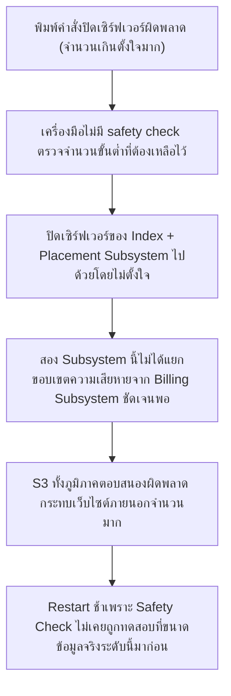
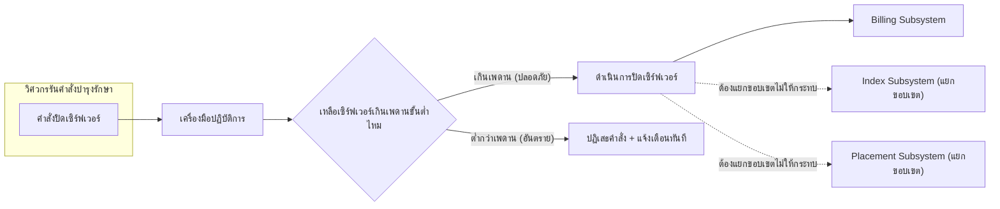

Chaos Engineering & DR (บทก่อนหน้า) สอนไว้ว่าต้องจำกัด <mark class="hl-term">Blast Radius</mark> ก่อนทำการทดลองหรือเปลี่ยนแปลงระบบเสมอ — เคสนี้คือเรื่องจริงของ <mark class="hl-term">AWS S3</mark> ที่พนักงานคนหนึ่งพิมพ์คำสั่งผิดพลาดเพียงครั้งเดียว แต่ทำให้บริการอินเทอร์เน็ตจำนวนมากในสหรัฐฯ ฝั่งตะวันออกล่มพร้อมกันนานหลายชั่วโมง

## เกิดอะไรขึ้นจริง (28 กุมภาพันธ์ 2017)

ทีมวิศวกร AWS S3 กำลังแก้ปัญหาระบบเรียกเก็บเงิน (billing subsystem) ที่ทำงานช้าผิดปกติ ตามขั้นตอนที่เคยทำมาก่อนคือปิดเซิร์ฟเวอร์บางส่วนของ subsystem นั้นเพื่อลดโหลดชั่วคราว

```demo
component: StepThroughDiagram
props: {"steps":[{"label":"1. ทีมงานรัน playbook ที่เคยใช้มาก่อน เพื่อปิดเซิร์ฟเวอร์บางส่วนของ Billing Subsystem","detail":"เป็นขั้นตอนปกติที่เคยทำสำเร็จมาแล้วหลายครั้ง เพื่อลดโหลดของ subsystem ที่มีปัญหา"},{"label":"2. คำสั่งที่พิมพ์ระบุจำนวนเซิร์ฟเวอร์ที่จะปิดผิดพลาด","detail":"แทนที่จะปิดแค่ไม่กี่เครื่องตามที่ตั้งใจ คำสั่งกลับปิดเซิร์ฟเวอร์จำนวนมากกว่าที่ตั้งใจไว้มาก และเครื่องมือที่ใช้รันคำสั่งนี้ไม่มีการตรวจสอบว่าจำนวนที่ระบุนั้นสมเหตุสมผลหรือไม่"},{"label":"3. เซิร์ฟเวอร์ที่ถูกปิดไปครอบคลุมถึง Index Subsystem และ Placement Subsystem","detail":"สอง subsystem นี้ไม่ใช่แค่ของ billing — Index Subsystem เก็บ metadata ว่าไฟล์แต่ละไฟล์อยู่ที่ไหน ส่วน Placement Subsystem จัดสรรพื้นที่เก็บไฟล์ใหม่ ทั้งคู่เป็นหัวใจของ S3 ทั้งระบบ ไม่ใช่แค่ของ billing subsystem เดียว"},{"label":"4. S3 ในภูมิภาคนั้นเริ่มตอบสนองผิดพลาดเป็นวงกว้างทันที","detail":"เว็บไซต์และแอปพลิเคชันจำนวนมากที่พึ่งพา S3 เก็บไฟล์ (รูปภาพ, ข้อมูล static) เริ่มล่มตาม รวมถึงบริการภายในของ AWS เองบางส่วนก็ได้รับผลกระทบเพราะพึ่งพา S3 เช่นกัน"},{"label":"5. การกู้คืนช้ากว่าที่คาดมาก เพราะ subsystem เหล่านี้ไม่เคยถูก restart เต็มรูปแบบมานานหลายปี","detail":"Index Subsystem และ Placement Subsystem มีกระบวนการตรวจสอบความปลอดภัยของข้อมูล (safety check) ที่ต้องรันตอนเริ่มระบบใหม่ ยิ่งระบบมีข้อมูลสะสมมากเท่าไหร่ ยิ่งใช้เวลาตรวจสอบนานขึ้น ซึ่งไม่เคยถูกทดสอบที่ขนาดจริงระดับนี้มาก่อน"}]}
```

<mark class="hl-warning">ต้นตอไม่ใช่แค่ "พิมพ์ผิด" (มนุษย์พิมพ์ผิดเกิดขึ้นได้เสมอ) แต่คือเครื่องมือที่ใช้รันคำสั่งไม่มีเพดานความปลอดภัย (safety check) ที่ป้องกันไม่ให้ปิดเซิร์ฟเวอร์เกินจำนวนขั้นต่ำที่ subsystem ต้องการเพื่อทำงานต่อได้ และ subsystem สำคัญหลายตัวไม่ได้ถูกแยกขอบเขตความเสียหาย (isolate) ออกจากกันชัดเจนพอ</mark>

## ทำไมคำสั่งเดียวถึงล่มได้กว้างขนาดนี้



<mark class="hl-insight">นี่คือตัวอย่างจริงของหลักการ Blast Radius ที่เรียนในบท Chaos Engineering — การเปลี่ยนแปลงใดๆ กับระบบ production ควรถูกจำกัดขอบเขตความเสียหายไว้ล่วงหน้าเสมอ ไม่ว่าจะเป็นการทดลองที่ตั้งใจ (chaos experiment) หรือคำสั่งบำรุงรักษาปกติ (operational command) ก็ตาม เครื่องมือที่ดีควรปฏิเสธคำสั่งที่จะทำให้ subsystem เหลือความจุต่ำกว่าขั้นต่ำที่ปลอดภัย แทนที่จะทำตามคำสั่งทันทีโดยไม่ตรวจสอบ</mark>

## ถ้าออกแบบเครื่องมือปฏิบัติการนี้ให้ปลอดภัยกว่าเดิม

```demo
component: JourneyDiagram
props: {"nodes":[{"icon":"person","label":"วิศวกรรันคำสั่ง"},{"icon":"gear","label":"เครื่องมือปฏิบัติการ"},{"icon":"shield","label":"Safety Check: เพดานขั้นต่ำ"},{"icon":"building","label":"Subsystem ที่ถูกปิดเซิร์ฟเวอร์"}],"travelerIcon":"gear","steps":[{"activeNode":0,"caption":"วิศวกรพิมพ์คำสั่งปิดเซิร์ฟเวอร์ (อาจพิมพ์จำนวนผิดพลาดโดยไม่ตั้งใจ เพราะมนุษย์พลาดได้เสมอ)"},{"activeNode":2,"caption":"ก่อนดำเนินการจริง เครื่องมือตรวจสอบก่อนว่าจำนวนเซิร์ฟเวอร์ที่จะเหลือหลังปิดยังสูงกว่าค่าต่ำสุดที่ subsystem ต้องการเพื่อทำงานต่อได้อย่างปลอดภัยหรือไม่"},{"activeNode":3,"caption":"ถ้าคำสั่งจะทำให้เหลือต่ำกว่าเพดานขั้นต่ำ เครื่องมือปฏิเสธคำสั่งทันทีและแจ้งเตือน แทนที่จะดำเนินการตามคำสั่งที่พิมพ์มาเฉยๆ"},{"activeNode":1,"caption":"วิศวกรต้องยืนยันซ้ำอย่างชัดเจน (หรือขอสิทธิ์เพิ่ม) ถ้าต้องการปิดเกินเพดานจริงๆ ในกรณีพิเศษ ป้องกันความผิดพลาดจากการพิมพ์ผิดโดยไม่ตั้งใจ"}]}
```

## Architecture รวม



## Trade-off ที่ควรพูดถึง

- **Safety Check ทำให้ operation ที่จำเป็นจริงช้าลง** — ถ้าเพดานขั้นต่ำตั้งไว้เข้มงวดเกินไป วิศวกรที่ต้องการปิดเซิร์ฟเวอร์จำนวนมากจริงๆ ในสถานการณ์ฉุกเฉิน (เช่นความปลอดภัยข้อมูลรั่วไหล) อาจถูกบล็อกโดยไม่จำเป็น ต้องออกแบบทางออกสำรอง (override พร้อม approval เพิ่ม) ไว้ด้วย
- **แยกขอบเขต Subsystem ชัดเจนมีต้นทุนวิศวกรรมเพิ่ม** — การทำให้ Index/Placement/Billing Subsystem แยกขาดจากกันจริงๆ (ไม่แชร์ resource pool เดียวกัน) ต้องลงทุนออกแบบสถาปัตยกรรมเพิ่ม ไม่ใช่แค่เขียนโค้ดเพิ่ม
- **Restart เต็มรูปแบบที่ไม่เคยทดสอบคือความเสี่ยงที่มองไม่เห็นจนกว่าจะเกิดจริง** — ระบบที่ทำงานได้ดีมานานหลายปีโดยไม่เคย restart เต็มรูปแบบเลย ไม่ได้แปลว่า restart จะทำงานได้เร็วเท่าที่คาด ต้องทดสอบ recovery path จริงเป็นระยะ (เชื่อมโยงกับหลัก Game Day ในบท Chaos Engineering)

## คำถามเจาะลึกที่มักถูกถามต่อ

**ถาม: ทำไมแค่คำสั่งปิดเซิร์ฟเวอร์ผิดพลาดครั้งเดียว ถึงกระทบกว้างขนาดทำเว็บไซต์ครึ่งอินเทอร์เน็ตล่ม**

เพราะเซิร์ฟเวอร์ที่ถูกปิดไปครอบคลุมถึง Index Subsystem และ Placement Subsystem ซึ่งเป็นหัวใจของ S3 ทั้งระบบ ไม่ใช่แค่ของ billing subsystem ที่ตั้งใจจะแก้ปัญหาแต่แรก เว็บไซต์และแอปพลิเคชันจำนวนมากพึ่งพา S3 เก็บไฟล์พื้นฐาน (รูปภาพ, JavaScript, ข้อมูล static) พอ subsystem หลักของ S3 มีปัญหา ทุกอย่างที่พึ่งพามันก็ล่มตามเป็นวงกว้างทันที

**ถาม: ทำไมเครื่องมือปฏิบัติการไม่มี safety check ตรวจสอบจำนวนเซิร์ฟเวอร์ขั้นต่ำตั้งแต่แรก**

เพราะเครื่องมือถูกออกแบบมาให้ทำตามคำสั่งที่วิศวกรพิมพ์โดยตรง โดยไว้ใจว่าคนที่มีสิทธิ์รันคำสั่งจะพิมพ์ถูกต้องเสมอ ซึ่งเป็นสมมติฐานที่อันตราย เพราะมนุษย์พิมพ์ผิดได้เสมอไม่ว่าจะมีประสบการณ์แค่ไหน หลักการที่ถูกต้องคือเครื่องมือควรมีเพดานความปลอดภัยในตัวมันเองเสมอ ไม่ใช่หวังพึ่งความระมัดระวังของมนุษย์เพียงอย่างเดียว

**ถาม: ทำไม Index Subsystem กับ Placement Subsystem ถึง restart ช้ากว่าที่คาดไว้มาก**

เพราะสอง subsystem นี้มีกระบวนการตรวจสอบความถูกต้องของข้อมูล (safety/consistency check) ที่ต้องรันตอนเริ่มระบบใหม่ เพื่อยืนยันว่าข้อมูล metadata ทั้งหมดยังถูกต้องก่อนเปิดรับ traffic จริง ยิ่งข้อมูลสะสมมากเท่าไหร่ (S3 เก็บข้อมูลมาหลายปี) ยิ่งใช้เวลาตรวจสอบนานขึ้นตามสัดส่วน และกระบวนการนี้ไม่เคยถูกทดสอบที่ขนาดข้อมูลจริงระดับนี้มาก่อนเพราะไม่เคย restart เต็มรูปแบบมานาน

**ถาม: เคสนี้เกี่ยวข้องกับ Blast Radius ในบท Chaos Engineering ยังไง**

หลักการเดียวกันเป๊ะ — Chaos Engineering สอนให้จำกัดขอบเขตความเสียหายก่อนทำการทดลองใดๆ กับ production เสมอ (เริ่มเล็กก่อนค่อยขยาย) เคสนี้แสดงให้เห็นว่าหลักการเดียวกันต้องใช้กับ**operation ปกติที่ไม่ใช่การทดลอง**ด้วย เพราะคำสั่งบำรุงรักษาธรรมดาก็สร้างความเสียหายวงกว้างได้พอๆ กับการทดลองที่ผิดพลาด ถ้าไม่มีเพดานจำกัดขอบเขตไว้ล่วงหน้า

**ถาม: ทำไมไม่แค่เพิ่ม "ยืนยันอีกครั้งก่อนรันคำสั่ง" (confirmation prompt) ก็พอ ทำไมต้องมี safety check ที่ซับซ้อนกว่านั้น**

เพราะ confirmation prompt ทั่วไปแค่ถามซ้ำว่า "ใช่ไหม" ซึ่งถ้าคนพิมพ์ผิดตั้งแต่ต้นก็มักจะกดยืนยันผิดตามไปด้วย (ไม่ได้ช่วยจับ error จริง) ส่วน safety check ที่ตรวจจำนวนขั้นต่ำเทียบกับสถานะจริงของระบบ (เช่น "เหลือเซิร์ฟเวอร์เกิน 80% ของที่ subsystem ต้องการไหม") เป็นการตรวจสอบเชิงตรรกะที่ไม่ขึ้นกับว่าคนพิมพ์ตั้งใจหรือพิมพ์ผิด ทำให้จับความผิดพลาดได้แม้คนจะยืนยันซ้ำผิดตามไปด้วยก็ตาม

**ถาม: บทเรียนนี้เอาไปใช้ได้กับระบบขนาดเล็กที่ไม่ได้ใหญ่เท่า AWS S3 ไหม**

ได้เต็มที่ — หลักการ "เครื่องมือปฏิบัติการที่แก้ไข production ควรมีเพดานความปลอดภัยในตัว ไม่ใช่หวังพึ่งความระมัดระวังของมนุษย์อย่างเดียว" ใช้ได้กับทุกขนาดระบบ เช่น script ลบข้อมูลใน production database ควรปฏิเสธถ้าจำนวนแถวที่จะลบเกินเปอร์เซ็นต์ที่กำหนดไว้ของทั้งตาราง หรือ deployment tool ควรปฏิเสธถ้าคำสั่งจะทำให้เหลือ instance ที่ทำงานได้ต่ำกว่าจำนวนขั้นต่ำที่ตั้งไว้ หลักการเดียวกันป้องกันความผิดพลาดจากมนุษย์ได้ในทุกระดับความใหญ่ของระบบ

> คำถามสัมภาษณ์: "จะออกแบบเครื่องมือปฏิบัติการ (operational tooling) ที่แก้ไขระบบ production ยังไงให้ปลอดภัยจากความผิดพลาดของมนุษย์แบบ AWS S3" — ต้องมี safety check ในตัวเครื่องมือเอง ไม่ใช่หวังพึ่งความระมัดระวังของคนที่รันคำสั่งเพียงอย่างเดียว เช่น ปฏิเสธคำสั่งที่จะทำให้ทรัพยากรเหลือต่ำกว่าเพดานขั้นต่ำที่ปลอดภัย และแยกขอบเขตความเสียหาย (isolate) ระหว่าง subsystem ต่างๆ ให้ชัดเจน เพื่อไม่ให้ความผิดพลาดใน subsystem หนึ่งลามไปกระทบ subsystem อื่นที่ไม่เกี่ยวข้อง พร้อมทั้งทดสอบ recovery path (เช่น full restart) เป็นระยะแม้ในสถานการณ์ปกติที่ไม่เคยต้องใช้จริง เพราะความเสี่ยงที่ไม่เคยถูกทดสอบคือความเสี่ยงที่มองไม่เห็นจนกว่าจะสายเกินไป
