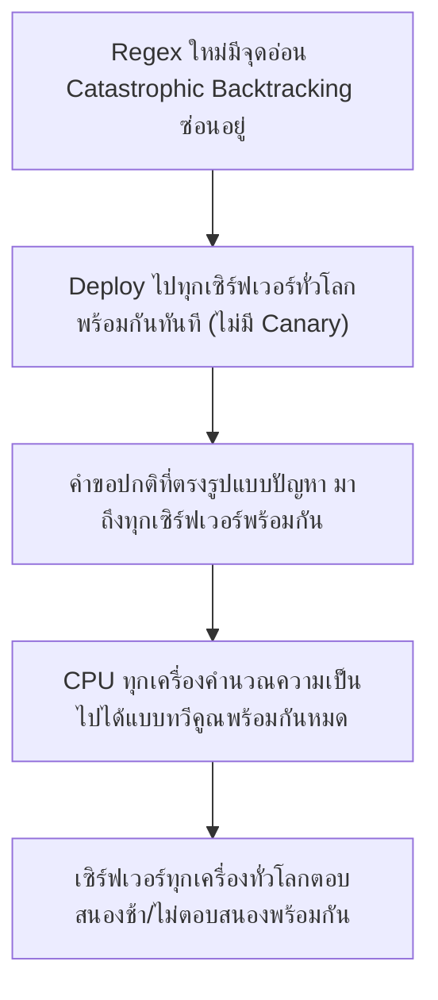
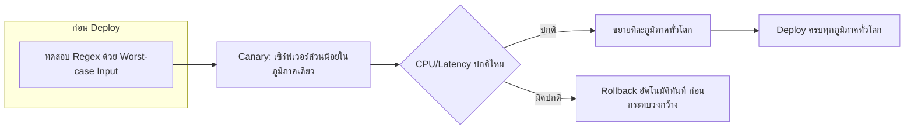

Deployment Strategies (บทก่อนหน้า) สอนไว้ว่า Canary Release ต้องปล่อยเวอร์ชันใหม่ทีละส่วนก่อนเสมอ — เคสนี้คือเรื่องจริงของ <mark class="hl-term">Cloudflare</mark> ที่ deploy กฎป้องกันภัยคุกคาม (WAF rule) หนึ่งบรรทัดไปทั่วโลกพร้อมกันทันที ทำให้ CPU ของเซิร์ฟเวอร์ทุกเครื่องทั่วโลกพุ่งขึ้น 100% พร้อมกัน จนเว็บไซต์จำนวนมหาศาลที่พึ่งพา Cloudflare ล่มพร้อมกันทั่วโลกนานประมาณครึ่งชั่วโมง

## เกิดอะไรขึ้นจริง (2 กรกฎาคม 2019)

Cloudflare เป็นบริการที่เว็บไซต์นับล้านแห่งพึ่งพาเป็น CDN และเกราะป้องกันภัยคุกคาม (WAF - Web Application Firewall) ทีมงานเตรียม deploy กฎ WAF ใหม่เพื่อป้องกัน XSS (Cross-Site Scripting) แบบหนึ่งที่เพิ่งค้นพบ

```demo
component: StepThroughDiagram
props: {"steps":[{"label":"1. ทีมเขียนกฎ WAF ใหม่ด้วย Regular Expression (Regex) เพื่อดักจับรูปแบบการโจมตี XSS","detail":"Regex ตัวนี้เขียนมาเพื่อดักจับ pattern อันตรายในข้อความที่ผู้ใช้ส่งเข้ามา เป็นงานปกติของทีม WAF"},{"label":"2. Regex มีจุดอ่อนที่เรียกว่า Catastrophic Backtracking ซ่อนอยู่โดยไม่มีใครรู้ตัว","detail":"Regex บางรูปแบบ (โดยเฉพาะที่มีกลุ่มซ้อนกันหลายชั้นพร้อม wildcard) สามารถทำให้ CPU ต้องคำนวณความเป็นไปได้จำนวนมหาศาลแบบทวีคูณ (exponential) เมื่อเจอข้อความบางรูปแบบ แม้ข้อความนั้นจะสั้นก็ตาม"},{"label":"3. กฎใหม่ถูก deploy ไปยังเซิร์ฟเวอร์ทุกเครื่องทั่วโลกพร้อมกันทันที ไม่มีการปล่อยแบบ Canary ก่อน","detail":"เพราะกฎ WAF ถือเป็น config เพื่อความปลอดภัยที่ทีมงานต้องการให้มีผลป้องกันทันทีทั่วโลก จึงข้ามขั้นตอน staged rollout ที่ปกติใช้กับการ deploy โค้ดทั่วไป"},{"label":"4. คำขอ (request) ปกติที่มีรูปแบบข้อความบางอย่างไปกระตุ้น Catastrophic Backtracking พร้อมกันทุกเครื่อง","detail":"เพราะกฎถูก deploy ทุกเครื่องพร้อมกัน คำขอปกติจากทั่วโลกที่บังเอิญตรงกับรูปแบบที่มีปัญหา จึงไปกระตุ้นปัญหาเดียวกันในทุกเซิร์ฟเวอร์ในเวลาไล่เลี่ยกัน"},{"label":"5. CPU ของเซิร์ฟเวอร์ทุกเครื่องทั่วโลกพุ่งขึ้น 100% พร้อมกันภายในไม่กี่นาที","detail":"เซิร์ฟเวอร์ที่ CPU เต็มไม่สามารถประมวลผลคำขออื่นได้ต่อ ทำให้เว็บไซต์นับล้านแห่งที่พึ่งพา Cloudflare ตอบสนองช้าหรือไม่ตอบสนองเลยพร้อมกันทั่วโลก"},{"label":"6. ทีมงานต้อง Rollback กฎ WAF ตัวนี้ทั่วโลกเพื่อหยุดปัญหา ใช้เวลาประมาณ 27 นาที","detail":"เมื่อ rollback สำเร็จ CPU กลับสู่ระดับปกติทันที ยืนยันว่าต้นตอคือกฎ WAF ตัวนั้นจริง"}]}
```

<mark class="hl-warning">ต้นตอไม่ใช่แค่ "regex เขียนพลาด" (ซึ่งเป็นเรื่องที่เกิดขึ้นได้กับทุกทีม) แต่คือการ deploy การเปลี่ยนแปลงไปทั่วโลกพร้อมกันทันทีโดยไม่ผ่านขั้นตอน staged rollout ที่ควรใช้กับการเปลี่ยนแปลงทุกประเภท แม้จะเป็น config ด้านความปลอดภัยที่ดูเหมือน "ต้องมีผลทันที" ก็ตาม</mark>

## ทำไม Regex ตัวเดียวถึงทำให้ CPU พุ่งได้ทั้งโลกพร้อมกัน



<mark class="hl-insight">นี่คือตัวอย่างจริงที่ชี้ให้เห็นว่า Canary Release ไม่ได้มีไว้ป้องกันแค่ "bug ในโค้ด" เท่านั้น แต่ป้องกัน**การเปลี่ยนแปลงค่า config ทุกประเภท**ที่มีผลกับพฤติกรรมระบบ รวมถึงกฎความปลอดภัย, feature flag, หรือแม้แต่ค่าตัวเลขปรับแต่งเล็กๆ น้อยๆ — ถ้าปล่อยให้เซิร์ฟเวอร์ส่วนน้อยรับ traffic จริงก่อน ทีมงานจะเห็น CPU พุ่งผิดปกติที่เซิร์ฟเวอร์กลุ่มเล็กนั้นก่อน แล้วหยุด rollout ได้ก่อนที่จะกระทบทั่วโลก</mark>

## ถ้าออกแบบ Deployment Pipeline นี้ให้ปลอดภัยกว่าเดิม

```demo
component: JourneyDiagram
props: {"nodes":[{"icon":"gear","label":"Regex Testing (จำลอง Worst-case Input)"},{"icon":"building","label":"Canary: เซิร์ฟเวอร์ส่วนน้อย"},{"icon":"gauge","label":"เฝ้าดู CPU/Latency"},{"icon":"building","label":"เซิร์ฟเวอร์ที่เหลือทั่วโลก"}],"travelerIcon":"package","steps":[{"activeNode":0,"caption":"ก่อน deploy ทดสอบ regex ด้วย input ที่จงใจออกแบบมาให้แย่ที่สุด (worst-case) เพื่อวัดว่ามันใช้เวลาคำนวณนานผิดปกติไหม"},{"activeNode":1,"caption":"ปล่อยกฎใหม่ให้เซิร์ฟเวอร์ส่วนน้อยก่อนเสมอ แม้จะเป็น config ด้านความปลอดภัยที่รู้สึกว่าต้อง 'มีผลทันทีทั่วโลก' ก็ตาม"},{"activeNode":2,"caption":"เฝ้าดู metric CPU/latency ของกลุ่ม canary อย่างใกล้ชิดในช่วงเวลาสั้นๆ ก่อนตัดสินใจขยาย"},{"activeNode":3,"caption":"ถ้า metric ปกติ ค่อยขยายไปเซิร์ฟเวอร์ที่เหลือทั่วโลกทีละภูมิภาค ไม่ปล่อยทีเดียวหมดทุกที่พร้อมกัน"}]}
```

## Architecture รวม



## Trade-off ที่ควรพูดถึง

- **Config ด้านความปลอดภัยอยากมีผลทันที แต่ Canary ทำให้ช้าลง** — กฎป้องกันภัยคุกคามใหม่ยิ่งมีผลช้า ยิ่งเปิดช่องให้ผู้โจมตีใช้ช่องโหว่นั้นได้นานขึ้น ต้องหาจุดสมดุลระหว่างความเร็วในการป้องกันกับความปลอดภัยของการ deploy เอง
- **ทดสอบ Worst-case Input ของ Regex ทำได้ยากในทางปฏิบัติ** — การหา input ที่แย่ที่สุดสำหรับ regex ที่ซับซ้อนต้องใช้เครื่องมือเฉพาะทาง (regex complexity analyzer) ไม่ใช่แค่ทดสอบด้วย input ทั่วไปที่คิดขึ้นเอง
- **Rollback ทั่วโลกเร็ว แต่ต้องมีระบบที่ทำได้จริงในไม่กี่นาที** — Cloudflare กู้คืนได้ใน 27 นาทีเพราะมีระบบ rollback ที่ทำได้เร็ว ถ้าไม่มีการเตรียมระบบ rollback ที่รวดเร็วไว้ล่วงหน้า ความเสียหายจะยาวนานกว่านี้มาก

## คำถามเจาะลึกที่มักถูกถามต่อ

**ถาม: Catastrophic Backtracking คืออะไร ทำไมข้อความสั้นๆ ถึงทำให้ CPU พุ่งได้**

Regex บางรูปแบบ (โดยเฉพาะที่มีกลุ่มซ้อนกันหลายชั้นพร้อม wildcard เช่น `(a+)+b`) เมื่อเจอข้อความที่ไม่ตรงกับรูปแบบพอดี regex engine จะพยายามไล่ลองจับคู่ทุกความเป็นไปได้แบบทวีคูณ (exponential) ก่อนจะสรุปว่าไม่ตรง ยิ่งข้อความยาวขึ้นแค่นิดเดียว จำนวนความเป็นไปได้ที่ต้องลองก็เพิ่มขึ้นแบบก้าวกระโดดมหาศาล ทำให้ CPU ต้องทำงานหนักผิดปกติทั้งที่ข้อความนำเข้าอาจสั้นแค่ไม่กี่สิบตัวอักษรเท่านั้น

**ถาม: ทำไม Canary Release ถึงป้องกันปัญหานี้ได้ ทั้งที่ปัญหาคือ regex เขียนผิด ไม่ใช่ deploy ไม่ครบแบบ Knight Capital**

เพราะ Canary ไม่ได้ป้องกันแค่ "deploy ไม่ครบ" แต่ป้องกัน**การเห็นผลกระทบในวงเล็กก่อนขยายวงกว้าง** ไม่ว่าต้นตอของปัญหาจะเป็นอะไร ถ้าปล่อยกฎ WAF ใหม่ให้เซิร์ฟเวอร์ 1% ก่อน ทีมงานจะเห็น CPU ของเซิร์ฟเวอร์กลุ่มนั้นพุ่งผิดปกติภายในไม่กี่วินาที และหยุด rollout ได้ทันทีก่อนที่ 99% ที่เหลือทั่วโลกจะได้รับผลกระทบตามไปด้วย

**ถาม: ทำไมทีมงานถึงข้ามขั้นตอน Canary สำหรับกฎความปลอดภัยนี้โดยเฉพาะ**

เพราะกฎด้านความปลอดภัย (โดยเฉพาะที่ป้องกันการโจมตีที่กำลังถูกใช้จริง) มักถูกมองว่าต้อง "มีผลทันทีทั่วโลก" เพื่อปิดช่องโหว่ให้เร็วที่สุด การรอ canary หลายนาทีอาจถูกมองว่าเสี่ยงกว่าการ deploy ทันที แต่เคสนี้แสดงให้เห็นว่าการข้าม canary มีความเสี่ยงของตัวมันเอง (การ deploy ที่ผิดพลาดกระทบวงกว้างทันที) ซึ่งบางครั้งอันตรายกว่าการรอไม่กี่นาทีเพื่อยืนยันความปลอดภัยก่อน

**ถาม: จะทดสอบก่อน deploy ยังไงให้จับปัญหา Catastrophic Backtracking ได้ก่อนที่จะถึงมือ production**

ใช้เครื่องมือวิเคราะห์ความซับซ้อนของ regex (regex complexity analyzer) ที่ตรวจจับรูปแบบเสี่ยง เช่น กลุ่มซ้อนกันหลายชั้นพร้อม quantifier ที่คลุมเครือ ก่อน deploy จริง หรือทดสอบด้วย input ที่จงใจออกแบบมาให้แย่ที่สุด (fuzzing ด้วย pattern ที่รู้กันว่าเสี่ยงต่อ catastrophic backtracking) วัดเวลาประมวลผลจริงก่อนปล่อยเข้า production เพื่อจับความผิดปกติตั้งแต่ขั้นตอนทดสอบ ไม่ต้องรอให้เจอใน production

**ถาม: ทำไมปัญหานี้ถึงกระทบ "ทั่วโลกพร้อมกัน" ทั้งที่ปกติ CDN ควรกระจายโหลดตามภูมิภาค**

เพราะ Cloudflare deploy กฎ WAF ตัวนี้ไปยังทุกเซิร์ฟเวอร์ในทุกภูมิภาคพร้อมกันในเวลาเดียวกัน (global config push) ไม่ได้ทยอยปล่อยทีละภูมิภาคแบบที่ควรทำกับการเปลี่ยนแปลงที่มีความเสี่ยง เมื่อทุกเซิร์ฟเวอร์ได้รับกฎเดียวกันพร้อมกัน และคำขอปกติจากทั่วโลกที่ตรงกับรูปแบบปัญหาก็มาถึงในเวลาไล่เลี่ยกันตามธรรมชาติของ traffic จริง ผลกระทบจึงเกิดขึ้นพร้อมกันทุกภูมิภาคแทนที่จะจำกัดอยู่แค่ภูมิภาคเดียว

**ถาม: บทเรียนนี้ต่างจากเคส Knight Capital ตรงไหน ทั้งที่ดูเหมือนเป็นเรื่อง deployment เหมือนกัน**

Knight Capital พังเพราะ deploy**ไม่ครบ**ทุกเครื่อง (เครื่องหนึ่งยังมีโค้ดเก่าอันตรายค้างอยู่) ส่วน Cloudflare พังเพราะ deploy**ครบทุกเครื่องพร้อมกันทันที**โดยไม่มีขั้นตอนทยอยปล่อย — สองเคสนี้คือปลายสองด้านของปัญหาเดียวกัน คือการ deploy ที่ไม่มีการตรวจสอบและควบคุมขอบเขตผลกระทบก่อนขยายวงกว้าง ไม่ว่าจะ "ไม่ครบ" หรือ "ครบเร็วเกินไป" ก็อันตรายได้พอกันถ้าไม่มีกระบวนการ verify + canary + monitor ที่ถูกต้อง

> คำถามสัมภาษณ์: "ทำไมการ deploy config เพื่อความปลอดภัย (เช่นกฎ WAF) ถึงยังต้องผ่าน Canary Release ทั้งที่อยากให้มีผลทันทีทั่วโลก" — เพราะการเปลี่ยนแปลงใดๆ ที่กระทบพฤติกรรมระบบ ไม่ว่าจะเป็นโค้ดหรือ config ก็มีความเสี่ยงที่ไม่คาดคิดเสมอ (เช่น regex ที่มี catastrophic backtracking ซ่อนอยู่) การปล่อยให้เซิร์ฟเวอร์ส่วนน้อยรับผลกระทบก่อนทำให้เห็นความผิดปกติ (CPU พุ่ง, latency สูง) ในวงจำกัดและ rollback ได้ทันก่อนที่จะกระทบทั่วโลก ความเร็วในการป้องกันภัยคุกคามที่ได้จาก deploy ทันทีทั่วโลกไม่คุ้มกับความเสี่ยงที่ความผิดพลาดจะกระทบทุกที่พร้อมกันโดยไม่มีทางหยุดได้ทัน
