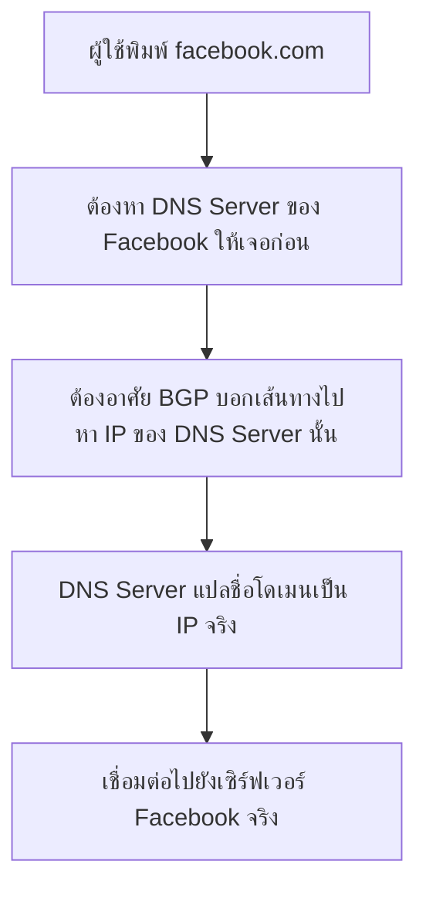
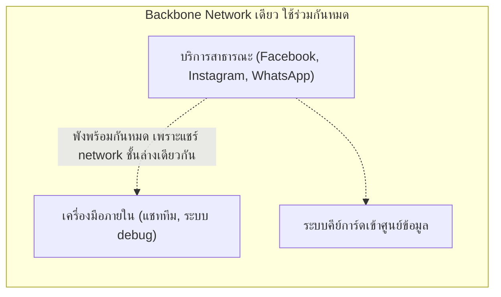
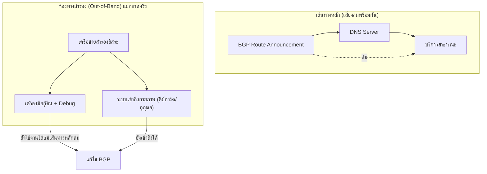

DNS Resolution (บทก่อนหน้าสุดในหลักสูตร) สอนไว้ว่าชื่อโดเมนต้องถูกแปลเป็น IP ก่อนเสมอถึงจะเชื่อมต่อได้ — เคสนี้คือเรื่องจริงของ <mark class="hl-term">Meta (Facebook)</mark> ที่ Facebook, Instagram, WhatsApp หายไปจากอินเทอร์เน็ตพร้อมกันนานเกือบ 6 ชั่วโมง เพราะคำสั่งบำรุงรักษาปกติคำสั่งเดียวไปตัดเส้นทางที่ทำให้คนทั้งโลกหา DNS server ของ Facebook เจอ

## ใช้ความรู้ System Design อะไรมาอธิบายเคสนี้: BGP คือชั้นที่อยู่ใต้ DNS อีกที

ก่อนจะเข้าใจเคสนี้ ต้องรู้ว่า DNS เองก็ต้องมีคนหาทางไปหามันให้เจอก่อน — <mark class="hl-term">BGP (Border Gateway Protocol)</mark> คือโปรโตคอลที่บอกเน็ตเวิร์กทั่วโลกว่า "จะไปหา IP ช่วงนี้ ต้องส่งข้อมูลผ่านเส้นทางไหน" ถ้า BGP ประกาศถอนเส้นทางไปยัง DNS server ของใครออก คนอื่นทั่วโลกก็จะหาทางไปหา DNS server นั้นไม่เจอเลย ทั้งที่ DNS server นั้นเองยังทำงานปกติอยู่ข้างในก็ตาม



<mark class="hl-warning">นี่คือจุดที่คนมักเข้าใจผิด — คิดว่า "เว็บล่ม" แปลว่าเซิร์ฟเวอร์ข้างในพัง แต่เคสนี้เซิร์ฟเวอร์ข้างในทำงานปกติทุกอย่าง ปัญหาอยู่ที่**ชั้นล่างสุด** (BGP) ที่ทำให้ไม่มีใครหาทางไปถึง DNS Server ได้เลย เหมือนบ้านยังอยู่ดี แต่ป้ายบอกทางไปบ้านหายไปจากแผนที่ทั้งหมด</mark>

## เกิดอะไรขึ้นจริง และแก้ปัญหายังไง (4 ตุลาคม 2021)

```demo
component: StepThroughDiagram
props: {"steps":[{"label":"1. ทีมงานรันคำสั่งบำรุงรักษาปกติเพื่อตรวจสอบความจุของ backbone network","detail":"เป็นงานปกติที่ทำเพื่อประเมินว่าโครงข่ายหลักของบริษัทมีความจุพอสำหรับ traffic ในอนาคตแค่ไหน"},{"label":"2. คำสั่งมีผลข้างเคียงที่ไม่ตั้งใจ: ถอนประกาศเส้นทาง BGP ไปยัง DNS Server ของ Facebook ทั้งหมด","detail":"เครื่องมือตรวจสอบที่ควรจะป้องกันคำสั่งอันตรายแบบนี้ มี bug ที่ทำให้ไม่ได้ block คำสั่งนี้ไว้ทัน"},{"label":"3. เน็ตเวิร์กทั่วโลกไม่เห็นเส้นทางไปยัง DNS Server ของ Facebook อีกต่อไป","detail":"เท่ากับ facebook.com, instagram.com, whatsapp.com หายไปจากอินเทอร์เน็ตในสายตาของทุกคนทั่วโลกพร้อมกันทันที"},{"label":"4. เครื่องมือภายในของพนักงานเองก็ใช้งานไม่ได้ด้วย เพราะพึ่งพา backbone network เดียวกัน","detail":"ระบบสื่อสารภายใน (แชท, อีเมล) และเครื่องมือ debug ที่ควรใช้แก้ปัญหา ก็ไม่สามารถเข้าถึงได้เช่นกัน เพราะไม่ได้แยกโครงสร้างพื้นฐานออกจากระบบที่ล่ม"},{"label":"5. ระบบคีย์การ์ดเข้าออกศูนย์ข้อมูล (data center) ก็ใช้งานไม่ได้ ต้องใช้กุญแจกลไกเปิดประตูแทน","detail":"เพราะระบบคีย์การ์ดก็พึ่งพาเน็ตเวิร์กภายในเดียวกัน ทำให้วิศวกรที่ต้องเข้าไปแก้ปัญหาถึงที่ตัวเครื่องจริงล่าช้าไปอีก"},{"label":"6. วิศวกรต้องเข้าถึงเราเตอร์หลักโดยตรงเพื่อประกาศเส้นทาง BGP กลับคืนอย่างระมัดระวัง ใช้เวลารวมเกือบ 6 ชั่วโมง","detail":"ต้องทำอย่างระมัดระวังเพราะการเปิดทุกอย่างกลับมาพร้อมกันทันทีเสี่ยงทำให้ระบบ cache/database ที่ไม่ได้รับ traffic มานานรับโหลดหนักเกินจนพังซ้ำ"}]}
```

## ปัญหาที่ลึกกว่า BGP: ไม่มี Isolation ระหว่างระบบใช้งานจริงกับเครื่องมือกู้คืน



<mark class="hl-insight">หลักการที่เรียนในบท Bulkhead (แยกขอบเขตความเสียหาย) ควรใช้ไม่ใช่แค่กับ subsystem ของ product เดียวกัน แต่ควรใช้กับ**เครื่องมือกู้คืนฉุกเฉินด้วย** — ระบบที่ใช้แก้ปัญหาตอนวิกฤต (internal tools, การเข้าถึงทางกายภาพ) ควรมีเส้นทางสำรองที่ไม่พึ่งพาโครงสร้างพื้นฐานเดียวกับระบบที่กำลังจะพัง ไม่งั้นตอนระบบหลักล่ม เครื่องมือที่ควรใช้ซ่อมก็ล่มตามไปด้วย</mark>

## ถ้าออกแบบระบบนี้ให้ทนทานกว่าเดิม

```demo
component: JourneyDiagram
props: {"nodes":[{"icon":"gear","label":"Backbone Network หลัก"},{"icon":"shield","label":"Out-of-Band Access (ช่องทางสำรอง)"},{"icon":"building","label":"เครื่องมือกู้คืน + คีย์การ์ด"},{"icon":"person","label":"วิศวกรกู้ระบบ"}],"travelerIcon":"key","steps":[{"activeNode":0,"caption":"Backbone Network หลักมีปัญหา (BGP route หาย) — บริการสาธารณะทั้งหมดใช้งานไม่ได้"},{"activeNode":1,"caption":"ถ้ามีช่องทางสำรองที่แยกขาดจาก backbone หลักจริงๆ (out-of-band access ผ่านสายโทรศัพท์/ดาวเทียม/เน็ตเวิร์กแยกต่างหาก) วิศวกรยังเข้าถึงเครื่องมือกู้คืนได้"},{"activeNode":2,"caption":"เครื่องมือ debug และระบบคีย์การ์ดที่แยกจาก backbone หลัก ยังทำงานได้ปกติแม้ backbone หลักจะล่ม"},{"activeNode":3,"caption":"วิศวกรเข้าถึงศูนย์ข้อมูลและแก้ไข BGP ได้เร็วกว่ามาก เพราะไม่ต้องรอเปิดประตูด้วยกุญแจกลไกหรือเสียเวลาหาทางเข้าเครื่องมือ debug"}]}
```

## Architecture รวม



## Trade-off ที่ควรพูดถึง

- **ช่องทางสำรอง (Out-of-Band) มีต้นทุนสูงและใช้น้อยครั้งมาก** — ต้องลงทุนโครงสร้างพื้นฐานที่แยกขาดจริงไว้เผื่อเหตุการณ์ที่นานๆ เกิดที มีค่าใช้จ่ายต่อเนื่องในการดูแลรักษาแม้ปกติจะไม่ได้ใช้เลย
- **การป้องกันคำสั่งบำรุงรักษาเข้มงวดเกินไป ทำให้งานประจำวันช้าลง** — เครื่องมือตรวจสอบก่อนรันคำสั่งที่กระทบ BGP ต้องสมดุลระหว่างความปลอดภัยกับความคล่องตัวของทีมที่ต้องทำงานบำรุงรักษาเป็นประจำ
- **ยิ่งระบบใหญ่และเชื่อมโยงกันลึก ยิ่งหาจุดที่ควรแยก isolation ยากขึ้น** — บริษัทขนาดใหญ่มักมีระบบที่พึ่งพากันซับซ้อนจนบางจุดที่ควรแยกจริงๆ ถูกมองข้ามไป เพราะดูเหมือนไม่เกี่ยวข้องกันในตอนออกแบบครั้งแรก

## คำถามเจาะลึกที่มักถูกถามต่อ

**ถาม: ทำไมคำสั่งบำรุงรักษาปกติครั้งเดียว ถึงทำให้ Facebook หายไปจากอินเทอร์เน็ตทั้งบริษัทพร้อมกัน**

เพราะคำสั่งไปกระทบ BGP ซึ่งเป็นชั้นที่อยู่ใต้ DNS อีกที — DNS Server ของ Facebook เองยังทำงานปกติทุกอย่างข้างใน แต่ไม่มีใครในโลกหาเส้นทางไปหามันเจอ เพราะ BGP ที่บอกเส้นทางถูกถอนออกไป เปรียบเหมือนบ้านยังอยู่ดีแต่ป้ายบอกทางหายไปจากแผนที่ทุกฉบับพร้อมกัน ทำให้ผลกระทบเกิดขึ้นทันทีทั่วโลกโดยไม่ต้องรอ propagate ทีละจุดแบบปัญหาทั่วไป

**ถาม: ทำไมเครื่องมือภายในของพนักงานเองก็พังไปด้วย ทั้งที่ไม่ใช่บริการสาธารณะ**

เพราะเครื่องมือภายใน (แชททีม, ระบบ debug) ถูกออกแบบให้พึ่งพา backbone network เดียวกันกับบริการสาธารณะ ไม่ได้แยก infrastructure ออกจากกันจริงๆ นี่คือความผิดพลาดเชิงสถาปัตยกรรมที่ลึกกว่าตัว BGP เอง — หลักการ Bulkhead ที่เรียนมาสอนให้แยกขอบเขตความเสียหาย แต่กรณีนี้แสดงให้เห็นว่าแม้แต่บริษัทระดับโลกก็พลาดแยก isolation ระหว่าง "ระบบที่ใช้งานจริง" กับ "เครื่องมือที่ใช้กู้คืนตอนวิกฤต" ซึ่งเป็นจุดที่สำคัญที่สุดที่ควรแยกให้ขาดจากกัน

**ถาม: ทำไมระบบคีย์การ์ดเข้าออกศูนย์ข้อมูลถึงพังไปด้วย มันเกี่ยวอะไรกับ network**

เพราะระบบคีย์การ์ดสมัยใหม่ทำงานผ่านการยืนยันตัวตนออนไลน์ (เช็คสิทธิ์ผ่านเซิร์ฟเวอร์กลาง) ไม่ใช่กลไกทางกายภาพล้วนๆ พอ backbone network เดียวกันล่ม ระบบยืนยันตัวตนก็เข้าถึงไม่ได้ตามไปด้วย ทำให้พนักงานที่ต้องเข้าไปแก้ปัญหาถึงตัวเครื่องจริงในศูนย์ข้อมูลล่าช้าไปอีก นี่คือตัวอย่างที่ชัดเจนว่าการพึ่งพาระบบดิจิทัลมากเกินไปโดยไม่มีทางเลือกสำรองทางกายภาพ (เช่นกุญแจกลไก) เป็นความเสี่ยงที่มองข้ามได้ง่าย

**ถาม: การกู้คืนใช้เวลาเกือบ 6 ชั่วโมง ทำไมไม่แค่ประกาศ BGP กลับคืนทันทีที่รู้ปัญหา**

เพราะต้องเข้าถึงเราเตอร์หลักด้วยมือโดยตรง (เนื่องจากเครื่องมือ remote management ก็ใช้งานไม่ได้จากปัญหาเดียวกัน) และต้องทำอย่างระมัดระวัง — การเปิดทุกอย่างกลับมาพร้อมกันทันทีเสี่ยงทำให้ cache, database, และระบบที่ไม่ได้รับ traffic มานานหลายชั่วโมงต้องรับโหลดมหาศาลพร้อมกันทันที (คล้ายปัญหา thundering herd) ซึ่งอาจทำให้ระบบพังซ้ำสองรอบ ต้องค่อยๆ เปิดกลับทีละส่วนแทน

**ถาม: หลักการ "Out-of-Band Access" ที่แนะนำในเคสนี้ ใช้กับระบบขนาดเล็กได้ไหม**

หลักการปรับใช้ได้ตามขนาด ไม่จำเป็นต้องมีเครือข่ายสำรองระดับดาวเทียมแบบบริษัทยักษ์ใหญ่ — ระบบขนาดเล็กอาจแค่มีการเข้าถึงเซิร์ฟเวอร์สำรอง (เช่น SSH ผ่าน mobile hotspot หรือ VPN คนละผู้ให้บริการ) ที่ไม่ได้พึ่งพา network หลักเดียวกันกับ production เพื่อให้ยังกู้คืนได้แม้ network หลักมีปัญหา หลักการสำคัญคือ "อย่าให้เครื่องมือกู้คืนพึ่งพาสิ่งเดียวกับที่กำลังจะพัง" ไม่ว่าระบบจะใหญ่แค่ไหน

**ถาม: เคสนี้ต่างจาก AWS S3 ตรงไหน ทั้งที่ดูเหมือนเป็นเรื่อง "คำสั่งบำรุงรักษาผิดพลาด" เหมือนกัน**

AWS S3 พังเพราะคำสั่งปิดเซิร์ฟเวอร์เกินตั้งใจไปกระทบ subsystem ภายในของตัวเอง (Index/Placement Subsystem) ยังอยู่ใน "ขอบเขตเดียวกัน" ของบริการนั้น ส่วน Meta พังเพราะปัญหาลามไป**ข้ามชั้น**ไปถึงเครื่องมือกู้คืนและระบบเข้าถึงกายภาพที่ควรจะเป็นอิสระจากระบบหลักโดยสิ้นเชิง บทเรียนของ AWS S3 คือ "แยก subsystem ภายในให้ isolate กัน" ส่วนบทเรียนของ Meta คือ "แยกเครื่องมือกู้คืนออกจากระบบที่มันมีหน้าที่กู้คืน" ซึ่งเป็นระดับความล้ำลึกที่มากกว่า

> คำถามสัมภาษณ์: "ถ้าระบบ production ทั้งหมดล่มพร้อมกัน คุณจะออกแบบยังไงให้ยังกู้คืนได้ ไม่ใช่ต้องรอเครื่องมือกู้คืนที่ล่มไปด้วย" — ต้องแยก out-of-band access (ช่องทางเข้าถึงฉุกเฉิน) ออกจากโครงสร้างพื้นฐานหลักอย่างแท้จริง ทั้งเครื่องมือ debug, ระบบสื่อสารทีมตอนวิกฤต, และการเข้าถึงทางกายภาพ (คีย์การ์ด/กุญแจสำรอง) ไม่ให้พึ่งพา network หรือ service เดียวกันกับระบบที่กำลังจะพัง เพราะถ้าเครื่องมือกู้คืนพึ่งพาสิ่งเดียวกับที่มันมีหน้าที่ไปซ่อม ตอนเกิดวิกฤตจริงจะไม่มีทางเข้าไปแก้ไขอะไรได้เลย
