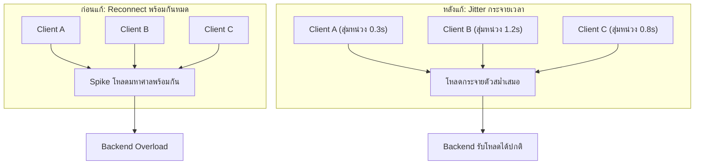

Retry & Backoff (บทก่อนหน้า) สอนไว้ว่าถ้า client ทุกตัวลอง retry พร้อมกันทันทีตอน error จะยิ่งซ้ำเติมปัญหา ต้องมี exponential backoff + jitter — เคสนี้คือเรื่องจริงของ <mark class="hl-term">Slack</mark> ที่ network สะดุดสั้นๆ เพียงไม่กี่นาที แต่ทำให้ผู้ใช้ทั่วโลกใช้งานไม่ได้นานหลายชั่วโมง เพราะทุก client พยายามเชื่อมต่อกลับเข้ามาพร้อมกันในเวลาเดียวกันเป๊ะ

## ใช้ความรู้ System Design อะไรมาอธิบายเคสนี้: Thundering Herd ตอน Reconnect

<mark class="hl-term">Thundering Herd</mark> คือปรากฏการณ์ที่ client จำนวนมากทำสิ่งเดียวกันพร้อมกันในเวลาเดียวเป๊ะ จนสร้างโหลดมหาศาลกระทันหัน ปกติเรียนเรื่องนี้ในบริบท cache miss (หลายคน query database พร้อมกันตอน cache หมดอายุ) แต่เคสนี้เกิดกับ**การเชื่อมต่อใหม่ (reconnect)** แทน


## เกิดอะไรขึ้นจริง และแก้ปัญหายังไง (มกราคม 2021)

```demo
component: StepThroughDiagram
props: {"steps":[{"label":"1. เกิดปัญหา network ระดับโครงสร้างพื้นฐานสั้นๆ ทำให้การเชื่อมต่อของ client จำนวนมากหลุดพร้อมกัน","detail":"ปัญหาต้นตอเองใช้เวลาสั้นมาก ไม่ใช่ปัญหาใหญ่ในตัวมันเอง"},{"label":"2. Client ทุกตัว (WebSocket connection ของแต่ละคนที่เปิด Slack ค้างไว้) พยายามเชื่อมต่อกลับทันทีที่ network กลับมา","detail":"เพราะ client ส่วนใหญ่ไม่มีการหน่วงเวลาแบบสุ่มก่อน reconnect ทำให้ทุกคนยิงคำขอ reconnect เข้ามาในช่วงเวลาสั้นๆ เดียวกันเกือบทั้งหมด"},{"label":"3. ปริมาณคำขอเชื่อมต่อใหม่พุ่งสูงกว่าปกติมากในเวลาไม่กี่วินาที","detail":"ระบบ backend ที่ปกติรองรับการเชื่อมต่อใหม่แบบกระจายตัวตามธรรมชาติ (คนทยอยเปิดแอปทีละคน) ไม่เคยถูกออกแบบมาให้รับทุกคนพร้อมกันในเวลาเดียว"},{"label":"4. ระบบ Autoscaling ปรับเพิ่มความจุตามไม่ทัน","detail":"กลไกปรับขนาดอัตโนมัติอาศัยเวลาในการตรวจจับโหลดที่เพิ่มขึ้นและเวลาในการ provision เครื่องใหม่ ซึ่งช้ากว่าความเร็วที่โหลดพุ่งขึ้นมาก"},{"label":"5. Backend ที่รับโหลดเกินเริ่มตอบสนองช้าลง กระทบต่อเนื่องไปยัง service อื่นที่ต้องรอผลจาก backend นี้","detail":"ผู้ใช้เห็นข้อความล่ม แม้จะพยายามโหลดหน้าเว็บใหม่ ก็ยิ่งเป็นการเพิ่ม request เข้าไปในระบบที่กำลังโอเวอร์โหลดอยู่แล้ว"},{"label":"6. ทีมงานต้อง scale ความจุด้วยมือเร่งด่วน และรอให้ traffic การ reconnect กระจายตัวออกตามธรรมชาติ กว่าจะกลับสู่ปกติใช้เวลาหลายชั่วโมง","detail":"หลังเหตุการณ์ ทีมงานปรับปรุงกลไก reconnect ของ client ให้มีการหน่วงเวลาแบบสุ่มก่อนลองเชื่อมต่อใหม่ และปรับ autoscaling ให้ตอบสนองเร็วขึ้น"}]}
```

<mark class="hl-warning">ต้นตอไม่ใช่แค่ "network สะดุด" (ซึ่งเกิดขึ้นได้เสมอและมักหายเองในไม่กี่วินาที) แต่คือพฤติกรรมของ client ที่ reconnect พร้อมกันหมดโดยไม่มีการกระจายเวลาแบบสุ่ม ทำให้ผลกระทบขยายจาก "network สะดุดไม่กี่วินาที" เป็น "ระบบล่มหลายชั่วโมง"</mark>

## ทางแก้: Exponential Backoff + Jitter สำหรับการ Reconnect

```demo
component: JourneyDiagram
props: {"nodes":[{"icon":"person","label":"Client แต่ละตัว"},{"icon":"gate","label":"ตัวสุ่มหน่วงเวลา (Jitter)"},{"icon":"building","label":"Backend Server"}],"travelerIcon":"envelope","steps":[{"activeNode":0,"caption":"Network กลับมาปกติ Client ทุกตัวพร้อมจะ reconnect ในเวลาเดียวกัน"},{"activeNode":1,"caption":"แทนที่จะ reconnect ทันที แต่ละ client สุ่มหน่วงเวลาไม่เท่ากัน (jitter) ก่อนลองเชื่อมต่อจริง"},{"activeNode":2,"caption":"คำขอ reconnect กระจายตัวออกตามช่วงเวลาที่สุ่มได้ แทนที่จะกระจุกพร้อมกันหมด ทำให้ backend รับโหลดได้ทันโดยไม่ต้อง scale ฉุกเฉิน"}]}
```

<mark class="hl-insight">หลักการ Exponential Backoff + Jitter ที่เรียนไปสำหรับการ retry คำขอที่ล้มเหลว ใช้หลักการเดียวกันได้กับการ**reconnect ของ connection ที่หลุด** — แทนที่ทุก client จะทำสิ่งเดียวกันในเวลาเดียวกันเป๊ะ การสุ่มหน่วงเวลาเล็กน้อยทำให้ traffic ที่ควรจะกระจุกเป็นยอดแหลมสูง (spike) ถูกกระจายให้แบนราบลงตามธรรมชาติ โดยที่ผู้ใช้แทบไม่รู้สึกถึงความหน่วงที่เพิ่มขึ้นเลย เพราะเป็นแค่เสี้ยววินาที</mark>

## Architecture รวม



## Trade-off ที่ควรพูดถึง

- **Jitter เพิ่ม latency เล็กน้อยให้ผู้ใช้แต่ละคน** — ผู้ใช้บางคนอาจต้องรอนานขึ้นเสี้ยววินาทีก่อน reconnect สำเร็จ แลกกับการที่ระบบโดยรวมไม่ล่ม เป็น trade-off ที่คุ้มค่าเกือบทุกกรณี
- **Autoscaling ที่ตอบสนองเร็วมีต้นทุนสูงกว่า** — การปรับ autoscaling ให้ตรวจจับและเพิ่มความจุเร็วขึ้นมักต้องแลกกับการ scale เกินจำเป็นบ่อยขึ้น (over-provision) ในช่วงเวลาปกติที่โหลดแค่ผันผวนเล็กน้อย ไม่ใช่ thundering herd จริง
- **ปัญหานี้ป้องกันได้ล่วงหน้ายากกว่าที่คิด** — เพราะดูเผินๆ เหมือนระบบทำงานถูกต้องทุกจุด (client reconnect ตามที่ควรทำ, backend รับ request ตามปกติ) ปัญหาเกิดจาก**การรวมตัวของพฤติกรรมที่ถูกต้องของแต่ละส่วน** ไม่ใช่ bug ที่จุดใดจุดหนึ่งชัดเจน

## คำถามเจาะลึกที่มักถูกถามต่อ

**ถาม: ทำไม network สะดุดแค่ไม่กี่นาที ถึงทำให้ Slack ใช้งานไม่ได้นานหลายชั่วโมง**

เพราะปัญหาไม่ได้อยู่ที่ network สะดุดเอง (ซึ่งจบไปเร็ว) แต่อยู่ที่ผลกระทบต่อเนื่อง — พอ client ทุกตัวหลุดพร้อมกันแล้วพยายาม reconnect พร้อมกันอีกครั้ง สร้างโหลดมหาศาลกระทันหันที่ backend ไม่เคยถูกออกแบบมาให้รับได้ในเวลาสั้นขนาดนั้น ระบบเลยเข้าสู่สภาวะ overload ต่อเนื่อง กว่าจะ scale ความจุทันและ traffic กระจายตัวเองตามธรรมชาติก็กินเวลาหลายชั่วโมง

**ถาม: Thundering Herd ในเคสนี้ต่างจาก Thundering Herd แบบ Cache Miss ที่เรียนในบท Caching ยังไง**

หลักการเดียวกันเป๊ะคือ "หลายคนทำสิ่งเดียวกันพร้อมกันจนโหลดพุ่ง" แต่ต้นเหตุต่างกัน — cache miss thundering herd เกิดจากข้อมูลหมดอายุพร้อมกันแล้วทุก request วิ่งไป database พร้อมกัน ส่วนเคสนี้เกิดจาก connection หลุดพร้อมกันแล้วทุก client พยายามเชื่อมต่อใหม่พร้อมกัน ทางแก้ก็คล้ายกันในหลักการ (กระจายเวลาด้วยการสุ่ม) แต่ implement คนละจุด — cache ใช้ lease/lock ป้องกันหลาย request คำนวณซ้ำ ส่วน reconnect ใช้ jitter หน่วงเวลาก่อนลองใหม่

**ถาม: ทำไม Autoscaling ถึงตามไม่ทันสถานการณ์นี้ ทั้งที่ระบบ autoscaling ควรจะช่วยเรื่องนี้โดยตรง**

เพราะ autoscaling ทั่วไปต้องใช้เวลาสองส่วน: เวลาตรวจจับว่าโหลดเพิ่มขึ้นจริง (ต้องรอ metric สะสมข้อมูลสักพัก ไม่ใช่ตรวจจับได้ทันทีในเสี้ยววินาที) และเวลา provision เครื่องใหม่ให้พร้อมใช้งานจริง (boot, warm-up, join cluster) ทั้งสองขั้นตอนนี้รวมกันมักใช้เวลาระดับนาที ในขณะที่ thundering herd พุ่งขึ้นภายในไม่กี่วินาที ทำให้ autoscaling ตามไม่ทันความเร็วของปัญหาเสมอ ต้องแก้ที่ต้นตอ (ลด spike ด้วย jitter) มากกว่าจะหวังพึ่ง autoscaling อย่างเดียว

**ถาม: ทำไมผู้ใช้กด refresh หน้าเว็บซ้ำๆ ตอนระบบล่ม ถึงยิ่งทำให้สถานการณ์แย่ลง**

เพราะการ refresh คือการยิง request ใหม่เข้าไปในระบบที่กำลัง overload อยู่แล้ว ยิ่งเพิ่มโหลดซ้ำเข้าไปอีก แทนที่จะช่วยให้เร็วขึ้นกลับทำให้ backend ฟื้นตัวช้าลง เพราะต้องแบ่ง capacity มารับ request ใหม่ที่ซ้ำซ้อนแทนที่จะโฟกัสจัดการ queue ที่ค้างอยู่ นี่คือเหตุผลที่ client ที่ดีควรมี backoff ในตัว ไม่ใช่ยิง retry รัวๆ ตามความต้องการของผู้ใช้ทันที

**ถาม: ถ้าเป็นระบบขนาดเล็กที่ไม่มี client จำนวนมหาศาลเท่า Slack จำเป็นต้องกังวลเรื่อง Jitter ตอน Reconnect ไหม**

ยังคุ้มที่จะทำเป็นนิสัยแม้ระบบเล็ก เพราะต้นทุนของการเพิ่ม jitter ต่ำมาก (แค่สุ่มตัวเลขหน่วงเวลาเล็กน้อยก่อน retry) แต่ป้องกันปัญหาที่อาจไม่เจอตอนทดสอบ (เพราะทดสอบมักไม่ได้จำลอง client จำนวนมากหลุดพร้อมกันจริง) แต่จะเจอทันทีที่ระบบมีผู้ใช้เพิ่มขึ้นถึงระดับหนึ่งและเกิด network blip ขึ้นจริงในโลกจริง

**ถาม: บทเรียนนี้บอกอะไรเกี่ยวกับการทดสอบระบบก่อน production**

บอกว่าการทดสอบด้วย load ปกติ (คนทยอยเข้าใช้งานทีละคนตามธรรมชาติ) ไม่พอที่จะจับปัญหาแบบนี้ได้ ต้องทดสอบสถานการณ์ "ทุกคนทำสิ่งเดียวกันพร้อมกันในเวลาเดียว" โดยเฉพาะ (เช่นจำลองว่า client ทั้งหมดหลุดการเชื่อมต่อพร้อมกันแล้ว reconnect พร้อมกัน) ซึ่งเป็นสถานการณ์ที่หลักการ Chaos Engineering สอนไว้ — ทดลองจำลองความล้มเหลวแบบควบคุมได้ก่อนที่จะเจอสถานการณ์จริงที่ควบคุมไม่ได้

> คำถามสัมภาษณ์: "ระบบที่มี client เชื่อมต่อค้างไว้จำนวนมาก (WebSocket, persistent connection) ควรออกแบบการ reconnect ยังไงให้ไม่เกิด thundering herd ตอน network สะดุด" — ต้องใช้ exponential backoff พร้อม jitter (สุ่มหน่วงเวลาก่อนลองเชื่อมต่อใหม่) แทนที่จะให้ทุก client reconnect ทันทีพร้อมกัน เพื่อกระจาย traffic ที่ควรจะกระจุกเป็นยอดแหลมสูงให้แบนราบลงตามธรรมชาติ เพราะ autoscaling ตอบสนองไม่ทันความเร็วที่ thundering herd พุ่งขึ้นเสมอ ต้องแก้ที่พฤติกรรมของ client เป็นด่านแรก ไม่ใช่หวังพึ่งความจุสำรองของ backend อย่างเดียว
