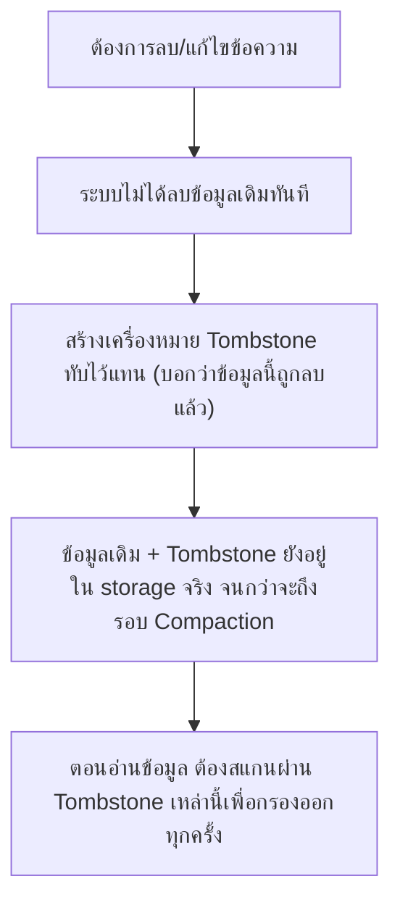
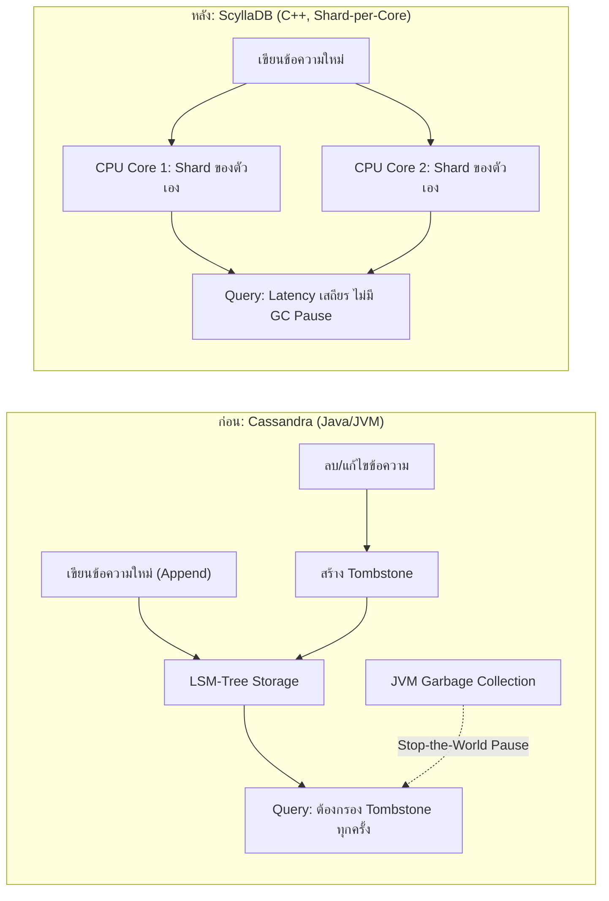

SQL vs NoSQL (บทก่อนหน้า) สอนไว้ว่า NoSQL แบบ wide-column store เขียนข้อมูลเร็วมากเพราะเป็น append-only แต่ไม่ได้บอกว่า "การลบข้อมูล" ใน storage แบบนี้ทำงานต่างจากที่คิดสิ้นเชิง — เคสนี้คือเรื่องจริงของ <mark class="hl-term">Discord</mark> ที่ต้องย้ายฐานข้อมูลทั้งระบบออกจาก Cassandra หลังเก็บข้อความสะสมถึงระดับล้านล้านข้อความ เพราะการลบ/แก้ไขข้อความสร้างปัญหาที่ซ่อนอยู่มานานโดยไม่มีใครสังเกต

## ใช้ความรู้ System Design อะไรมาอธิบายเคสนี้: LSM-Tree กับ Tombstone

Cassandra (และ NoSQL แบบ wide-column store อื่นๆ) ใช้โครงสร้างเก็บข้อมูลชื่อ <mark class="hl-term">LSM-Tree (Log-Structured Merge-Tree)</mark> หัวใจคือ**เขียนข้อมูลใหม่เสมอโดยไม่แก้ข้อมูลเดิม** (append-only) ทำให้เขียนเร็วมาก แต่การ "ลบ" ข้อมูลในระบบแบบนี้ทำไม่ได้ตรงๆ



<mark class="hl-warning">นี่คือกลไกที่ต่างจาก database แบบ SQL ทั่วไปที่เรียนมา — SQL แบบ B-Tree ลบแถวข้อมูลออกจริงๆ ทันที แต่ NoSQL แบบ LSM-Tree "ลบ" ด้วยการทับด้วย tombstone แล้วรอ**Compaction** (กระบวนการรวมและทำความสะอาดไฟล์ข้อมูลเป็นระยะ) มาเก็บกวาดทีหลัง ถ้ามีการลบ/แก้ไขข้อมูลบ่อยมากในช่วงเวลาสั้น tombstone จะสะสมเร็วกว่าที่ compaction จะตามทัน</mark>

## เกิดอะไรขึ้นจริง และแก้ปัญหายังไง

```demo
component: StepThroughDiagram
props: {"steps":[{"label":"1. Discord ใช้ Cassandra เก็บข้อความ แบ่ง shard ตาม channel ตั้งแต่เริ่มต้น","detail":"เลือก Cassandra เพราะเขียนเร็วมาก เหมาะกับปริมาณข้อความมหาศาลที่เพิ่มขึ้นตลอดเวลา และ scale out ได้ง่ายด้วยการเพิ่มเครื่อง"},{"label":"2. ข้อมูลสะสมถึงระดับล้านล้านข้อความ พร้อมกับการแก้ไข/ลบข้อความที่เกิดขึ้นต่อเนื่องทุกวัน","detail":"ผู้ใช้แก้ไขข้อความ, ลบข้อความ, หรือ Discord เองลบข้อความตามนโยบาย (เช่น ephemeral message) ทุกการกระทำเหล่านี้สร้าง tombstone ใหม่ในระบบ"},{"label":"3. Channel ที่มีกิจกรรมสูงมาก (server ใหญ่ที่มีข้อความไหลเร็ว) เริ่มมี tombstone สะสมเร็วกว่า compaction จะตามทัน","detail":"เพราะ channel เหล่านี้ active ตลอดเวลา ไม่มีช่วงเวลาว่างพอให้ compaction ทำงานตามทัน tombstone ที่สะสมไว้"},{"label":"4. การ query ข้อความในช่วงเวลาหนึ่ง (เช่น เลื่อนดูข้อความเก่า) เริ่มช้าลงผิดปกติในบาง channel","detail":"เพราะ Cassandra ต้องสแกนผ่าน tombstone จำนวนมากในระหว่างทางเพื่อกรองออกก่อนจะได้ข้อมูลจริงที่ต้องการ ยิ่ง tombstone สะสมมาก ยิ่งสแกนนาน"},{"label":"5. ปัญหาซ้ำเติมด้วย Garbage Collection Pause ของ JVM ที่ Cassandra รันอยู่บน","detail":"Cassandra เขียนด้วยภาษา Java รันบน JVM ที่มี garbage collector คอยเก็บกวาด memory เป็นระยะ ตอน GC ทำงาน (โดยเฉพาะ major GC) เซิร์ฟเวอร์อาจหยุดตอบสนองชั่วขณะ (GC pause) ยิ่งข้อมูลเยอะและซับซ้อน ยิ่ง GC pause นานและถี่ขึ้น"},{"label":"6. ทีมวิศวกร Discord ตัดสินใจย้ายไป ScyllaDB ซึ่งใช้ API เดียวกับ Cassandra แต่เขียนด้วย C++ ไม่มี GC","detail":"ScyllaDB ออกแบบสถาปัตยกรรมแบบ shard-per-core (แต่ละ CPU core ดูแลข้อมูลส่วนของตัวเองอย่างอิสระ ไม่ต้องแย่ง lock กัน) ทำให้ latency เสถียรและคาดเดาได้มากกว่า ไม่มี GC pause มากวนใจ"}]}
```

## ทำไมภาษาที่เขียน Database ถึงส่งผลต่อ Latency โดยตรง

```demo
component: JourneyDiagram
props: {"nodes":[{"icon":"gear","label":"Cassandra (Java/JVM)"},{"icon":"database","label":"Memory Heap"},{"icon":"gear","label":"ScyllaDB (C++)"}],"travelerIcon":"gear","steps":[{"activeNode":0,"caption":"Cassandra สะสม object ใน memory heap ของ JVM ระหว่างทำงานตามปกติ"},{"activeNode":1,"caption":"เมื่อ heap เต็มถึงจุดหนึ่ง JVM ต้องหยุดทุกอย่างชั่วขณะเพื่อทำ Garbage Collection เก็บกวาด memory ที่ไม่ใช้แล้ว (Stop-the-World pause) ยิ่ง heap ใหญ่ ยิ่งหยุดนาน"},{"activeNode":2,"caption":"ScyllaDB เขียนด้วย C++ จัดการ memory เองโดยตรงไม่ต้องพึ่ง garbage collector จึงไม่มี stop-the-world pause แบบนี้เกิดขึ้นเลย ทำให้ latency เสถียรและคาดเดาได้มากกว่ามาก"}]}
```

<mark class="hl-insight">นี่คือบทเรียนที่ลึกกว่าระดับ "เลือก database ตัวไหน" — แม้ database สองตัวจะทำหน้าที่เดียวกัน (wide-column store, API เข้ากันได้) แต่**ภาษาและ runtime ที่ใช้เขียนตัว database เอง**ก็ส่งผลต่อพฤติกรรมของระบบโดยตรง โดยเฉพาะที่ scale ระดับล้านล้านแถวขึ้นไป ที่แม้แต่ garbage collector ที่ออกแบบมาดีก็เริ่มแสดงผลกระทบที่มองเห็นได้ชัดเจน</mark>

## Architecture รวม



## Trade-off ที่ควรพูดถึง

- **ย้าย Database ทั้งระบบมีต้นทุนมหาศาล** — ต้องย้ายข้อมูลระดับล้านล้านแถวโดยไม่ให้บริการหยุดชะงัก ทดสอบความถูกต้องของข้อมูลอย่างละเอียด และดูแลระบบทั้งสองแบบคู่ขนานกันชั่วคราวระหว่างการย้าย
- **API เข้ากันได้ ไม่ได้แปลว่า Performance Profile เหมือนกัน** — แม้ ScyllaDB จะออกแบบให้ใช้ API แบบเดียวกับ Cassandra (ลด effort ในการย้ายโค้ด) แต่พฤติกรรมภายใน (latency, memory usage) ยังต่างกันมาก ต้องทดสอบ workload จริงก่อนมั่นใจว่าจะได้ผลลัพธ์ตามคาด
- **ภาษาไม่มี Garbage Collector ต้องจัดการ Memory เองอย่างระมัดระวัง** — C++ ไม่มี GC ช่วยป้องกัน memory leak เหมือน Java ทีมพัฒนาต้องมีวินัยและเครื่องมือตรวจสอบ memory safety เข้มงวดกว่า แลกกับ latency ที่คาดเดาได้ดีกว่า

## คำถามเจาะลึกที่มักถูกถามต่อ

**ถาม: ทำไมการ "ลบ" ข้อมูลใน Cassandra ถึงไม่ใช่การลบจริงๆ ทันที**

เพราะ Cassandra ใช้โครงสร้าง LSM-Tree ที่ออกแบบมาให้เขียนข้อมูลแบบ append-only เพื่อความเร็วสูงสุด (ไม่ต้องหาตำแหน่งเดิมมาแก้ไข แค่เขียนต่อท้ายเสมอ) การจะ "แก้ไขหรือลบ" ข้อมูลเดิมโดยตรงจะขัดกับหลักการนี้ จึงใช้วิธีเขียน tombstone (เครื่องหมายบอกว่า "แถวนี้ถูกลบแล้ว") ทับเข้าไปแทน ข้อมูลจริงและ tombstone จะถูกเก็บกวาดทิ้งจริงตอนกระบวนการ compaction ทำงานทีหลัง

**ถาม: ทำไม Tombstone ถึงทำให้ query ช้าลง ทั้งที่มันควรจะแค่ "บอกว่าข้อมูลถูกลบ" เฉยๆ**

เพราะเวลา query ข้อมูล ระบบต้องอ่านผ่านทุกอย่างที่อยู่ในเส้นทางนั้น รวมถึง tombstone ด้วย เพื่อรู้ว่าแถวไหนถูกลบไปแล้วบ้างจะได้ไม่เอามาแสดงผล ยิ่ง tombstone สะสมเยอะ ยิ่งต้องอ่านและกรองข้อมูลที่ไม่มีประโยชน์มากขึ้นก่อนจะถึงข้อมูลจริงที่ต้องการ เหมือนต้องเปิดดูซองจดหมายเปล่าหลายซองก่อนจะเจอซองที่มีจดหมายจริงอยู่ข้างใน

**ถาม: Garbage Collection Pause คืออะไร ทำไมถึงเป็นปัญหาสำหรับ database ที่ scale ใหญ่**

ภาษาที่มี garbage collector (เช่น Java ที่ Cassandra ใช้) จะจัดการหน่วยความจำให้อัตโนมัติ แต่เป็นระยะๆ ต้องหยุดการทำงานทุกอย่างชั่วขณะ (stop-the-world pause) เพื่อไล่เก็บกวาด memory ที่ไม่ได้ใช้แล้ว ยิ่งข้อมูลใน memory เยอะ (เช่น database ที่มีข้อมูลสะสมระดับล้านล้านแถว) ยิ่งใช้เวลา pause นานและถี่ขึ้น ทำให้ latency ของ query ไม่คงที่ บาง request เร็วปกติ บาง request ช้าผิดปกติเพราะดันมาชนจังหวะ GC pause พอดี

**ถาม: ทำไมไม่แค่ tune ค่า config ของ Cassandra ให้ compaction ทำงานถี่ขึ้น แทนที่จะย้าย database ทั้งระบบ**

การ tune compaction ให้ถี่ขึ้นช่วยได้ระดับหนึ่ง แต่มีข้อจำกัด — compaction เองก็ใช้ CPU/disk I/O มาก ยิ่งทำถี่ยิ่งแย่งทรัพยากรจาก query ปกติ กลายเป็นแก้ปัญหาหนึ่งแต่สร้างปัญหาใหม่แทน ที่ scale ระดับล้านล้านแถวของ Discord ปัญหา GC pause จากตัว JVM เองก็ยังคงอยู่ไม่ว่าจะ tune compaction ยังไง เพราะเป็นข้อจำกัดของภาษาและ runtime ไม่ใช่แค่ config การย้ายไป database ที่ไม่มี GC เลยเป็นทางแก้ที่ตรงจุดกว่าในระยะยาว

**ถาม: บทเรียนนี้บอกอะไรเกี่ยวกับการเลือก Database ตั้งแต่แรกเริ่มออกแบบระบบ**

บอกว่าการเลือก SQL vs NoSQL ไม่ใช่การตัดสินใจครั้งเดียวจบตลอดไป ต้องทบทวนตามที่ scale และลักษณะ workload เปลี่ยนไป — ตอนเริ่มต้น Discord เลือก Cassandra ถูกต้องเพราะตอนนั้นเน้นเขียนเร็วเป็นหลัก แต่พอ workload เปลี่ยนไปมีการแก้ไข/ลบข้อความมากขึ้นตามการใช้งานจริง (ephemeral message, edit message) ลักษณะการใช้งานก็เปลี่ยนจาก "append-heavy" เป็น "delete-heavy" มากขึ้น ซึ่งเป็นจุดอ่อนของ LSM-Tree ที่ไม่มีใครเห็นชัดตอนออกแบบครั้งแรก

**ถาม: ระบบขนาดเล็กที่ไม่มีข้อมูลระดับล้านล้านแถว ต้องกังวลเรื่อง Tombstone/GC Pause นี้ไหม**

ไม่จำเป็นต้องกังวลจนกว่าจะถึงระดับที่มีผลกระทบจริง (ข้อมูลระดับล้านๆ แถวและ delete/update ถี่มาก) แต่ควรรู้จักไว้เป็นความรู้ติดตัวว่า "ถ้าเลือก LSM-Tree-based NoSQL แล้วมี delete/update บ่อยผิดปกติ ต้องเฝ้าดู tombstone accumulation" เป็นตัวอย่างที่ดีของหลักการทั่วไปคือ ทุกเทคโนโลยีมีจุดอ่อนที่ปรากฏเฉพาะที่ scale ใดระดับหนึ่ง การรู้ล่วงหน้าว่าจุดอ่อนคืออะไรช่วยให้ตัดสินใจได้ทันก่อนที่ปัญหาจะลุกลามเหมือนที่ Discord เจอ

> คำถามสัมภาษณ์: "ถ้าเลือกใช้ NoSQL แบบ wide-column store (เช่น Cassandra) ที่ scale ใหญ่มาก แล้วเจอปัญหา latency ไม่คงที่ จะวินิจฉัยและแก้ปัญหายังไง" — ต้องตรวจสอบสองจุดหลัก คือ (1) Tombstone accumulation จาก delete/update ที่บ่อยเกินกว่า compaction จะตามทัน ซึ่งแก้ได้ด้วยการ tune compaction strategy หรือลดความถี่ของ delete/update ที่ไม่จำเป็น และ (2) Garbage Collection pause จาก runtime ที่ database รันอยู่ (ถ้าเขียนด้วยภาษาที่มี GC เช่น Java) ซึ่งเป็นข้อจำกัดเชิงโครงสร้างที่ tune config อย่างเดียวแก้ไม่หมด ถ้าปัญหารุนแรงถึงระดับที่กระทบ SLA จริง อาจต้องพิจารณาย้ายไป database ที่ใช้ runtime ไม่มี GC แทน
