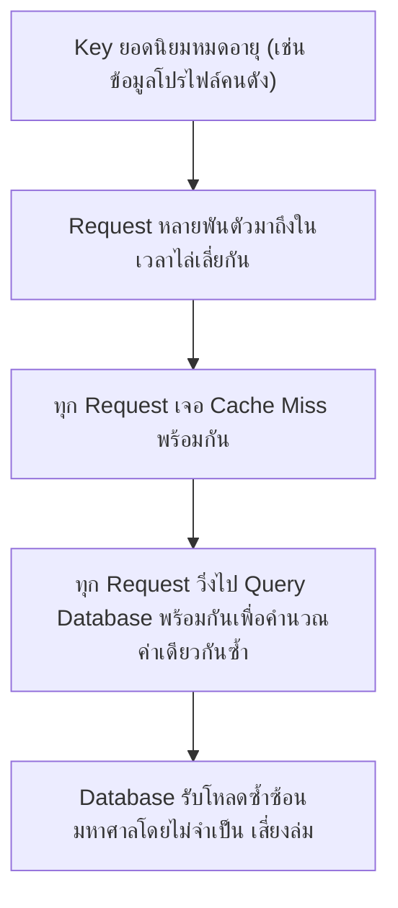
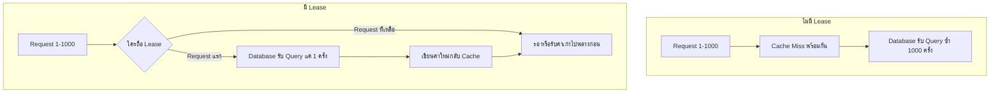

Cache Invalidation (บทก่อนหน้า) สอนไว้ว่า cache-aside pattern (เช็ค cache ก่อน ถ้าไม่มีค่อยไป query database) เป็นแพทเทิร์นพื้นฐานที่ใช้กันทั่วไป — แต่ที่ scale ของ <mark class="hl-term">Facebook</mark> ที่มี request หลักพันล้านครั้งต่อวินาที แพทเทิร์นพื้นฐานนี้พังไม่เป็นท่าตอน key ยอดนิยมหมดอายุพร้อมกัน จนต้องคิดกลไกใหม่ชื่อ <mark class="hl-term">Lease</mark> ขึ้นมาแก้โดยเฉพาะ

## ใช้ความรู้ System Design อะไรมาอธิบายเคสนี้: Cache Stampede ที่ Scale มหาศาล

<mark class="hl-term">Cache Stampede</mark> (หรือ Thundering Herd แบบ cache miss) คือปัญหาที่เรียนไปแล้วในบท Caching — พอ key ที่มีคนเรียกดูพร้อมกันจำนวนมากหมดอายุ ทุก request ที่มาถึงในช่วงเวลาไล่เลี่ยกันจะเจอ cache miss พร้อมกันหมด แล้ววิ่งไป query database ซ้ำๆ กันโดยไม่จำเป็น



<mark class="hl-warning">ที่ scale ทั่วไปปัญหานี้อาจไม่รุนแรงมาก แต่ที่ scale ของ Facebook (คนดังคนเดียวมีคนเปิดโปรไฟล์พร้อมกันนับหมื่นครั้งต่อวินาที) ถ้าไม่มีกลไกป้องกัน database ฝั่งหลังจะถูกถล่มด้วยคำขอคำนวณค่าเดียวกันซ้ำๆ กันนับพันครั้งในเวลาไม่กี่มิลลิวินาที</mark>

## ทางแก้ของ Facebook: Lease (ใบอนุญาตคำนวณค่าใหม่)

```demo
component: StepThroughDiagram
props: {"steps":[{"label":"1. Request แรกที่เจอ Cache Miss สำหรับ key นั้น ขอ Lease จาก Memcache","detail":"Memcache มอบ lease token (เลขที่ไม่ซ้ำกัน) ให้ request แรกที่มาถึงเท่านั้น พร้อมทำเครื่องหมายว่า key นี้ 'กำลังถูกคำนวณใหม่อยู่'"},{"label":"2. Request แรกที่ได้ Lease ไปคำนวณค่าจริงจาก Database ตามปกติ","detail":"เป็น request เดียวที่ได้รับอนุญาตให้ query database สำหรับ key นี้ในช่วงเวลานี้"},{"label":"3. Request อื่นๆ ที่มาถึงในช่วงเวลาเดียวกันสำหรับ key เดียวกัน จะไม่ได้รับ Lease","detail":"Memcache บอก request เหล่านี้ให้รอสักครู่แทนที่จะปล่อยให้วิ่งไป query database ซ้ำ หรือในบางกรณีให้ค่าเก่าที่ยังไม่ update ไปพลางก่อน (stale value) ถ้าระบบยอมรับความคลาดเคลื่อนเล็กน้อยได้"},{"label":"4. Request แรกคำนวณค่าเสร็จ เขียนค่าใหม่กลับเข้า Memcache พร้อมกับ Lease token ที่ตรงกัน","detail":"Memcache ตรวจสอบว่า lease token ที่ส่งมาตรงกับที่แจกไปหรือไม่ ก่อนจะยอมรับการเขียนนี้"},{"label":"5. Request อื่นๆ ที่รอไว้ ได้รับค่าใหม่จาก cache ทันทีโดยไม่ต้องคำนวณซ้ำเอง","detail":"ผลลัพธ์คือ database ถูก query แค่ครั้งเดียวสำหรับ key เดียวกัน แม้จะมี request มาพร้อมกันนับพันครั้งก็ตาม"}]}
```

## ปัญหาที่ Lease แก้เพิ่มอีกอย่าง: Stale Set

```demo
component: JourneyDiagram
props: {"nodes":[{"icon":"person","label":"Request A (ช้า)"},{"icon":"database","label":"Memcache"},{"icon":"person","label":"Request B (เร็วกว่า)"}],"travelerIcon":"package","steps":[{"activeNode":0,"caption":"Request A เจอ cache miss เริ่มคำนวณค่าจาก database (แต่ query ช้าผิดปกติเพราะ database กำลังโหลดสูง)"},{"activeNode":2,"caption":"ระหว่างที่ A ยังคำนวณไม่เสร็จ มีคนเขียนข้อมูลใหม่จริงเข้า database แล้ว Request B มาอ่านค่าล่าสุดและเขียนกลับเข้า cache ก่อน"},{"activeNode":1,"caption":"ถ้าไม่มี Lease ตรวจสอบ พอ Request A คำนวณเสร็จ (ช้ากว่า) จะเขียนค่าเก่าทับค่าใหม่ที่ B เพิ่งเขียนไป กลายเป็นข้อมูลผิดที่ไม่มีใครรู้ตัว — นี่คือ Stale Set"},{"activeNode":1,"caption":"ด้วย Lease token, Memcache ปฏิเสธการเขียนของ Request A ทันทีที่รู้ว่า lease ของมันถูกยกเลิกไปแล้ว (เพราะมีการเขียนใหม่เกิดขึ้นระหว่างทาง) ป้องกัน stale set ได้"}]}
```

<mark class="hl-insight">Lease แก้ปัญหาสองอย่างพร้อมกันด้วยกลไกเดียว — (1) ป้องกัน cache stampede โดยให้แค่ผู้ถือ lease เท่านั้นที่ query database ได้ และ (2) ป้องกัน stale set โดยตรวจสอบว่า lease ยังใช้ได้อยู่หรือถูกยกเลิกไปแล้วก่อนยอมรับการเขียนกลับเข้า cache ทั้งสองปัญหานี้ดูเผินๆ เหมือนไม่เกี่ยวกัน แต่จริงๆ แล้วแก้ได้ด้วย token เดียวกันเพราะรากปัญหาเดียวกันคือ "หลาย request แข่งกันทำงานกับ key เดียวกันโดยไม่รู้จักกัน"</mark>

## Architecture รวม



## Trade-off ที่ควรพูดถึง

- **Request ที่ไม่ได้ Lease ต้องรอหรือได้ข้อมูลเก่าไปก่อน** — ถ้าเลือกให้รอ ผู้ใช้บางคนจะเจอ latency สูงขึ้นเล็กน้อยระหว่างรอ request แรกคำนวณเสร็จ ถ้าเลือกให้ได้ค่าเก่าไปก่อน ต้องยอมรับว่าข้อมูลอาจไม่ update ทันทีเป๊ะ (eventual consistency เล็กน้อย)
- **Lease เพิ่มความซับซ้อนให้กับ Memcache เอง** — ต้องมีกลไกจัดการ token, ตรวจสอบความถูกต้อง, และจัดการ edge case (เช่น request ที่ถือ lease ค้างไปไม่คืนค่ากลับมา) ซึ่งเป็นความซับซ้อนที่ระบบขนาดเล็กไม่จำเป็นต้องมี
- **คุ้มค่าเฉพาะที่ scale สูงมากพอ** — ระบบทั่วไปที่ traffic ต่อ key ไม่ได้สูงมาก cache-aside ธรรมดาก็เพียงพอ Lease คุ้มค่าเฉพาะระบบที่มี concurrent request ต่อ key เดียวจำนวนมากจริงๆ อย่าง Facebook

## คำถามเจาะลึกที่มักถูกถามต่อ

**ถาม: ทำไม cache-aside pattern ธรรมดาถึงไม่พอสำหรับ scale ของ Facebook**

เพราะ cache-aside ธรรมดาไม่มีกลไกจัดการกรณีที่ request หลายพันตัวเจอ cache miss พร้อมกันสำหรับ key เดียวกัน ทุก request จะวิ่งไป query database เองอย่างอิสระโดยไม่รู้ว่ามีคนอื่นกำลังทำสิ่งเดียวกันอยู่ ที่ scale ทั่วไปนี้ไม่ใช่ปัญหาใหญ่ (โอกาสที่หลาย request จะชนกันพอดีต่ำ) แต่ที่ scale ของ Facebook ซึ่งมี concurrent request ต่อ key ยอดนิยมสูงมาก การชนกันแบบนี้เกิดขึ้นตลอดเวลาจนกลายเป็นปัญหาจริง

**ถาม: Lease Token ทำงานยังไงในทางเทคนิค ทำไมต้องเป็นเลขไม่ซ้ำกัน**

Lease token เป็นเลขที่ Memcache สุ่มสร้างและมอบให้ request แรกที่เจอ cache miss สำหรับ key นั้น ต้องไม่ซ้ำกันเพื่อให้ Memcache แยกแยะได้ว่า "การเขียนกลับครั้งนี้มาจาก request ที่ได้รับอนุญาตจริงหรือไม่" ถ้า token ไม่ตรงกับที่แจกล่าสุด (เช่นเพราะมีการเขียนใหม่แทรกเข้ามาระหว่างทาง ทำให้ lease เดิมถูกยกเลิก) Memcache จะปฏิเสธการเขียนนั้น ป้องกัน stale set ได้

**ถาม: Stale Set คืออะไร ทำไมถึงเป็นปัญหาที่ซ่อนอยู่ลึกกว่าที่คิด**

Stale Set คือสถานการณ์ที่ request ที่คำนวณค่าช้ากว่า (อาจเพราะ database query ช้าผิดปกติ) เขียนค่าเก่าทับค่าใหม่ที่เพิ่งถูกเขียนเข้า cache ไปแล้วโดย request อื่นที่เร็วกว่า ปัญหานี้ซ่อนอยู่ลึกเพราะไม่ได้เกิดจาก error ที่เห็นชัด (ทั้งสอง request "ทำงานถูกต้อง" ในมุมมองของตัวเอง) แต่เกิดจากลำดับเวลาที่สลับกันโดยบังเอิญ ทำให้ debug ยากมากถ้าไม่มีกลไกป้องกันเชิงระบบตั้งแต่ต้น

**ถาม: ทำไมไม่ใช้ Lock ธรรมดา (เช่น distributed lock) แทน Lease**

Distributed lock ทั่วไปมักออกแบบมาให้ request อื่นที่ไม่ได้ lock ต้อง**รอจนกว่า lock จะถูกปล่อย** ซึ่งเหมาะกับงานที่ต้องการความถูกต้องสัมบูรณ์ แต่ Lease ของ Facebook ออกแบบมาให้ยืดหยุ่นกว่านั้น — request ที่ไม่ได้ lease สามารถเลือกได้ว่าจะรอหรือจะรับค่าเก่าไปพลางก่อน (ตามความสำคัญของ use case) ซึ่งเหมาะกับระบบ social media ที่ยอมรับความคลาดเคลื่อนชั่วขณะได้ (เช่น เห็นจำนวนไลค์ช้าไปเสี้ยววินาทีไม่ใช่เรื่องใหญ่) ต่างจาก lock ที่บังคับรอเสมอ

**ถาม: กลไกนี้ใช้ได้กับ Cache Invalidation แบบไหนบ้าง เช่น TTL expiry หรือ explicit invalidation**

ใช้ได้กับทั้งสองแบบ — ไม่ว่า key จะหมดอายุเองตาม TTL หรือถูก invalidate โดยตรงจากการเขียนข้อมูลใหม่ (explicit invalidation) ผลลัพธ์ปลายทางเหมือนกันคือ request ที่มาถึงหลังจากนั้นจะเจอ cache miss พร้อมกันได้ Lease จัดการปัญหานี้ที่**จุดเดียวกัน**คือตอน cache miss เกิดขึ้น ไม่ว่าสาเหตุของการ miss จะมาจากอะไรก็ตาม

**ถาม: ระบบขนาดเล็กที่ traffic ไม่สูงเท่า Facebook ควรใช้ Lease ไหม**

ส่วนใหญ่ไม่จำเป็น — cache-aside ธรรมดาก็เพียงพอถ้า concurrent request ต่อ key เดียวไม่สูงมาก การเพิ่ม lease เข้าไปโดยไม่จำเป็นจะเพิ่มความซับซ้อนโดยไม่ได้ประโยชน์คุ้มค่า หลักการ ponytail/YAGNI ใช้ได้ตรงนี้พอดี — เพิ่มกลไกซับซ้อนก็ต่อเมื่อวัดได้จริงว่า cache stampede เป็นปัญหาจริงในระบบของตัวเอง ไม่ใช่เพิ่มไว้ก่อนเผื่ออนาคต

> คำถามสัมภาษณ์: "ถ้า cache ของคุณเจอปัญหา cache stampede ตอน key ยอดนิยมหมดอายุพร้อมกัน จะแก้ยังไง" — ใช้กลไก lease/token: ให้แค่ request แรกที่เจอ cache miss ได้รับอนุญาต (lease) ไป query database และคำนวณค่าใหม่ ส่วน request อื่นที่มาถึงพร้อมกันให้รอหรือรับค่าเก่าไปพลางก่อนแทนที่จะปล่อยให้ทุกคนวิ่งไป query database ซ้ำกันหมด พร้อมกันนั้น token นี้ยังใช้ป้องกัน stale set ได้ด้วย โดยปฏิเสธการเขียนกลับจาก request ที่ lease ถูกยกเลิกไปแล้วเพราะมีการเขียนใหม่แทรกเข้ามาก่อน กลไกเดียวแก้ได้สองปัญหาเพราะรากของปัญหาเดียวกันคือหลาย request แข่งกันทำงานกับ key เดียวกันโดยไม่ประสานงานกัน
