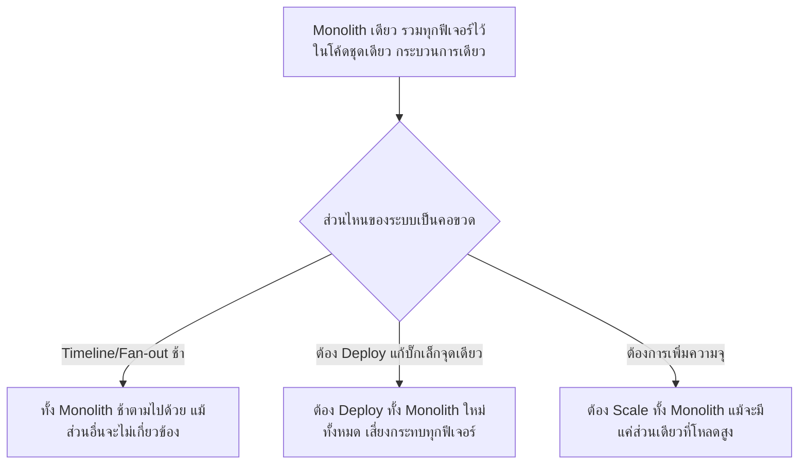
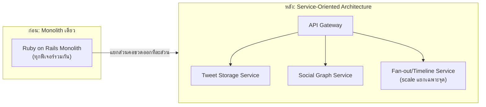

Monolith vs Microservices (บทก่อนหน้า) สอนไว้ว่า Monolith เหมาะกับทีมเล็กที่ต้องการความเร็วในการพัฒนา ส่วน Microservices เหมาะกับระบบที่โตจนต้อง scale แต่ละส่วนแยกกันอิสระ — เคสนี้คือเรื่องจริงของ <mark class="hl-term">Twitter</mark> ในยุคที่รูปปลาวาฬ "Fail Whale" กลายเป็นภาพจำของทั้งบริษัท เพราะ Monolith เดียวที่เคยพอดีตอนเริ่มต้น รับการเติบโตแบบก้าวกระโดดไม่ไหวอีกต่อไป

## ใช้ความรู้ System Design อะไรมาอธิบายเคสนี้: จุดที่ Monolith เริ่มไม่พอ

บทเรียนจาก Instagram (เคสก่อนหน้าในโมดูลนี้) แสดงให้เห็นว่า Monolith ใช้ได้ดีมากตอนทีมเล็ก — Twitter เองก็เริ่มต้นแบบเดียวกันด้วย Ruby on Rails monolith ตัวเดียว แต่ปัญหาคือ**ลักษณะการใช้งานของ Twitter ต่างจาก Instagram** — Twitter ต้องรองรับการกระจายข้อความ (fan-out) ไปหา follower จำนวนมหาศาลแบบเรียลไทม์ ซึ่งเป็นงานที่หนักกว่าการเก็บรูปภาพธรรมดามาก



<mark class="hl-warning">นี่คือข้อจำกัดหลักของ Monolith ที่ Instagram ไม่เจอ (เพราะ workload ของ Instagram กระจายสม่ำเสมอกว่า) — พอส่วนใดส่วนหนึ่งของ Monolith มีปัญหาหรือกลายเป็นคอขวด (เช่น การกระจายทวีตไปหา follower ที่มีคนติดตามหลักล้าน) ทั้งระบบจะได้รับผลกระทบไปด้วย เพราะทุกอย่างรันอยู่ในกระบวนการเดียวกัน ไม่มีการแยกขอบเขตความเสียหาย</mark>

## เกิดอะไรขึ้นจริง และแก้ปัญหายังไง (2007-2010)

```demo
component: StepThroughDiagram
props: {"steps":[{"label":"1. Twitter เริ่มต้นด้วย Ruby on Rails Monolith ตัวเดียว รับผู้ใช้เติบโตแบบก้าวกระโดด","detail":"เหมาะกับความเร็วในการพัฒนาฟีเจอร์ใหม่ตอนทีมยังเล็กและผู้ใช้ยังไม่มาก"},{"label":"2. ผู้ใช้เพิ่มขึ้นเร็วมาก โดยเฉพาะช่วงเหตุการณ์ใหญ่ (South by Southwest 2007 เป็นจุดเปลี่ยนสำคัญที่ทำให้คนรู้จัก Twitter มากขึ้นอย่างก้าวกระโดด)","detail":"Traffic พุ่งเร็วกว่าที่ทีมงานเตรียมโครงสร้างพื้นฐานไว้รองรับมาก"},{"label":"3. รูปปลาวาฬ 'Fail Whale' กลายเป็นภาพที่ผู้ใช้เห็นบ่อยครั้งเวลาเว็บล่ม","detail":"เพราะ Monolith เดียวรับโหลดไม่ไหว ล่มบ่อยจนกลายเป็นภาพจำ (แม้จะเป็นการออกแบบ error page ที่มีอารมณ์ขัน แต่สะท้อนปัญหาความเสถียรที่จริงจัง)"},{"label":"4. ทีมวิศวกรเริ่มแยกส่วนที่หนักที่สุดออกมาเป็น service อิสระทีละส่วน","detail":"เริ่มจากส่วนที่เป็นคอขวดชัดเจนที่สุดก่อน เช่น ระบบกระจายทวีต (fan-out), Social Graph (ใครติดตามใคร), และระบบเก็บทวีต แยกออกจาก Monolith เดิม"},{"label":"5. ย้ายไปใช้ภาษา/runtime ที่รองรับ concurrency สูงกว่าสำหรับ service ที่หนักที่สุด (JVM-based เช่น Scala)","detail":"เพราะงานกระจายทวีตต้องจัดการ concurrent connection จำนวนมหาศาลพร้อมกัน ภาษาที่ Ruby on Rails ใช้เดิมไม่เหมาะกับงานลักษณะนี้เท่า"},{"label":"6. แต่ละ Service ที่แยกออกมา scale ได้อิสระตามโหลดของตัวเอง ไม่ต้อง scale ทั้งระบบพร้อมกัน","detail":"Service ที่เป็นคอขวด (เช่น fan-out) เพิ่มเครื่องได้เฉพาะจุด โดยไม่กระทบ service อื่นที่โหลดปกติ ความถี่ Fail Whale ลดลงอย่างเห็นได้ชัดหลังจากนี้"}]}
```

## ทำไมแยก Service ถึงแก้ปัญหานี้ได้: Isolation + Independent Scaling

```demo
component: JourneyDiagram
props: {"nodes":[{"icon":"person","label":"ผู้ใช้โพสต์ทวีต"},{"icon":"gear","label":"Service: Tweet Storage"},{"icon":"gear","label":"Service: Social Graph"},{"icon":"gear","label":"Service: Fan-out/Timeline"}],"travelerIcon":"envelope","steps":[{"activeNode":0,"caption":"ผู้ใช้โพสต์ทวีตใหม่"},{"activeNode":1,"caption":"Tweet Storage Service บันทึกทวีตทันที — service นี้เบา ไม่ค่อยเป็นคอขวด"},{"activeNode":2,"caption":"Social Graph Service หา follower ทั้งหมดของผู้ใช้คนนี้"},{"activeNode":3,"caption":"Fan-out Service กระจายทวีตไปหา timeline ของ follower แต่ละคน — เป็นจุดที่หนักที่สุดสำหรับ account ที่มี follower หลักล้าน จึงถูกแยกออกมาให้ scale ได้อิสระโดยเฉพาะ โดยไม่กระทบ Tweet Storage หรือ Social Graph Service ที่ทำงานปกติดีอยู่แล้ว"}]}
```

<mark class="hl-insight">หลักการสำคัญที่เรียนในบท Monolith vs Microservices คือ: เมื่อแต่ละส่วนของระบบมี**ลักษณะโหลดต่างกันมาก** (บางส่วนเบา บางส่วนหนักมาก) การแยกเป็น service อิสระทำให้ scale ได้ตรงจุดที่ต้องการจริงๆ แทนที่จะต้อง scale ทั้งระบบตามส่วนที่หนักที่สุดเสมอ ซึ่งสิ้นเปลืองทรัพยากรของส่วนที่เบาโดยไม่จำเป็น</mark>

## Architecture รวม



## Trade-off ที่ควรพูดถึง

- **Service ที่แยกกันต้องคุยกันผ่าน network เพิ่ม latency** — Monolith เดิมเรียกฟังก์ชันภายในกระบวนการเดียวกัน (เร็วมาก) พอแยกเป็น service ต้องเรียกผ่าน network call ซึ่งช้ากว่าและมีโอกาส fail มากกว่า ต้องรับมือกับ partial failure ที่ไม่เคยเจอตอนเป็น Monolith
- **ความซับซ้อนในการดูแลระบบเพิ่มขึ้นมาก** — จากดูแล deployment เดียว กลายเป็นต้องดูแลหลาย service พร้อมกัน (versioning, service discovery, monitoring แยกส่วน) ต้องมีทีม infrastructure ที่แข็งแรงกว่าเดิมมาก
- **ไม่ใช่ทุกส่วนต้องแยกพร้อมกันทีเดียว** — Twitter เลือกแยกเฉพาะส่วนที่เป็นคอขวดจริงๆ ก่อน (fan-out, social graph) ไม่ได้ rewrite ทั้งระบบใหม่ทีเดียว เป็นการทยอยแยกตามความจำเป็นจริง ไม่ใช่ตามความนิยมของเทคโนโลยี

## คำถามเจาะลึกที่มักถูกถามต่อ

**ถาม: ทำไม Twitter ถึงเจอปัญหา Monolith รับไม่ไหว ทั้งที่ Instagram ก็เป็น Monolith เหมือนกันแต่ไม่มีปัญหานี้**

เพราะลักษณะ workload ต่างกันโดยพื้นฐาน — Instagram เน้นเก็บและแสดงรูปภาพซึ่งกระจายโหลดสม่ำเสมอกว่า (แต่ละคนดูรูปของตัวเอง) ส่วน Twitter ต้องกระจายทวีตของ 1 คนไปหา follower นับล้านคนแบบเรียลไทม์ (fan-out) ซึ่งเป็นงานที่โหลดกระจุกตัวรุนแรงกว่ามาก โดยเฉพาะ account ดังที่มี follower มหาศาล — ธรรมชาติของ workload ต่างกันทำให้จุดที่ Monolith เริ่มไม่พอมาถึงเร็วกว่ามาก

**ถาม: ทำไมการแยก Service ถึงช่วยลดความถี่ของ Fail Whale ได้**

เพราะก่อนแยก ถ้าส่วนกระจายทวีต (fan-out) รับโหลดหนักจนช้า ทั้ง Monolith จะช้าตามไปด้วยเพราะรันอยู่ในกระบวนการเดียวกัน ทำให้แม้แต่ฟีเจอร์ที่ไม่เกี่ยวข้องกันเลย (เช่น การดูโปรไฟล์) ก็ได้รับผลกระทบไปด้วย พอแยก fan-out ออกมาเป็น service อิสระ ปัญหาที่เกิดกับ fan-out จะถูกจำกัดขอบเขตอยู่แค่ service นั้น ไม่ลามไปกระทบ service อื่นที่ทำงานปกติดีอยู่แล้ว

**ถาม: ทำไมต้องเปลี่ยนภาษา/runtime ด้วย (จาก Ruby ไป JVM-based) ไม่ใช่แค่แยก Service เฉยๆ**

เพราะปัญหาบางส่วนไม่ได้อยู่ที่สถาปัตยกรรมอย่างเดียว แต่อยู่ที่ความสามารถของภาษา/runtime ในการจัดการ concurrent connection จำนวนมหาศาลพร้อมกันด้วย งาน fan-out ต้องส่งข้อมูลไปหา follower นับล้านคนพร้อมกันในเวลาสั้นๆ ซึ่งต้องการ runtime ที่จัดการ concurrency ได้มีประสิทธิภาพสูง การแยก service อย่างเดียวโดยไม่เปลี่ยนเทคโนโลยีที่รองรับ workload นั้นโดยเฉพาะ อาจไม่ได้ประโยชน์เต็มที่

**ถาม: ทำไม Twitter ไม่แยก Service ทั้งหมดทีเดียวตั้งแต่แรก ทำไมต้องทยอยแยกทีละส่วน**

เพราะการ rewrite ทั้งระบบพร้อมกันมีความเสี่ยงสูงมาก (ต้องหยุดพัฒนาฟีเจอร์ใหม่นานเพื่อ rewrite, เสี่ยง bug ใหม่จำนวนมาก, ทดสอบยากกว่าการแยกทีละส่วน) การทยอยแยกเฉพาะส่วนที่เป็นคอขวดจริงๆ ก่อน (ตามข้อมูลจริงว่าอะไรพังบ่อยที่สุด) ทำให้แก้ปัญหาเร่งด่วนได้เร็วกว่า และเรียนรู้จากการแยกแต่ละครั้งไปปรับใช้กับส่วนถัดไป มีความเสี่ยงต่อครั้งต่ำกว่าการเปลี่ยนทั้งระบบทีเดียว

**ถาม: เคสนี้กับเคส Instagram (Sharding) สอนบทเรียนตรงข้ามกันหรือเปล่า**

ไม่ใช่ตรงข้ามกัน แต่เป็นสองด้านของหลักการเดียวกันคือ "เลือกความซับซ้อนให้พอดีกับปัญหาจริง" — Instagram ยังเป็นทีมเล็กและ workload กระจายสม่ำเสมอ การอยู่กับ Monolith แล้วแก้แค่จุดที่จำเป็น (sharded ID) จึงเหมาะสมและประหยัดแรงงานที่สุด ส่วน Twitter workload กระจุกตัวรุนแรงและโตเร็วกว่ามาก จนถึงจุดที่ Monolith ไม่พอจริงๆ การแยก service จึงจำเป็นแม้จะมีต้นทุนสูงกว่า ทั้งสองเคสสอนหลักการเดียวกันคือ**อย่าเพิ่มความซับซ้อนก่อนที่ปัญหาจริงจะมาถึง แต่ก็อย่ากลัวที่จะเพิ่มเมื่อจำเป็นจริง**

**ถาม: จะรู้ได้ยังไงว่าถึงเวลาที่ควรแยก Monolith เป็น Microservices แล้ว ไม่ใช่แค่รู้สึกว่าอยากทำตามเทรนด์**

สัญญาณที่ชัดเจนคือ: (1) มีส่วนใดส่วนหนึ่งของระบบที่โหลดสูงกว่าส่วนอื่นมากอย่างสม่ำเสมอ ไม่ใช่แค่ผันผวนชั่วคราว (2) การแก้บั๊กหรือ deploy จุดเล็กๆ ต้องเสี่ยงกระทบทั้งระบบซ้ำๆ จนกลายเป็นปัญหาจริง (3) มีข้อมูลวัดผลจริงชี้ชัดว่าจุดไหนคือคอขวด ไม่ใช่แค่คาดเดา อย่างเคส Twitter ที่ระบบ fan-out เป็นคอขวดชัดเจนจากข้อมูลจริง ไม่ใช่การเปลี่ยนสถาปัตยกรรมเพราะ "microservices ดูทันสมัยกว่า"

> คำถามสัมภาษณ์: "จะรู้ได้ยังไงว่าระบบ Monolith ของคุณถึงจุดที่ต้องแยกเป็น Microservices แล้ว และควรแยกยังไง" — สัญญาณสำคัญคือมีส่วนใดส่วนหนึ่งของระบบที่มีลักษณะโหลดต่างจากส่วนอื่นอย่างชัดเจนและสม่ำเสมอ (ไม่ใช่แค่ชั่วคราว) จนการ scale ทั้ง Monolith ตามส่วนที่หนักที่สุดสิ้นเปลืองทรัพยากรของส่วนที่เบาโดยไม่จำเป็น หรือการ deploy/บั๊กจุดเล็กกระทบทั้งระบบซ้ำๆ วิธีแยกที่ปลอดภัยกว่าคือทยอยแยกเฉพาะส่วนที่เป็นคอขวดจริงตามข้อมูลวัดผล ไม่ใช่ rewrite ทั้งระบบพร้อมกันทีเดียว เพราะแต่ละ service ที่แยกออกมาต้องแลกกับ latency จาก network call ที่เพิ่มขึ้นและความซับซ้อนในการดูแลระบบที่มากกว่าเดิมมาก
