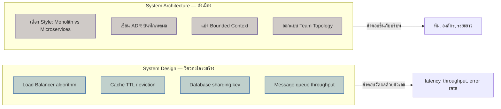

ลองนึกภาพสองอาชีพที่ทำงานกับ "บ้าน" เหมือนกัน แต่คนละมุมมองโดยสิ้นเชิง คนแรกคือวิศวกรโครงสร้างที่คำนวณว่าเสาต้นไหนต้องรับน้ำหนักเท่าไหร่ ท่อน้ำต้องมีขนาดพอสำหรับกี่คนอาบน้ำพร้อมกัน สายไฟต้องเดินยังไงไม่ให้โหลดเกิน — งานของเขาคือทำให้ "บ้านหลังนี้" รองรับการใช้งานจริงได้โดยไม่พัง

คนที่สองคือผังเมือง (urban planner) ที่ไม่ได้สนใจว่าท่อน้ำในบ้านหลังไหนขนาดเท่าไหร่เลย แต่ตัดสินใจว่าที่ดินผืนนี้ควรมีกี่หลัง แต่ละหลังควรเป็นบ้านเดี่ยวหรือตึกแถว ถนนควรเชื่อมกันยังไง เขตไหนเป็นที่อยู่อาศัย เขตไหนเป็นพาณิชย์ — การตัดสินใจของเขาส่งผลกระทบยาวนานเป็นสิบปี แก้ทีหลังยากกว่าซ่อมท่อน้ำแตกมาก

นี่คือความต่างระหว่าง **System Design** (ที่เรียนมาทั้ง track ก่อนหน้า) กับ **System Architecture** (track นี้) — <mark class="hl-term">System Design</mark> คือวิศวกรโครงสร้าง โฟกัสที่กลไกทำงาน: load balancer กระจายโหลดยังไง, cache ช่วยอะไร, database ควร shard ยังไง ล้วนเป็นคำถามระดับ "ทำให้ระบบหนึ่งระบบรองรับโหลดได้" ส่วน <mark class="hl-term">System Architecture</mark> คือผังเมือง โฟกัสที่การตัดสินใจระดับสูงกว่า: ควรแตกเป็นกี่ระบบ แต่ละระบบคุยกันแบบไหน จะบันทึกเหตุผลการตัดสินใจไว้ยังไงให้คนอื่นเข้าใจทีหลัง — เป็นคำถามที่ตอบผิดแล้วแก้ยากกว่ามาก

## ขอบเขตของแต่ละฝั่ง: กลไก vs การตัดสินใจ

ลองเทียบคำถามที่แต่ละฝั่งตอบ — System Design ตอบคำถามอย่าง "จะ scale ระบบยังไงให้รองรับ 1 ล้าน request/วินาที", "cache ควรตั้งค่า TTL เท่าไหร่", "database ไหน sharding ตามอะไร" ล้วนเป็นคำถามที่มีคำตอบค่อนข้างเป็นรูปธรรม วัดผลได้ด้วยตัวเลข (latency, throughput) ส่วน System Architecture ตอบคำถามอย่าง "ทีมนี้ควรแตกเป็นกี่ service", "ควรเขียนเอกสารสถาปัตยกรรมแบบไหนให้คนใหม่เข้าใจเร็ว", "domain นี้มีขอบเขตความหมายศัพท์ตรงไหนที่ควรแยก" — คำตอบขึ้นกับบริบทองค์กรและทีมมากกว่าตัวเลขล้วนๆ



```demo
component: ComparisonDiagram
props: {"left":{"title":"System Design (มาก่อน)","points":["โฟกัสกลไกภายในหนึ่งระบบ","คำถาม: ทำยังไงให้ scale/เร็ว/เสถียร","วัดผลด้วยตัวเลข (latency, RPS)","แก้ผิดแล้วปรับทีหลังได้ค่อนข้างง่าย"]},"right":{"title":"System Architecture (track นี้)","points":["โฟกัสการตัดสินใจข้ามระบบ/ข้ามทีม","คำถาม: ควรแตกกี่ระบบ ใครคุยกับใคร","วัดผลด้วยบริบท (ทีม, องค์กร, ต้นทุนระยะยาว)","ตัดสินใจผิดแล้วแก้ยากและแพงกว่ามาก"]},"note":"สองฝั่งไม่ได้แข่งกัน — System Architecture ตัดสินใจ 'จะมีกี่ระบบ' ก่อน แล้ว System Design ค่อยตอบว่า 'แต่ละระบบนั้นรองรับโหลดยังไง'"}
```

## ทำไมต้องแยกเรียนสองเรื่องนี้

ทีมที่เก่ง System Design แต่ไม่เคยคิดเรื่อง System Architecture มักเจอปัญหาแบบเดียวกันซ้ำๆ — ระบบ scale ได้ดีในทางเทคนิค แต่ทีมกลับ deploy ช้าลงเรื่อยๆ เพราะทุกคนแก้โค้ดก้อนเดียวกันจนชนกันตลอด (ปัญหานี้ optimize cache หรือ database ไม่ช่วยเลย เพราะมันไม่ใช่ปัญหาระดับกลไก) ในทางกลับกัน ทีมที่ตัดสินใจเรื่อง architecture เก่งแต่ไม่เข้าใจกลไก system design ก็เสี่ยงแตก service ออกมาสวยงามบนกระดาษ แต่แต่ละ service เองก็ scale ไม่ไหวเพราะไม่รู้จัก caching หรือ load balancing เลย — <mark class="hl-insight">สองเรื่องนี้ต้องใช้คู่กัน</mark>

| สถานการณ์ | คิดแบบ System Design | คิดแบบ System Architecture |
|---|---|---|
| ระบบเดียวช้าลง ต้อง optimize | ✅ เพิ่ม cache, sharding, index | ไม่เกี่ยวโดยตรง |
| ทีมโตจาก 3 คนเป็น 30 คน เริ่มชนกันบ่อย | ไม่ช่วยอะไร | ✅ พิจารณาแตก service/ทีม |
| ต้อง onboard engineer ใหม่ให้เข้าใจระบบเร็ว | ช่วยได้บางส่วน | ✅ เขียน ADR, วาด C4 diagram |
| Database query ช้าลงเรื่อยๆ | ✅ indexing, replication | ไม่เกี่ยว (เว้นแต่เป็นสัญญาณว่า bounded context ผิด) |

## มุมมองตอนสัมภาษณ์งาน

คำถามสัมภาษณ์ระดับ senior มักไม่ถามตรงๆ ว่า "System Design กับ System Architecture ต่างกันยังไง" แต่จะสังเกตจากคำตอบข้อสอบ system design ทั่วไป — <mark class="hl-warning">คนที่ตอบด้วยการเสนอ "แตก microservices" ทันทีโดยไม่ถามเรื่องขนาดทีมหรือ bounded context ก่อนเลย มักถูกมองว่ายังแยกสองมุมมองนี้ไม่ออก</mark> คำตอบที่ดีควรระบุก่อนว่ากำลังตอบคำถามระดับไหน แล้วค่อยลงรายละเอียดตามระดับนั้น

## ADR ตัวอย่าง

> **Title:** ตัดสินใจเริ่มเขียน Architecture Decision Record สำหรับทีม
> **Status:** Accepted
> **Context:** ทีมมี engineer ใหม่เข้าทุกไตรมาส แต่ละคนถามซ้ำว่า "ทำไมระบบถึงออกแบบแบบนี้" ทั้งที่มีคนตัดสินใจไปแล้วตั้งแต่ปีก่อน ไม่มีใครจำเหตุผลได้แม่นยำ
> **Decision:** เริ่มบันทึกการตัดสินใจเชิงสถาปัตยกรรมทุกครั้งที่มีผลกระทบระยะยาวเป็น ADR เก็บไว้ใน repo เดียวกับโค้ด
> **Consequences:** engineer ใหม่อ่าน ADR แล้วเข้าใจบริบทได้เร็วขึ้นมาก แต่ทีมต้องมีวินัยเขียน ADR ทุกครั้งที่ตัดสินใจสำคัญ ไม่ใช่แค่ตอนนึกออก
