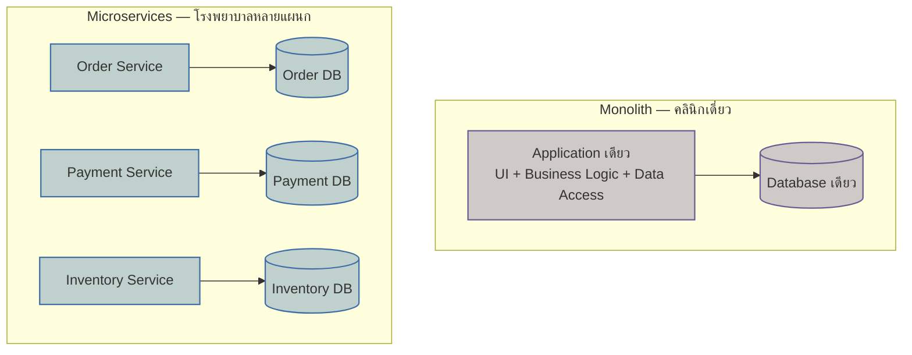

ลองนึกภาพหมอสองคน คนแรกเปิด**คลินิกครอบครัว**เล็กๆ คนเดียว ตรวจได้ทุกโรคเบื้องต้น ไข้หวัด ปวดหัว ฉีดวัคซีน ตัดสินใจเองได้ทันทีไม่ต้องขอความเห็นใคร อยากเปลี่ยนเวลาเปิด-ปิดคลินิก อยากปรับราคาค่าตรวจ ก็ทำได้เดี๋ยวนั้น เพราะมีคนเดียวที่ต้องตกลงกันเอง

คนที่สองบริหาร**โรงพยาบาลใหญ่**ที่แบ่งเป็นแผนกเฉพาะทาง ผ่าตัด หัวใจ กระดูก สูตินรีเวช แต่ละแผนกมีทีมแพทย์ พยาบาล งบประมาณ และตารางเวรของตัวเอง แผนกหัวใจจะซื้อเครื่องมือใหม่หรือปรับ protocol การรักษา ก็ทำได้โดยไม่ต้องรอแผนกกระดูกอนุมัติ แต่ต้องแลกกับความซับซ้อน — ต้องมีระบบนัดหมายกลาง ระบบเวชระเบียนที่ทุกแผนกอ่านเข้าใจตรงกัน และทีมบริหารที่คอยประสานงานข้ามแผนกตลอดเวลา

นี่คือภาพเดียวกับที่ทีมวิศวกรรมซอฟต์แวร์ทุกทีมต้องตัดสินใจ — จะสร้างระบบแบบ**คลินิกเดี่ยว** (**<mark class="hl-term">Monolith</mark>**) หรือแบบ**โรงพยาบาลหลายแผนก** (**<mark class="hl-term">Microservices</mark>**) รายละเอียดว่า "แตกยังไง" แบ่งขอบเขต service ตรงไหน ดูได้ในโมดูล Microservices & API Design ที่เรียนไปแล้ว บทนี้จะโฟกัสคำถามที่มาก่อนหน้านั้น — อะไรคือปัจจัยที่บอกว่า**ถึงเวลาต้องเลือก style ไหน**

## ปัจจัยที่ตัดสินใจ style: ไม่ใช่แค่เรื่องเทคนิค แต่คือเรื่ององค์กร



<mark class="hl-insight">สิ่งที่มักถูกมองข้ามคือการเลือก style ไม่ใช่การตัดสินใจทางเทคนิคล้วนๆ แต่ผูกกับโครงสร้างองค์กรโดยตรง</mark> นักวิจัยชื่อ Melvin Conway เคยตั้งข้อสังเกตไว้ตั้งแต่ปี 1967 ซึ่งภายหลังถูกเรียกว่า **<mark class="hl-term">Conway's Law</mark>**: ระบบที่องค์กรออกแบบมักมีโครงสร้างสะท้อนโครงสร้างการสื่อสารขององค์กรนั้นเอง ทีมเดียวที่นั่งคุยกันได้ทั่วถึงมักผลิตระบบก้อนเดียว ส่วนหลายทีมที่แยกกันทำงานอิสระมักผลิตระบบที่แยกเป็นหลาย service ตามขอบเขตทีม

ปัจจัยหลักที่ควรใช้ตัดสินใจมีสี่อย่าง:

1. **ขนาดทีมและ Conway's Law** — ทีมเดียวหรือไม่กี่คนสื่อสารกันเองได้ทั่วถึง ยังไม่จำเป็นต้องแยก service ตามทีม แต่พอทีมโตเป็นหลายทีมที่ทำงานคนละ domain การรวมกันอยู่ใน codebase เดียวจะเริ่มชนกันบ่อยขึ้น
2. **จังหวะการ deploy ที่ต้องการ** — ถ้าทุกทีม deploy พร้อมกันได้โดยไม่เจ็บ ยังไม่มีเหตุผลต้องแยก แต่ถ้าทีมหนึ่งต้อง deploy บ่อยกว่าทีมอื่นมาก และต้องรอคิว deploy รวมของทั้งระบบ นั่นคือสัญญาณ
3. **ความซับซ้อนของ domain** — ถ้ายังไม่รู้ขอบเขตทางธุรกิจที่แท้จริง (bounded context) <mark class="hl-warning">การแตกเป็น service ก่อนเวลาอันควรมักแตกผิดที่ ต้องมาแก้ทีหลังซึ่งแพงกว่าการรวมไว้ก่อน</mark>
4. **ความพร้อมด้าน operational maturity** — Microservices ต้องการ CI/CD ที่รองรับหลาย pipeline, observability ที่ตามรอยข้าม service ได้, และทีม infra ที่ดูแล service จำนวนมากพร้อมกัน ถ้ายังไม่มีสิ่งเหล่านี้ ต้นทุนการดูแลจะสูงกว่าประโยชน์ที่ได้

```demo
component: ComparisonDiagram
props: {"left":{"title":"เลือก Monolith เมื่อ...","points":["ทีมเล็ก (ไม่กี่คนถึงสิบกว่าคน) สื่อสารกันเองได้ทั่วถึง","deploy พร้อมกันทั้งระบบยังไม่เจ็บ ยังไม่มีคิวรอ deploy ชนกัน","domain ยังไม่ชัดเจน แบ่งขอบเขตตายตัวไม่ได้ง่ายๆ","operational maturity ยังไม่พร้อม ไม่มีทีม infra ดูแล service หลายสิบตัว"]},"right":{"title":"เลือก Microservices เมื่อ...","points":["หลายทีมโตขึ้น ต้องการ deploy อิสระไม่รอกัน (ตาม Conway's Law)","แต่ละ domain แยกขอบเขตได้ชัด และโหลดต่างกันมากพอจะ scale แยก","มี platform รองรับ service หลายตัว (CI/CD, observability, service mesh)","ยอมแลก operational overhead เพื่อความเป็นอิสระของทีม"]},"note":"Conway's Law บอกว่าสถาปัตยกรรมระบบมักสะท้อนโครงสร้างองค์กรที่สร้างมันขึ้นมา ทีมแยกกันชัดเจนแค่ไหน ระบบก็มักแยกออกมาแบบนั้น"}
```

## สรุปเป็นตาราง: ใครเหมาะกับ style ไหน

| ปัจจัย | Monolith เหมาะกว่า | Microservices เหมาะกว่า |
|---|---|---|
| ขนาดทีม | ทีมเดียวหรือไม่กี่คน | หลายทีมอิสระ (ตาม Conway's Law) |
| ความถี่ deploy ที่ต้องการ | deploy พร้อมกันได้ ไม่มีปัญหา | แต่ละทีมต้อง deploy เองได้โดยไม่รอกัน |
| ความซับซ้อนของ domain | โมเดลธุรกิจยังเรียบง่าย ขอบเขตไม่ชัด | แยก domain/bounded context ได้ชัดเจนแล้ว |
| ความพร้อมด้าน operations | ยังไม่มีทีม infra/DevOps รองรับหลาย service | มี CI/CD, observability, on-call รองรับ service จำนวนมาก |

ในการสัมภาษณ์งานสาย system design คำถามแนวนี้มักไม่ได้ถามว่า "microservices ดีกว่า monolith ไหม" แต่ถามว่า "ทีมและระบบแบบนี้ควรเลือก style ไหน" คำตอบที่ดีจึงต้องพูดถึงปัจจัยองค์กรควบคู่กับปัจจัยเทคนิคเสมอ ไม่ใช่ตอบแค่ฝั่งเทคนิคฝั่งเดียว

## ADR ตัวอย่าง

รูปแบบด้านล่างคือ **ADR (Architecture Decision Record)** — วิธีบันทึกการตัดสินใจเชิงสถาปัตยกรรมที่จะอธิบายละเอียดเต็มๆ ในโมดูล Architecture Documentation & Views ถัดไป ตอนนี้แค่อ่านผ่านๆ เพื่อดูตัวอย่างการนำไปใช้จริงก่อนก็พอ

> **Title:** เลือกเริ่มต้นระบบ e-commerce ใหม่ด้วย Monolith ก่อน
> **Status:** Accepted
> **Context:** ทีมมีวิศวกร 4 คน ยังไม่รู้ domain boundary ที่แน่นอน ต้องออก MVP ให้เร็วที่สุดเพื่อทดสอบตลาด
> **Decision:** เริ่มด้วย Monolith เดียว แยก module ภายในให้ชัดเจนไว้ล่วงหน้า (modular monolith) เพื่อให้แตกเป็น microservices ได้ง่ายในอนาคตถ้าจำเป็น
> **Consequences:** deploy และ debug ง่ายในช่วงแรก แต่ต้องคอยระวังไม่ให้ module พึ่งพากันมั่วจนแยกยากภายหลัง ถ้าทีมโตเกิน ~15 คนต้องกลับมาทบทวนการแตก service ตาม Conway's Law
