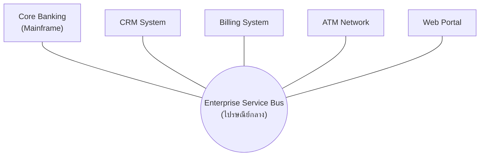

ลองนึกภาพองค์กรใหญ่แห่งหนึ่งในยุค 2000 ที่มีระบบคอมพิวเตอร์กระจัดกระจาย — ระบบ core banking รันอยู่บน mainframe เก่าอายุ 20 ปี ระบบ CRM เป็นซอฟต์แวร์ที่ซื้อจาก vendor หนึ่ง ระบบออกใบแจ้งหนี้เป็นอีกซอฟต์แวร์ที่พัฒนาเอง แต่ละระบบพูด "ภาษา" (protocol, format) ของตัวเองทั้งสิ้น ทีม IT ต้องเขียนสะพานเชื่อมเอง (point-to-point integration) ทุกคู่ระบบ ยิ่งระบบเยอะ สะพานก็ยิ่งพันกันจนดูแลไม่ไหว

วิธีแก้ที่องค์กรใหญ่ยุคนั้นนิยมใช้คือตั้ง**ไปรษณีย์กลาง** — ทุกระบบที่จะคุยกับระบบอื่นไม่ต้องสร้างสะพานตรงไปหากันเองอีกต่อไป แค่ส่ง "จดหมาย" ในซองมาตรฐานเดียวกันไปที่ไปรษณีย์กลาง แล้วไปรษณีย์กลางจะเป็นคนแปลและส่งต่อให้ระบบปลายทางเอง ไปรษณีย์กลางในโลกซอฟต์แวร์เรียกว่า **ESB (Enterprise Service Bus)** และแนวคิดการออกแบบทั้งหมดที่ล้อมรอบมันเรียกว่า **SOA (Service-Oriented Architecture)**

## รูปแบบสถาปัตยกรรมของ SOA

ทุกระบบส่งข้อความผ่าน ESB ในรูปแบบมาตรฐาน ส่วนใหญ่เป็น **SOAP** ผ่านชุดมาตรฐาน **WS-\*** (เช่น WS-Security, WS-ReliableMessaging) แต่ละ service ต้องประกาศ **contract** ของตัวเองด้วยไฟล์ **WSDL** บอกว่ารับ-ส่งข้อมูลรูปแบบไหน ระบบใหม่ที่จะเข้าร่วมแค่ทำตาม contract แล้วต่อเข้า ESB เส้นเดียว ไม่ต้องรู้จักระบบอื่นเลยสักตัว — แนวคิดนี้ฟังดูดีมากในกระดาษ และเคยเป็นมาตรฐานเดียวที่องค์กรใหญ่ทั่วโลกใช้อยู่นานเกือบทศวรรษ

## ทำไม SOA ถึงเสื่อมความนิยม

- **ESB กลายเป็นคอขวดขององค์กร** — องค์กรใหญ่มักตั้ง ESB เป็น cluster แบบ HA เพื่อไม่ให้เป็นจุดล่มเดี่ยวทางเทคนิค แต่ปัญหาจริงคือคอขวดเชิง**องค์กร**: ทุกการเปลี่ยนแปลง routing/transformation logic ต้องผ่านทีมกลางทีมเดียว การเพิ่ม service ใหม่หรือแก้ contract จึงช้าลงเรื่อยๆ เมื่อจำนวนระบบเพิ่มขึ้น ขัดกับสิ่งที่ microservices ต้องการคือให้แต่ละทีม deploy อิสระได้เอง
- **โปรโตคอลหนักเกินไป** — SOAP/XML ผ่าน WS-\* มี overhead สูงมากเทียบกับ REST/JSON ที่เบากว่าหลายเท่าในยุคถัดมา
- **Governance หนักเกินไป** — versioning, service registry, และ contract ต้องผ่าน approval process ที่ยาวและเป็นทางการ ทำให้เพิ่ม service ใหม่ช้า

## สิ่งที่ SOA ยังทิ้งมรดกไว้

แม้ SOA แบบ ESB-centric จะเสื่อมความนิยมลง แต่แนวคิดหลายอย่างยังอยู่ในระบบยุคปัจจุบัน แนวคิด **service contract** (การประกาศ interface ให้ชัดเจนก่อนเริ่มใช้งาน) ยังคงเป็นหัวใจของ OpenAPI spec และ gRPC schema ที่ใช้กันทุกวันนี้ แนวคิด enterprise integration patterns (message routing, transformation, aggregation) ยังมีชีวิตอยู่ในเครื่องมือสมัยใหม่อย่าง API Gateway และ iPaaS และที่สำคัญคือ SOA/ESB เองก็ยัง**ใช้งานจริง**อยู่ในองค์กรขนาดใหญ่ที่ต้องเชื่อมระบบ legacy จำนวนมาก โดยเฉพาะธนาคาร ประกันภัย และหน่วยงานรัฐ ที่ mainframe เก่ายังต้องอยู่ร่วมกับระบบใหม่ไปอีกนาน

| มิติ | SOA (ESB-centric) | Microservices |
|---|---|---|
| จุดกลาง | มี ESB เป็นจุดกลางที่ทุก message ต้องผ่าน | ไม่มีจุดกลาง service คุยกันตรงหรือผ่าน lightweight gateway |
| โปรโตคอล | SOAP/XML ผ่าน WS-\* ค่อนข้างหนัก | REST/JSON, gRPC เบากว่ามาก |
| ทีมดูแล | ทีมกลางทีมเดียวดูแล ESB ทั้งองค์กร | แต่ละทีมดูแล service ของตัวเอง deploy อิสระ |
| Governance | เข้มงวด ต้องผ่าน approval ตาม contract ส่วนกลาง | กระจายอำนาจ แต่ละทีมดูแล contract ของตัวเอง |
| เหมาะกับ | เชื่อมระบบ legacy จำนวนมากในองค์กรใหญ่ | ระบบใหม่ที่ต้องการ deploy เร็วและ scale อิสระ |

ในการสัมภาษณ์งาน ถ้าถูกถามว่า "รู้จัก SOA ไหม" คำตอบที่ดีไม่ใช่แค่บอกว่ามันเก่าแล้วไม่ใช้แล้ว แต่ควรอธิบายได้ว่ามันแก้ปัญหาอะไร ทำไมถึงมีข้อจำกัด และแนวคิดอะไรจากมันที่ยังส่งต่อมาถึง microservices และ API-first design ในปัจจุบัน

## ADR ตัวอย่าง

> **Title:** ใช้ API Gateway + Microservices แทนการสร้าง ESB ใหม่สำหรับระบบใหม่
> **Status:** Accepted
> **Context:** บริษัทมี ESB เดิมเชื่อม core banking กับระบบ legacy อยู่แล้ว แต่ทีมผลิตภัณฑ์ใหม่ต้องการความเร็วในการ deploy สูง
> **Decision:** ระบบใหม่ทั้งหมดสื่อสารผ่าน REST/gRPC โดยตรง ผ่าน API Gateway เบาๆ ไม่ผูกกับ ESB เดิม ส่วน ESB เดิมยังคงไว้เฉพาะจุดเชื่อมต่อกับ mainframe legacy เท่านั้น
> **Consequences:** ทีมใหม่ deploy อิสระได้เร็วขึ้นมาก แต่ต้องดูแล contract ระหว่าง service ใหม่กับ ESB เดิมที่จุดเชื่อมต่อ (integration boundary) ให้ดี เพื่อไม่ให้เกิด inconsistency ระหว่างสองโลก
