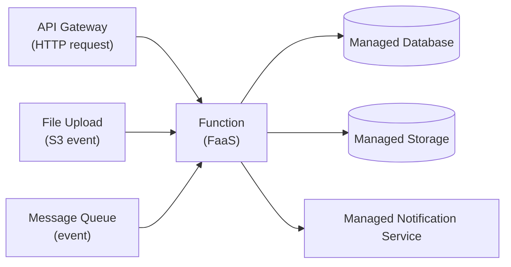

ลองนึกภาพการเดินทางสองแบบ แบบแรกคือ**ซื้อรถเป็นของตัวเอง** ต้องจ่ายค่าที่จอด ค่าประกัน ค่าบำรุงรักษาทุกเดือนไม่ว่าจะขับหรือไม่ขับ รถจอดนิ่งอยู่ในโรงจอดก็ยังเสียเงินอยู่ดี แบบที่สองคือ**เรียกรถผ่านแอป** จ่ายเฉพาะตอนที่นั่งจริง เรียกเมื่อไหร่มีรถมาเมื่อนั้น ไม่ต้องดูแลอะไรเองเลย แต่ถ้าย่านนั้นไม่มีใครเรียกรถมานาน คันแรกอาจต้องรอนานหน่อยเพราะคนขับต้องขับมาจากที่ไกล

เซิร์ฟเวอร์ก็มีสองแบบคล้ายกัน แบบแรกคือเช่า/ดูแล server ที่รันอยู่ตลอด 24 ชั่วโมง (**ซื้อรถเอง**) ไม่ว่าจะมี traffic เข้ามาหรือไม่ก็ต้องจ่ายค่าเครื่องอยู่ดี แบบที่สองคือ **Serverless** — เขียนโค้ดเป็นฟังก์ชันเล็กๆ วางไว้ แพลตฟอร์ม (AWS Lambda, Google Cloud Functions, Azure Functions) จะ "เรียกรถ" มาให้เองเมื่อมี event เข้ามาเท่านั้น รันเสร็จก็หายไป จ่ายเงินตามจำนวนครั้งที่เรียกจริง โมเดลการเขียนโค้ดแบบนี้เรียกว่า **FaaS (Function-as-a-Service)** ซึ่งเป็นแกนหลักของ Serverless Architecture

## รูปแบบการทำงาน: Trigger → Function → Managed Service

จุดสำคัญของ pattern นี้คือ function เองไม่ได้ "รอ" อะไรอยู่ตลอดเวลาแบบ server ทั่วไป มันถูกปลุกขึ้นมาทำงานเมื่อมี trigger เท่านั้น — HTTP request ผ่าน API Gateway, ไฟล์ใหม่ถูกอัปโหลดเข้า storage, หรือมี message เข้าคิว แล้วหลังจากประมวลผลเสร็จก็มักจะส่งต่อไปยัง managed service อื่น (database, storage, notification) ที่แพลตฟอร์ม cloud ดูแลให้ทั้งหมด ทีมงานไม่ต้องดูแล server ตัวไหนเลยตลอดทั้ง flow

## Cold Start คืออะไร

เมื่อ function ไม่ถูกเรียกมาสักพัก แพลตฟอร์มจะคืนทรัพยากรของ container ที่เคยเตรียมไว้กลับไป (เหมือนคนขับ Uber ขับออกไปไกลจากย่านนั้น) พอมี trigger ใหม่เข้ามา ต้องจัดสรร container ใหม่ โหลด runtime และโหลดโค้ดขึ้นมาก่อนเริ่มทำงานจริง ขั้นตอนนี้ใช้เวลาตั้งแต่หลักร้อยมิลลิวินาทีไปจนถึงหลักวินาที เรียกว่า **cold start** ถ้า function ถูกเรียกถี่ๆ ต่อเนื่อง container จะยังคง "อุ่น" (warm) อยู่และไม่เจอปัญหานี้ วิธีลดผลกระทบที่นิยมคือใช้ **provisioned concurrency** — จ่ายเงินเพิ่มให้แพลตฟอร์มเตรียม container อุ่นไว้ล่วงหน้าจำนวนหนึ่งเสมอ

## เหมาะกับอะไร ไม่เหมาะกับอะไร

Serverless เหมาะกับงานที่มี traffic แบบ **bursty** หรือ event-driven เช่น การประมวลผลรูปภาพหลังอัปโหลด, webhook handler, scheduled cron job, glue code เชื่อมระหว่าง managed service หลายตัว, หรือ API backend ที่ traffic ไม่สม่ำเสมอตลอดวัน

แต่ไม่เหมาะกับงานที่รันต่อเนื่องนาน (long-running) เพราะแต่ละแพลตฟอร์มมักจำกัดเวลา execute สูงสุด (เช่น AWS Lambda จำกัดที่ 15 นาที) และไม่เหมาะกับงานที่ต้องเก็บ **state** ใน memory ระหว่าง request ต่อเนื่องยาวๆ เช่น WebSocket connection ที่ค้างนาน หรือ in-memory cache แบบ persistent เพราะ function แต่ละ instance ควรถูกออกแบบให้เป็น stateless เก็บ state ทั้งหมดไว้ที่ managed service ข้างนอกแทน

อีกสองข้อที่มักถูกมองข้ามแต่สำคัญไม่แพ้กัน: **Vendor lock-in** — API และรูปแบบการเขียน function ของแต่ละ cloud provider (AWS Lambda, Google Cloud Functions, Azure Functions) ไม่เหมือนกัน ย้ายค่ายทีหลังมักต้องเขียนใหม่บางส่วน ต่างจาก container ที่ portable กว่ามาก และ **Cost inversion ที่ traffic สูงต่อเนื่อง** — ราคาต่อ request ของ serverless แพงกว่า server แบบ always-on เมื่อคิดต่อหน่วยงาน ถ้า traffic สม่ำเสมอสูงตลอดเวลา (ไม่ bursty) ต้นทุนรวมอาจแพงกว่าเช่า server ปกติเสียอีก — serverless คุ้มที่สุดตอน traffic ไม่สม่ำเสมอ ไม่ใช่ตอน traffic สูงคงที่

| มิติ | Serverless (FaaS) | Server แบบ always-on |
|---|---|---|
| โมเดลค่าใช้จ่าย | จ่ายตามจำนวนครั้ง/เวลาที่ execute จริง | จ่ายค่าเครื่องตลอดเวลาไม่ว่าจะมี traffic หรือไม่ |
| การ scale | scale อัตโนมัติตั้งแต่ศูนย์ถึงหลักพันได้เอง | ต้องตั้ง auto-scaling เอง หรือ provision ล่วงหน้า |
| Latency | มี cold start เป็นระยะ | เครื่องรันอยู่แล้ว ตอบสนองสม่ำเสมอกว่า |
| ระยะเวลาทำงานสูงสุด | จำกัด (เช่น 15 นาทีใน AWS Lambda) | ไม่จำกัด รันต่อเนื่องได้ |
| Statefulness | ควรเป็น stateless เก็บ state ที่ managed service ข้างนอก | เก็บ state ใน memory ได้ตามต้องการ |

ในการสัมภาษณ์งาน คำถามที่มักตามมาหลัง "รู้จัก Serverless ไหม" คือ "แล้วเมื่อไหร่ไม่ควรใช้" คำตอบที่ดีต้องพูดถึงข้อจำกัดเรื่อง execution time, statefulness, cold start, vendor lock-in และความเสี่ยงเรื่อง cost inversion ที่ traffic สูงต่อเนื่อง ควบคู่กับข้อดี ไม่ใช่บอกว่า Serverless ใช้ได้กับทุกงาน

## ADR ตัวอย่าง

> **Title:** ใช้ AWS Lambda สำหรับ pipeline ประมวลผลรูปภาพหลังอัปโหลด
> **Status:** Accepted
> **Context:** งาน resize/compress รูปเกิดขึ้นเป็น burst เฉพาะตอนผู้ใช้อัปโหลด ไม่สม่ำเสมอตลอดวัน และไม่ต้องการดูแล server ที่ว่างเปล่าเกินครึ่งวัน
> **Decision:** ใช้ S3 event trigger เรียก Lambda function ประมวลผลรูปแล้วเขียนผลลัพธ์กลับไปยัง S3 อีก bucket โดยไม่ตั้ง server แยกไว้เอง
> **Consequences:** ค่าใช้จ่ายลดลงมากในช่วงที่ traffic ต่ำ แต่ต้องยอมรับ cold start เล็กน้อยตอน trigger แรกหลังไม่มีการอัปโหลดนาน และต้องออกแบบ function ให้ execute จบภายในเวลาจำกัดของแพลตฟอร์ม
