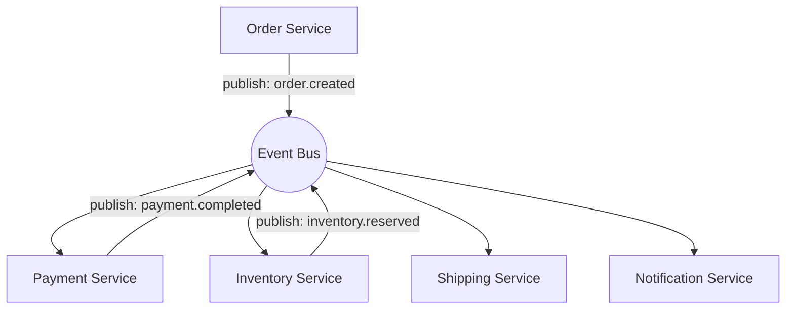

ลองนึกภาพวงดนตรีสองแบบ แบบแรกคือ**วงออร์เคสตรา**ที่มีวาทยกร (conductor) ยืนอยู่หน้าวง คอยยกไม้บาตองสั่งว่าเครื่องดนตรีชิ้นไหนต้องเล่นตอนไหน ดังแค่ไหน วาทยกรรู้จักและควบคุมทุกส่วนของเพลงอยู่คนเดียว อยากเปลี่ยนจังหวะทั้งวงก็แค่สั่งจากจุดเดียว

แบบที่สองคือ**วงแจ๊สที่ด้นสด** ไม่มีใครเป็นคนสั่ง นักดนตรีแต่ละคนฟังเสียงเพื่อนร่วมวงแล้วตอบสนองเอง มือกลองได้ยินมือเบสเปลี่ยนจังหวะก็ปรับตาม มือเปียโนได้ยินมือกลองเปลี่ยนก็ปรับตามอีกที ไม่มีใครควบคุมภาพรวมทั้งหมด แต่เพลงก็ยังออกมาเป็นเนื้อเดียวกันได้จากการที่แต่ละคน "ฟัง" และ "ตอบสนอง" ต่อกันเอง

ระบบซอฟต์แวร์ที่ออกแบบด้วยแนวคิด **Event-Driven** ก็เลือกได้ระหว่างสองแบบนี้เช่นกัน กลไกเบื้องหลังอย่าง event, pub/sub, message broker เราเรียนละเอียดไปแล้วในโมดูล Async & Messaging และคำว่า Choreography vs Orchestration เองก็เคยเจอมาแล้วตอนเรียน Saga pattern ในโมดูล Microservices & API Design — ที่นั่นมองจากมุม transactional rollback ข้ามหลาย service ส่วนบทนี้จะมองมุมใหม่: การประสานงานระหว่าง service แบบวงออร์เคสตรา หรือแบบวงแจ๊ส ส่งผลต่อ topology ขององค์กรและความเป็นเจ้าของของแต่ละทีมยังไง

## Choreography vs Orchestration

ไดอะแกรมด้านบนคือ **<mark class="hl-term">Choreography</mark>** — เหมือนวงแจ๊ส ไม่มี service ไหนสั่งใคร Order Service แค่ประกาศว่า "order ถูกสร้างแล้ว" ผ่าน event bus ส่วน Payment, Inventory, Shipping, Notification ต่างฟังและตัดสินใจทำงานของตัวเองอย่างอิสระ ไม่มี service ไหนรู้จัก flow ทั้งหมดตั้งแต่ต้นจนจบเลยด้วยซ้ำ ตรงข้ามกับ Choreography คือ **<mark class="hl-term">Orchestration</mark>** — เหมือนวงออร์เคสตรา มี service กลางหนึ่งตัว (มักเรียกว่า Saga Orchestrator) ทำหน้าที่เป็นวาทยกร คอยเรียก Payment Service ก่อน รอผลลัพธ์ แล้วค่อยเรียก Inventory Service ต่อ รู้จักและควบคุม flow ทั้งหมดจากจุดเดียว รวมถึงตัดสินใจว่าถ้าขั้นตอนไหนล้มเหลว ต้อง compensate (ย้อนกลับ) ยังไง

## ผลต่อ topology และขอบเขตของทีม

การเลือกระหว่างสองแบบนี้ไม่ใช่แค่รายละเอียดทางเทคนิค แต่เปลี่ยนหน้าตาขององค์กรและระบบไปพร้อมกัน ใน Choreography ไม่มี service ไหนรู้จัก flow ทั้งหมด แต่ละทีมเป็นเจ้าของ service ของตัวเองเต็มที่ เพิ่มหรือแก้ logic ในทีมตัวเองได้โดยไม่ต้องขอทีมอื่น (decentralized ownership) แต่ต้องแลกกับการ debug ที่ยากขึ้นมาก เพราะไม่มีที่เดียวให้ดู flow ทั้งหมด ต้องพึ่ง distributed tracing เพื่อตามรอย ส่วนใน Orchestration มีทีมเดียวเป็นเจ้าของ orchestrator ต้องเข้าใจและแก้ไขทุก step เวลาต้องการเปลี่ยน flow <mark class="hl-warning">ซึ่งถ้าออกแบบไม่ดีอาจกลายเป็นคอขวดคล้ายกับ ESB ในสถาปัตยกรรม SOA</mark> แต่แลกมาด้วยการมองเห็น flow ทั้งหมดได้จากจุดเดียว ทำให้ debug และ reason เกี่ยวกับระบบง่ายกว่ามาก

| มิติ | Choreography (วงแจ๊ส) | Orchestration (วงออร์เคสตรา) |
|---|---|---|
| จุดควบคุม | ไม่มี แต่ละ service ตัดสินใจเอง | มี orchestrator กลางควบคุม flow ทั้งหมด |
| Coupling | หลวมมาก แต่ละ service ไม่รู้จักกัน | service ต้องถูก orchestrator เรียกและรู้จัก |
| มองเห็น flow รวม | ยาก ต้องต่อ trace ข้ามหลาย service | ง่าย ดูจาก orchestrator ที่เดียว |
| ความเป็นเจ้าของทีม | กระจาย แต่ละทีมดูแล service ตัวเอง | รวมศูนย์ที่ทีมดูแล orchestrator |
| เหมาะกับ | flow ไม่ซับซ้อน ไม่ต้อง rollback หลายขั้น | flow ซับซ้อน ต้องการ retry/compensate ชัดเจน (Saga) |

ในการสัมภาษณ์งาน คำถามแนวนี้มักถามต่อว่า "ถ้า flow ซับซ้อนขึ้นเรื่อยๆ จะยังใช้ choreography ต่อไหม" คำตอบที่ดีคือชี้ให้เห็นว่าทั้งสองแบบไม่ใช่ทางเลือกตายตัว <mark class="hl-insight">ระบบใหญ่จำนวนมากเริ่มจาก choreography ในส่วนที่ง่าย แล้วค่อยดึงบาง flow ที่ซับซ้อนมาก (มี compensating transaction หลายขั้น) ออกมาทำเป็น orchestration แยกต่างหาก</mark>

## ADR ตัวอย่าง

> **Title:** ใช้ Choreography สำหรับ flow "สร้าง order" ของระบบ e-commerce
> **Status:** Accepted
> **Context:** ทีมแบ่งตาม service (Order, Payment, Inventory, Shipping) แต่ละทีมต้องการความเป็นอิสระในการ deploy และ flow ปัจจุบันไม่ซับซ้อนมาก ไม่ต้อง rollback ข้ามหลาย step
> **Decision:** ให้แต่ละ service publish/subscribe event ผ่าน event bus กลาง โดยไม่มี orchestrator ตัวกลาง
> **Consequences:** ทีมแก้ไข service ตัวเองได้อิสระ แต่ต้องลงทุนกับ distributed tracing ตั้งแต่ต้นเพื่อยังตามรอย flow ข้าม service ได้เวลาเกิดปัญหา และถ้า flow ซับซ้อนขึ้นในอนาคต (ต้องการ compensating transaction หลายขั้น) อาจต้องพิจารณากลับไปใช้ orchestration แทน
