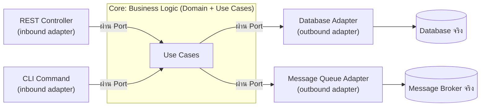

ลองนึกภาพตึกสำนักงานที่แบ่งเป็นชั้นๆ ชั้นบนสุดคือแผนกต้อนรับลูกค้า (UI) ชั้นกลางคือแผนกดำเนินธุรกิจ (Business Logic) และชั้นล่างสุดคือห้องเก็บเอกสาร (Data/Database) พนักงานชั้นต้อนรับต้องเดินลงไปที่แผนกธุรกิจก่อน แผนกธุรกิจถึงจะเดินลงไปห้องเก็บเอกสารได้อีกที ทุกอย่างเรียงลำดับจากบนลงล่างเป๊ะ — นี่คือโครงสร้างของ **<mark class="hl-term">Layered Architecture</mark>** (หรือ N-tier) ที่คุ้นเคยกันมานาน

ปัญหาคือถ้าห้องเก็บเอกสารชั้นล่างสุดเปลี่ยนระบบ (เช่น ย้ายจากตู้เอกสารกระดาษเป็นระบบสแกนดิจิทัล) พนักงานแผนกธุรกิจชั้นกลางอาจต้องเปลี่ยนวิธีทำงานตามไปด้วย เพราะเขาผูกวิธีทำงานของตัวเองไว้กับรูปแบบเฉพาะของห้องเก็บเอกสารชั้นล่างโดยตรง — <mark class="hl-warning">business logic ที่ควรจะเป็นแก่นของระบบ กลับ**พึ่งพา (depend on) รายละเอียดของ infrastructure** ที่ควรจะเป็นแค่รายละเอียดปลีกย่อยเท่านั้น</mark>

ลองเปลี่ยนมุมมองใหม่ นึกภาพ**ปลั๊กไฟบนผนังบ้าน** — ปลั๊กมีรูปทรงมาตรฐานตายตัว เครื่องใช้ไฟฟ้าอะไรก็ตามที่มีหัวปลั๊กพอดีกับรูนี้เสียบใช้งานได้ทันที จะเป็นพัดลม ทีวี หรือเครื่องชาร์จมือถือ ระบบไฟฟ้าในบ้าน (แกนกลาง) ไม่จำเป็นต้องรู้จักเครื่องใช้ไฟฟ้าแต่ละชนิดเลยด้วยซ้ำ รู้แค่รูปทรงปลั๊กมาตรฐานก็พอ — นี่คือแนวคิดของ **<mark class="hl-term">Hexagonal Architecture</mark>** (หรือ **Ports and Adapters**) และแนวคิดพี่น้องอย่าง **Clean Architecture** ที่กลับทิศทางการพึ่งพาทั้งหมด: business logic เป็นแกนกลางที่ไม่รู้จัก infrastructure เลย มีแค่ "รูปทรงปลั๊ก" มาตรฐาน (เรียกว่า **port** ซึ่งเป็น interface) ให้ของจริง (เรียกว่า **adapter** เช่น database adapter, REST adapter) มาเสียบแทน

## ปัญหาของ Layered Architecture แบบดั้งเดิม

Dependency ใน layered architecture ไหลทางเดียวจากบนลงล่าง: UI พึ่งพา Business Logic พึ่งพา Data Access ผลที่ตามมาคือ business logic มักเขียนโดยอ้างอิงชนิดข้อมูลหรือ library เฉพาะของ data layer ตรงๆ (เช่น ORM entity ที่ผูกกับ database ตัวใดตัวหนึ่ง) เวลาจะเขียน unit test สำหรับ business logic ล้วนๆ จึงมักต้องพึ่ง database จริงหรือ mock ที่ผูกกับ framework อยู่ดี และถ้าต้องเปลี่ยน database vendor หรือ framework ในอนาคต business logic ก็ได้รับผลกระทบไปด้วยทั้งที่ตรรกะทางธุรกิจไม่ได้เปลี่ยนเลยสักนิด

## Hexagonal พลิกทิศทาง dependency

หลักการสำคัญคือ **Dependency Inversion** — core (business logic) เป็นฝ่ายกำหนด **port** (interface) ว่าต้องการอะไรจากภายนอก เช่น "ฉันต้องการที่เก็บข้อมูล order" โดยไม่สนใจว่าจะเก็บใน PostgreSQL, MongoDB หรือไฟล์ธรรมดา ส่วน **adapter** ตัวจริง (database adapter, REST controller, message queue adapter) เป็นฝ่ายต้อง implement ตาม port นั้นแทน ไม่ใช่ให้ core ไปพึ่งพา adapter โดยตรงเหมือน layered ทั่วไป แนวคิด **Clean Architecture** ของ Robert C. Martin ก็อยู่บนหลักการเดียวกัน เพียงวาดเป็นวงกลมซ้อนกัน (entities อยู่ในสุด ถัดมาคือ use case แล้วค่อยเป็น adapter ชั้นนอกสุด) กฎที่ใช้ร่วมกันคือ **<mark class="hl-insight">dependency ต้องชี้เข้าหาศูนย์กลางเสมอ</mark>** ไม่มีทางย้อนออกไปนอกได้



```demo
component: ComparisonDiagram
props: {"left":{"title":"Layered / N-tier","points":["Dependency ไหลทางเดียวจากบนลงล่าง UI → Business → Data","Business logic ผูกกับรายละเอียด infrastructure โดยตรง (เช่น ORM entity เฉพาะ database)","เข้าใจง่าย เริ่มต้นเร็ว เหมาะกับระบบเล็กไม่ซับซ้อน","เปลี่ยน infrastructure (database, framework) กระทบ business logic ตามไปด้วย"]},"right":{"title":"Hexagonal / Clean Architecture","points":["Dependency ทุกทิศทางชี้เข้าหา core เสมอ (Dependency Inversion)","Business logic ไม่รู้จัก infrastructure เลย รู้แค่ port (interface)","Test business logic ได้โดยไม่ต้องพึ่ง database จริง (mock ที่ port)","สลับ infrastructure (เปลี่ยน database, เพิ่ม adapter ใหม่) ได้โดยไม่แตะ business logic"]},"note":"ไม่ได้แปลว่า Hexagonal ดีกว่าเสมอ — โปรเจกต์เล็กที่ไม่คาดว่าจะเปลี่ยน infrastructure บ่อย layered ธรรมดาก็เพียงพอและเร็วกว่าในการเริ่มต้น"}
```

| มิติ | Layered (N-tier) | Hexagonal / Clean Architecture |
|---|---|---|
| ทิศทาง dependency | บนลงล่าง ชั้นบนพึ่งพาชั้นล่าง | ทุกทิศทางชี้เข้าหา core (Dependency Inversion) |
| Testability | ทดสอบ business logic มักต้องพึ่ง DB จริงหรือ mock ที่ผูกกับ framework | mock แค่ port (interface) ทดสอบ core ได้อิสระจาก infrastructure |
| ความเร็วในการเริ่มต้น | เร็วกว่า เข้าใจง่ายกว่า | ใช้เวลาออกแบบ interface/port เพิ่มตั้งแต่แรก |
| ความยืดหยุ่นต่อการเปลี่ยน infra | ต่ำ เปลี่ยน database/framework กระทบ business logic | สูง สลับ adapter ได้โดยไม่แตะ core |
| เหมาะกับ | ระบบเล็ก-กลาง ไม่คาดว่าจะเปลี่ยน infra บ่อย | ระบบที่ business logic ซับซ้อน อายุยืน ต้องทดสอบหนักและอาจเปลี่ยน infra |

ในการสัมภาษณ์งาน คำถามแนวนี้มักตามด้วย "แล้วทุกโปรเจกต์ควรใช้ Hexagonal เลยไหม" คำตอบที่ดีคือชี้ว่ามันมีต้นทุนตั้งแต่วันแรก (ต้องออกแบบ interface เพิ่ม) ควรใช้เมื่อ business logic ซับซ้อนพอ อายุระบบยาว และมีความเป็นไปได้จริงที่จะเปลี่ยน infrastructure ในอนาคต ไม่ใช่ใช้เพราะมันเป็น "best practice" ที่ต้องทำเสมอ

## ADR ตัวอย่าง

> **Title:** ใช้ Hexagonal Architecture สำหรับ core billing engine
> **Status:** Accepted
> **Context:** billing engine มี business rule ซับซ้อนมาก ต้องเทสละเอียด และคาดว่าจะต้องรองรับ payment gateway หลายเจ้าในอนาคต
> **Decision:** แยก business logic ให้เป็น core ที่ไม่รู้จัก infrastructure เลย กำหนด port สำหรับ payment gateway และ repository แล้วให้แต่ละ gateway จริงเป็น adapter ที่ implement port นั้น
> **Consequences:** เขียน unit test business logic ได้เร็วและไม่ต้องพึ่ง sandbox ของ payment gateway จริง แต่ต้องลงทุนเวลาออกแบบ interface ตั้งแต่ต้น และทีมใหม่ต้องใช้เวลาทำความเข้าใจโครงสร้างเพิ่มขึ้นเล็กน้อยเทียบกับ layered ธรรมดา
