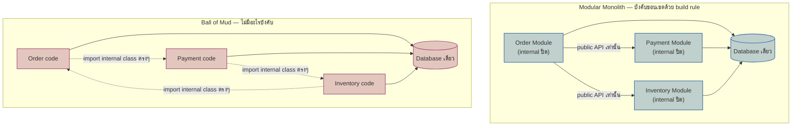

ลองนึกภาพบริษัทที่เช่าตึกสำนักงานตึกเดียว มีสองแบบให้เลือกจัดพื้นที่ภายใน แบบแรกทุบผนังทิ้งหมดทำเป็นห้องโล่งใบเดียว พนักงานฝ่ายไหนก็เดินไปหยิบเอกสารของฝ่ายอื่นได้ตลอดเวลาโดยไม่ต้องขออนุญาต แบบที่สองกั้นเป็นห้องแยกฝ่ายชัดเจน แต่ละห้องมีประตูกุญแจของตัวเอง ฝ่ายบัญชีจะเข้าห้องฝ่ายขายได้ต้องผ่านประตูที่มีระเบียบรองรับเท่านั้น ทั้งสองแบบยังอยู่ตึกเดียวกัน เดินถึงกันได้โดยไม่ต้องออกไปนอกตึก แต่มีวินัยเรื่องขอบเขตคนละเรื่องกันโดยสิ้นเชิง

สถาปัตยกรรมแบบห้องกั้นชัดเจนแต่ยังอยู่ตึกเดียวนี้คือแนวคิดที่เรียกว่า <mark class="hl-term">Modular Monolith</mark> — Monolith ที่แบ่งเป็น module ภายในอย่างมีวินัย แต่ละ module มีขอบเขตชัดเจนเหมือน microservice ทุกประการ ยกเว้นอย่างเดียวคือไม่ได้แยก deploy เป็นคนละ process เรียกกันในโค้ดเดียวกันได้โดยตรง แต่ห้ามข้ามเข้าไปแตะ internal ของอีก module เด็ดขาด ต้องผ่านทางเข้าที่ module นั้นเปิดให้เท่านั้น บทนี้ต่อยอดจากหัวข้อ Monolith vs Microservices ที่เรียนไปแล้ว โดยเจาะเฉพาะทางเลือกที่สามที่มักถูกมองข้าม — ไม่ใช่ต้องเลือกระหว่างสุดขั้วสองแบบเท่านั้น

## อะไรทำให้ Monolith "Modular" ต่างจาก Monolith ก้อนโคลน

Monolith ทุกก้อนเริ่มต้นด้วยเจตนาดี แต่ถ้าไม่มีอะไรบังคับขอบเขตไว้ตั้งแต่แรก มันมักจบลงที่สภาพที่เรียกกันในวงการว่า **ball of mud** — ทุกไฟล์ import ข้ามกันได้อิสระ ฟังก์ชันของ module หนึ่งถูกเรียกตรงจากอีกสิบที่ทั่ว codebase โดยไม่มีใครรู้ทั้งหมดว่าใครพึ่งพาอะไรอยู่บ้าง <mark class="hl-warning">ผลคือพอระบบโตขึ้น ไม่มีใครกล้าแก้โค้ดเก่า เพราะไม่รู้ว่าการเปลี่ยนแปลงจุดเดียวจะกระเพื่อมไปกระทบส่วนไหนบ้าง</mark>

Modular Monolith แก้ปัญหานี้ด้วยการบังคับขอบเขตภายใน ไม่ใช่แค่ "ตั้งใจจะจัดระเบียบ" แต่บังคับจริงด้วยกลไกสองชั้น:

1. **โครงสร้าง package/folder** — แต่ละ domain (Order, Payment, Inventory) อยู่ในของตัวเอง มี public interface ที่เปิดให้เรียกชัดเจน ส่วนที่เหลือถือเป็น internal
2. **กฎ lint/build ที่ปฏิเสธการ import ข้าม internal** — เช่น dependency-cruiser, ArchUnit, หรือ ESLint boundary rule ที่ทำให้ build แดงทันทีถ้ามีใคร import class internal ของ module อื่นตรงๆ

ข้อแรกอย่างเดียวไม่พอ เพราะโครงสร้างโฟลเดอร์เป็นแค่ข้อตกลงทางสายตา ใครจะ import ข้ามยังไงก็ได้ถ้าภาษาไม่ห้าม ข้อสองต่างหากที่ทำให้ขอบเขตเป็นของจริงที่ตรวจสอบได้อัตโนมัติ

## ได้วินัยขอบเขตแบบ Microservices โดยไม่ต้องแบกต้นทุนเครือข่าย

<mark class="hl-insight">จุดที่ Modular Monolith น่าสนใจคือมันเก็บประโยชน์หลักของ microservices ไว้ได้ — ขอบเขตความรับผิดชอบชัดเจน ไม่มีใครแอบเข้าไปแก้ internal ของอีกทีมได้เงียบๆ — โดยไม่ต้องแบกต้นทุนของระบบกระจาย (distributed system) เลย</mark> ไม่มี network call ระหว่าง module ไม่มี eventual consistency ที่ต้องจัดการ ยัง deploy เป็นหน่วยเดียว และยังใช้ transaction เดียวของ database เดียวข้าม module ได้ตามปกติ



สังเกตว่าทั้งสองฝั่งมี database เดียวกันเหมือนกัน ความต่างไม่ได้อยู่ที่ network topology แต่อยู่ที่ว่า "การเรียกข้าม module ถูกบังคับให้ผ่านทางที่กำหนดไว้หรือไม่" นี่คือสิ่งที่แยก Modular Monolith ออกจากทั้ง ball of mud และ microservices — ได้วินัยของฝั่งขวา (microservices) แต่ยังคงความง่ายในการ debug และ deploy ของฝั่งซ้าย (monolith)

## เมื่อไหร่ควรเลือก Modular Monolith แทนที่จะกระโดดไป Microservices ทันที

การแตกเป็น microservices ตั้งแต่วันแรกมีต้นทุนที่มักถูกมองข้าม โดยเฉพาะเมื่อสามเงื่อนไขนี้ยังไม่ครบ:

- **ทีมยังเล็ก** — ทีมเดียวหรือไม่กี่คนยังสื่อสารกันเองได้ทั่วถึง ยังไม่มีปัญหาการ deploy ชนกันที่ microservices แก้ได้จริง
- **ขอบเขต domain ยังไม่นิ่ง** — ถ้ายังไม่รู้ bounded context ที่แท้จริง การแตก service ตอนนี้มักแตกผิดที่ แล้วต้องมาแก้ทีหลังผ่าน network ซึ่งแพงกว่าการย้าย module ภายใน codebase เดียวมาก
- **ไม่มีทีม platform/infra ที่ดูแล service จำนวนมากได้** — microservices ต้องการ CI/CD หลาย pipeline, observability ที่ตามรอยข้าม service, และคนที่ดูแล operational overhead นั้นตลอดเวลา ถ้ายังไม่มี ต้นทุนจะสูงกว่าประโยชน์ที่ได้ทันที

Modular Monolith จึงเป็นจุดกึ่งกลางที่ตั้งใจเลือก ไม่ใช่ทางเลือกที่ด้อยกว่าเพราะ "ยังทำ microservices ไม่ได้" — มันคือการเลื่อนต้นทุนของระบบกระจายออกไปจนกว่าจะมีเหตุผลจริงที่ต้องจ่าย ในขณะที่ยังคงฝึกวินัยเรื่องขอบเขตไว้ล่วงหน้า ถ้าวันหนึ่ง module ไหนต้อง scale แยกจริง การดึงออกไปเป็น service ก็ทำได้ง่ายกว่ามาก เพราะขอบเขต public interface ถูกกำหนดไว้ชัดอยู่แล้ว

```demo
component: StepThroughDiagram
props: {"steps":[{"label":"Monolith ก้อนโคลน (Ball of Mud)","detail":"ทุกส่วนของโค้ด import ข้ามกันได้อิสระ ไม่มีอะไรบังคับขอบเขต พอระบบโตขึ้นไม่มีใครกล้าแก้โค้ดเก่าเพราะไม่รู้ว่าจะกระทบตรงไหนบ้าง"},{"label":"Modular Monolith","detail":"แบ่งเป็น module ตาม domain แต่ละ module เปิดเฉพาะ public interface ให้เรียก internal ถูกปิดด้วย build rule/lint ยัง deploy เป็นก้อนเดียว ไม่มี network call ระหว่าง module"},{"label":"Microservices","detail":"แยก module ออกเป็น service คนละ process คนละ deploy pipeline ได้ขอบเขตที่เข้มขึ้นไปอีก แต่แลกกับ network call, eventual consistency และทีม infra ที่ต้องดูแล service จำนวนมาก"}]}
```

## ความเสี่ยง: ขอบเขตกร่อนเงียบๆ ถ้าไม่มีอะไรบังคับ

Modular Monolith ไม่ได้ปลอดภัยโดยธรรมชาติตลอดไป <mark class="hl-warning">ถ้าไม่มีกลไกอัตโนมัติคอยตรวจ ขอบเขตระหว่าง module จะกร่อนไปเรื่อยๆ แบบเงียบๆ — เริ่มจาก import ข้าม internal "แค่ครั้งเดียว เดี๋ยวไปแก้ทีหลัง" แล้วค่อยๆ กลายเป็นเรื่องปกติจนระบบกลับไปเป็น ball of mud แบบเดิมโดยไม่มีใครสังเกตทัน</mark> เพราะ code review เพียงอย่างเดียวพึ่งพาความจำและวินัยส่วนบุคคลของทุกคนตลอดไป ไม่ scale เมื่อทีมโตขึ้น

ทางแก้คือย้ายการตรวจขอบเขตออกจากคนไปเป็นเครื่องมืออัตโนมัติที่รันใน CI ทุกครั้ง ซึ่งเป็นแนวคิดที่เรียกว่า <mark class="hl-term">Fitness Function</mark> — architecture test ที่ตรวจสอบกฎเชิงโครงสร้างของระบบโดยอัตโนมัติ รายละเอียดเต็มอยู่ในโมดูล Architecture Documentation & Views ถัดไป

| ปัจจัย | Modular Monolith | Microservices |
|---|---|---|
| ความชัดเจนของขอบเขต | บังคับด้วย build rule/lint ภายใน codebase เดียว | บังคับด้วยขอบเขต process/network จริง |
| การเรียกข้าม module | เรียก function ในโปรเซสเดียวกัน ไม่มี network call | ต้องผ่าน network (HTTP/gRPC/message queue) |
| Transaction ข้าม module | ใช้ transaction เดียวของ database เดียวได้ | ต้องจัดการ eventual consistency เอง (เช่น saga) |
| หน่วย deploy | ก้อนเดียว deploy พร้อมกันทั้งหมด | แยก deploy ต่อ service อิสระ |
| ต้นทุน operational | ต่ำ ไม่ต้องมีทีม infra ดูแลหลาย service | สูง ต้องมี CI/CD และ observability หลายชุด |
| ความเสี่ยงถ้าขาดวินัย | ขอบเขตกร่อนเงียบๆ กลับไปเป็น ball of mud ได้ | ขอบเขตถูกบังคับทางกายภาพ กร่อนยากกว่า |

## มุมมองตอนสัมภาษณ์งาน

คำถามสัมภาษณ์: "ทีมใช้ Modular Monolith มาสองปี ตอนนี้เริ่มมีคน import ข้าม module กันตรงๆ เยอะขึ้นเรื่อยๆ จะแก้ยังไง" คำตอบระดับ surface คือ "เตือนใน code review ให้เข้มขึ้น" ซึ่งแก้แค่อาการ เพราะพึ่งพาความจำและความเข้มงวดของคนตรวจแต่ละคน ไม่ scale เมื่อทีมโตหรือคนเปลี่ยนหน้า คำตอบระดับ senior ที่แก้ที่ต้นเหตุคือต้องมีกลไกอัตโนมัติบล็อกการ import ข้าม internal ตั้งแต่ build time ผูกเข้ากับ CI ให้ build แดงทันทีที่มีการข้ามขอบเขต ไม่ใช่พึ่งคนตรวจเองทุกครั้ง

## ADR ตัวอย่าง

> **Title:** ใช้ Modular Monolith สำหรับระบบ order management ใหม่ แทนการแตก microservices ตั้งแต่ต้น
> **Status:** Accepted
> **Context:** ทีมมีวิศวกร 6 คน โดเมนธุรกิจยังไม่นิ่ง (ปรับ business rule รายสัปดาห์) และยังไม่มีทีม infra แยกที่ดูแล service หลายตัวได้
> **Decision:** สร้างเป็น Monolith เดียว แต่แบ่งเป็น module ตาม bounded context (Order, Payment, Inventory) บังคับด้วย build rule ที่ปฏิเสธการ import ข้าม internal package ของ module อื่น เปิดให้เรียกได้เฉพาะ public interface ที่ประกาศไว้เท่านั้น
> **Consequences:** ยัง deploy หน่วยเดียว debug ง่าย ไม่มี network call ระหว่าง module แต่ทีมต้องรักษาวินัยเรื่อง build rule ต่อเนื่อง ถ้า module ไหนโตจนต้อง scale แยกจริงในอนาคต ก็ดึงออกเป็น service ได้ง่ายกว่าดึงจาก ball of mud มาก เพราะขอบเขตถูกกำหนดไว้ชัดตั้งแต่แรก
