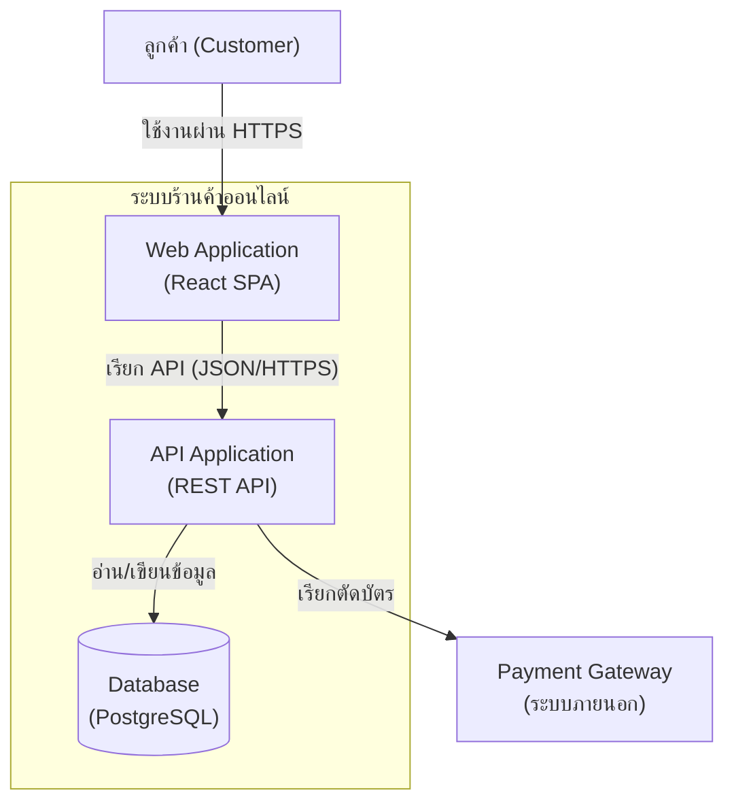

เปิด Google Maps ขึ้นมาแล้วลอง zoom out ไปเรื่อยๆ จนเห็นทั้งโลก จะเห็นแค่เส้นแบ่งประเทศคร่าวๆ ไม่มีถนนสักเส้น ไม่มีตึกสักหลังให้เห็น — พอ zoom เข้ามาระดับเมือง เริ่มเห็นเขตต่างๆ ถนนสายหลัก สนามบิน แต่ยังไม่เห็นรายละเอียดข้างในตึกแต่ละหลัง ต้อง zoom เข้าไปอีกถึงจะเห็นตัวตึกแยกเป็นหลังๆ ทางเข้า ที่จอดรถ และถ้าเปิด Street View เดินเข้าไปใกล้ๆ ถึงจะเห็นรายละเอียดจริงอย่างป้ายร้านหรือวัสดุกำแพง

สังเกตว่าคำถาม "แผนที่นี้ดีหรือเปล่า" ตอบไม่ได้เลยถ้าไม่รู้ก่อนว่าจะเอาไปใช้ดูอะไร — นักท่องเที่ยวที่แค่อยากรู้ว่าจะบินจากกรุงเทพไปโตเกียวยังไง ต้องการแค่ระดับ zoom out เห็นประเทศ เห็นเส้นทางบิน ส่วนคนขับส่งของที่ต้องไปให้ถึงบ้านเลขที่จริง ต้องการ zoom เข้าระดับถนน แผนที่ระดับเดียวใช้ตอบทุกคำถามไม่ได้ ต้องมีหลายชั้นให้แต่ละคนเลือกซูมตามที่ตัวเองต้องการ

เอกสารสถาปัตยกรรมซอฟต์แวร์ก็เจอปัญหาแบบเดียวกันเป๊ะ ผู้บริหารที่อยากรู้ว่าระบบเชื่อมกับระบบภายนอกอะไรบ้างไม่ต้องการเห็น diagram ที่มี class เป็นร้อยกล่องเต็มหน้าจอ แต่ developer ที่ต้องแก้บั๊กในโมดูลหนึ่งกลับต้องการรายละเอียดขนาดนั้นจริงๆ ถ้าใช้ diagram เดียวพยายามตอบทุกคำถามพร้อมกัน สุดท้ายมันจะรกจนไม่มีใครกล้าเปิดดู Simon Brown เลยเสนอวิธีมาตรฐานที่ให้ "ซูม" แผนที่สถาปัตยกรรมได้เป็นชั้นๆ เหมือน Google Maps เรียกว่า **C4 Model** ย่อมาจากสี่ระดับ Context, Container, Component, Code

C4 กับ **4+1 View Model** (หัวข้อถัดไปในโมดูลนี้) มักถูกสับสนกันเพราะทั้งคู่เป็น "framework สำหรับมองสถาปัตยกรรมหลายมุม" เหมือนกัน — แต่ C4 ซูมตาม**ระดับความละเอียดของโครงสร้าง** (โครงสร้างเดียวกัน มองหยาบ/ละเอียดต่างกัน) ส่วน 4+1 แยกตาม**ประเภทคำถามที่ต่างกันโดยสิ้นเชิง** (โครงสร้างโดเมน vs. การรันจริง vs. โค้ด vs. hardware) ใช้คนละมุมกัน ไม่ใช่คนละระดับความละเอียด — สองอันนี้ใช้**ประกอบกัน**ได้ ไม่ใช่เลือกอย่างใดอย่างหนึ่ง

## ซูมทีละชั้น: 4 ระดับของ C4 Model

ลองไล่ทั้ง 4 ระดับผ่านตัวอย่างระบบเดียวกัน — ระบบร้านค้าออนไลน์ — จะเห็นชัดว่าแต่ละระดับให้รายละเอียดต่างกันแค่ไหน

```demo
component: StepThroughDiagram
props: {"steps":[{"label":"1. System Context — มองจากดาวเทียม","detail":"เหมือน Google Maps ตอน zoom out จนเห็นทั้งประเทศ ระดับนี้มองระบบทั้งก้อนเป็นกล่องเดียว ไม่สนใจว่าข้างในทำงานยังไง เห็นแค่ว่าระบบร้านค้าออนไลน์คุยกับใครบ้าง เช่น ลูกค้า (Customer), Payment Gateway, และ Email Service ที่เป็นระบบภายนอก เหมาะสำหรับผู้บริหารหรือทีมอื่นที่อยากรู้ภาพรวมแบบเร็วๆ ไม่ต้องมีพื้นฐานเทคนิคก็อ่านเข้าใจ"},{"label":"2. Container — มองระดับเมือง","detail":"zoom เข้ามาอีกขั้นจนเห็นเขตต่างๆ ในเมือง ระดับนี้แตกกล่องเดียวจาก Context ออกเป็นหน่วยที่ deploy แยกกันได้จริง (คำว่า container ในที่นี้ไม่ใช่ Docker) เช่น Web Application, Mobile App, API Application, Database และแสดงว่าแต่ละหน่วยคุยกันด้วย protocol อะไร เหมาะสำหรับ tech lead หรือ architect ที่ต้องตัดสินใจเรื่อง deployment และ tech stack"},{"label":"3. Component — มองผังภายในตึกหลังเดียว","detail":"zoom เข้าไปในหนึ่ง container เช่น API Application เพื่อดูว่าข้างในแบ่งเป็นโมดูลใหญ่ๆ อะไรบ้าง เช่น Order Controller, Payment Service, Inventory Service เหมือนดูผังห้องภายในตึกหลังเดียว เหมาะสำหรับ developer ที่กำลังจะทำงานหรือแก้บั๊กใน container นั้นโดยเฉพาะ"},{"label":"4. Code — มองระดับอิฐแต่ละก้อน","detail":"ซูมสุดจนเห็น class, interface, method จริงในโค้ด เหมือนเปิด Street View เดินเข้าไปดูวัสดุกำแพงทีละก้อน ระดับนี้ละเอียดมากจนแทบไม่มีใครวาดมือ ส่วนใหญ่ปล่อยให้ IDE generate class diagram ให้เวลาต้องใช้จริงๆ เท่านั้น"}]}
```

จะเห็นว่ายิ่งซูมเข้าไปลึก จำนวนคนที่อ่าน diagram นั้นออก (และสนใจอ่าน) ก็ยิ่งแคบลง แต่รายละเอียดที่ได้ก็ยิ่งลึกขึ้นตาม — นี่คือเหตุผลที่ C4 Model ไม่ได้บอกให้วาด diagram เดียวที่สมบูรณ์แบบ แต่ให้เตรียมชุด diagram ไว้หลายระดับ แล้วเลือกหยิบระดับที่ตรงกับคำถามของคนอ่านตรงหน้า

## เลือกซูมระดับไหน ให้ตรงกับคนอ่าน

| ระดับ | แสดงอะไร | คนอ่านหลัก | อัปเดตบ่อยแค่ไหน |
|---|---|---|---|
| Context | ระบบทั้งก้อนเป็นกล่องเดียว + actor/ระบบภายนอก | ผู้บริหาร, stakeholder ที่ไม่ใช่สายเทค, ทีมอื่นที่ต้อง integrate | นานๆ ครั้ง — เปลี่ยนแค่ตอนมี integration ใหม่ |
| Container | แอปพลิเคชัน/service/database ที่ deploy แยกกันจริง | tech lead, architect, DevOps | เปลี่ยนตาม deployment หรือ tech stack ที่เลือกใหม่ |
| Component | โมดูลภายใน 1 container | developer ที่ทำงานอยู่ใน container นั้น | เปลี่ยนตามการ refactor ภายใน |
| Code | class/interface จริงในโค้ด | developer เฉพาะจุดที่ตรรกะซับซ้อนมากจริงๆ | แทบไม่วาดเอง มักให้ IDE generate เวลาต้องใช้ |

ในทางปฏิบัติ ทีมส่วนใหญ่วาดแค่ Context กับ Container ไว้เป็นเอกสารถาวร เพราะสองระดับนี้เปลี่ยนไม่บ่อยและตอบคำถาม "ระบบนี้ทำงานร่วมกับอะไรบ้าง" ได้ครบแล้ว ส่วน Component และ Code มักวาดแบบ ad-hoc เฉพาะตอนต้องอธิบายส่วนที่ซับซ้อนจริงๆ เพราะถ้าพยายามรักษา diagram ระดับ Code ให้ตรงกับโค้ดตลอดเวลา จะกลายเป็นภาระที่ไม่มีใครตามอัปเดตทัน

## ตัวอย่าง Container Diagram: ระบบร้านค้าออนไลน์



diagram นี้ตอบคำถามระดับ "ระบบนี้ประกอบด้วยอะไรบ้าง และแต่ละชิ้นคุยกันยังไง" ได้ในหน้าเดียว โดยไม่ต้องรู้เลยว่า API Application ข้างในมี class อะไรบ้าง — นี่คือจุดแข็งของ Container diagram เวลาต้อง onboard คนใหม่ให้เข้าใจภาพรวมระบบภายใน 5 นาที

## ใช้ยังไงในทีมจริง

หลายทีมใช้เครื่องมืออย่าง Structurizr หรือแค่ diagram-as-code (เช่น Mermaid หรือ PlantUML เก็บในเดียวกับ repo) เพื่อให้ diagram อัปเดตพร้อมกับโค้ดผ่าน pull request แทนที่จะวาดใน tool กราฟิกแยกต่างหากซึ่งมักหลุดจากความจริงภายในไม่กี่เดือน ในสาย interview ระบบสถาปัตยกรรม (system design interview) การพูดว่า "ผมจะเริ่มจาก Context diagram ก่อน แล้วค่อย zoom เข้า Container" เป็นสัญญาณที่ดีมากว่าผู้สมัครเข้าใจว่าจะสื่อสารความซับซ้อนของระบบให้คนละกลุ่มฟังยังไง แทนที่จะโดดไปวาดรายละเอียด service ทันทีโดยไม่ปูภาพรวมก่อน

## ADR ตัวอย่าง

> **Title:** ADR-007: ใช้ C4 Model เป็นมาตรฐานเอกสารสถาปัตยกรรมของทีม
> **Status:** Accepted
> **Context:** ทีมมี diagram สถาปัตยกรรมกระจัดกระจายหลายแบบ บางอันวาดใน Figma บางอันเป็นภาพในสไลด์เก่า ไม่มีมาตรฐานร่วม ทำให้ตีความไม่ตรงกันเวลาสื่อสารกับทีมอื่นหรือ onboard engineer ใหม่
> **Decision:** ใช้ C4 Model เป็นมาตรฐาน โดยเก็บ Context กับ Container diagram เป็น Mermaid ไว้ใน repo คู่กับโค้ด ส่วน Component/Code diagram วาดเฉพาะตอนจำเป็น ไม่บังคับดูแลถาวร
> **Consequences:** ทุกทีมต้องเรียนรู้สัญลักษณ์ C4 เบื้องต้น แลกกับการมี diagram ที่อัปเดตง่ายผ่าน PR และภาพรวมระบบที่คนกลุ่มต่างกันอ่านแล้วเข้าใจตรงกัน
