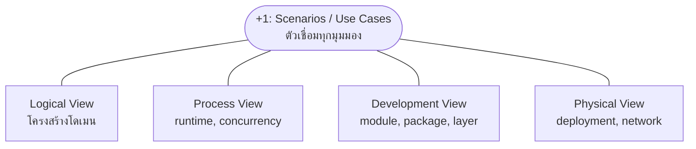

ลองนึกภาพทีมสร้างบ้านหลังหนึ่ง สถาปนิกไม่ได้ส่งพิมพ์เขียวแผ่นเดียวให้ทุกคนใช้ร่วมกัน — ช่างไฟต้องการแบบวงจรไฟฟ้า วิศวกรโครงสร้างต้องการแบบเสาเข็มกับคาน ทีมขอใบอนุญาตก่อสร้างต้องการผังไซต์งานว่าตัวบ้านตั้งอยู่ตรงไหนของที่ดิน ส่วนเจ้าของบ้านเองอยากได้แค่ภาพห้องแต่ละห้องว่าจะใช้ทำอะไร แต่ละคนดูพิมพ์เขียวคนละแผ่น เพราะสนใจคนละมุมของ "บ้านหลังเดียวกัน"

ปัญหาคือถ้าพิมพ์เขียวแต่ละแผ่นถูกวาดแยกกันโดยไม่มีอะไรมาเช็คว่าสอดคล้องกันจริง อาจเจอเรื่องขำไม่ออกแบบเสาโครงสร้างตั้งอยู่ตรงกลางห้องนอนพอดี หรือท่อประปาตัดผ่านตำแหน่งที่แบบไฟฟ้าวางปลั๊กไว้ วิธีแก้ที่สถาปนิกมืออาชีพใช้คือพา "การเดินสำรวจบ้านจริงตามกิจวัตรประจำวัน" มาเทียบกับพิมพ์เขียวทุกแผ่นพร้อมกัน ตื่นนอนเดินไปห้องน้ำ เดินไปครัว เปิดไฟ เปิดน้ำ — ถ้าขั้นตอนพวกนี้ไหลลื่นในทุกแบบพร้อมกัน แปลว่าพิมพ์เขียวสอดคล้องกันจริง

สถาปัตยกรรมซอฟต์แวร์ก็มีปัญหาแบบเดียวกัน — โดเมนโมเดล, การรันจริงตอน production, การจัดโครงสร้างซอร์สโค้ด, และการวาง server จริง ล้วนเป็น "มุมมอง" ของระบบเดียวกันแต่ตอบคนละคำถาม Philippe Kruchten เสนอวิธีจัดระเบียบมุมมองเหล่านี้อย่างเป็นระบบ เรียกว่า **<mark class="hl-term">4+1 View Model</mark>** — สี่มุมมองหลัก บวกมุมมองที่ห้าที่ทำหน้าที่เหมือนการเดินสำรวจบ้านจริง คอยเช็คว่าทุกมุมมองสอดคล้องกัน

ต่างจาก **C4 Model** (หัวข้อก่อนหน้า) ที่ซูมตามระดับความละเอียดของโครงสร้างเดียวกัน 4+1 แยกตามประเภทคำถามที่ต่างกันโดยสิ้นเชิง (โดเมน vs. runtime vs. โค้ด vs. hardware) — ใช้ประกอบกับ C4 ได้ เช่น ใช้ C4 Container diagram เป็นส่วนหนึ่งของ Physical View

## ห้ามุมมองของระบบเดียวกัน

```demo
component: StepThroughDiagram
props: {"steps":[{"label":"1. Logical View — โครงสร้างโดเมน","detail":"เหมือนพิมพ์เขียวผังห้องของบ้าน บอกว่าบ้านมีห้องอะไรบ้างและห้องไหนเชื่อมกับห้องไหน Logical View แสดง object, class, และความสัมพันธ์ของโดเมนที่ระบบต้องรองรับ (functional requirement) เขียนให้นักวิเคราะห์และ developer ที่ต้องออกแบบโมเดลข้อมูลใช้เป็นหลัก"},{"label":"2. Process View — การไหลตอน runtime","detail":"เหมือนแผนผังเส้นทางเดินของคนในบ้านตอนใช้งานจริง ใครเดินผ่านห้องไหนตอนไหน ชนกันไหม Process View แสดงว่า process หรือ thread ไหนคุยกับอะไรตอนระบบรันจริง จัดการเรื่อง concurrency, performance, และ availability เขียนให้ system integrator ที่ต้องประกอบส่วนต่างๆ เข้าด้วยกันใช้"},{"label":"3. Development View — การจัดโครงสร้างซอร์สโค้ด","detail":"เหมือนแบบแปลนที่ช่างก่อสร้างใช้แบ่งงานเป็นชุดๆ ทีมไฟฟ้าดูแบบไฟฟ้า ทีมประปาดูแบบประปา Development View แสดงว่าโค้ดถูกแบ่งเป็น module, package, layer อะไรบ้าง ใครดูแลส่วนไหน เขียนให้ programmer และทีมที่ดูแล build หรือ config management ใช้จัดงาน"},{"label":"4. Physical View — ผังการวางจริง","detail":"เหมือนผังไซต์งานที่บอกว่าตึกตั้งอยู่ตรงไหนของที่ดิน ท่อน้ำเดินใต้ดินยังไง Physical View หรือ Deployment View แสดงว่า software แต่ละส่วนรันอยู่บน server หรือ node ไหน เครือข่ายเชื่อมกันยังไง เขียนให้ system engineer และทีม ops ใช้วางแผนเรื่อง availability และ scalability ของฮาร์ดแวร์จริง"},{"label":"+1. Scenarios — เดินผ่านสถานการณ์จริงเพื่อเช็คทุกมุมมอง","detail":"เหมือนพาลูกค้าเดินสำรวจบ้านจริงตามกิจวัตรประจำวัน ตื่นนอน เดินไปห้องน้ำ ไปครัว เพื่อเช็คว่าแบบบ้านทั้ง 4 ชุดที่ทำมาใช้งานได้จริงสอดคล้องกัน มุมมองที่ห้านี้คือชุด use case สำคัญที่ใช้ทดสอบว่า Logical, Process, Development, และ Physical View ทั้งหมดรองรับสถานการณ์จริงได้ครบ ถ้ามีจุดขัดแย้งจะเจอตรงนี้ก่อนไปเจอหน้างานจริง"}]}
```

## ใครใช้มุมมองไหน

| มุมมอง | โฟกัสหลัก | คำถามที่ตอบ | คนใช้เป็นหลัก |
|---|---|---|---|
| Logical | โครงสร้างโดเมน, object/class | "ระบบเข้าใจโลกของธุรกิจนี้ยังไง" | นักวิเคราะห์, developer |
| Process | พฤติกรรมตอน runtime | "ตอนรันจริง อะไรคุยกับอะไร พร้อมกันกี่ทาง" | system integrator, performance engineer |
| Development | การจัดโครงสร้างซอร์สโค้ด | "โค้ดแบ่งเป็นโมดูลยังไง ใครแก้ส่วนไหน" | programmer, ทีม build/config |
| Physical | การวาง hardware/network จริง | "รันอยู่ที่ไหน เชื่อมเน็ตเวิร์กยังไง" | system engineer, ทีม ops |
| +1 Scenarios | use case สำคัญที่พาดผ่านทุกมุมมอง | "ทุกมุมมองที่วาดมา ใช้งานจริงได้ไหม สอดคล้องกันไหม" | ทุกทีม ใช้เป็นจุดตรวจสอบร่วม |

<mark class="hl-warning">จุดที่มักเข้าใจผิดคือคิดว่าต้องวาดทั้ง 5 มุมมองให้ครบทุกโปรเจกต์</mark> ในทางปฏิบัติทีมขนาดเล็กมักโฟกัสแค่ Logical กับ Physical View เพราะตอบคำถามที่ถูกถามบ่อยที่สุด ("ระบบมีอะไรบ้าง" กับ "รันอยู่ที่ไหน") ส่วน Process View มักวาดเฉพาะตอนระบบมีความซับซ้อนด้าน concurrency สูงจริงๆ เช่น ระบบที่ต้องประมวลผลแบบ real-time หรือมี distributed transaction เยอะ

## มุมมองทั้งห้าเชื่อมกันยังไง



<mark class="hl-insight">Scenarios อยู่ตรงกลางเพราะทำหน้าที่เป็นทั้งจุดเริ่มต้น (ใช้ driving use case มาช่วยออกแบบทั้ง 4 มุมมองตั้งแต่แรก) และจุดตรวจสอบท้ายสุด (เดินเคสจริงผ่านทุกมุมมองเพื่อยืนยันว่าออกแบบสอดคล้องกัน) ไม่ใช่มุมมองที่แยกอิสระเหมือนอีกสี่อัน</mark>

## ใช้ยังไงในทีมจริง

ทีมที่เขียน design doc ก่อนเริ่มโปรเจกต์ใหญ่มักหยิบโครงของ 4+1 มาเป็น checklist ที่ไม่ต้องจำ Kruchten คำต่อคำ เช่น หัวข้อ "Domain Model" (=Logical), "Runtime Behavior" (=Process), "Codebase Structure" (=Development), "Deployment Topology" (=Physical) และปิดท้ายด้วย "Key Scenarios ที่ต้องรองรับ" — โครงแบบนี้บังคับให้คนเขียนคิดครบทุกมุม ไม่ใช่พูดถึงแต่ domain model แล้วลืมพูดว่าจะ deploy ยังไง ในมุม interview ระบบสถาปัตยกรรม <mark class="hl-insight">การพูดถึงระบบผ่านมุมที่ต่างกัน (โครงสร้างโค้ด vs runtime behavior vs deployment) แสดงว่าเข้าใจว่าสถาปัตยกรรมไม่ใช่แค่ "diagram กล่องกับลูกศร" แต่มีมิติที่ต้องคิดพร้อมกันหลายชั้น</mark>

## ADR ตัวอย่าง

> **Title:** ADR-004: ใช้ 4+1 View Model เป็นเทมเพลตเอกสารสถาปัตยกรรมสำหรับระบบจัดการคลังสินค้า
> **Status:** Accepted
> **Context:** โปรเจกต์ระบบจัดการคลังสินค้าใหม่มีหลายทีมเกี่ยวข้อง (backend, infra, ทีม warehouse operation) แต่ละทีมเคยได้รับ design doc ที่โฟกัสแค่มุมเดียว ทำให้พลาดประเด็น deployment หรือ runtime concurrency จนไปเจอปัญหาตอน production
> **Decision:** กำหนดให้ design doc ของโปรเจกต์ใหญ่ทุกอันต้องมีหัวข้อครบตามกรอบ 4+1 คือ Logical, Process, Development, Physical View และปิดท้ายด้วย key scenarios ที่ใช้ตรวจสอบความสอดคล้อง
> **Consequences:** เอกสารยาวขึ้นและใช้เวลาเขียนนานขึ้นในช่วงแรก แต่ลดจำนวนปัญหาที่เพิ่งมาถูกพบตอน deploy จริง เพราะถูกบังคับให้คิดเรื่อง deployment topology ตั้งแต่ตอนออกแบบ ไม่ใช่ตอนจบโปรเจกต์
