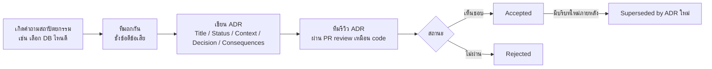

ลองนึกภาพออฟฟิศที่ย้ายโต๊ะทำงานกันบ่อยๆ โดยไม่มีใครจดว่าทำไมถึงย้าย — วันหนึ่งพนักงานใหม่เข้ามาเห็นตู้เอกสารตัวหนึ่งวางเกะกะขวางทางเดิน เลยช่วยกันยกกลับไปตำแหน่งเดิมที่ดูเป็นระเบียบกว่า โดยไม่รู้ว่าตำแหน่งเดิมนั้นบังทางออกฉุกเฉินพอดี ทีมความปลอดภัยเคยสั่งย้ายมันออกมาหลังตรวจสอบอย่างจริงจังเมื่อหกเดือนก่อน สุดท้ายทีมต้องมานั่งถกเรื่องเดิมซ้ำอีกรอบ เสียเวลาไปกับปัญหาที่เคยแก้ไปแล้ว

ระบบซอฟต์แวร์ก็เจอเรื่องแบบนี้ตลอด — engineer ใหม่เข้าทีมมาเห็นว่าทำไม service สอง service คุยกันแบบ synchronous ทั้งที่ async น่าจะเร็วกว่า เลยเสนอเปลี่ยน ทั้งที่ทีมเดิมเคยลองแล้วและเจอปัญหา data consistency จนตัดสินใจกลับมาใช้ sync แบบตั้งใจ แต่ไม่มีใครจดเหตุผลไว้ที่ไหน คนที่ตัดสินใจตอนนั้นก็ลาออกไปแล้ว โค้ดบอกได้แค่ว่า "ระบบทำอะไร" แต่ไม่บอกว่า "ทำไมถึงเลือกทำแบบนี้" ช่องว่างตรงนี้เองที่ **ADR (Architecture Decision Record)** ถูกสร้างมาเพื่ออุด

## ทำไมต้องเขียน ADR

เหตุผลหลักมีสามข้อที่ทับซ้อนกัน อย่างแรกคือ**หยุดการถกเถียงซ้ำ** — ถ้าเหตุผลถูกบันทึกไว้แล้วว่าทำไมไม่เลือกทางเลือกที่ดูดีกว่าบนกระดาษ ทีมในอนาคตจะได้ไม่ต้องเสียเวลาไล่ตามหาเหตุผลเดิมใหม่หมด (หรือแย่กว่านั้นคือเปลี่ยนกลับไปเจอปัญหาเดิมที่เคยแก้ไปแล้ว) อย่างที่สองคือ**ช่วย onboard คนใหม่** — engineer ที่เพิ่งเข้าทีมอ่าน ADR ย้อนหลังได้เหมือนอ่านประวัติศาสตร์ย่อของระบบ เข้าใจว่าทำไมโครงสร้างถึงเป็นแบบนี้โดยไม่ต้องไปถามรุ่นพี่ทีละคน อย่างที่สามคือ**รักษาความทรงจำขององค์กร** — คนย้ายทีมหรือลาออกได้เสมอ แต่ถ้าเหตุผลของการตัดสินใจสำคัญๆ ถูกเขียนเป็นเอกสารแทนที่จะอยู่แค่ในหัวใครคนหนึ่ง ความรู้นั้นจะไม่หายไปพร้อมกับคน

## รูปแบบมาตรฐาน: Michael Nygard Format

ADR ที่นิยมใช้กันมากที่สุดเป็นรูปแบบสั้นๆ ของ Michael Nygard มีห้าส่วนหลัก

- **Title** — ชื่อสั้นๆ บอกว่าตัดสินใจเรื่องอะไร มักมีเลขรันกำกับ เช่น "ADR-003: เลือกใช้ PostgreSQL แทน MongoDB"
- **Status** — สถานะปัจจุบันของการตัดสินใจ: Proposed (เสนอ ยังไม่อนุมัติ), Accepted (อนุมัติแล้ว ใช้จริง), Rejected (ถูกปฏิเสธ), หรือ Superseded (ถูกแทนที่ด้วย ADR ใหม่กว่า)
- **Context** — สถานการณ์และแรงกดดันที่ทำให้ต้องตัดสินใจเรื่องนี้ รวมถึงข้อจำกัดที่มีตอนนั้น (ทีม, เวลา, เทคโนโลยีที่มีอยู่แล้ว)
- **Decision** — สิ่งที่ตัดสินใจเลือกจริง เขียนให้ชัดเจน ไม่คลุมเครือ
- **Consequences** — ผลที่ตามมาทั้งด้านดีและด้านที่ต้องแลก (trade-off) ไม่มีการตัดสินใจไหนไม่มีต้นทุน ส่วนนี้คือที่ที่ซื่อสัตย์กับต้นทุนนั้น

จุดสำคัญคือ ADR ไม่ใช่เอกสารยาวเป็นสิบหน้า ปกติอยู่ที่ครึ่งหน้าถึงหนึ่งหน้ากระดาษ เขียนเสร็จภายในสิบนาทีถึงครึ่งชั่วโมง เป้าหมายคือบันทึกเหตุผล ไม่ใช่เขียน spec ฉบับสมบูรณ์

## เมื่อไหร่ควรเขียน เมื่อไหร่ไม่จำเป็น

ไม่ใช่ทุกการตัดสินใจต้องมี ADR — ถ้าบังคับเขียนทุกเรื่องแม้แต่เรื่องเล็กๆ ทีมจะเบื่อและเลิกเขียนไปเอง หลักคร่าวๆ ที่ใช้แยกคือแนวคิด "one-way door vs two-way door" ของ Amazon: การตัดสินใจที่กลับตัวยาก มีผลระยะยาว ควรมี ADR ส่วนการตัดสินใจที่กลับตัวง่าย ไม่จำเป็น

| ลักษณะการตัดสินใจ | ตัวอย่าง | ควรเขียน ADR ไหม |
|---|---|---|
| กลับตัวยาก มีผลระยะยาว (one-way door) | เลือก database หลัก, monolith vs microservices, sync vs async messaging | ควรเขียน |
| กระทบหลายทีมหรือหลาย service พร้อมกัน | เปลี่ยน API contract ระหว่าง service, เปลี่ยน auth strategy ทั้งระบบ | ควรเขียน |
| กลับตัวง่าย ผลกระทบแคบอยู่ใน 1 module | ตั้งชื่อตัวแปร, จัดโฟลเดอร์ภายในโมดูลเดียว | ไม่จำเป็น |
| ทดลองสั้นๆ พร้อม rollback ได้ทันที | feature flag ทดสอบ UI, ปรับ config ชั่วคราวเพื่อทดสอบ | ไม่จำเป็น (จดสั้นๆ ใน PR ก็พอ) |

## กระบวนการเขียนและรีวิว ADR

ข้อดีของการรีวิว ADR ผ่าน pull request เหมือนรีวิวโค้ดคือทุกคนในทีมเห็นเหตุผลตั้งแต่ก่อนตัดสินใจจริง ไม่ใช่มารู้ทีหลังว่ามีคนตัดสินใจไปแล้ว และเมื่อบริบทเปลี่ยนในอนาคต (เช่น ทีมโตขึ้น เทคโนโลยีใหม่ออกมา) ก็ไม่ต้องลบ ADR เก่าทิ้ง แค่เขียน ADR ใหม่แล้วมาร์กอันเก่าเป็น Superseded พร้อมลิงก์ไปอันใหม่ — ประวัติศาสตร์การตัดสินใจทั้งหมดยังอยู่ครบ ไม่ถูกเขียนทับ

## ADR ตัวอย่าง

> **Title:** ADR-003: เลือกใช้ PostgreSQL แทน MongoDB สำหรับ Order Service
> **Status:** Accepted
> **Context:** Order Service ต้องบันทึก order, order item, สถานะการชำระเงิน และการตัดสต๊อกสินค้า ซึ่งต้องการ transactional consistency สูง เช่น การหักสต๊อกกับการสร้าง order ต้องสำเร็จพร้อมกันหรือ rollback พร้อมกันทั้งคู่ ทีมยังต้องทำรายงานยอดขายที่ join ข้อมูลข้าม table บ่อยครั้ง ตอนแรกมีข้อเสนอให้ใช้ MongoDB เพราะ schema ของ order อาจเปลี่ยนบ่อยตามโปรโมชันใหม่ๆ ที่ทีมการตลาดคิดขึ้นเรื่อยๆ
> **Decision:** เลือกใช้ PostgreSQL เป็น database หลักของ Order Service เพราะรองรับ multi-table transaction แบบ ACID ได้ตรงไปตรงมา และทีม backend มีประสบการณ์ SQL อยู่แล้ว ส่วนความยืดหยุ่นของ schema ที่ต้องการจะจัดการด้วยคอลัมน์ประเภท JSONB สำหรับ field ที่เปลี่ยนบ่อย แทนที่จะย้ายทั้งระบบไปเป็น document store
> **Consequences:** ทีมต้องดูแล schema migration ทุกครั้งที่โครงสร้างเปลี่ยน (เช่นผ่าน Flyway หรือ Prisma Migrate) ซึ่งช้ากว่าการไม่มี schema ตายตัวของ MongoDB เล็กน้อย แต่แลกกับความมั่นใจเรื่อง data consistency ที่สำคัญมากสำหรับข้อมูล order และ payment และลด bug จาก race condition ระหว่างการสร้าง order กับการตัดสต๊อกได้อย่างชัดเจน
