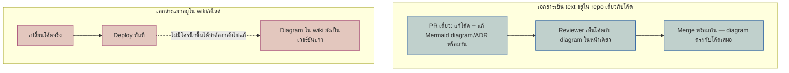

ลองนึกภาพแผนที่ที่แจกฟรีตรงประตูสวนสนุก มันแม่นยำมากในวันที่พิมพ์ออกมา — แต่หกเดือนต่อมา สวนสนุกปิดเครื่องเล่นตัวหนึ่งไปแล้วเปิดตัวใหม่อีกสองตัว ทางเดินที่เคยเป็นทางลัดก็ถูกปิดสร้างร้านขายของแทน ถ้ายังแจกแผนที่แผ่นเดิมต่อไปโดยไม่มีใครแก้ นักท่องเที่ยวจะไม่ใช่แค่ "ไม่มีแผนที่" แต่แย่กว่านั้นคือมีแผนที่ที่พาไปผิดทางอย่างมั่นใจ

เอกสารสถาปัตยกรรมซอฟต์แวร์เจอชะตากรรมเดียวกัน — diagram ที่วาดไว้ครั้งเดียวใน wiki หรือสไลด์ตอน kickoff โปรเจกต์ ไม่มีกลไกอะไรบังคับให้ใครกลับมาแก้เวลาโค้ดเปลี่ยน มันแค่ค่อยๆ เพี้ยนจากของจริงไปเรื่อยๆ จนวันหนึ่งกลายเป็นเอกสารที่ไม่ใช่แค่ล้าสมัยเฉยๆ แต่หลอกคนอ่านให้เข้าใจระบบผิด วิธีแก้ที่ทีมวิศวกรรมสมัยใหม่ใช้กันคือ <mark class="hl-term">**Documentation as Code**</mark> — แนวคิดที่เขียนเอกสารสถาปัตยกรรม (diagram, ADR ที่โมดูลนี้พูดถึงไปแล้วในหัวข้อก่อนหน้า) เป็นไฟล์ข้อความธรรมดาที่อยู่ใน git repository เดียวกับโค้ด แทนที่จะเก็บแยกไว้ในเครื่องมือกราฟิกหรือ wiki ที่ไม่มีอะไรผูกมันเข้ากับ pull request (PR) ที่เปลี่ยนโค้ดจริง

## ปัญหา: เอกสารที่แยกออกจากโค้ด คือเอกสารที่กำลังจะโกหก

C4 diagram หรือ ADR ที่วาดใน Confluence, Google Slides, หรือไฟล์ `.drawio` แยกต่างหาก มีจุดอ่อนร่วมกันข้อเดียว — การแก้โค้ดกับการแก้เอกสารเป็นคนละ action กันโดยสิ้นเชิง ไม่มีอะไรเชื่อมสองอย่างนี้เข้าด้วยกัน developer เพิ่ม service ใหม่, เปลี่ยน database, หรือเปิด endpoint ให้ระบบภายนอกเรียกได้เสร็จแล้ว deploy เลย ส่วนคนที่ควรกลับไปแก้ diagram ใน wiki อาจจะไม่รู้ด้วยซ้ำว่ามันมีอยู่ หรือรู้แต่ลืม หรือรู้และตั้งใจจะแก้ "ทีหลัง" ที่ไม่เคยมาถึง <mark class="hl-warning">ผลคือ diagram ไม่ได้แค่หยุดสะท้อนความจริง แต่กลายเป็นเอกสารที่ active ให้ข้อมูลผิด — คนใหม่ที่ onboard เปิดอ่านแล้วเข้าใจ topology ของระบบผิดทั้งหมด</mark> ซึ่งอันตรายกว่าการไม่มีเอกสารเลยเสียอีก เพราะอย่างน้อยการไม่มีเอกสารยังบังคับให้คนไปอ่านโค้ดจริง

## ทางแก้: วาด diagram เป็น text แล้วรีวิวคู่กับโค้ดใน PR เดียวกัน

หลักการง่ายมาก — ถ้าอยากให้เอกสารไม่หลุดจากโค้ด ให้เอกสารอยู่ *ที่เดียวกับโค้ด* และผ่านกระบวนการเดียวกับโค้ด นั่นคือเก็บ diagram เป็นไฟล์ text ที่ commit เข้า git repo เดียวกัน เช่น Mermaid ฝังอยู่ในไฟล์ markdown แบบที่เว็บนี้ใช้ทั้งเว็บ หรือถ้าต้องการ diagram ที่ generate จากโมเดลจริง (ไม่ใช่แค่วาดมือ) ก็มีเครื่องมืออย่าง Structurizr DSL หรือ PlantUML ที่เขียนสถาปัตยกรรมเป็น syntax ข้อความแล้วให้ tool render เป็นภาพให้ตอน build

จุดสำคัญที่ทำให้วิธีนี้ต่างจากแค่ "ย้ายไฟล์ภาพไปไว้ใน repo" คือ diagram ที่เป็น text เปลี่ยนพร้อมกับโค้ดในคอมมิตเดียวกันได้ — developer ที่เพิ่ม service ใหม่แก้ Mermaid diagram ในไฟล์เดียวกับที่แก้โค้ด แล้วส่ง PR เดียวกันทั้งคู่ reviewer เห็นทั้งโค้ดและ diagram อยู่ในหน้ารีวิวเดียวกัน ตัดสินใจได้ทันทีว่า diagram ที่แก้มาตรงกับโค้ดจริงไหม ไม่ต้องเปิดอีก tab ไปเช็ค wiki แยก



## บังคับด้วย CI: ไม่มี diagram อัปเดต ไม่ให้ merge

ปัญหาคือแค่ "ทำได้" ยังไม่พอ — ถ้าไม่มีอะไรบังคับ ทีมก็ยังลืมแก้ diagram ได้เหมือนเดิม แค่ตอนนี้ลืมแก้ไฟล์ markdown ใน repo แทนที่จะลืมแก้ wiki ทางแก้ขั้นต่อไปคือเขียน check อัตโนมัติใน CI (Continuous Integration) ที่ทำให้ PR fail ถ้าตรวจพบว่าโค้ดมีการเปลี่ยนแปลงที่ "architecture-significant" — เช่น มี service ใหม่เพิ่มเข้ามา, มี network call ข้าม boundary ที่ไม่เคยมีมาก่อน, หรือมี external dependency ใหม่ — แต่ diff ของ PR นั้นไม่มีการแก้ไฟล์ diagram หรือ ADR ไปด้วย

```demo
component: StepThroughDiagram
props: {"steps":[{"label":"1. Developer เพิ่ม service ใหม่ หรือเรียกข้าม boundary","detail":"เช่น เพิ่มโฟลเดอร์ service ใหม่ เพิ่ม HTTP client ที่ยิงไป service อื่นที่ไม่เคยคุยกันมาก่อน หรือเพิ่ม dependency ไปยังระบบภายนอก การเปลี่ยนแปลงระดับนี้กระทบภาพรวมสถาปัตยกรรม ไม่ใช่แค่ business logic ภายในไฟล์เดียว"},{"label":"2. CI job สแกน diff หา pattern ที่นับเป็น architecture-significant change","detail":"ใช้กฎง่ายๆ ตรวจ diff เช่น มีไฟล์ใหม่ใต้ services/ มี import ข้าม service boundary ที่ไม่เคยมี หรือมี Dockerfile ใหม่ ไม่ต้องฉลาดถึงขั้นเข้าใจ semantic แค่จับ pattern ที่บ่งบอกว่าโครงสร้างระบบเปลี่ยน"},{"label":"3. เช็คว่า PR เดียวกันมีการแก้ diagram หรือ ADR ไปด้วยไหม","detail":"เทียบรายชื่อไฟล์ที่เปลี่ยนใน PR ว่ามีไฟล์ในโฟลเดอร์ docs/architecture หรือ adr/ ถูกแก้ร่วมด้วยหรือเปล่า ถ้ามีแปลว่า developer อัปเดตเอกสารพร้อมโค้ดแล้วจริง"},{"label":"4. ไม่มี → fail PR ทันที เหมือนกฎอื่นในชุด Fitness Function","detail":"นี่คือแนวคิดเดียวกับ Fitness Function (ดูรายละเอียดในหัวข้อ Fitness Function ของโมดูลถัดไป) แค่เปลี่ยนสิ่งที่วัดจาก dependency rule หรือ performance เป็น 'เอกสารสถาปัตยกรรมยังตรงกับโค้ดไหม' เท่านั้น"},{"label":"5. มี → merge ได้ diagram กับโค้ดจึงไม่มีวันห่างกันเกินหนึ่ง PR","detail":"ต่อให้ diagram จะไม่สมบูรณ์แบบร้อยเปอร์เซ็นต์ตลอดเวลา แต่ระยะห่างสูงสุดระหว่างของจริงกับเอกสารถูกจำกัดไว้แค่ระดับ PR เดียว ไม่ใช่หลายเดือนหรือหลายปีแบบที่เกิดกับ wiki"}]}
```

<mark class="hl-insight">check แบบนี้ไม่ได้รับประกันว่า diagram ที่แก้มาถูกต้องสมบูรณ์แบบ — มันแค่บังคับว่า "ต้องมีคนแตะมันด้วยความตั้งใจ" ทุกครั้งที่โครงสร้างเปลี่ยน ซึ่งพอเพียงแล้วที่จะตัดปัญหา drift ที่มาจากความหลงลืมล้วนๆ ออกไปได้เกือบหมด</mark> ส่วนความถูกต้องเชิงเนื้อหายังต้องพึ่ง reviewer เหมือนรีวิวโค้ดทั่วไป <mark class="hl-warning">ข้อควรระวังคืออย่าเขียนกฎแค่ "ต้องมีไฟล์ในโฟลเดอร์ docs/ เปลี่ยนแปลง" เพราะ developer จะแก้ comment เล็กๆ ในไฟล์นั้นเพื่อผ่าน check แล้วไม่ได้แก้เนื้อหาจริง — กฎที่ดีต้องผูกกับ pattern ของโค้ดที่เปลี่ยนเฉพาะเจาะจงพอ ไม่ใช่แค่เช็คว่ามีไฟล์ไหนถูกแตะบ้าง</mark>

## Versioning: `git log` บนโฟลเดอร์เอกสาร คือประวัติศาสตร์ของ "ทำไม"

ผลพลอยได้ที่มักถูกมองข้ามของการเก็บ diagram เป็น text ใน git คือมันได้ version control มาฟรีทันที ไม่ต้องตั้งใจทำ `git log -- docs/architecture/` แสดงทุกครั้งที่ diagram เปลี่ยน พร้อม commit message และ PR ที่ผูกกัน ส่วน `git blame` ชี้ได้ว่าบรรทัดที่ว่า "service A เรียก service B แบบ synchronous" ถูกเพิ่มเข้ามาในคอมมิตไหน แก้พร้อมกับโค้ดส่วนไหน นี่คือของที่ wiki ไม่มีให้ — wiki ส่วนใหญ่เก็บได้แค่ revision history ของหน้ากระดาษ ไม่ได้ผูกกับ commit ของโค้ดที่ทำให้ต้องแก้หน้านั้น

พูดอีกแบบคือ diagram ใน wiki บอกได้แค่ "ตอนนี้ระบบหน้าตาเป็นยังไง" (ถ้ายังไม่ drift ไปเสียก่อน) แต่ diagram-as-code ที่อยู่ใน git บอกได้ทั้ง "ตอนนี้เป็นยังไง" และ "ทำไมถึงเปลี่ยนมาเป็นแบบนี้ ใครเปลี่ยน ตอนไหน" ซึ่งเป็นคำถามแบบเดียวกับที่ ADR ตอบ — diagram-as-code กับ ADR จึงเสริมกันโดยธรรมชาติ เพราะทั้งคู่ใช้ git history เป็นกลไกเก็บความทรงจำขององค์กรเหมือนกัน

| แนวทางเก็บเอกสาร | จุดแข็ง | จุดอ่อน |
|---|---|---|
| Wiki/สไลด์ แยกจากโค้ด | แก้ง่าย ไม่ต้องรู้ git, จัด layout สวยงามได้อิสระ | ไม่มีอะไรบังคับให้อัปเดต drift จากโค้ดจริงเรื่อยๆ จนหลอกคนอ่าน |
| Diagram-as-code ใน repo (ไม่มี CI บังคับ) | รีวิวคู่กับโค้ดได้ใน PR, มี git history ของ "ทำไม" | ยังพึ่งความจำ/วินัยของ developer ว่าจะแก้ไฟล์ diagram ไปพร้อมโค้ดจริงไหม |
| Diagram-as-code + CI enforcement (fitness function) | บังคับให้ diagram ถูกแตะทุกครั้งที่โครงสร้างเปลี่ยน ระยะห่างจากของจริงถูกจำกัดแค่ระดับ 1 PR | ต้องเขียนและดูแลกฎ CI เอง, กฎหลวมเกินไปจะถูกเลี่ยงได้ (แก้แค่ comment ให้ผ่าน) |

## มุมมองตอนสัมภาษณ์งาน

คำถามสัมภาษณ์: "ทีมมี architecture diagram อยู่แล้วใน Confluence แต่ทุกคนบ่นว่าเชื่อไม่ได้ จะแก้ยังไง" คำตอบระดับ surface คือ "จัดวัน sprint ให้ทีมนั่งอัปเดต diagram ให้ตรงกับปัจจุบัน" ซึ่งแก้ได้แค่ครั้งเดียว หกเดือนต่อมาก็ drift ใหม่เหมือนเดิมเพราะไม่ได้แก้ที่ต้นเหตุ คำตอบระดับ senior ต้องชี้ว่าต้นเหตุคือ *เอกสารอยู่คนละที่กับกระบวนการที่ทำให้โค้ดเปลี่ยน* — ทางแก้ที่ยั่งยืนคือย้าย diagram เข้ามาเป็น text ใน repo ผูกเข้ากับ PR review และถ้าจะให้แน่ใจจริงๆ ว่าไม่ drift อีก ต้องมี fitness function ใน CI คอยเช็คว่า architecture-significant change ทุกอันมีการแก้เอกสารคู่กันเสมอ ไม่ใช่หวังพึ่งวินัยส่วนบุคคลของ developer แต่ละคน

## ADR ตัวอย่าง

> **Title:** ย้าย Architecture Diagram จาก Confluence เข้าเป็น Mermaid-in-Markdown ใน Repo
> **Status:** Accepted
> **Context:** ทีมมี C4 Container diagram อยู่ใน Confluence ที่อัปเดตล่าสุดเมื่อ 8 เดือนก่อน ตอนนี้มี service เพิ่มมาแล้ว 3 ตัวที่ไม่ปรากฏใน diagram เลย engineer ใหม่ที่ onboard โดยอ่าน diagram นี้เข้าใจ topology ของระบบผิดไปทั้งหมด
> **Decision:** ย้าย diagram ทั้งหมดมาเป็นไฟล์ Mermaid ในโฟลเดอร์ `docs/architecture/` ของ repo หลัก บังคับให้ PR ที่เพิ่ม service ใหม่หรือ cross-service call ต้องแก้ไฟล์ diagram ในโฟลเดอร์นี้ไปด้วย ผ่าน CI check ที่ตรวจ diff แล้ว fail ถ้าไม่พบการแก้ไข ลบสิทธิ์แก้ไข diagram เก่าใน Confluence เพื่อตัดทางเลือกที่ทำให้เกิด drift ซ้ำ
> **Consequences:** diagram อาจไม่สวยงามเท่า tool กราฟิกเดิม และ developer ต้องเรียนรู้ syntax Mermaid เพิ่มเล็กน้อย แต่ diagram ไม่มีวันห่างจากโค้ดจริงเกินระยะ 1 PR อีกต่อไป และทุกการเปลี่ยนแปลงมีประวัติผ่าน `git log` ให้ตรวจสอบย้อนหลังได้ว่าทำไมสถาปัตยกรรมถึงเปลี่ยนมาเป็นแบบนี้
