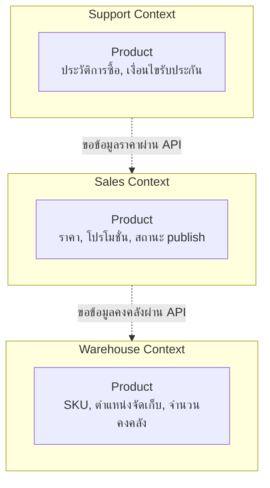

ลองนึกภาพบริษัทอีคอมเมิร์ซแห่งหนึ่ง มีคำว่า "สินค้า" (Product) ปรากฏอยู่แทบทุกหน้าจอ ทุกเอกสาร ทุกที่ประชุม แต่ถ้าลองเดินไปถามแต่ละแผนกว่า "สินค้า" ของพวกเขาคืออะไร คำตอบจะไม่เหมือนกันเลย ฝ่ายขาย (Sales) มองสินค้าเป็นชุดของราคา โปรโมชั่น ส่วนลด แคมเปญที่กำลังจะจบ ฝ่ายคลังสินค้า (Warehouse) มองสินค้าเป็น SKU ตำแหน่งจัดเก็บบนชั้น น้ำหนัก ขนาดกล่อง จำนวนคงคลังที่เหลือ ส่วนฝ่ายบริการลูกค้า (Support) มองสินค้าเป็นประวัติการซื้อของลูกค้าคนหนึ่ง เงื่อนไขการรับประกัน เคสร้องเรียนที่เคยเกิดขึ้น

ทั้งสามแผนกใช้คำว่า "สินค้า" คำเดียวกัน แต่คิดถึงคนละเรื่องเลย แย่กว่านั้นคือบาง field ชื่อเหมือนกันแต่ความหมายขัดแย้งกันตรงๆ เช่น "สถานะสินค้า" ของฝ่ายขายหมายถึง publish อยู่บนหน้าเว็บหรือถูกซ่อนไว้ ในขณะที่ "สถานะสินค้า" ของฝ่ายคลังหมายถึงมีของในสต็อกหรือของหมด สองอย่างนี้เป็นคนละแกนกันโดยสิ้นเชิง ถ้าทีมพัฒนาพยายามสร้าง `Product` model เดียวที่ตอบโจทย์ทุกแผนกพร้อมกัน <mark class="hl-warning">สุดท้ายจะได้ class ที่บวมเป็นร้อย field ครึ่งหนึ่งไม่เกี่ยวข้องกับอีกครึ่ง และทุกครั้งที่แผนกหนึ่งขอแก้ field ก็เสี่ยงไปกระทบ logic ของอีกแผนกโดยไม่ตั้งใจ</mark>

นี่คือปัญหาของ "shared domain model" เดียวที่พยายามครอบคลุมทั้งองค์กร — มันดูสมเหตุสมผลตอนระบบยังเล็ก แต่พอทีมโตขึ้น โดเมนซับซ้อนขึ้น มันจะพังเพราะไม่มีใครกล้าแก้ model กลางโดยไม่กลัวพังทีมอื่น วิธีแก้ในโลกของ Domain-Driven Design (DDD) คือยอมรับความจริงว่าคำเดียวกันมีความหมายต่างกันได้ในแต่ละบริบท แล้ววาดเส้นแบ่งให้ชัดเจนรอบๆ แต่ละความหมาย เส้นแบ่งนี้เรียกว่า **<mark class="hl-term">Bounded Context</mark>**

## Bounded Context คืออะไร

Bounded Context คือขอบเขตที่ชัดเจน (explicit boundary) รอบๆ โมเดลหนึ่งชุด <mark class="hl-insight">ภายในขอบเขตนั้นคำศัพท์ทุกคำมีความหมายเดียวเท่านั้น ไม่มีการตีความสองแบบ</mark> ภายใน Sales Context คำว่า `Product` หมายถึงสิ่งที่ขายได้พร้อมราคาและโปรโมชั่นเสมอ ภายใน Warehouse Context คำว่า `Product` หมายถึงหน่วยที่ต้องจัดเก็บและนับสต็อกเสมอ ทั้งสอง context มี class ชื่อ `Product` ของตัวเอง คนละ schema คนละ database ก็ได้ ไม่ต้องพยายามรวมเป็นตัวเดียวกัน

จุดสำคัญคือ Bounded Context ไม่ใช่แค่เรื่องเทคนิคของโค้ด แต่เป็นขอบเขตขององค์กรและการสื่อสารด้วย — โดยทั่วไปหนึ่งทีมจะดูแลหนึ่ง (หรือไม่กี่) bounded context และทีมนั้นมีอำนาจเต็มที่ในการออกแบบโมเดลภายในของตัวเองโดยไม่ต้องขอความเห็นชอบจากทีมอื่นทุกครั้ง สิ่งที่ต้องตกลงร่วมกันมีแค่ "จุดเชื่อมต่อ" ระหว่าง context เท่านั้น เช่น เมื่อ Sales ต้องรู้ว่าสินค้าตัวนี้มีของในคลังไหม ก็เรียก API ของ Warehouse Context แล้วแปลงข้อมูลที่ได้มาให้เข้ากับโมเดลของตัวเอง ไม่ใช่เอา `Product` object ของ Warehouse มาใช้ตรงๆ

สังเกตว่าทั้งสาม context มี `Product` เป็นของตัวเอง ไม่ได้แชร์ class เดียวกัน การเชื่อมต่อระหว่าง context ทำผ่านการเรียก API หรือ event เท่านั้น ไม่ใช่การแชร์ตาราง database หรือแชร์ object ตรงๆ

## แล้วจะรู้ได้ยังไงว่าขอบเขตควรอยู่ตรงไหน

ในทางปฏิบัติ สัญญาณที่บอกว่าควรตัดเป็น Bounded Context ใหม่คือ เมื่อคำศัพท์เดียวกันเริ่มมีความหมายขัดแย้งกัน (เหมือนตัวอย่าง "สถานะสินค้า" ข้างต้น) หรือเมื่อทีมสองทีมต้องรอกันตลอดเวลาเพราะแก้ model กลางร่วมกัน หรือเมื่อ business rule ของแผนกหนึ่งเริ่มไม่เกี่ยวข้องกับอีกแผนกเลย บ่อยครั้งขอบเขตนี้จะสอดคล้องกับโครงสร้างองค์กร (org chart) พอสมควร เพราะแต่ละแผนกมักมีวิธีคิดเกี่ยวกับโดเมนที่ต่างกันอยู่แล้วโดยธรรมชาติ

## ทำไมเรื่องนี้ถึงสำคัญตอนออกแบบ microservices

Bounded Context มักถูกใช้เป็นหน่วยในการตัดแบ่ง microservice เพราะถ้าตัดผิดขอบเขต (เช่น ตัดตาม database table แทนที่จะตัดตามความหมายทางธุรกิจ) <mark class="hl-warning">จะได้ service ที่ต้องเรียกกันไปมาตลอดเวลาจนแทบไม่ต่างจาก monolith ที่ถูกแยกไฟล์เฉยๆ</mark> การเข้าใจ Bounded Context ให้ถูกต้องตั้งแต่แรกจึงเป็นรากฐานของการออกแบบระบบขนาดใหญ่ทั้งหมด

| แนวทาง | ข้อดี | ข้อเสีย | เหมาะกับ |
|---|---|---|---|
| Shared Domain Model เดียวทั้งองค์กร | เขียนง่ายตอนเริ่ม ไม่ต้องแปลข้อมูลระหว่างทีม | บวมเร็ว แก้แล้วกระทบทีมอื่นเสมอ ทีมต้องรอกันตลอด | ระบบเล็ก ทีมเดียว โดเมนไม่ซับซ้อน |
| แยกเป็น Bounded Context ตามทีม/โดเมน | แต่ละทีมออกแบบโมเดลของตัวเองได้อิสระ แก้ไม่กระทบทีมอื่น | ต้องดูแลจุดเชื่อมต่อ (integration) และแปลข้อมูลข้าม context | ระบบใหญ่ หลายทีม โดเมนซับซ้อน มีความหมายศัพท์ขัดแย้งกันจริง |

## ADR ตัวอย่าง

> **Title:** แยก Product Model ออกเป็น Bounded Context ตามแผนก
> **Status:** Accepted
> **Context:** ทีม Sales, Warehouse และ Support ใช้ตาราง `products` ร่วมกันตัวเดียว ทุกครั้งที่แผนกหนึ่งขอเพิ่ม field เสี่ยงกระทบ logic ของอีกแผนก และคำว่า "สถานะสินค้า" ถูกตีความไม่ตรงกันจนเกิด bug ซ้ำๆ
> **Decision:** แยก `Product` เป็นสาม bounded context ตามแผนก แต่ละ context มีโมเดลและ storage ของตัวเอง เชื่อมต่อกันผ่าน API/event เท่านั้น
> **Consequences:** แต่ละทีมแก้โมเดลตัวเองได้อิสระโดยไม่กระทบทีมอื่น แลกกับต้องดูแล data consistency ข้าม context เพิ่มเติม และต้องมี integration layer ที่ชัดเจน
