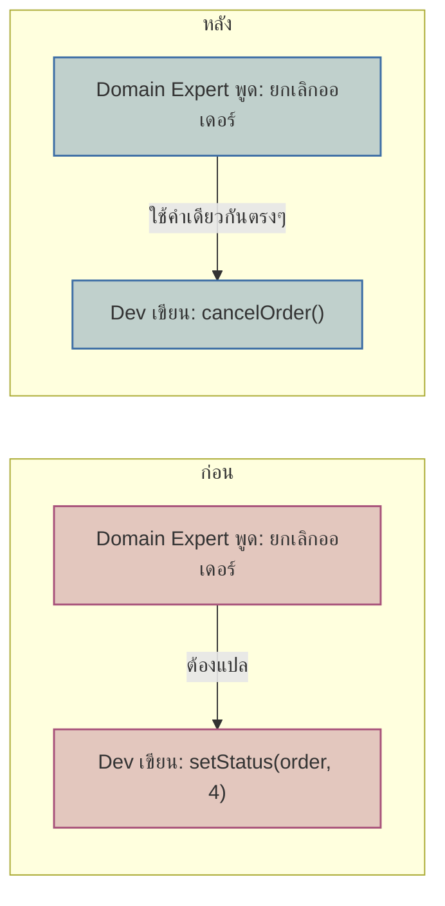

ลองนึกภาพประชุมระหว่างฝ่ายธุรกิจกับทีม dev ฝ่ายธุรกิจพูดว่า "ลูกค้ายกเลิกออเดอร์แล้ว เราต้องคืนเงินให้เขา" ทุกคนในห้องพยักหน้าเข้าใจตรงกัน แต่พอ dev คนหนึ่งเปิดโค้ดขึ้นมาดู กลับไม่เจอคำว่า "cancel" ที่ไหนเลย มีแต่ฟังก์ชันชื่อ `setStatus(order, 4)` ต้องไปเปิดไฟล์ constants อีกไฟล์ถึงจะรู้ว่าเลข 4 หมายถึง "ยกเลิก" ส่วนเลข 3 หมายถึงอะไรก็ต้องเดาหรือถามรุ่นพี่เอา

ปัญหานี้ดูเล็กแต่กัดกร่อนทีมไปเรื่อยๆ ทุกครั้งที่มีคนใหม่เข้าทีมต้องมีคนคอย "แปล" ว่าคำที่ธุรกิจใช้ตรงกับโค้ดตรงไหน ทุกครั้งที่แก้ business rule ต้องนั่งเทียบว่า status 4 ใน production เปลี่ยนพฤติกรรมยังไง และที่แย่ที่สุดคือ bug มักเกิดจากช่องว่างตรงนี้เอง — <mark class="hl-warning">dev คนหนึ่งเข้าใจว่า status 4 คือ "ยกเลิกโดยลูกค้า" แต่จริงๆ ทีมอื่นใช้เลขเดียวกันหมายถึง "ยกเลิกโดยระบบเพราะสต็อกหมด" ความหมายเพี้ยนไปทีละนิดจนกลายเป็น bug ที่ยากจะสืบ</mark>

DDD เรียกช่องว่างนี้ว่าปัญหาของ "translation layer" ระหว่างภาษาที่ธุรกิจใช้คุยกันกับภาษาที่โค้ดใช้เขียน วิธีแก้คือทำให้สองภาษานี้เป็นภาษาเดียวกันไปเลย นั่นคือแนวคิด **<mark class="hl-term">Ubiquitous Language</mark>** — คำศัพท์ชุดเดียวที่ใช้เหมือนกันทุกที่: ในบทสนทนากับ domain expert, ในเอกสาร, และในโค้ดจริง ไม่มีขั้นตอนแปลระหว่างกลาง

## สร้าง Ubiquitous Language ยังไง

จุดเริ่มต้นคือการนั่งคุยกับ domain expert (คนที่รู้ธุรกิจจริงๆ เช่น ฝ่ายปฏิบัติการ ฝ่ายขาย) แล้วจดคำศัพท์ที่พวกเขาใช้จริงๆ ไม่ใช่คำที่ทีม dev คิดเอง เช่นถ้าฝ่ายปฏิบัติการพูดว่า "ยกเลิกออเดอร์" "ลูกค้าเบิกล่วงหน้า" "ของตีกลับ" คำเหล่านี้ควรกลายเป็นชื่อ method ชื่อ class ชื่อ event ในโค้ดตรงๆ — `cancelOrder()` ไม่ใช่ `setStatus(4)`, `refundAdvance()` ไม่ใช่ `updateBalance()`, event ชื่อ `PackageReturned` ไม่ใช่ `StatusChanged`

สิ่งสำคัญคือ Ubiquitous Language ไม่ใช่ dictionary ที่ทำครั้งเดียวจบ แต่เป็นภาษาที่มีชีวิต ต้องปรับตามเมื่อความเข้าใจโดเมนลึกขึ้น และเมื่อคำในโค้ดกับคำที่ธุรกิจพูดเริ่มไม่ตรงกันอีก (เช่น ธุรกิจเริ่มแยก "ยกเลิกโดยลูกค้า" กับ "ยกเลิกโดยระบบ" เป็นสองเรื่อง) โค้ดก็ต้องรีแฟกเตอร์ตามทันที ไม่ปล่อยให้ค้างคาไว้

อีกจุดที่เชื่อมกับหัวข้อก่อนหน้าคือ Ubiquitous Language นั้นใช้ได้เฉพาะภายใน **<mark class="hl-term">Bounded Context</mark>** เดียวเท่านั้น คำว่า "ออเดอร์" ใน Sales Context กับ "ออเดอร์" ใน Shipping Context อาจมีรายละเอียดต่างกัน — Sales สนใจราคาและส่วนลด Shipping สนใจที่อยู่จัดส่งและ tracking number แต่ละ context มีภาษาของตัวเองที่สอดคล้องกันภายใน ไม่จำเป็นต้องเหมือนกันข้าม context

```demo
component: ComparisonDiagram
props: {"left":{"title":"ก่อนมี Ubiquitous Language","points":["ธุรกิจพูดว่า \"ยกเลิกออเดอร์\" แต่โค้ดมี setStatus(order, 4)","ต้องเปิดไฟล์ constants แยกเพื่อรู้ว่าเลข 4 คืออะไร","คนใหม่เข้าทีมต้องมีคนคอยแปลศัพท์ให้ตลอด","event ชื่อ StatusChanged ไม่บอกเลยว่าเกิดอะไรขึ้นจริง"]},"right":{"title":"หลังมี Ubiquitous Language","points":["ธุรกิจพูดว่า \"ยกเลิกออเดอร์\" โค้ดมี cancelOrder() ตรงกันเป๊ะ","อ่านชื่อ method แล้วเข้าใจ business rule ได้ทันที","คนใหม่เข้าทีมอ่าน domain expert คุยกันแล้วเดาโค้ดถูก","event ชื่อ OrderCancelled สื่อความหมายชัดเจนในตัวเอง"]},"note":"เป้าหมายคือทำให้ไม่ต้องมี \"ล่าม\" คอยแปลระหว่างสิ่งที่ธุรกิจพูดกับสิ่งที่โค้ดเขียน"}
```



## ทำไมเรื่องนี้ไม่ใช่แค่ "ตั้งชื่อตัวแปรให้สวย"

หลายคนมองว่า Ubiquitous Language เป็นแค่เรื่อง naming convention แต่จริงๆ แล้วมันคือเครื่องมือสื่อสารระหว่างคนสองกลุ่มที่คิดคนละแบบ — domain expert ไม่สนใจ implementation detail และ dev ไม่รู้ business context ลึกพอ <mark class="hl-insight">ถ้าทั้งคู่ใช้คำเดียวกัน การประชุมออกแบบ feature ใหม่จะเร็วขึ้นมาก เพราะไม่ต้องเสียเวลาแปลไปแปลมา</mark> และเวลาอ่าน code review หรือ commit message ก็จะเข้าใจ business intent ได้ทันทีโดยไม่ต้องถามใคร

| แง่มุม | เขียนโค้ดแบบ Technical/Generic | เขียนโค้ดตาม Ubiquitous Language |
|---|---|---|
| ชื่อ method/class | ทั่วไป ใช้ซ้ำได้ข้ามโดเมน (setStatus, updateRecord) | เฉพาะเจาะจงตาม business term (cancelOrder, shipOrder) |
| ต้นทุนตอนเริ่มทำ | เขียนเร็ว ไม่ต้องประชุมกับ domain expert เยอะ | ต้องนั่งสร้าง glossary ร่วมกับ domain expert ก่อนเริ่ม |
| ต้นทุนระยะยาว | dev ใหม่ต้องถามรุ่นพี่ตลอดว่า status 4 คืออะไร | อ่านโค้ดแล้วเข้าใจ business logic ได้ทันทีโดยไม่ต้องถาม |
| เหมาะกับ | prototype เร็วๆ, CRUD ธรรมดาไม่มี business rule ซับซ้อน | โดเมนที่มี business rule ซับซ้อน ทีมทำงานกับ domain expert บ่อย |

## ADR ตัวอย่าง

> **Title:** รีแฟกเตอร์ OrderService ให้ใช้ Ubiquitous Language แทน generic status code
> **Status:** Accepted
> **Context:** โค้ด OrderService ใช้ `setStatus(order, code)` กับตัวเลข magic number ตลอด ทำให้ dev ใหม่ตีความ business rule ผิดซ้ำๆ และเกิด bug จากการเข้าใจ status code ไม่ตรงกัน
> **Decision:** รีแฟกเตอร์ให้แต่ละ transition มี method ชื่อตรงกับคำที่ domain expert ใช้จริง เช่น `cancelOrder()`, `shipOrder()`, `refundOrder()` แทนการเซ็ต status code ตรงๆ
> **Consequences:** โค้ดอ่านเข้าใจง่ายขึ้นและ map กับบทสนทนาทางธุรกิจตรงๆ แลกกับต้องรีแฟกเตอร์จุดเรียกใช้เดิมทั้งหมด และต้องคอยอัปเดตชื่อเมื่อ business vocabulary เปลี่ยน
