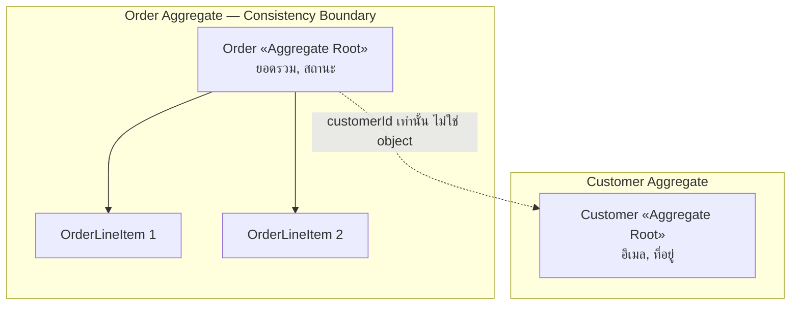

ลองนึกภาพใบเสร็จที่ร้านอาหาร บนใบเสร็จมีรายการอาหารหลายจาน แต่ละจานมีราคาของตัวเอง แต่ที่ท้ายใบเสร็จจะมี "ยอดรวม" อยู่บรรทัดเดียว ถ้าพนักงานคนหนึ่งแอบไปแก้ราคาจานที่สามบนใบเสร็จโดยไม่บอกใคร ยอดรวมท้ายบิลก็จะผิดทันที ร้านอาหารที่จัดการดีจะไม่ยอมให้ใครแก้ไขรายการอาหารบนใบเสร็จโดยตรง — ทุกการแก้ไขต้องผ่าน "แคชเชียร์" คนเดียวที่รับผิดชอบใบเสร็จใบนั้นทั้งใบ แคชเชียร์เป็นคนเดียวที่รู้ว่าต้องคำนวณยอดรวมใหม่ยังไงเมื่อมีการเพิ่ม-ลด-แก้รายการ

ใบเสร็จกับรายการอาหารข้างในจึงต้อง "สอดคล้องกันเสมอ" (consistent) เป็นกลุ่มเดียว จะแก้ต้องแก้ผ่านจุดเดียว ไม่ใช่แก้แต่ละรายการแยกอิสระกัน นี่คือแก่นของแนวคิด **Aggregate** ใน DDD — กลุ่มของ **entity** (สิ่งที่มีตัวตน/identity ของตัวเอง ต้องติดตามได้ตลอดเวลา เช่น `OrderLineItem` ที่มี id ของตัวเอง) และ **value object** (ไม่มี identity ตัวตนถูกกำหนดจากค่าข้างในทั้งหมด เปลี่ยนแปลงไม่ได้หลังสร้าง เช่น `Money` หรือ `Address`) ที่ต้องเปลี่ยนแปลงไปด้วยกันเสมอเพื่อรักษาความถูกต้อง (invariant) โดยมี **Aggregate Root** เป็นจุดเข้าเดียวที่ยอมให้แก้ไขอะไรก็ตามภายในกลุ่มนั้น

ในระบบ order จริง Aggregate ที่พบบ่อยที่สุดคือ `Order` กับ `OrderLineItem` — Order คือ Aggregate Root ส่วน OrderLineItem แต่ละรายการอยู่ภายในขอบเขตของมัน จะเพิ่มสินค้าในออเดอร์ จะลดจำนวน จะยกเลิกรายการ ต้องเรียกผ่าน method ของ `Order` เท่านั้น เช่น `order.addLineItem(product, qty)` ไม่ใช่ไปสร้าง `OrderLineItem` แล้วยัดเข้า database ตรงๆ เพราะ `Order` เป็นคนเดียวที่รู้กติกาว่ายอดรวมต้องคำนวณใหม่ยังไง ส่วนลดต้องเช็คเงื่อนไขอะไรบ้าง และจำนวนรายการสูงสุดต่อออเดอร์คือเท่าไหร่

## ทำไมต้องมีขอบเขตธุรกรรม (Transactional Boundary)

เหตุผลที่ต้องรวม Order และ OrderLineItem ไว้ใน transaction เดียวกันคือ ถ้าแยก transaction กัน (เช่น บันทึก Order สำเร็จ แต่บันทึก OrderLineItem บางตัวล้มเหลว) จะได้ออเดอร์ที่ข้อมูลไม่ครบ ยอดรวมไม่ตรงกับรายการจริง Aggregate จึงเป็นหน่วยที่บอกว่า "สิ่งเหล่านี้ต้อง commit หรือ rollback พร้อมกันเสมอ" — เวลาบันทึกลง database ก็มักบันทึกทั้ง Aggregate ในธุรกรรมเดียว (หนึ่ง transaction ต่อหนึ่ง aggregate เป็นกฎที่แนะนำใน DDD)

## กฎสำคัญ: อ้างอิงข้าม Aggregate ด้วย ID เท่านั้น

คำถามที่ตามมาคือ แล้ว `Order` ควรเก็บข้อมูล `Customer` ที่สั่งซื้อไว้ยังไง คำตอบคือ **ห้ามเก็บ object ของ Customer ทั้งก้อนไว้ข้างใน Order aggregate** ให้เก็บแค่ `customerId` เท่านั้น เพราะ `Customer` เป็น Aggregate ของตัวเองที่มีขอบเขตความถูกต้องของมันเอง (เช่น อีเมล ที่อยู่ ประวัติสมาชิก) ถ้า `Order` ถือ object ของ `Customer` ไว้ตรงๆ จะเกิดปัญหาสองเรื่อง — หนึ่งคือ transaction ของสอง aggregate จะพันกัน แก้ Customer ทีก็ต้อง lock Order ไปด้วย สองคือข้อมูล Customer ที่ฝังอยู่ใน Order อาจเก่าไม่ตรงกับข้อมูลจริงถ้า Customer ถูกแก้ไขทีหลัง

การอ้างอิงด้วย ID เท่านั้นทำให้แต่ละ Aggregate มีขอบเขตความถูกต้องที่ชัดเจนและเป็นอิสระจากกัน เขียนพร้อมกันได้โดยไม่ชนกัน และ scale แต่ละส่วนแยกจากกันได้ในระบบที่ใหญ่ขึ้น

คำถามที่ตามมาต่อคือ — ถ้า `Order` แก้ไขอะไรใน `Customer` ตรงๆ ไม่ได้เลย แล้วเวลามีเหตุการณ์ที่ต้องอัปเดตทั้งสอง aggregate พร้อมกัน (เช่น ลูกค้าสั่งของครบ 10 ครั้งแล้วต้องอัปเกรดเป็นสมาชิก VIP) จะทำยังไง คำตอบคือใช้ **Domain Event** (แนวคิดเดียวกับ Event-Driven Architecture ที่เรียนไปแล้ว) — `Order` ยิง event `OrderCompleted` ออกมาหลัง commit เสร็จ แล้ว `Customer` aggregate (คนละ transaction, คนละเวลา) ค่อย subscribe event นั้นแล้วอัปเดตสถานะสมาชิกของตัวเอง นี่คือ **eventual consistency ระหว่าง aggregate** — แต่ละ aggregate ยัง strong consistency ภายในตัวเองเสมอ เพียงแค่ความสอดคล้อง**ข้าม** aggregate ต้องยอมรอสักครู่ ไม่ใช่ real-time เป๊ะ

สังเกตว่าเส้นระหว่าง `Order` กับ `Customer` เป็นเส้นประ (reference by ID) ในขณะที่เส้นระหว่าง `Order` กับ `OrderLineItem` เป็นเส้นทึบ (อยู่ในขอบเขตเดียวกัน แก้พร้อมกันเสมอ)

## ขนาดของ Aggregate ควรใหญ่แค่ไหน

คำถามที่มือใหม่มักเจอคือ แล้วอะไรควรอยู่ใน Aggregate เดียวกัน อะไรควรแยก คำแนะนำทั่วไปคือให้ Aggregate เล็กที่สุดเท่าที่จะรักษา invariant ที่จำเป็นได้ — ยิ่ง Aggregate ใหญ่ ยิ่ง lock เยอะ เขียนพร้อมกันไม่ได้ เสี่ยง contention สูงเมื่อมี concurrent write เยอะๆ

| ขนาด Aggregate | ข้อดี | ข้อเสีย | เหมาะกับ |
|---|---|---|---|
| เล็ก (เช่น Order ไม่รวม Customer, อ้างด้วย ID) | lock สั้น เขียนพร้อมกันได้เยอะ transaction เร็ว | ต้องยิง query เพิ่มถ้าต้องการข้อมูลข้าม aggregate พร้อมกัน | ระบบที่มี concurrent write เยอะ ต้องการ scale แยกส่วน |
| ใหญ่ (รวมทุกอย่างที่เกี่ยวข้องไว้ใน object เดียว) | อ่านข้อมูลครบในที่เดียว ไม่ต้อง join หลาย aggregate | lock ยาว เขียนพร้อมกันไม่ได้ เสี่ยง contention สูง | ระบบอ่านเยอะเขียนน้อย ข้อมูลต้อง sync กันเป๊ะตลอดเวลา |

## ADR ตัวอย่าง

> **Title:** กำหนดขอบเขต Order Aggregate ให้ไม่รวม Customer object โดยตรง
> **Status:** Accepted
> **Context:** ทีมเคยฝัง Customer object ทั้งก้อนไว้ใน Order ทำให้แก้ข้อมูล Customer ทีต้อง lock Order ที่เกี่ยวข้องทั้งหมด และเกิดปัญหาข้อมูล Customer ใน Order เก่าไม่ตรงกับ Customer จริง
> **Decision:** Order aggregate เก็บ OrderLineItem ไว้ภายในขอบเขตเดียวกัน แต่เก็บ Customer แค่ `customerId` แล้วดึงข้อมูลเต็มผ่าน Customer aggregate เมื่อจำเป็นเท่านั้น
> **Consequences:** เขียน Order และแก้ Customer พร้อมกันได้โดยไม่ชนกัน แลกกับต้องยิง query เพิ่มเมื่อหน้าจอต้องแสดงข้อมูล Customer ควบคู่กับ Order
