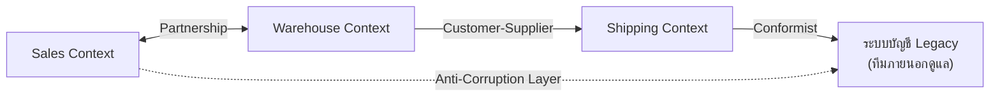

ลองนึกภาพความสัมพันธ์ระหว่างประเทศ บางคู่ประเทศเป็นพันธมิตรใกล้ชิด วางแผนนโยบายร่วมกัน แก้กฎหมายพร้อมกันเพื่อให้การค้าราบรื่น บางคู่เป็นความสัมพันธ์แบบผู้ซื้อ-ผู้ขายชัดเจน ฝ่ายหนึ่งสั่งสินค้าตามสเปกที่ตัวเองต้องการ อีกฝ่ายผลิตตามนั้น บางประเทศเล็กไม่มีอำนาจต่อรอง จึงต้องปรับมาตรฐานของตัวเองให้เข้ากับประเทศใหญ่ที่ค้าขายด้วยทั้งหมด และบางครั้งเมื่อต้องติดต่อกับประเทศที่กฎหมาย ระบบเงินตรา หรือมาตรฐานต่างกันสุดขั้ว ก็ต้องมีด่านศุลกากรและล่ามคอยแปลงทุกอย่างก่อนให้เข้าประเทศ ไม่ปล่อยให้ระบบภายนอกไหลเข้ามาปนกับระบบภายในตรงๆ

**<mark class="hl-term">Bounded Context</mark>** ที่เรียนไปก่อนหน้านี้ก็เหมือนประเทศเหล่านี้ — แต่ละ context มีโมเดล มีภาษา มีกติกาของตัวเอง แต่ไม่มี context ไหนอยู่โดดเดี่ยวได้จริง สุดท้ายต้องเชื่อมต่อและแลกเปลี่ยนข้อมูลกัน คำถามคือ "เชื่อมต่อกันแบบไหน" ใครมีอำนาจต่อรองมากกว่า ใครต้องปรับตามใคร และถ้าอีกฝั่งเป็นระบบเก่าที่ไว้ใจไม่ได้จะป้องกันตัวเองยังไง — ชุดของคำตอบและรูปแบบความสัมพันธ์เหล่านี้เรียกว่า **<mark class="hl-term">Context Mapping</mark>**

## สี่รูปแบบความสัมพันธ์หลักที่เจอบ่อยที่สุด

DDD นิยามรูปแบบความสัมพันธ์ระหว่าง bounded context ไว้หลายแบบ แต่สี่แบบที่พบบ่อยที่สุดในงานจริงคือ Partnership, Customer-Supplier, Conformist และ Anti-Corruption Layer (ACL) — แต่ละแบบเหมาะกับสถานการณ์อำนาจต่อรองและระดับความไว้ใจที่ต่างกัน

```demo
component: StepThroughDiagram
props: {"steps":[{"label":"Partnership","detail":"สองทีมมีเป้าหมายร่วมกันและประสานงานใกล้ชิด วางแผน release ร่วมกัน ถ้าฝั่งหนึ่งจะเปลี่ยน API อีกฝั่งรู้และปรับตามทันที เช่นทีม Sales กับทีม Inventory ในบริษัทเดียวกันที่ต้อง sync feature ใหม่พร้อมกันเสมอ เหมาะกับทีมภายในองค์กรเดียวกันที่มีเป้าหมายทางธุรกิจเดียวกันชัดเจน"},{"label":"Customer-Supplier","detail":"ทีมหนึ่งเป็น downstream (ลูกค้า) อีกทีมเป็น upstream (ผู้จัดหา) ฝั่งลูกค้ากำหนด requirement ให้ผู้จัดหาทำตาม แต่ผู้จัดหายังมีอำนาจตัดสินใจ roadmap ของตัวเอง เช่นทีม Checkout ขอให้ทีม Payment เพิ่ม field ใหม่ใน API แล้วทีม Payment ใส่ไว้ใน backlog ของตัวเองตามลำดับความสำคัญ เหมาะกับทีม downstream ที่พึ่งพาข้อมูล/API จากทีม upstream โดยตรงแต่ยังคุยกันได้"},{"label":"Conformist","detail":"ทีม downstream ยอมรับโมเดลของ upstream ทั้งหมดโดยไม่เปลี่ยนแปลงหรือแปลงข้อมูลเลย เพราะไม่มีอำนาจต่อรองหรือไม่คุ้มที่จะสร้างชั้นแปลเอง เช่นระบบต้องต่อกับ API ของธนาคารหรือ payment gateway ใหญ่ ต้องยอมรับ format และ error code ตามที่เขากำหนดมาทั้งหมด เหมาะกับกรณี upstream เป็นระบบมาตรฐานอุตสาหกรรมหรือ third-party ใหญ่ที่เราต่อรองไม่ได้"},{"label":"Anti-Corruption Layer (ACL)","detail":"สร้างชั้นแปล (translation layer) ไว้ระหว่าง context ของเรากับระบบภายนอก เพื่อไม่ให้โมเดลที่ไม่ดีหรือไม่ตรงกันของฝั่งนั้นรั่วไหลเข้ามาปนกับ domain model ของเรา เช่นระบบใหม่ต้องอ่านข้อมูลจากระบบบัญชี legacy ที่ใช้ชื่อ field และหน่วยเงินคนละแบบ ทีมจึงเขียน adapter ที่แปลงข้อมูลให้ตรงกับ Ubiquitous Language ของ context ตัวเองก่อนเสมอ เหมาะกับการเชื่อมกับระบบ legacy หรือระบบภายนอกที่โมเดลไม่น่าเชื่อถือหรือคุณภาพต่ำ"}]}
```



จากแผนภาพ: Sales กับ Warehouse ทำงานใกล้ชิดแบบ Partnership เพราะอยู่ทีมเดียวกัน Warehouse เป็น upstream ของ Shipping แบบ Customer-Supplier เพราะ Shipping ต้องรอข้อมูลคงคลังจาก Warehouse ก่อนจึงจะจัดส่งได้ Shipping ต้อง Conformist ยอมรับ format ของระบบบัญชี Legacy เพราะไม่มีอำนาจแก้ระบบนั้น ในขณะที่ Sales เลือกป้องกันตัวเองด้วย Anti-Corruption Layer เมื่อต้องอ่านข้อมูลจากระบบเดียวกัน เพื่อไม่ให้ field แปลกๆ ของระบบเก่าหลุดเข้ามาปนในโมเดลของตัวเอง

## เลือกรูปแบบไหนดี

<mark class="hl-insight">กุญแจสำคัญคือดูสองแกน — อำนาจต่อรอง (เราคุยกับอีกทีมปรับ API ร่วมกันได้ไหม) และความไว้ใจในคุณภาพโมเดลของอีกฝั่ง (โมเดลของเขาสะอาดพอจะเอามาใช้ตรงๆ ไหม)</mark> ถ้าคุยกันได้และไว้ใจได้ก็ใช้ Partnership หรือ Customer-Supplier ถ้าคุยกันได้แต่ไม่มีอำนาจต่อรองก็ต้อง Conformist <mark class="hl-warning">ถ้าคุยกันไม่ได้เลยหรือโมเดลของอีกฝั่งไม่น่าเชื่อถือ ต้องสร้าง ACL ป้องกันตัวเองไว้ก่อนเสมอ</mark>

| Pattern | ลักษณะความสัมพันธ์ | เหมาะกับสถานการณ์ |
|---|---|---|
| Partnership | สองทีมประสานงานใกล้ชิด วางแผน release ร่วมกัน | ทีมภายในองค์กรเดียวกัน เป้าหมายทางธุรกิจร่วมกันชัดเจน |
| Customer-Supplier | ทีม downstream กำหนด requirement ให้ทีม upstream ทำตาม | ทีม downstream พึ่งพา API/ข้อมูลจากทีม upstream โดยตรง แต่ยังคุยกันได้ |
| Conformist | ทีม downstream ยอมรับโมเดลของ upstream ทั้งหมด ไม่แปลง | upstream เป็นระบบใหญ่/มาตรฐานอุตสาหกรรมที่ต่อรองไม่ได้ (เช่น API ธนาคาร) |
| Anti-Corruption Layer (ACL) | สร้างชั้นแปลกันไม่ให้โมเดลภายนอกรั่วเข้ามาปนกับ domain model ของเรา | เชื่อมกับระบบ legacy หรือ third-party ที่โมเดลไม่ตรงหรือคุณภาพไม่น่าเชื่อถือ |

## ADR ตัวอย่าง

> **Title:** ใช้ Anti-Corruption Layer เมื่อเชื่อมต่อกับระบบบัญชี Legacy
> **Status:** Accepted
> **Context:** ระบบบัญชี legacy ใช้ field name และหน่วยเงินคนละแบบกับ Ubiquitous Language ของ Order Context และทีมดูแลระบบเก่าไม่รับข้อเสนอเปลี่ยนแปลง API
> **Decision:** สร้าง adapter layer (ACL) แปลงข้อมูลจากระบบ legacy ให้เข้ากับโมเดลของ Order Context ก่อนใช้งานเสมอ ไม่ให้โมเดลของระบบเก่าหลุดเข้ามาในโดเมนของเรา
> **Consequences:** โดเมนของเรายังสะอาดและสอดคล้องกับ Ubiquitous Language แลกกับต้องดูแลโค้ด adapter เพิ่ม และต้องอัปเดตทุกครั้งที่ระบบ legacy เปลี่ยน format
