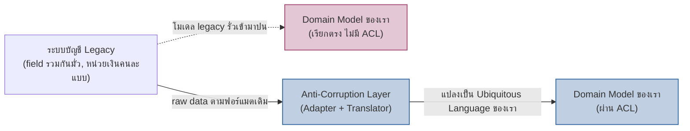

ลองนึกภาพสำนักข่าวหลายแห่งที่ไม่เคยโทรเข้าไปขุดฐานข้อมูลภายในของกันและกันโดยตรง แต่ละสำนักข่าวจะ "แถลง" สิ่งที่เกิดขึ้นออกมาเป็นข่าวสั้นด้วยสำนวนของตัวเอง แล้วปล่อยให้สำนักข่าวอื่นเลือกรับไปใช้ตามที่ต้องการ แต่ถ้าสำนักข่าวต้องไปทำข่าวในประเทศที่กฎหมาย ปฏิทิน หรือหน่วยเงินต่างจากบ้านตัวเองโดยสิ้นเชิงและแก้ไขระบบของเขาไม่ได้เลย ก็ต้องจ้าง "ล่ามประจำพื้นที่" คอยแปลทุกอย่างให้ตรงกับสไตล์กองบรรณาธิการของตัวเองก่อนนำไปตีพิมพ์เสมอ

หัวข้อ 04 แนะนำ Anti-Corruption Layer (ACL) ไปแล้วในฐานะหนึ่งในสี่รูปแบบความสัมพันธ์ระหว่าง context แต่พูดถึงแค่ระดับ "เมื่อไหร่ควรใช้" บทนี้จะเจาะกลไกจริงสองอย่างที่ทำให้ context คุยกันได้โดยไม่ต้องผูกโมเดลภายในเข้าด้วยกัน — อย่างแรกคือ <mark class="hl-term">Domain Event</mark> กลไกที่ context หนึ่งประกาศ "มีอะไรเกิดขึ้น" ออกไปด้วยภาษาของตัวเอง สำหรับสื่อสารกับ context อื่นที่อยู่ในระบบเดียวกัน และอย่างที่สองคือกลไกภายในของ ACL เองว่ามันแปลโมเดลยังไงกันแน่ ไม่ใช่แค่ "มีชั้นกันไว้" ลอยๆ

## Domain Event: ประกาศสิ่งที่เกิดขึ้น ไม่ใช่แชร์โมเดลภายใน

Domain Event ตั้งชื่อเป็นกริยาอดีต (past tense) เสมอ เช่น `OrderShipped`, `PaymentCaptured`, `InventoryReserved` — ชื่อพวกนี้บอกว่า "เรื่องนี้เกิดขึ้นแล้วในโดเมนของฉัน" ไม่ใช่คำสั่งให้ใครทำอะไร ตัว event เองก็ต้องออกแบบด้วย Ubiquitous Language ของ context ที่ยิงมัน ไม่ใช่ก็อป field ตรงจาก table หรือ aggregate ภายในมาทั้งดุ้น เช่น `OrderShipped` ควรมีแค่ `orderId`, `shippedAt`, `trackingNumber` ที่ context อื่นสนใจจริง ไม่ใช่ dump ทุก column ของตาราง `orders` หรือทุก field ภายใน `Order` aggregate ออกไปทั้งหมด

<mark class="hl-insight">Publisher ไม่จำเป็นต้องรู้ว่าใครฟัง event อยู่บ้าง และไม่รู้ว่าฟังแล้วจะเอาไปทำอะไรต่อ</mark> — นี่คือจุดต่างสำคัญจากความสัมพันธ์แบบ Customer-Supplier ที่เรียนใน 04 ซึ่งเป็นการเรียก API แบบ sync รู้ตัวตนอีกฝั่งชัดเจนและรอ response กลับ Domain Event เป็น async, publisher ยิงแล้วจบ ไม่ต้องรอใคร ไม่ต้องรู้จำนวนหรือตัวตนของ subscriber เลยด้วยซ้ำ ทำให้เพิ่ม context ใหม่มา subscribe event เดิมได้โดยไม่ต้องแก้ฝั่ง publisher แม้แต่บรรทัดเดียว

<mark class="hl-warning">ข้อผิดพลาดที่พบบ่อยที่สุดคือเอาโครงสร้างตาราง database หรือ object ภายในมาเป็น payload ของ event ตรงๆ</mark> เพราะนั่นเท่ากับผูก schema ภายในของ publisher เข้ากับทุก consumer ทางอ้อม — พอวันหนึ่งทีม publisher อยาก refactor ตาราง `orders` เพิ่ม column ใหม่หรือเปลี่ยนชื่อ field ภายใน consumer ทุกตัวที่ parse event นั้นก็พังไปด้วย ทั้งที่ไม่ได้เกี่ยวอะไรกับสิ่งที่ event ควรสื่อสารเลย event contract ต้องถูกออกแบบแยกจาก internal schema เสมอ เหมือนเป็น public API ของ context ที่ต้องรักษาความเข้ากันได้ (backward compatible)

## Anti-Corruption Layer: แปลโมเดลที่ขอบเขต ไม่ใช่แค่ "มี wrapper"

ACL ไม่ใช่แค่ function ห่อ (wrapper) ที่เรียก legacy system แทนเรา แต่เป็นชุดของ facade, adapter และ translator ที่ทำงานร่วมกันเพื่อแก้ปัญหาสองชั้น — ชั้นเทคนิค (protocol, format, error code ต่างกัน) และชั้นแนวคิด (concept ของอีกฝั่งไม่ตรงกับของเราเลย) เช่นระบบบัญชี legacy อาจมี field เดียวชื่อ `status` ที่รวมทั้งสถานะการชำระเงิน สถานะการอนุมัติ และสถานะการยกเลิกไว้ในตัวเลขเดียวแบบสับสน หน้าที่ของ ACL ไม่ใช่แค่ rename field เป็นภาษาอังกฤษที่อ่านง่ายขึ้น แต่ต้อง**ตีความ**ตัวเลขนั้นแล้วแตกออกเป็น value object ที่ตรงกับ Ubiquitous Language ของ context เราจริงๆ เช่น `PaymentStatus`, `ApprovalStatus` แยกกันคนละตัว ก่อนที่ core domain logic ของเราจะได้เห็นข้อมูลนั้นเลยด้วยซ้ำ



ฝั่งซ้ายของแผนภาพคือสิ่งที่เกิดขึ้นถ้าปล่อยให้โค้ดในโดเมนเรียก legacy system ตรงๆ กระจายอยู่หลายจุดในโค้ดเบส — ทุกจุดที่เรียกต้องรู้ quirk ของระบบเก่าเอง โมเดลที่มั่วของฝั่งนั้นค่อยๆ ซึมเข้ามาปนกับ type และ logic ภายในทีละนิดจนแยกไม่ออกว่าอะไรเป็นของเราอะไรเป็นของเขา ฝั่งขวาคือทุกจุดเรียกผ่าน ACL จุดเดียว โดเมนของเราเห็นแต่ type ที่สะอาดและสอดคล้องกับภาษาของตัวเองเสมอ ไม่ว่าระบบ legacy ข้างหลังจะเละแค่ไหนก็ตาม

## เลือกใช้ Domain Event หรือ ACL: ดูที่ว่าใครควบคุมอีกฝั่ง

<mark class="hl-insight">เกณฑ์ตัดสินไม่ใช่ "sync กับ async" แต่คือ "เราคุมโมเดลอีกฝั่งได้ไหม"</mark> — ถ้าอีกฝั่งเป็น context ในระบบของเราเอง (หรือทีมในองค์กรเดียวกันที่คุยกันได้ ปรับ contract ร่วมกันได้) ใช้ Domain Event เพราะทั้งสองฝั่งวิวัฒน์ event contract ไปด้วยกันได้ แต่ถ้าอีกฝั่งเป็นระบบ legacy ที่ทีมเดิมเลิกดูแลไปแล้ว หรือเป็น API ของ vendor ภายนอกที่เราไม่มีสิทธิ์ขอให้เขาเปลี่ยนอะไรเลย ต้องใช้ ACL เพราะปัญหาไม่ใช่แค่ "จะสื่อสารยังไง" แต่คือ "จะป้องกันตัวเองจากโมเดลที่เราแก้ไม่ได้ยังไง"

<mark class="hl-warning">ข้อผิดพลาดที่พบรองลงมาคือสร้าง ACL เต็มรูปแบบระหว่าง context ของตัวเองสองอันที่คุยกันได้ปกติ</mark> ทั้งที่แค่ตกลง event contract ร่วมกันก็พอ — ACL มีต้นทุนการดูแลสูงกว่า Domain Event เพราะต้องคอย sync ทุกครั้งที่ฝั่งตรงข้ามเปลี่ยน ถ้าฝั่งตรงข้ามเป็นทีมที่คุยกันได้และปรับ contract ร่วมกันได้อยู่แล้ว การสร้าง ACL เพิ่มคือความซับซ้อนที่ไม่จำเป็น

## ผสานสองแนวคิด: ACL ที่แปลเป็น Domain Event

ในระบบจริง ACL ไม่จำเป็นต้องทำแค่ request/response แปลข้อมูลตอนถูกเรียกเท่านั้น มันสร้างเป็นตัวที่คอย poll หรือ subscribe สัญญาณจากระบบภายนอก แล้วแปลงแต่ละสัญญาณนั้นให้กลายเป็น Domain Event ของ context เราเองก่อนส่งเข้า event bus ภายใน เช่น legacy accounting system ไม่มี concept ของ event เลย มีแต่ตาราง log การเปลี่ยนแปลง ACL จึงทำหน้าที่ poll ตาราง log นั้น ตีความแต่ละแถวแล้วยิงเป็น `InvoiceSettled` ในภาษาของเราออกมาแทน <mark class="hl-insight">ผลคือ consumer ภายในระบบไม่มีทางเห็นรูปร่างของระบบ legacy เลยแม้แต่น้อย เห็นแต่ Domain Event ที่สะอาดเหมือนกับ event ที่ยิงมาจาก context ภายในระบบเราเองทุกประการ</mark> — ACL กับ Domain Event จึงไม่ใช่ทางเลือกที่ต้องเลือกอย่างใดอย่างหนึ่ง แต่ใช้ร่วมกันได้ โดย ACL เป็นตัวผลิต event ที่ขอบเขตนอกสุด

```demo
component: ComparisonDiagram
props: {"left":{"title":"Domain Event","points":["ใช้ระหว่าง context ที่เราควบคุม (หรือคุยตกลงกันได้) ทั้งสองฝั่ง","publisher ประกาศว่าเกิดอะไรขึ้นด้วยภาษาของตัวเอง ไม่ต้องรู้จักผู้ฟัง","async ยิงแล้วจบ เพิ่ม subscriber ใหม่ได้โดยไม่แก้ publisher","วิวัฒน์ contract ร่วมกันได้เมื่อทั้งสองฝั่งตกลงกัน"]},"right":{"title":"Anti-Corruption Layer","points":["ใช้ที่ขอบเขตกับระบบที่เราแก้ไขไม่ได้ เช่น legacy หรือ vendor API","แปลโมเดล/เรียกของฝั่งตรงข้ามให้เป็นภาษาโดเมนเราก่อนเข้าสู่ core logic เสมอ","กันความมั่วของโมเดลภายนอกไม่ให้รั่วเข้ามาปนโดเมนเรา","ต้นทุนดูแลสูงกว่า ต้องอัปเดตเองทุกครั้งที่ฝั่งตรงข้ามเปลี่ยน format"]},"note":"ACL แปลข้อมูลเสร็จแล้วยิงเป็น Domain Event ต่อได้ — สองแนวคิดนี้ใช้ร่วมกัน ไม่ใช่เลือกอย่างใดอย่างหนึ่ง"}
```

| แนวทาง | ใช้เมื่อ | ต้นทุนถ้าไม่ทำ |
|---|---|---|
| Domain Event | context-to-context ภายในระบบเราเอง ทั้งสองฝั่งคุยและวิวัฒน์ contract ร่วมกันได้ | context ต้องเรียก API กันตรงๆ แบบ sync ผูกกันแน่นเกินจำเป็น เพิ่ม consumer ใหม่ทีต้องแก้ publisher ทุกครั้ง |
| Anti-Corruption Layer | ขอบเขตกับระบบที่เราไม่คุม (legacy, vendor API) ที่แก้ไขให้ไม่ได้ | โมเดลมั่วของระบบนอกรั่วเข้ามาปนโดเมนเรากระจายหลายจุด แก้ทีต้องไล่แก้ทุกจุดที่เรียกตรง |
| ACL ที่ผลิต Domain Event | ต้องคุ้มครองทั้งระบบจาก legacy พร้อมให้ consumer ภายในสื่อสารกันแบบ async เหมือน context ปกติ | ทุก consumer ภายในต้องรู้จัก quirk ของ legacy เองแยกกันคนละที่ |

## มุมมองตอนสัมภาษณ์งาน

คำถามสัมภาษณ์: "ทีมต้องเชื่อมกับ API ของ vendor เก่าที่ response format เปลี่ยนบ่อยและ error code ไม่มีมาตรฐาน จะออกแบบยังไงไม่ให้กระทบ domain model เดิมทุกครั้งที่ vendor เปลี่ยน" คำตอบแบบแก้ปัญหาเฉพาะหน้าคือ "ใส่ try-catch ดัก error ตรงจุดที่เรียก API" ซึ่งแก้แค่ครั้งเดียวแต่ปัญหาเดิมจะย้อนกลับมาทุกจุดที่มีคนเรียก API ตัวนี้แยกกัน คำตอบระดับ senior คือชี้ว่าต้นเหตุคือไม่มีจุดแปลโมเดลจุดเดียว จึงต้องสร้าง ACL เป็นจุดเดียวที่รู้จัก quirk ทั้งหมดของ vendor นั้น แปลงเป็น domain type (หรือ Domain Event) ของเราเองก่อนส่งต่อ ทุก caller ภายในเห็นแต่โมเดลที่สะอาดและ error ที่มีความหมายในภาษาของเราเอง เวลา vendor เปลี่ยน format ก็แก้ที่ ACL จุดเดียวพอ ไม่ต้องไล่แก้ทุก caller

## ADR ตัวอย่าง

> **Title:** ใช้ Domain Event สื่อสารข้าม Context ภายในระบบ และตั้ง ACL เฉพาะจุดเชื่อมกับระบบ Legacy
> **Context:** Order Context ต้องแจ้ง Customer Context เมื่อออเดอร์เสร็จสมบูรณ์ (ทั้งสอง context ทีมเราคุมเอง) และต้องดึงข้อมูลใบแจ้งหนี้จากระบบบัญชี legacy ที่ทีมภายนอกดูแลและ response format เปลี่ยนโดยไม่แจ้งล่วงหน้า
> **Status:** Accepted
> **Decision:** ระหว่าง Order กับ Customer Context ใช้ Domain Event (`OrderCompleted`) สื่อสารแบบ async ตกลง event contract ร่วมกันในทีม ส่วนการเชื่อมกับระบบบัญชี legacy สร้าง Anti-Corruption Layer แปลข้อมูลให้เข้ากับโมเดลของเราก่อนเสมอ และให้ ACL ยิง Domain Event ภายในต่อ เพื่อให้ consumer ภายในไม่ต้องรู้จักรูปร่างของระบบ legacy เลย
> **Consequences:** เพิ่ม consumer ใหม่ฝั่ง Order/Customer ได้โดยไม่แก้โค้ดเดิม และ core domain ไม่ถูกกระทบเมื่อระบบบัญชี legacy เปลี่ยน format แลกกับต้องดูแลโค้ด ACL แยกต่างหากและปรับทุกครั้งที่ระบบ legacy เปลี่ยนพฤติกรรม
