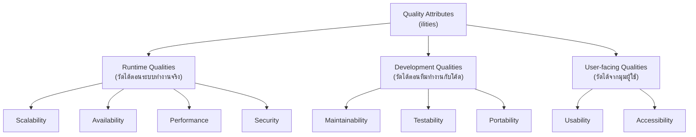

ลองนึกภาพเจ้าของบ้านที่เดินไปหาผู้รับเหมาแล้วบอกว่า "อยากได้บ้าน 3 ห้องนอน 2 ห้องน้ำ มีที่จอดรถ 2 คัน มีครัว" ผู้รับเหมาจดสเปกนี้ไปสร้างจนเสร็จ บ้านมีครบทุกห้องตามที่สั่งจริงๆ แต่พอเจ้าของบ้านย้ายเข้าไปอยู่กลับเจอปัญหาทันที — หน้าร้อนในบ้านร้อนอบอ้าวเพราะไม่มีฉนวนกันความร้อน ผนังบางจนได้ยินเสียงเพื่อนบ้านทุกคำพูด ท่อน้ำซ่อมยากเพราะฝังในผนังปูนไม่มีช่องเปิด และถ้าอยากต่อเติมห้องเพิ่มก็ทำไม่ได้เพราะโครงสร้างเสาไม่รองรับ

สังเกตว่าปัญหาทั้งหมดนี้**ไม่ได้เกี่ยวกับว่าบ้านมีห้องครบหรือไม่** — บ้านทำหน้าที่ตามสเปกทุกอย่าง มีห้องนอน 3 ห้องจริง มีที่จอดรถจริง สิ่งที่ขาดคือคุณสมบัติที่ไม่ได้ระบุไว้ตั้งแต่แรก: อยู่สบายแค่ไหน ทนทานแค่ไหน ซ่อมง่ายแค่ไหน ขยายได้ไหม ในโลกซอฟต์แวร์ก็เหมือนกันทุกประการ ระบบที่ทำ feature ครบทุกอย่างตามที่ลูกค้าขอ อาจยังเป็นระบบที่ใช้งานไม่ได้จริงเลยก็ได้ ถ้ามันช้าจนทนไม่ได้ ล่มบ่อย แก้โค้ดแล้วพังทุกครั้ง หรือถูกแฮกง่ายๆ คุณสมบัติเชิงคุณภาพเหล่านี้เรียกว่า **Quality Attributes** หรือที่มักเรียกกันติดปากว่า **"ilities"** (เพราะชื่อส่วนใหญ่ลงท้ายด้วย -ility เช่น scalability, availability, maintainability)

## Quality Attributes คือคุณสมบัติของ "ทั้งระบบ" ไม่ใช่ของ "ฟีเจอร์"

จุดสำคัญที่ทำให้ ilities ต่างจาก feature ทั่วไปคือ มันไม่ใช่สิ่งที่เพิ่มเข้าไปทีหลังแบบ feature เดี่ยวๆ ได้ — คุณจะเพิ่มปุ่ม "ลืมรหัสผ่าน" เข้าไปในระบบเมื่อไหร่ก็ได้โดยไม่กระทบส่วนอื่น แต่คุณจะเพิ่ม **scalability** เข้าไปทีหลังแบบนั้นไม่ได้ เพราะมันฝังอยู่ใน "โครงสร้าง" ของระบบทั้งหมด ตั้งแต่วิธีเก็บ state วิธีต่อฐานข้อมูล ไปจนถึงวิธี deploy — นี่คือเหตุผลที่คำเหล่านี้ถูกจัดอยู่ในหมวด **software architecture** ไม่ใช่แค่ requirement ธรรมดา เพราะการตัดสินใจเรื่องสถาปัตยกรรมตั้งแต่วันแรกคือตัวกำหนดเพดานว่าระบบจะมี ility แต่ละตัวได้มากแค่ไหน

ตัวอย่าง ilities ที่เจอบ่อยที่สุดในงานจริง:

- **Scalability** — รองรับโหลดที่เพิ่มขึ้นได้โดยไม่พัง (ผู้ใช้เพิ่มจาก 1,000 เป็น 1 ล้านคน ระบบยังไหวไหม)
- **Availability** — ระบบพร้อมให้บริการกี่เปอร์เซ็นต์ของเวลาทั้งหมด (99.9% เท่ากับ downtime ได้ไม่เกิน ~8.7 ชั่วโมงต่อปี)
- **Maintainability** — แก้โค้ด เพิ่มฟีเจอร์ใหม่ได้ง่ายแค่ไหนโดยไม่ทำของเดิมพัง
- **Security** — ป้องกันการเข้าถึงข้อมูล/ระบบโดยไม่ได้รับอนุญาตได้ดีแค่ไหน
- **Testability** — เขียน automated test ครอบคลุมพฤติกรรมของระบบได้ง่ายแค่ไหน
- **Usability** — ผู้ใช้เรียนรู้และใช้งานระบบได้ง่ายแค่ไหนโดยไม่ต้องอ่านคู่มือหนาๆ
- **Performance** — ตอบสนองเร็วแค่ไหน (latency) และประมวลผลได้เยอะแค่ไหนต่อวินาที (throughput)
- **Portability** — ย้ายระบบไปรันบน environment อื่นได้ง่ายแค่ไหน

## ทำไม Quality Attributes ถึงสำคัญพอๆ กับ Functional Requirements

ทีมที่เพิ่งเริ่มทำโปรดักต์มักโฟกัสเกือบ 100% ไปที่ "ระบบต้องทำอะไรได้บ้าง" เพราะมันจับต้องได้ง่ายกว่า เดโมให้ลูกค้าดูได้ทันที แต่ในทางปฏิบัติ ระบบที่ล้มเหลวในโลกจริงมักไม่ได้ล้มเหลวเพราะขาด feature — ล้มเหลวเพราะระบบล่มตอน traffic พุ่งช่วงโปรโมชั่น (ขาด scalability) หรือทีม dev กลัวแตะโค้ดเก่าเพราะแก้ทีไรพังทุกที (ขาด maintainability) หรือข้อมูลลูกค้ารั่วไหล (ขาด security) ความเสียหายจากการขาด ility เหล่านี้มักใหญ่กว่าการขาด feature มาก และแก้ทีหลังก็แพงกว่ามากเช่นกัน เพราะต้องรื้อโครงสร้างที่วางผิดตั้งแต่ต้น ไม่ใช่แค่เพิ่มโค้ดใหม่เข้าไป

## แต่จะเอาให้ครบทุกตัวพร้อมกันไม่ได้

นี่คือจุดที่คนใหม่มักเข้าใจผิด — คิดว่าถ้าออกแบบดีพอ ระบบจะ scalable, secure, maintainable, fast, usable ได้พร้อมกันหมดโดยไม่มีข้อแลกเปลี่ยน ในความเป็นจริง ilities ส่วนใหญ่**แย่งทรัพยากรและแย่งความซับซ้อนกัน** ยิ่งเพิ่ม security (encrypt ทุกจุด, ตรวจสอบสิทธิ์หลายชั้น) ก็ยิ่งกิน performance ยิ่งเพิ่ม availability (มี server สำรองหลายเครื่อง, replicate ข้อมูลข้ามภูมิภาค) ก็ยิ่งเพิ่มความซับซ้อนที่กระทบ maintainability ยิ่งอยากให้ระบบ scale ง่าย (แตกเป็น microservices เล็กๆ) ก็ยิ่งทำให้ debug และ testability ยากขึ้น

| Quality Attribute | ได้เพิ่มขึ้นเมื่อไหร่ | มักแลกกับอะไร |
|---|---|---|
| Availability | มี server/database สำรองหลายชุด | ต้นทุนสูงขึ้น, ความซับซ้อนของการ sync ข้อมูล |
| Security | เพิ่ม encryption, auth หลายชั้น | Performance ช้าลง, Usability ยุ่งยากขึ้น |
| Scalability | แตกระบบเป็นส่วนย่อย (microservices) | Maintainability และ Testability ยากขึ้น |
| Performance | เพิ่ม cache, ลด validation | Consistency และ Security อาจลดลง |
| Maintainability | เขียนโค้ดสะอาด มี abstraction ชัดเจน | อาจ delivery ฟีเจอร์ช้าลงในระยะสั้น |

เพราะฉะนั้นงานของสถาปนิกระบบ (และ engineer ทุกคน) ไม่ใช่การไล่ล่าค่าสูงสุดของทุก ility พร้อมกัน แต่คือการ**เลือก**ว่า ility ตัวไหนสำคัญที่สุดสำหรับระบบนี้ ในบริบทนี้ แล้วยอมแลก ility ตัวอื่นลงบ้างอย่างมีสติ — เรื่องนี้จะลงรายละเอียดเต็มๆ ในหัวข้อ **ATAM-style Trade-off Reasoning** ถัดๆ ไปในโมดูลนี้ ว่าจะ "ให้เหตุผล" การเลือกนี้อย่างเป็นระบบได้อย่างไร

## มุมมองตอนสัมภาษณ์งาน

คำถามสัมภาษณ์สาย system design แทบทุกข้อจะเริ่มด้วยการถามหา ility ที่สำคัญก่อนเสมอ เช่น "ระบบนี้ต้องรองรับ concurrent user กี่คน" (scalability), "ยอมรับ downtime ได้แค่ไหน" (availability), "ข้อมูลอ่อนไหวแค่ไหน" (security) — คนที่ตอบดีคือคนที่รู้จัก**ถามหา** ility ที่เกี่ยวข้องก่อนเริ่มออกแบบ ไม่ใช่กระโดดไปเขียน diagram ทันที เพราะสถาปัตยกรรมที่ "ถูกต้อง" ไม่มีอยู่จริงแบบสัมบูรณ์ มีแต่สถาปัตยกรรมที่เหมาะกับชุด quality attribute ที่ระบบนั้นต้องการเท่านั้น

## ADR ตัวอย่าง

> **Title:** เลือกให้ Availability เป็น quality attribute อันดับหนึ่งสำหรับระบบ Payment Gateway
> **Status:** Accepted
> **Context:** ระบบ payment gateway ของเราประมวลผลธุรกรรมให้ร้านค้าหลายพันร้าน downtime แม้เพียงไม่กี่นาทีหมายถึงร้านค้าขายของไม่ได้และสูญเสียความเชื่อมั่นทันที
> **Decision:** จัดลำดับความสำคัญให้ Availability สูงกว่า Feature velocity และ Cost — ลงทุนทำ multi-region deployment พร้อม automatic failover แม้จะเพิ่มความซับซ้อนและต้นทุน infra
> **Consequences:** ระบบมี uptime สูงขึ้นชัดเจน แต่ทีมต้องดูแล infrastructure ที่ซับซ้อนขึ้น, การ deploy feature ใหม่ต้องผ่านขั้นตอนตรวจสอบเพิ่มเพื่อไม่ให้กระทบ availability, ต้นทุน cloud เพิ่มขึ้นจากการมี redundant infrastructure
