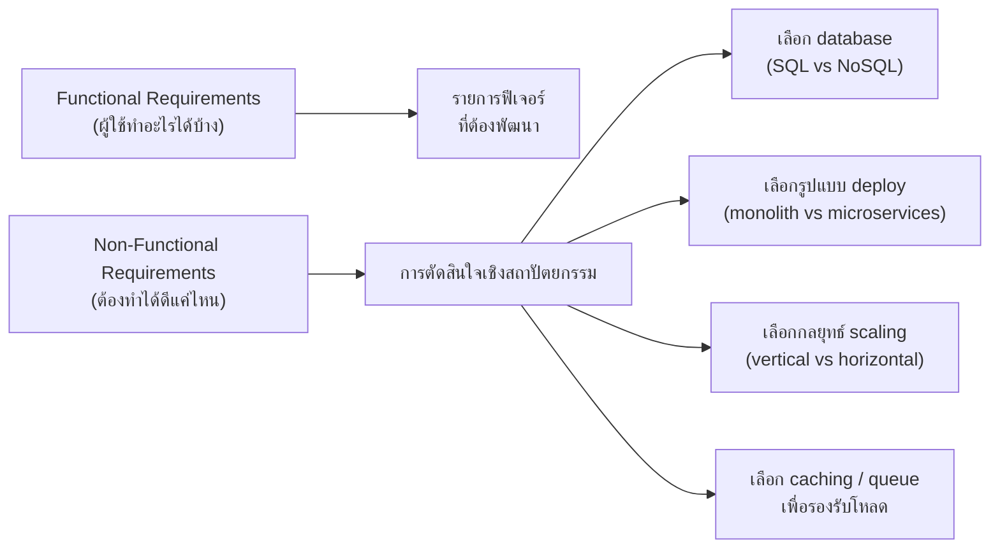

ลองนึกภาพเจ้าของร้านอาหารที่จ้างทีมพัฒนามาทำแอปสั่งอาหารเดลิเวอรี่ เขาเขียนสเปกให้ไว้ชัดเจนว่า "ผู้ใช้ต้องค้นหาร้านได้ เลือกเมนูใส่ตะกร้าได้ กดสั่งแล้วจ่ายเงินได้" ทีมพัฒนาทำตามนั้นเป๊ะๆ ทดสอบผ่านทุกเคส ส่งมอบงานตรงเวลา แต่พอเปิดใช้งานจริงในวันเทศกาลที่มีคนสั่งพร้อมกันหลายพันคน แอปกลับค้างจนสั่งอาหารไม่ได้ หน้าค้นหาร้านโหลดนานเป็นนาที และมีลูกค้าโดนตัดเงินซ้ำสองรอบเพราะกดสั่งซ้ำตอนหน้าจอค้าง

ปัญหาคือสเปกที่เจ้าของร้านให้มาบอกแค่ว่า "แอปต้องทำอะไรได้บ้าง" — เรียกว่า **Functional Requirement (FR)** — แต่ไม่เคยบอกเลยว่า "แอปต้องทำสิ่งเหล่านั้นได้ดีแค่ไหน" ภายใต้เงื่อนไขแบบไหน — สิ่งนี้คือ **Non-Functional Requirement (NFR)** และเป็นสิ่งที่ทีมพัฒนาไม่ได้ถามหาตั้งแต่ต้น เมื่อไม่มีใครระบุไว้ สถาปัตยกรรมที่สร้างขึ้นมาก็ไม่ได้ถูกออกแบบให้รองรับโหลดสูง ไม่ได้ป้องกันการกดสั่งซ้ำ ทั้งที่ตัวแอปเอง "ทำงานถูกต้อง" ตาม FR ทุกข้อ

## FR บอกว่า "ทำอะไร" ส่วน NFR บอกว่า "ทำได้ดีแค่ไหน"

ความแตกต่างนี้จำง่ายที่สุดถ้ามองเป็นคู่คำถาม-คำตอบ FR ตอบคำถาม "ระบบต้องทำอะไรได้บ้าง" เช่น "ผู้ใช้รีเซ็ตรหัสผ่านได้" ส่วน NFR ตอบคำถาม "ทำสิ่งนั้นได้ดีแค่ไหน เร็วแค่ไหน ปลอดภัยแค่ไหน" เช่น "อีเมลรีเซ็ตรหัสผ่านต้องส่งถึงภายใน 5 วินาที สำหรับ 99% ของคำขอ" สังเกตว่าทั้งสองประโยคพูดถึง "ฟีเจอร์รีเซ็ตรหัสผ่าน" เหมือนกัน แต่ประโยคแรกแค่บอกว่าฟีเจอร์นี้ต้องมี ส่วนประโยคที่สองบอกเงื่อนไขเชิงคุณภาพที่ฟีเจอร์นั้นต้องผ่านให้ได้ — และประโยคที่สองนี่แหละที่เป็นตัวกำหนดว่าทีมต้องออกแบบระบบส่งอีเมลแบบไหน ใช้ queue หรือไม่ ต้องมี retry ไหม

```demo
component: ComparisonDiagram
props: {"left":{"title":"Functional Requirements (แอปสั่งอาหาร)","points":["ผู้ใช้ค้นหาร้านอาหารใกล้ตัวได้","ผู้ใช้เพิ่มเมนูลงตะกร้าและกดสั่งซื้อได้","ร้านค้าอัปเดตสถานะออเดอร์ได้ (กำลังทำ/พร้อมส่ง)","ไรเดอร์กดรับงานและอัปเดตตำแหน่งได้","ระบบตัดเงินผ่านบัตรหรือ e-wallet ได้"]},"right":{"title":"Non-Functional Requirements (ระบบเดียวกัน)","points":["หน้าค้นหาร้านต้องโหลดเสร็จภายใน 2 วินาที สำหรับ 95% ของ request","การตัดเงินต้องสำเร็จ 99.99% โดยห้ามตัดซ้ำแม้กดปุ่มซ้ำ","ตำแหน่งไรเดอร์ต้องอัปเดตทุก 3 วินาที รองรับ 50,000 ไรเดอร์พร้อมกัน","ข้อมูลบัตรเครดิตต้อง encrypt ตามมาตรฐาน PCI-DSS","ระบบต้องรองรับโหลด 10 เท่าของปกติช่วงเทศกาล โดยไม่ downtime"]},"note":"FR แต่ละข้อบอกแค่ว่า 'ทำอะไรได้' ส่วน NFR ทุกข้อผูกกับตัวเลขหรือเงื่อนไขที่วัดผลได้ชัดเจน — นี่คือความต่างที่สำคัญที่สุด"}
```

## ทำไม NFR ต้องเจาะจงและวัดผลได้ ไม่งั้นไร้ประโยชน์

ปัญหาที่พบบ่อยที่สุดในทีมที่เพิ่งเริ่มเขียน NFR คือเขียนแบบกำกวม เช่น "ระบบต้องเร็ว" "ระบบต้องปลอดภัย" "ระบบต้องรองรับผู้ใช้เยอะๆ" — ประโยคเหล่านี้ฟังดูดีแต่ใช้งานจริงไม่ได้เลย เพราะไม่มีใครรู้ว่า "เร็ว" คือกี่มิลลิวินาที "เยอะๆ" คือกี่คน และที่สำคัญที่สุดคือ**ไม่มีทางทดสอบได้ว่าระบบผ่านหรือไม่ผ่าน** ทีม QA ก็ไม่รู้จะเขียน test อย่างไร ทีม infra ก็ไม่รู้จะซื้อเครื่องขนาดไหน

NFR ที่ใช้งานได้จริงต้องมีรูปแบบประมาณ "ภายใต้เงื่อนไข X ระบบต้องทำ Y ได้ภายในเกณฑ์ Z ที่วัดผลเป็นตัวเลข" เช่นเปรียบเทียบกัน:

| NFR แบบกำกวม (ใช้งานไม่ได้) | NFR แบบเจาะจง (ใช้งานได้จริง) |
|---|---|
| "ระบบต้องเร็ว" | "API response time ต้อง ≤ 200ms ที่ p95 เมื่อมี 1,000 concurrent request" |
| "ระบบต้องรองรับผู้ใช้เยอะ" | "ระบบต้องรองรับ 100,000 concurrent user โดย error rate ไม่เกิน 0.1%" |
| "ระบบต้องปลอดภัย" | "ทุก endpoint ต้องผ่าน authentication และ log การเข้าถึงทุกครั้งไว้อย่างน้อย 90 วัน" |
| "ระบบต้องเสถียร" | "Uptime ต้อง ≥ 99.9% ต่อเดือน (downtime ไม่เกิน ~43 นาที)" |

เมื่อ NFR เจาะจงแบบนี้ มันกลายเป็นสิ่งที่ทดสอบอัตโนมัติได้ ตั้ง alert ได้ และที่สำคัญที่สุดคือกลายเป็น**เกณฑ์ตัดสินใจ**ให้ทีมสถาปัตยกรรมเลือกเทคโนโลยีและ pattern ได้ถูกต้อง

## สถาปัตยกรรมถูกขับเคลื่อนด้วย NFR มากกว่า FR

ข้อเท็จจริงที่สำคัญที่สุดของบทนี้คือ: **FR ส่วนใหญ่แทบไม่มีผลต่อการเลือกสถาปัตยกรรม** ไม่ว่าจะสร้างด้วย monolith หรือ microservices, SQL หรือ NoSQL, deploy บน server เดียวหรือหลายภูมิภาค — FR อย่าง "ผู้ใช้ล็อกอินได้" ก็ทำสำเร็จได้เหมือนกันหมดทุกแบบ (ยกเว้น FR บางตัวที่มีข้อจำกัดทางเทคนิคฝังอยู่ในตัวเอง เช่น "ต้อง video call แบบ real-time สองทาง" ซึ่งบังคับให้ต้องพิจารณา UDP/WebRTC ตั้งแต่ต้น — ไม่ใช่ FR ทุกตัวจะเป็นกลางทางสถาปัตยกรรมขนาดนั้น) แต่โดยรวมแล้วสิ่งที่บังคับให้ต้องเลือกสถาปัตยกรรมแบบใดแบบหนึ่งคือ NFR เป็นหลัก



เช่น NFR ที่ว่า "ต้องรองรับ 50,000 ไรเดอร์อัปเดตตำแหน่งพร้อมกันทุก 3 วินาที" จะบังคับให้เลือก database ที่รองรับ write หนักๆ ได้ดี อาจต้องใช้ message queue กั้นหน้า และอาจต้องแยก service ติดตามตำแหน่งออกจาก service หลักเพื่อ scale แยกกันได้ — ทั้งหมดนี้ไม่มีทางรู้เลยถ้าดูแค่ FR ว่า "ไรเดอร์อัปเดตตำแหน่งได้"

## มุมมองตอนสัมภาษณ์งานและทำงานจริง

เวลาทำ system design ไม่ว่าจะสัมภาษณ์งานหรือทำงานจริง ขั้นตอนแรกที่สำคัญที่สุดคือ**ถามหา NFR ให้ชัดก่อนเริ่มออกแบบ** ไม่ใช่รีบวาด diagram ทันที เพราะคำตอบของคำถามอย่าง "ต้องรองรับกี่ request ต่อวินาที" "ยอมรับ downtime ได้แค่ไหน" "ข้อมูลต้อง consistent แบบ strong หรือ eventual ก็พอ" คือสิ่งที่จะเปลี่ยนคำตอบทั้งหมดของการออกแบบ ระบบเดียวกันที่มี NFR ต่างกันอาจต้องออกแบบสถาปัตยกรรมคนละแบบเลยก็ได้ ส่วน FR มักคล้ายกันในระบบประเภทเดียวกันอยู่แล้ว จึงไม่ใช่ตัวที่แยกผู้สมัครเก่งกับไม่เก่งออกจากกัน

## ADR ตัวอย่าง

> **Title:** กำหนด NFR เรื่อง Order Payment Consistency ให้เจาะจงก่อนเริ่มออกแบบระบบสั่งอาหาร
> **Status:** Accepted
> **Context:** สเปกเดิมระบุแค่ FR ว่า "ผู้ใช้ตัดเงินผ่านบัตรได้" โดยไม่มีเกณฑ์เรื่องความถูกต้องของการตัดเงิน ทำให้ทีมพัฒนาไม่มั่นใจว่าต้องออกแบบระบบป้องกันการตัดเงินซ้ำระดับไหน
> **Decision:** กำหนด NFR ให้ชัดว่า "การตัดเงินต้องสำเร็จ 99.99% และห้ามตัดซ้ำแม้ผู้ใช้กดปุ่มสั่งซื้อซ้ำในเวลาไม่ถึง 1 วินาที" และใช้ idempotency key ทุกคำขอตัดเงิน
> **Consequences:** ทีมต้องเพิ่ม layer ตรวจสอบ idempotency key ก่อนเรียก payment gateway ทำให้ complexity เพิ่มขึ้นเล็กน้อย แต่ลดความเสี่ยงเรื่องลูกค้าโดนตัดเงินซ้ำซึ่งกระทบความน่าเชื่อถือของแบรนด์โดยตรง
