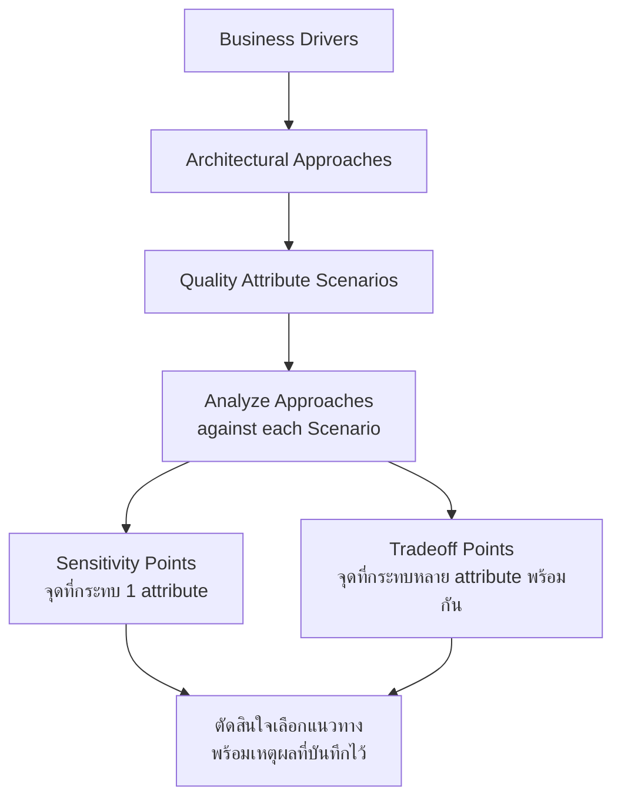

ลองนึกภาพครอบครัวหนึ่งที่จะต่อเติมบ้าน แม่อยากได้ห้องครัวใหญ่ขึ้นเพื่อทำอาหารขาย พ่ออยากได้ที่จอดรถเพิ่มอีกคัน ส่วนลูกอยากได้ห้องเก็บของ ผู้รับเหมาที่มีประสบการณ์จะไม่รีบวาดแบบก่อสร้างทันทีที่ได้ยินคำขอ เพราะรู้ดีว่าที่ดินมีจำกัด ทำครัวใหญ่ก็ต้องเบียดพื้นที่จอดรถ ทำที่จอดรถเพิ่มก็ต้องตัดพื้นที่ห้องเก็บของ ผู้รับเหมาที่ดีจะนั่งคุยกับทุกคนก่อนว่าอะไรสำคัญที่สุดจริงๆ (ถ้าครัวคือแหล่งรายได้หลัก ก็ต้องให้น้ำหนักตรงนั้นมากกว่า) จากนั้นเสนอแบบก่อสร้างหลายทางเลือก แล้ววัดแต่ละทางเลือกกับสถานการณ์ใช้งานจริง เช่น "เวลาจอดรถ 2 คันพร้อมกันตอนเช้า ต้องจอดได้โดยไม่ต้องขยับรถอีกคัน" ก่อนสรุปว่าทางเลือกไหนตอบโจทย์ได้ดีที่สุด และจุดไหนที่ต้องยอมเสียอะไรไปแลก

กระบวนการเจรจาแบบมีโครงสร้างนี้ เมื่อนำมาใช้กับการออกแบบสถาปัตยกรรมซอฟต์แวร์ มีชื่อเรียกอย่างเป็นทางการว่า <mark class="hl-term">**ATAM (Architecture Tradeoff Analysis Method)**</mark> — วิธีการที่พัฒนาโดย Software Engineering Institute เพื่อช่วยทีมสถาปัตยกรรมให้เหตุผลเรื่อง trade-off อย่างเป็นระบบ แทนที่จะเถียงกันด้วยความรู้สึกว่า "แบบนี้น่าจะดีกว่า"

## 5 ขั้นตอนหลักของ ATAM (เวอร์ชันย่อสำหรับเรียนรู้)

ATAM ตัวเต็มตามที่ SEI (Software Engineering Institute) นิยามไว้มีจริงๆ ประมาณ 9 ขั้นตอนใน 4 phase ครอบคลุมเรื่องการรวบรวม stakeholder หลายฝ่ายมา brainstorm และโหวต scenario ร่วมกัน รวมถึงขั้นตอนนำเสนอผลลัพธ์กลับให้ทีมอย่างเป็นทางการ — บทนี้ย่อให้เหลือ 5 ขั้นตอนแกนหลักที่ใช้เหตุผลได้จริงในการทำงานประจำวัน เพื่อให้เข้าใจแก่นของวิธีคิดก่อน ถ้าต้องใช้ ATAM แบบเป็นทางการในทีมใหญ่ ควรอ่านเอกสารต้นฉบับของ SEI เพิ่มเติมเรื่อง stakeholder participation

ลองใช้ตัวอย่างระบบที่เห็นภาพชัด: **ระบบจองตั๋วคอนเสิร์ตแบบเปิดขายพร้อมกัน (flash sale)** ที่คนหลายแสนคนกดจองพร้อมกันในนาทีแรกที่เปิดขาย

```demo
component: StepThroughDiagram
props: {"steps":[{"label":"1. Business Drivers","detail":"ระบุเป้าหมายทางธุรกิจที่สำคัญที่สุดก่อนออกแบบอะไรทั้งสิ้น: ห้ามขายตั๋วเกินจำนวนที่มี (overselling เท่ากับปัญหาทางกฎหมายและชื่อเสียง), ระบบต้องไม่ล่มตอนเปิดขาย, ผู้ซื้อต้องรู้สึกว่าได้คิวอย่างเป็นธรรม"},{"label":"2. Architectural Approaches","detail":"เสนอทางเลือกสถาปัตยกรรมที่เป็นไปได้: (A) Virtual waiting room + strict row lock ในฐานข้อมูล, (B) Optimistic locking พร้อม retry เมื่อชนกัน, (C) Distributed lock ผ่าน Redis ต่อที่นั่งแต่ละใบ"},{"label":"3. Quality Attribute Scenarios","detail":"เขียน scenario ที่วัดผลได้ชัดเจน: 'เมื่อมีผู้ใช้ 100,000 คนกดจองพร้อมกันในนาทีแรก ระบบต้องประมวลผลคำขอแต่ละใบภายใน 3 วินาที โดยขายตั๋วเกินจำนวนที่มีเป็น 0 ใบ และผู้ใช้ที่ไม่ได้ตั๋วต้องรู้สถานะภายใน 10 วินาที'"},{"label":"4. Analyze Approaches","detail":"วิเคราะห์ทีละทางเลือกกับ scenario ข้างต้น: (A) waiting room ป้องกัน overselling ได้แน่นอนแต่ผู้ใช้ต้องรอคิว, (B) optimistic locking เร็วตอนโหลดต่ำแต่โหลดสูงจะ retry ถี่จนช้าลงมาก, (C) Redis lock เร็วและแม่นยำแต่ lock contention พุ่งสูงช่วงวินาทีแรกอาจทำให้ Redis กลายเป็นคอขวด"},{"label":"5. Sensitivity & Tradeoff Points","detail":"จุดที่ปรับปรุงหนึ่งอย่างกระทบอีกอย่าง: ยิ่งทำ lock เข้มงวดขึ้นเพื่อการันตี consistency (ไม่ขายเกิน) throughput ยิ่งลดลงและผู้ใช้ยิ่งรอนานขึ้น — นี่คือ tradeoff point ระหว่าง Consistency กับ Performance/Availability ที่ทีมต้องตัดสินใจร่วมกันว่าจะยืนตรงจุดไหน"}]}
```

### ขั้นที่ 1-2: จากเป้าหมายธุรกิจสู่ทางเลือกสถาปัตยกรรม

Business driver ไม่ใช่แค่ "อยากได้ระบบที่ดี" แต่ต้องเจาะจงพอที่จะบอกได้ว่าอะไรคือความล้มเหลวที่ยอมรับไม่ได้ที่สุด สำหรับระบบจองตั๋ว การขายเกิน (overselling) คือหายนะที่สุด เพราะหมายถึงมีคนจ่ายเงินแล้วแต่ไม่มีที่นั่งจริง ส่วนระบบล่มเป็นรองลงมา — ลำดับความสำคัญแบบนี้เองที่ทำให้ทีมเลือกพิจารณาทางเลือกสถาปัตยกรรมที่เน้นความถูกต้องของข้อมูล (consistency) เป็นอันดับแรก ไม่ใช่เน้นความเร็วอย่างเดียว

### ขั้นที่ 3: เขียน Scenario ให้วัดผลได้ ไม่ใช่แค่พูดลอยๆ

หัวใจของ ATAM คือการเปลี่ยนคำพูดกำกวมอย่าง "ระบบต้องรองรับคนจองเยอะๆ" ให้กลายเป็นประโยคที่มีโครงสร้างชัดเจน: **สถานการณ์กระตุ้น (stimulus)** + **เงื่อนไขแวดล้อม (environment)** + **การตอบสนองที่วัดผลได้ (response measure)** เช่น "เมื่อมี 100,000 request พร้อมกัน (stimulus) ในนาทีแรกของการเปิดขาย (environment) ระบบต้องตอบกลับภายใน 3 วินาทีโดย error rate ไม่เกิน 1% (response measure)" scenario แบบนี้ใช้เป็นเกณฑ์ตัดสินสถาปัตยกรรมได้จริง ต่างจาก NFR ที่เขียนกำกวม (ดูรายละเอียดเพิ่มเติมเรื่องนี้ในหัวข้อก่อนหน้าของโมดูลนี้)



### ขั้นที่ 4-5: วิเคราะห์และหาจุด Trade-off

หลังจากมี scenario ชัดแล้ว ทีมนำแต่ละทางเลือกสถาปัตยกรรมมาวางเทียบกับ scenario ทีละข้อ เพื่อดูว่าทางเลือกไหนตอบโจทย์ quality attribute ไหนได้ดีหรือแย่แค่ไหน:

| ทางเลือกสถาปัตยกรรม | Consistency (ไม่ขายเกิน) | Availability (ไม่ล่มตอน spike) | ความเป็นธรรมที่ผู้ใช้รู้สึก |
|---|---|---|---|
| A: Virtual waiting room + strict row lock | สูงมาก การันตีไม่ overselling | ปานกลาง คิวอาจยาวช่วงแรก | สูง เรียงคิวตามลำดับเวลา |
| B: Optimistic locking + retry | ปานกลาง เสี่ยง edge case ตอน retry storm | สูง ตอบสนองเร็วในโหลดต่ำ-กลาง | ปานกลาง ผู้ใช้อาจโดน retry ซ้ำหลายครั้ง |
| C: Distributed lock ผ่าน Redis ต่อที่นั่ง | สูงมาก lock ระดับ resource เดียว | ปานกลาง Redis อาจกลายเป็นคอขวดตอน spike | ปานกลาง เร็วแต่ไม่มีลำดับคิวชัดเจน |

จากตารางนี้จะเห็น **tradeoff point** ชัดเจน: ทุกทางเลือกที่เพิ่ม consistency ให้สูงขึ้น (A และ C) ล้วนแลกกับ availability หรือ throughput ที่ลดลงในช่วง spike สูงสุด — กระทบสอง quality attribute พร้อมกัน (consistency ขึ้น availability ลง) นี่คือลักษณะของ<mark class="hl-term">tradeoff point</mark>ตามที่นิยามไว้ข้างต้น ต่างจาก<mark class="hl-term">sensitivity point</mark>ที่กระทบแค่ attribute เดียว นี่ไม่ใช่ข้อบกพร่องของการออกแบบ แต่เป็นธรรมชาติของปัญหา — เมื่อทีมเห็นจุดนี้ชัดแล้ว <mark class="hl-insight">การตัดสินใจจึงไม่ใช่การหา "คำตอบที่ถูกต้องที่สุด" แต่คือการเลือกจุดที่รับได้มากที่สุดตาม business driver ที่ตกลงกันไว้ตั้งแต่ขั้นที่ 1</mark>

## ทำไมต้องทำเป็นกระบวนการ ไม่ใช่แค่คุยกันในที่ประชุม

ข้อดีของการทำ ATAM แบบมีโครงสร้างคือมันบังคับให้ทีมพูดถึง trade-off **ก่อน**เขียนโค้ดสักบรรทัด <mark class="hl-warning">แทนที่จะไปเจอปัญหาตอน production แล้วค่อยถกเถียงกันว่าใครควรรู้เรื่องนี้ตั้งแต่แรก</mark> มันยังสร้างเอกสารที่ตรวจสอบย้อนหลังได้ว่าทำไมทีมถึงเลือกทางนี้ ไม่ใช่ทางอื่น ซึ่งมีประโยชน์มากเมื่อทีมใหม่เข้ามาแล้วสงสัยว่า "ทำไมไม่ใช้วิธีง่ายกว่านี้" — คำตอบอยู่ใน scenario และการวิเคราะห์ที่บันทึกไว้แล้ว ไม่ต้องเดาใหม่

## มุมมองตอนสัมภาษณ์งาน

ในการสัมภาษณ์ system design ผู้สัมภาษณ์มักไม่ได้มองหาคำตอบสุดท้ายที่ "ถูก" แต่มองหาว่าเราให้เหตุผลอย่างเป็นระบบหรือไม่ — เริ่มจากถามหา business driver, เสนอทางเลือกมากกว่าหนึ่งทาง, เขียน scenario ที่วัดผลได้ก่อนเลือก, แล้วชี้ให้เห็นชัดว่าทางเลือกที่เลือกนั้นแลกอะไรไปกับอะไร การพูดว่า "ผมเลือกวิธีนี้เพราะมันการันตี consistency แต่ยอมรับว่า availability จะลดลงช่วง peak ซึ่งยอมรับได้เพราะ business driver บอกว่าห้ามขายตั๋วเกิน" ฟังดูน่าเชื่อถือกว่า "ผมว่าวิธีนี้ดีที่สุด" มาก

## ADR ตัวอย่าง

> **Title:** เลือก Virtual Waiting Room + Strict Row Lock สำหรับระบบจองตั๋วคอนเสิร์ตแบบ flash sale
> **Status:** Accepted
> **Context:** วิเคราะห์แบบ ATAM แล้วพบว่า business driver อันดับหนึ่งคือห้าม overselling เด็ดขาด ส่วน availability ช่วง peak ยอมให้ต่ำลงได้ในระดับหนึ่งถ้าผู้ใช้ยังเห็นสถานะคิวชัดเจน
> **Decision:** ใช้ virtual waiting room คัดกรองผู้ใช้เข้าคิวก่อนแตะฐานข้อมูลจริง แล้วใช้ strict row lock ระดับที่นั่งตอนยืนยันการจอง แทนที่จะใช้ optimistic locking ที่เสี่ยงต่อ overselling ตอน retry storm
> **Consequences:** ผู้ใช้บางส่วนต้องรอคิวนานขึ้นช่วงนาทีแรก และระบบซับซ้อนขึ้นจากการมี waiting room เป็นอีกชั้นหนึ่ง แต่แลกมาด้วยการรับประกัน 0% overselling ซึ่งเป็นเงื่อนไขที่ทีมธุรกิจยืนยันว่าสำคัญที่สุด
