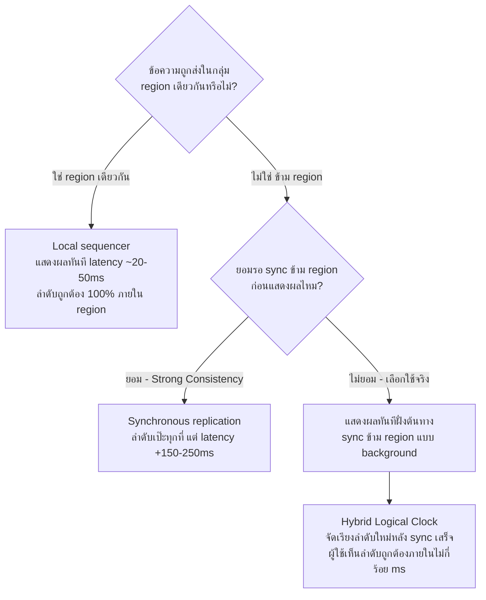

ลองนึกภาพการประชุมสองแบบ แบบแรกคือประชุมทางการที่มีเลขาคอยจดบันทึกทุกคำพูด แล้วอ่านทวนให้ทุกคนในห้องยืนยันก่อนว่า "ตรงกับที่พูดไหม" ก่อนจะไปต่อวาระถัดไป — ช้า แต่ไม่มีใครเข้าใจผิดว่าใครพูดอะไรตอนไหน แบบที่สองคือวงคุยกันสดๆ ในผับ ใครนึกอะไรได้ก็พูดออกไปเลย เร็วและเป็นธรรมชาติ แต่บางทีสองคนพูดพร้อมกัน หรือมีคนตอบคำถามที่เพิ่งพูดไปแล้วช้าไปหนึ่งประโยคจนดูเหมือนตอบผิดที่

ระบบแชทที่มีผู้ใช้กระจายกันอยู่คนละทวีปเจอปัญหาแบบเดียวกันเป๊ะ เมื่อ user ในเอเชียพิมพ์ข้อความเกือบพร้อมกับ user ในอเมริกา ระบบต้องตัดสินใจว่าจะรอให้ทุก server ทั่วโลก sync ตรงกันก่อนแล้วค่อยเรียงลำดับข้อความให้ถูกต้อง 100% (แบบเลขาจดประชุม) หรือจะปล่อยให้แต่ละฝั่งเห็นข้อความทันทีโดยไม่รอใคร (แบบคุยในผับ) นี่คือ trade-off คลาสสิกระหว่าง **Consistency** (ทุกคนเห็นลำดับข้อความตรงกัน) กับ **Latency** (ข้อความส่งถึงเร็วที่สุดเท่าที่จะทำได้) — บทนี้จะพาไล่เคสนี้แบบเต็มๆ ตั้งแต่ปัญหาจนถึงทางออกที่เลือกใช้จริง

## ตั้งโจทย์ให้ชัด: แชทกลุ่มของทีมที่กระจายอยู่ 3 ทวีป

สมมติทีม engineering ของบริษัทหนึ่งกระจายอยู่ที่กรุงเทพ, ซานฟรานซิสโก และลอนดอน ทุกคนอยู่ใน group chat เดียวกันเพื่อคุยงานแบบ real-time server ของระบบแชทตั้งอยู่ใกล้แต่ละ region เพื่อให้ user ในโซนนั้นได้ latency ต่ำ (ไม่ต้องวิ่งข้ามมหาสมุทรทุกครั้งที่พิมพ์) แต่ก็ต้องมีวิธี sync ข้อความข้ามทั้ง 3 region ให้ทุกคนเห็นบทสนทนาเดียวกัน

Round-trip time ระหว่างเอเชียกับอเมริกาฝั่งตะวันตกอยู่ที่ประมาณ 150-200ms ต่อครั้ง ถ้าระบบเลือกรอให้ทุก region ยืนยันรับข้อความก่อนถึงจะแสดงผลให้ใครเห็น (synchronous replication) จะได้ลำดับข้อความที่ถูกต้อง 100% ทุกที่ แต่ผู้ใช้ทุกคนจะรู้สึกหน่วงทุกครั้งที่พิมพ์ ซึ่งงานวิจัยด้าน UX พบว่าคนเริ่มรู้สึก "หน่วง" ชัดเจนเมื่อ latency เกิน ~200-300ms ในการสนทนาแบบ real-time — พูดง่ายๆ คือถ้าเลือกทางนี้ การแชทจะรู้สึกเหมือนคุยผ่านสายดาวเทียมที่หน่วงตลอดเวลา

## ทำไมเลือกทั้งสองอย่างเต็มร้อยพร้อมกันไม่ได้

ถ้าอยากได้ latency ต่ำสุด ทางออกที่ตรงไปตรงมาคือให้ server ประจำ region แสดงข้อความให้ user ในโซนนั้นเห็น**ทันที**โดยไม่รอ region อื่นยืนยัน แล้วค่อย sync ไป region อื่นแบบ background (eventual consistency) วิธีนี้เร็วมาก แต่มีความเสี่ยงจริง: ถ้า user ในกรุงเทพกับซานฟรานซิสโกพิมพ์เกือบพร้อมกัน แต่ละฝั่งจะเห็นข้อความของตัวเองก่อน แล้วเห็นข้อความอีกฝั่งโผล่มาทีหลังในลำดับที่อาจไม่ตรงกับที่คนอื่นเห็น เกิดอาการ "ข้อความสลับที่" ชั่วขณะ ซึ่งในบทสนทนาทั่วไปอาจไม่ใช่ปัญหาใหญ่ แต่ถ้าเป็นการคุยตัดสินใจสำคัญ (เช่น "อนุมัติ deploy ไหม") ลำดับที่สลับกันอาจทำให้ทีมเข้าใจผิดว่าใครตอบอะไรก่อน

นี่คือแก่นของ trade-off: **Consistency สูงต้องแลกกับ Latency ที่สูงขึ้น** เพราะการยืนยันความถูกต้องข้ามระยะทางไกลต้องใช้เวลา ไม่มีทางเลี่ยงกฎฟิสิกส์เรื่องความเร็วแสงและ network round-trip ได้ ในขณะที่ **Latency ต่ำต้องแลกกับความเสี่ยงเรื่อง Consistency** เพราะการแสดงผลทันทีหมายถึงยังไม่ได้ยืนยันกับทุกฝั่งว่าลำดับสุดท้ายจะเป็นแบบไหน — สังเกตว่านี่คือรูปแบบเดียวกับ **PACELC** ที่เรียนไปแล้วในโมดูล Consistency & CAP ของ System Design: แม้ไม่มี network partition เกิดขึ้นเลย (สถานการณ์ปกติทุกวัน) ระบบก็ยังต้องเลือกระหว่าง latency กับ consistency อยู่ดี ("Else" ของ PACELC) ต่างจาก CAP theorem ที่พูดถึงเฉพาะตอนเกิด partition เท่านั้น

| แนวทาง | Latency | ความถูกต้องของลำดับข้อความ | ความซับซ้อนของระบบ |
|---|---|---|---|
| Synchronous replication (รอทุก region ยืนยัน) | สูง (+150-250ms ต่อข้อความ) | สมบูรณ์แบบ ทุกที่เห็นลำดับเดียวกันเป๊ะ | ต่ำ-ปานกลาง แต่ต้องรับมือ region ล่มระหว่างรอ |
| Eventual consistency ล้วนๆ (แสดงทันที ไม่จัดเรียงใหม่) | ต่ำมาก (~20-50ms ภายใน region) | ลำดับอาจสลับชั่วคราวข้าม region | ต่ำ แต่ user experience สับสนได้ |
| Local-first + Hybrid Logical Clock reorder | ต่ำ (ภายใน region) + sync พื้นหลัง | ถูกต้องหลัง sync เสร็จ (ไม่กี่ร้อย ms) | สูงขึ้น ต้องมี algorithm จัดเรียงลำดับ |

## สิ่งที่ตัดสินใจเลือก และทำไม

ทีมเลือกแนวทางที่สาม: ให้แต่ละ region มี **local sequencer** ที่แสดงข้อความให้ user ในโซนเดียวกันเห็นทันทีด้วย latency ต่ำ (คุยกันในทีมย่อยที่อยู่ภูมิภาคเดียวกันจะไหลลื่นเหมือนแชทปกติ) ส่วนการ sync ข้ามภูมิภาคใช้ **Hybrid Logical Clock (HLC)** — เทคนิคที่ผสม physical timestamp กับ logical counter เพื่อจัดลำดับข้อความข้าม region ใหม่ได้อย่างสอดคล้องกันหลัง sync เสร็จ แม้ตอนแรกแต่ละฝั่งจะเห็นลำดับไม่ตรงกันชั่วขณะ (เสี้ยววินาทีถึงไม่กี่ร้อยมิลลิวินาที) แต่ระบบจะจัดเรียงให้ตรงกันในที่สุด และ UI จะไม่แสดงลำดับที่ "สลับไปมา" ให้ผู้ใช้เห็นแบบกระตุก เพราะรอ buffer สั้นๆ ก่อนเรียงลำดับให้เรียบร้อย

ทางเลือกนี้ไม่ใช่ทางที่ "สมบูรณ์แบบที่สุด" ในทั้งสองมิติ แต่เป็นทางที่ตอบโจทย์การใช้งานจริงที่สุด เพราะการคุยงานแบบ real-time ให้ความสำคัญกับความลื่นไหลของบทสนทนามากกว่าความถูกต้องของลำดับแบบเป๊ะทุกมิลลิวินาที ต่างจากระบบอย่าง financial ledger ที่ยอมรับ latency สูงเพื่อแลกกับ consistency แบบสมบูรณ์ไม่ได้เลย — นี่คือตัวอย่างที่ชัดว่า "คำตอบที่ถูก" ของ trade-off ไม่มีอยู่จริงแบบตายตัว มีแต่คำตอบที่เหมาะกับบริบทการใช้งานของระบบนั้นๆ

## บทเรียนที่เอาไปใช้ได้กับเคสอื่น

รูปแบบการคิดในเคสนี้ที่จริงคือ ATAM (จากหัวข้อก่อนหน้า) ที่ถูกย่อลงมาใช้กับ trade-off สองตัวโดยเฉพาะ: (1) ระบุ quality attribute สองตัวที่แข่งกันให้ชัด — เทียบเท่าขั้น Quality Attribute Scenarios (2) หาว่าอะไรคือข้อจำกัดทางฟิสิกส์หรือทางเทคนิคที่ทำให้เลือกทั้งคู่เต็มร้อยไม่ได้ — เทียบเท่าขั้น Analyze Approaches (3) ดูว่า user experience จริงของระบบนี้ให้น้ำหนักกับด้านไหนมากกว่า — เทียบเท่าขั้น Sensitivity & Tradeoff Points (4) มองหาทางออกแบบผสม (hybrid) ที่ได้ทั้งสองด้านบางส่วนแทนที่จะเลือกสุดโต่งไปทางใดทางหนึ่ง — เทียบเท่าขั้นสุดท้าย "ตัดสินใจเลือกแนวทางพร้อมเหตุผลที่บันทึกไว้" ในผังขั้นตอนก่อนหน้า ใช้กับ trade-off อื่นที่หน้าตาคล้ายกันได้ทุกกรณี ไม่ว่าจะเป็น read-heavy vs write-heavy optimization ของ social feed, หรือ strong vs eventual consistency ของระบบ inventory

## ADR ตัวอย่าง

> **Title:** ใช้ Local Sequencer + Hybrid Logical Clock สำหรับ Cross-region Chat Ordering
> **Status:** Accepted
> **Context:** ระบบแชทมีผู้ใช้กระจาย 3 region (เอเชีย, อเมริกา, ยุโรป) การรอ synchronous replication ข้าม region ทำให้ latency สูงถึง 150-250ms ต่อข้อความ ซึ่งผู้ใช้รู้สึกหน่วงชัดเจนในการสนทนาแบบ real-time
> **Decision:** แสดงข้อความทันทีด้วย local sequencer ภายใน region ต้นทาง แล้ว sync ข้าม region แบบ background โดยใช้ Hybrid Logical Clock จัดเรียงลำดับข้อความข้าม region ใหม่ให้สอดคล้องกันหลัง sync เสร็จ
> **Consequences:** ผู้ใช้ในทีมย่อยเดียวกัน region เดียวกันได้ latency ต่ำเหมือนแชทปกติ แต่ข้อความข้าม region อาจเห็นลำดับสลับกันชั่วขณะไม่กี่ร้อยมิลลิวินาทีก่อนถูกจัดเรียงใหม่ ทีมต้องเพิ่ม UI buffer สั้นๆ เพื่อไม่ให้ผู้ใช้เห็นข้อความ "กระโดด" สลับตำแหน่ง และต้องดูแล complexity ของ HLC เพิ่มเติมในโค้ด
